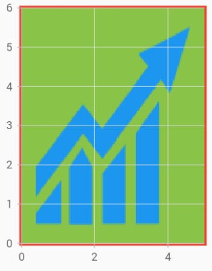

# Customization in Flutter Cartesian Charts (SfCartesianChart)

## Chart sizing

Chart renders based on the parent widget size. If you need the chart to be rendered in specific size, then set the size(width/height) to the parent widget.

You can also customize the following properties:
* [`backgroundColor`](https://pub.dev/documentation/syncfusion_flutter_charts/latest/charts/SfCartesianChart/backgroundColor.html) - used to changes the background color of the chart.
* [`borderWidth`](https://pub.dev/documentation/syncfusion_flutter_charts/latest/charts/CartesianSeries/borderWidth.html) - used to change the border width.
* [`borderColor`](https://pub.dev/documentation/syncfusion_flutter_charts/latest/charts/CartesianSeries/borderColor.html) - used to change the color of the chart border.
 

 

    @override
    Widget build(BuildContext context) {
      return Scaffold(
        body: SafeArea(
          child: Center(
            child: Container(
              // height of the Container widget
              height: 300, 
              // width of the Container widget
              width: 350,  
              child: SfCartesianChart()
            )
          )
        )
      );
    }




## Chart margin

Margin to the chart can be specified using the [`margin`](https://pub.dev/documentation/syncfusion_flutter_charts/latest/charts/SfCartesianChart/margin.html) property.


 

    @override
    Widget build(BuildContext context) {
      return Scaffold(
        body: SafeArea(
          child: Center(
        child: Container(
          height: 300, 
          width: 350, 
          child: SfCartesianChart(
              borderColor: Colors.red,
              borderWidth: 2,
              // Sets 15 logical pixels as margin for all the 4 sides.
              margin: EdgeInsets.all(15)
              )
            )
          )
        )
      );
    }




## Plot area customization

You can customize the plot area of the chart using the below properties.

* [`plotAreaBackgroundColor`](https://pub.dev/documentation/syncfusion_flutter_charts/latest/charts/SfCartesianChart/plotAreaBackgroundColor.html) - used to change the plot area background color.
* [`plotAreaBorderColor`](https://pub.dev/documentation/syncfusion_flutter_charts/latest/charts/SfCartesianChart/plotAreaBorderColor.html) - used to change the stroke color of the plot area.
* [`plotAreaBorderWidth`](https://pub.dev/documentation/syncfusion_flutter_charts/latest/charts/SfCartesianChart/plotAreaBorderWidth.html) - used to change the stroke width of the plot area.
* [`plotAreaBackgroundImage`](https://pub.dev/documentation/syncfusion_flutter_charts/latest/charts/SfCartesianChart/plotAreaBackgroundImage.html) - used to set the image path.


 

    @override
    Widget build(BuildContext context) {
      return Scaffold(
        body: SafeArea(
          child: Center(
            child: Container(
              height: 300, 
              width: 350, 
              child: SfCartesianChart(
                plotAreaBorderWidth: 5,
                plotAreaBorderColor: Colors.red,
                plotAreaBackgroundColor: Colors.lightGreen,
                plotAreaBackgroundImage: 'images/livechart.png'
              )
            )
          )
        )
      );
    }




#### See Also

* [Rendering a background image in the plot area of the Cartesian chart](https://support.syncfusion.com/kb/article/9741/how-to-render-the-cartesian-chart-sfcartesianchart-with-background-image-for-plot-area).

* [Rendering the Cartesian chart in dark theme](https://support.syncfusion.com/kb/article/9576/how-to-render-the-flutter-cartesian-chart-sfcartesianchart-in-dark-theme).

* [Hide the plot area border line in the Flutter chart](https://support.syncfusion.com/kb/article/10910/how-to-hide-the-plot-area-border-line-in-the-flutter-chart-sfcartesianchart).

* [Render the Flutter chart with background image](https://support.syncfusion.com/kb/article/10888/how-to-render-the-flutter-chart-with-background-image-sfcartesianchart).