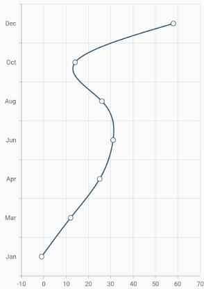
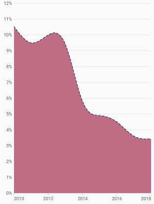
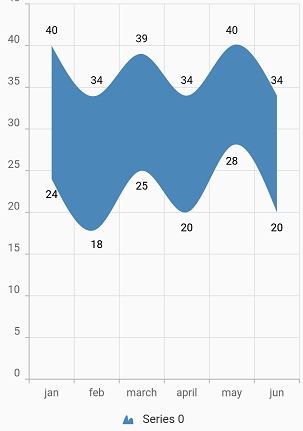
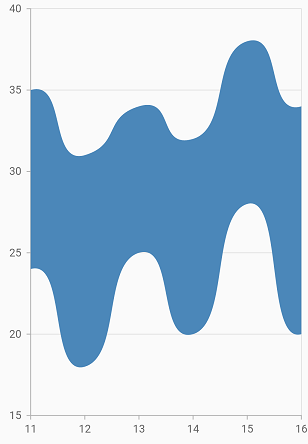
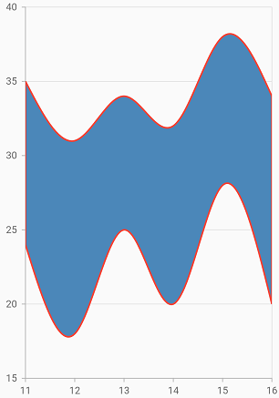
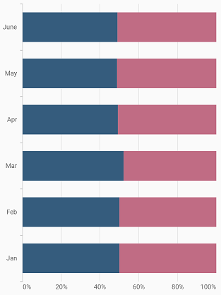
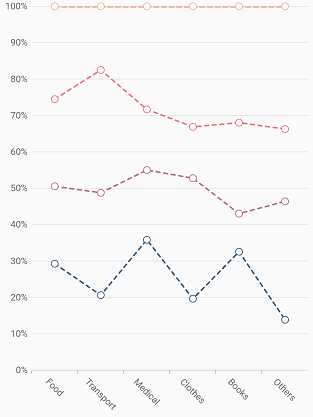
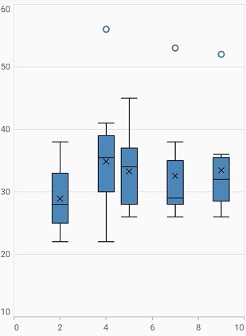
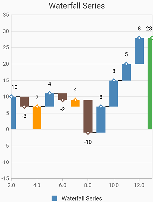

# Chart types in Cartesian charts

## Line chart

To render a line chart, create an instance of [`LineSeries`](https://pub.dev/documentation/syncfusion_flutter_charts/latest/charts/LineSeries-class.html), and add it to the [`series`](https://pub.dev/documentation/syncfusion_flutter_charts/latest/charts/SfCartesianChart/series.html) collection property of [`SfCartesianChart`](https://pub.dev/documentation/syncfusion_flutter_charts/latest/charts/SfCartesianChart/SfCartesianChart.html). The following properties can be used to customize the appearance:

* [`color`](https://pub.dev/documentation/syncfusion_flutter_charts/latest/charts/CartesianSeries/color.html) - changes the color of the line.
* [`opacity`](https://pub.dev/documentation/syncfusion_flutter_charts/latest/charts/CartesianSeries/opacity.html) - controls the transparency of the chart series.
* [`width`](https://pub.dev/documentation/syncfusion_flutter_charts/latest/charts/CartesianSeries/width.html) - changes the stroke width of the line.

 

    @override
    Widget build(BuildContext context) {
        final List<SalesData> chartData = [
            SalesData(2010, 35),
            SalesData(2011, 28),
            SalesData(2012, 34),
            SalesData(2013, 32),
            SalesData(2014, 40)
        ];

        return Scaffold(
            body: Center(
                child: Container(
                    child: SfCartesianChart(
                        primaryXAxis: DateTimeAxis(),
                        series: <ChartSeries>[
                            // Renders line chart
                            LineSeries<SalesData, dateTime>(
                                dataSource: chartData,
                                xValueMapper: (SalesData sales, _) => sales.year,
                                yValueMapper: (SalesData sales, _) => sales.sales
                            )
                        ]
                    )
                )
            )
        );
    }

    class SalesData {
        SalesData(this.year, this.sales);
            final dateTime year;
            final double sales;
    }



### Dashed line

The [`dashArray`](https://pub.dev/documentation/syncfusion_flutter_charts/latest/charts/CartesianSeries/dashArray.html) property of [`LineSeries`](https://pub.dev/documentation/syncfusion_flutter_charts/latest/charts/LineSeries-class.html) is used to render line series with dashes. Odd value is considered as rendering size and even value is considered as gap.

 
    
    @override
    Widget build(BuildContext context) {
        final List<SalesData> chartData = [
        SalesData("2010", 35),
        SalesData("2011", 28),
        SalesData('2012', 34),
        SalesData('2013', 32),
        SalesData('2014', 40)
        ];
        return Scaffold(
            body: Center(
                child: Container(
                    child: SfCartesianChart(
                        primaryXAxis: DateTimeAxis(),
                        series: <ChartSeries>[
                            LineSeries<SalesData, DateTime>(
                                dataSource: chartData,
                                // Dash values for line
                                dashArray: <double>[5, 5],
                                xValueMapper: (SalesData sales, _) => sales.year,
                                yValueMapper: (SalesData sales, _) => sales.sales)
                        ]
                    )
                )
            )
        );
  }



#### See Also

*[Applying dashed pattern for line chart](https://www.syncfusion.com/kb/12349/how-to-create-dash-pattern-line-chart-in-flutter-using-cartesian-charts-widget).

### Multi-colored line

To render a multi-colored line series, map the individual colors to the data using the [`pointColorMapper`](https://pub.dev/documentation/syncfusion_flutter_charts/latest/charts/CartesianSeries/pointColorMapper.html) property.

 

    @override
    Widget build(BuildContext context) {
        return Scaffold(
            body: Center(
                child: Container(
                    child: SfCartesianChart(
                        primaryXAxis: CategoryAxis(),
                        series: <ChartSeries>[
                            LineSeries<SalesData, String>(
                                dataSource: [
                                    SalesData('Jan', 35, Colors.red),
                                    SalesData('Feb', 28, Colors.green),
                                    SalesData('Mar', 34, Colors.blue),
                                    SalesData('Apr', 32, Colors.pink),
                                    SalesData('May', 40, Colors.black)
                                ],
                                // Bind the color for all the data points from the data source
                                pointColorMapper:(SalesData sales, _) => sales.segmentColor,
                                xValueMapper: (SalesData sales, _) => sales.year,
                                yValueMapper: (SalesData sales, _) => sales.sales
                            )
                        ]
                    )
                )
            )
        );
    }

    class SalesData {
        SalesData(this.year, this.sales, this.segmentColor);
        final String year;
        final double sales;
        final Color segmentColor;
    }



Also refer, [color palette](./series-customization#color-palette), [color mapping](./series-customization#color-mapping-for-data-points), [animation](./series-customization#animation), [gradient](./series-customization#gradient-fill) and [empty points](./series-customization#empty-points) for customizing the line series further.

## Fast line chart

[`FastLineSeries`](https://pub.dev/documentation/syncfusion_flutter_charts/latest/charts/FastLineSeries-class.html) is a line chart, but it loads faster than [`LineSeries`](https://pub.dev/documentation/syncfusion_flutter_charts/latest/charts/LineSeries-class.html). You can use this when there are large number of points to be loaded in a chart. To render a fast line chart, create an instance of [`FastLineSeries`](https://pub.dev/documentation/syncfusion_flutter_charts/latest/charts/FastLineSeries-class.html), and add it to the [`series`](https://pub.dev/documentation/syncfusion_flutter_charts/latest/charts/SfCartesianChart/series.html) collection property of [`SfCartesianChart`](https://pub.dev/documentation/syncfusion_flutter_charts/latest/charts/SfCartesianChart-class.html). The following properties can be used to customize the appearance of fast line segment:

* [`color`](https://pub.dev/documentation/syncfusion_flutter_charts/latest/charts/CartesianSeries/color.html) - changes the color of the line.
* [`opacity`](https://pub.dev/documentation/syncfusion_flutter_charts/latest/charts/CartesianSeries/opacity.html) - controls the transparency of the chart series.
* [`width`](https://pub.dev/documentation/syncfusion_flutter_charts/latest/charts/CartesianSeries/width.html) - changes the stroke width of the line.

 

    @override
    Widget build(BuildContext context) {
        return Scaffold(
            body: Center(
                child: Container(
                    child: SfCartesianChart(
                        primaryXAxis: DateTimeAxis(),
                        series: <ChartSeries>[
                            // Renders fast line chart
                            FastLineSeries<SalesData, DateTime>(
                                dataSource: chartData,
                                xValueMapper: (SalesData sales, _) => sales.year,
                                yValueMapper: (SalesData sales, _) => sales.sales
                            )
                        ]
                    )
                )
            )
        );
    }



Also refer, [color palette](./series-customization#color-palette), [color mapping](./series-customization#color-mapping-for-data-points), [animation](./series-customization#animation), [gradient](./series-customization#gradient-fill) and [empty points](./series-customization#empty-points) for customizing the fast line series further.

## Area chart

To render an area chart, create an instance of [`AreaSeries`](https://pub.dev/documentation/syncfusion_flutter_charts/latest/charts/AreaSeries-class.html), and add it to the [`series`](https://pub.dev/documentation/syncfusion_flutter_charts/latest/charts/SfCartesianChart/series.html) collection property of [`SfCartesianChart`](https://pub.dev/documentation/syncfusion_flutter_charts/latest/charts/SfCartesianChart/SfCartesianChart.html). The area chart shows the filled area to represent the data, but when there are more than a series, this may hide the other series. To get rid of this, increase or decrease the transparency of the series. 

The following properties can be used to customize the appearance:

* [`color`](https://pub.dev/documentation/syncfusion_flutter_charts/latest/charts/CartesianSeries/color.html) - changes the color of the series.
* [`opacity`](https://pub.dev/documentation/syncfusion_flutter_charts/latest/charts/CartesianSeries/opacity.html) - controls the transparency of the chart series.
* [`borderWidth`](https://pub.dev/documentation/syncfusion_flutter_charts/latest/charts/CartesianSeries/borderWidth.html) - changes the stroke width of the series.
* [`borderColor`](https://pub.dev/documentation/syncfusion_flutter_charts/latest/charts/CartesianSeries/borderColor.html) - changes the stroke color of the series.

 

    @override
    Widget build(BuildContext context) {
        return Scaffold(
            body: Center(
                child: Container(
                    child: SfCartesianChart(
                        primaryXAxis: DateTimeAxis(),
                        series: <ChartSeries>[
                            // Renders area chart
                            AreaSeries<SalesData, dateTime>(
                                dataSource: chartData,
                                xValueMapper: (SalesData sales, _) => sales.year,
                                yValueMapper: (SalesData sales, _) => sales.sales
                            )
                        ]
                    )
                )
            )
        );
    }



###	Border customization

The borders of the area chart can be customized using the [`borderDrawMode`](https://pub.dev/documentation/syncfusion_flutter_charts/latest/charts/AreaSeries/borderDrawMode.html) property. The default value of the [`borderDrawMode`](https://pub.dev/documentation/syncfusion_flutter_charts/latest/charts/AreaSeries/borderDrawMode.html) property is [`top`](https://pub.dev/documentation/syncfusion_flutter_charts/latest/charts/BorderDrawMode-class.html). The other values are [`all`](https://pub.dev/documentation/syncfusion_flutter_charts/latest/charts/BorderDrawMode-class.html) and [`excludeBottom`](https://pub.dev/documentation/syncfusion_flutter_charts/latest/charts/BorderDrawMode-class.html).

 

    @override
    Widget build(BuildContext context) {
        return Scaffold(
            body: Center(
                child: Container(
                    child: SfCartesianChart(
                        primaryXAxis: DateTimeAxis(),
                        series: <ChartSeries>[
                            AreaSeries<SalesData, DateTime>(
                                dataSource: chartData,
                                color: Colors.deepOrange[300],
                                borderMode: AreaBorderMode.excludeBottom,
                                borderColor: Colors.green,
                                borderWidth: 2,
                                xValueMapper: (SalesData sales, _) => sales.year,
                                yValueMapper: (SalesData sales, _) => sales.sales
                            )
                        ]
                    )
                )
            )
        );
    }



Also refer, [color palette](./series-customization#color-palette), [color mapping](./series-customization#color-mapping-for-data-points), [animation](./series-customization#animation), [gradient](./series-customization#gradient-fill) and [empty points](./series-customization#empty-points) for customizing the area series further.

### Area with gradients

The [`gradient`](https://pub.dev/documentation/syncfusion_flutter_charts/latest/charts/CartesianSeries/gradient.html) property is used to define the gradient colors. The colors from this property is used for series.

 

    @override
    Widget build(BuildContext context) {
         final List<Color> color = <Color>[];
        color.add(Colors.blue[50]!);
        color.add(Colors.blue[200]!);
        color.add(Colors.blue);

        final List<double> stops = <double>[];
        stops.add(0.0);
        stops.add(0.5);
        stops.add(1.0);

        final LinearGradient gradientColors =
            LinearGradient(colors: color, stops: stops);
        
        return Scaffold(
            body: Center(
                child: Container(
                    child: SfCartesianChart(
                        primaryXAxis: DateTimeAxis(),
                        series: <ChartSeries>[
                            // Renders area chart
                            AreaSeries<SalesData, DateTime>(
                                dataSource: chartData,
                                xValueMapper: (SalesData sales, _) => sales.year,
                                yValueMapper: (SalesData sales, _) => sales.sales,
                                 gradient: gradientColors
                            )
                        ]
                    )
                )
            )
        );
    }



### Area with empty points

Data points with a null value are considered empty points. Empty data points are ignored and are not plotted in the chart. By using [`emptyPointSettings`](https://pub.dev/documentation/syncfusion_flutter_charts/latest/charts/CartesianSeries/emptyPointSettings.html) property in series, you can decide the action taken for empty points. Available [`modes`](https://pub.dev/documentation/syncfusion_flutter_charts/latest/charts/EmptyPointMode-class.html) are [`gap`](https://pub.dev/documentation/syncfusion_flutter_charts/latest/charts/EmptyPointMode-class.html), [`zero`](https://pub.dev/documentation/syncfusion_flutter_charts/latest/charts/EmptyPointMode-class.html), [`drop`](https://pub.dev/documentation/syncfusion_flutter_charts/latest/charts/EmptyPointMode-class.html) and [`average`](https://pub.dev/documentation/syncfusion_flutter_charts/latest/charts/EmptyPointMode-class.html). Default mode of the empty point is [`gap`](https://pub.dev/documentation/syncfusion_flutter_charts/latest/charts/EmptyPointMode-class.html).

 

    @override
    Widget build(BuildContext context) {
        return Scaffold(
            body: Center(
                child: Container(
                    child: SfCartesianChart(
                        primaryXAxis: DateTimeAxis(),
                        series: <ChartSeries>[
                            AreaSeries<SalesData, DateTime>(
                                dataSource: chartData,
                                xValueMapper: (SalesData sales, _) => sales.year,
                                yValueMapper: (SalesData sales, _) => sales.sales
                            )
                        ]
                    )
                )
            )
        );
    }



### Vertical area chart

The [`isTransposed`](https://pub.dev/documentation/syncfusion_flutter_charts/latest/charts/SfCartesianChart/isTransposed.html) property of [`CartesianSeries`](https://pub.dev/documentation/syncfusion_flutter_charts/latest/charts/CartesianSeries-class.html) is used to transpose the horizontal and vertical axes, to view the data in a different perspective. Using this feature, you can render vertical area chart.

 

    @override
    Widget build(BuildContext context) {
        return Scaffold(
            body: Center(
                child: Container(
                    child: SfCartesianChart(
                        isTransposed: true,
                        primaryXAxis: DateTimeAxis(),
                        series: <ChartSeries>[
                            AreaSeries<SalesData, DateTime>(
                                dataSource: chartData,
                                xValueMapper: (SalesData sales, _) => sales.year,
                                yValueMapper: (SalesData sales, _) => sales.sales
                            )
                        ]
                    )
                )
            )
        );
    }



## Spline chart

To render a spline chart, create an instance of [`SplineSeries`](https://pub.dev/documentation/syncfusion_flutter_charts/latest/charts/SplineSeries-class.html), and add it to the [`series`](https://pub.dev/documentation/syncfusion_flutter_charts/latest/charts/SfCartesianChart/series.html) collection property of [`SfCartesianChart`](https://pub.dev/documentation/syncfusion_flutter_charts/latest/charts/SfCartesianChart/SfCartesianChart.html). The following properties can be used to customize the appearance of spline segment:

* [`color`](https://pub.dev/documentation/syncfusion_flutter_charts/latest/charts/CartesianSeries/color.html) - changes the color of the series.
* [`opacity`](https://pub.dev/documentation/syncfusion_flutter_charts/latest/charts/CartesianSeries/opacity.html) - controls the transparency of the chart series.
* [`width`](https://pub.dev/documentation/syncfusion_flutter_charts/latest/charts/CartesianSeries/width.html) - changes the stroke width of the series.

 

    @override
    Widget build(BuildContext context) {
        return Scaffold(
            body: Center(
                child: Container(
                    child: SfCartesianChart(
                        primaryXAxis: DateTimeAxis(),
                        series: <ChartSeries>[
                            // Renders spline chart
                            SplineSeries<SalesData, DateTime>(
                                dataSource: chartData,
                                xValueMapper: (SalesData sales, _) => sales.year,
                                yValueMapper: (SalesData sales, _) => sales.sales
                            )
                        ]
                    )
                )
            )
        );
    }



### Dashed spline

The [`dashArray`](https://pub.dev/documentation/syncfusion_flutter_charts/latest/charts/CartesianSeries/dashArray.html) property of the [`SplineSeries`](https://pub.dev/documentation/syncfusion_flutter_charts/latest/charts/SplineSeries/SplineSeries.html) is used to render spline series with dashes. Odd value is considered as rendering size and even value is considered as gap.

 
    
    @override
    Widget build(BuildContext context) {
        return Scaffold(
            body: Center(
                child: Container(
                    child: SfCartesianChart(
                        primaryXAxis: DateTimeAxis(),
                        series: <ChartSeries>[
                            SplineSeries<SalesData, DateTime>(
                                dataSource: chartData,
                                // Dash values for spline
                                dashArray: <double>[5, 5],
                                xValueMapper: (SalesData sales, _) => sales.year,
                                yValueMapper: (SalesData sales, _) => sales.sales
                            )
                        ]
                    )
                )
            )
        );
    }



###	Spline rendering types

The [`splineType`](https://pub.dev/documentation/syncfusion_flutter_charts/latest/charts/SplineSeries/splineType.html) allows you to change the spline curve in series. The following types can be used in [`SplineSeries`](https://pub.dev/documentation/syncfusion_flutter_charts/latest/charts/SplineSeries/SplineSeries.html):

* natural
* monotonic
* cardinal
* clamped

By default, the value of [`splineType`](https://pub.dev/documentation/syncfusion_flutter_charts/latest/charts/SplineSeries/splineType.html) is [`natural`](https://pub.dev/documentation/syncfusion_flutter_charts/latest/charts/SplineType-class.html).

The following code sample demonstrates how to set the [`splineType`](https://pub.dev/documentation/syncfusion_flutter_charts/latest/charts/SplineSeries/splineType.html) value to [`cardinal`](https://pub.dev/documentation/syncfusion_flutter_charts/latest/charts/SplineType-class.html). When you set the cardinal type, you can specify the desired line tension of the [`cardinal`](https://pub.dev/documentation/syncfusion_flutter_charts/latest/charts/SplineType-class.html) spline using the [`cardinalSplineTension`](https://pub.dev/documentation/syncfusion_flutter_charts/latest/charts/SplineSeries/cardinalSplineTension.html) property. The value of this property ranges from 0 to 1.

 
    
    @override
    Widget build(BuildContext context) {
        return Scaffold(
            body: Center(
                child: Container(
                    child: SfCartesianChart(
                        primaryXAxis: DateTimeAxis(),
                        series: <ChartSeries>[
                            SplineSeries<SalesData, DateTime>(
                                dataSource: chartData,
                                // Type of spline
                                splineType: SplineType.cardinal,
                                cardinalSplineTension: 0.9,
                                xValueMapper: (SalesData sales, _) => sales.year,
                                yValueMapper: (SalesData sales, _) => sales.sales
                            )
                        ]
                    )
                )
            )
        );
    }



Also refer, [color palette](./series-customization#color-palette), [color mapping](./series-customization#color-mapping-for-data-points), [animation](./series-customization#animation), [gradient](./series-customization#gradient-fill) and [empty points](./series-customization#empty-points) for customizing the spline series further.

### Vertical spline chart

The [`isTransposed`](https://pub.dev/documentation/syncfusion_flutter_charts/latest/charts/SfCartesianChart/isTransposed.html) property of [`CartesianSeries`](https://pub.dev/documentation/syncfusion_flutter_charts/latest/charts/CartesianSeries-class.html) is used to transpose the horizontal and vertical axes, to view the data in a different perspective. Using this feature, you can render vertical Spline chart.

 

    @override
    Widget build(BuildContext context) {
        return Scaffold(
            body: Center(
                child: Container(
                    child: SfCartesianChart(
                        isTransposed: true,
                        primaryXAxis: CategoryAxis(),
                        series: <ChartSeries>[
                            SplineSeries<SalesData, String>(
                                dataSource: chartData,
                                xValueMapper: (SalesData sales, _) => sales.year,
                                yValueMapper: (SalesData sales, _) => sales.sales
                            )
                        ]
                    )
                )
            )
        );
    }



## Column chart

To render a column chart, create an instance of [`ColumnSeries`](https://pub.dev/documentation/syncfusion_flutter_charts/latest/charts/ColumnSeries-class.html), and add it to the [`series`](https://pub.dev/documentation/syncfusion_flutter_charts/latest/charts/XyDataSeries-class.html) collection property of [`SfCartesianChart`](https://pub.dev/documentation/syncfusion_flutter_charts/latest/charts/SfCartesianChart/SfCartesianChart.html). The following properties can be used to customize the appearance:

* [`color`](https://pub.dev/documentation/syncfusion_flutter_charts/latest/charts/CartesianSeries/color.html) - changes the color of the series.
* [`opacity`](https://pub.dev/documentation/syncfusion_flutter_charts/latest/charts/CartesianSeries/opacity.html) - controls the transparency of the chart series.
* [`borderWidth`](https://pub.dev/documentation/syncfusion_flutter_charts/latest/charts/CartesianSeries/borderWidth.html) - changes the stroke width of the series.
* [`borderColor`](https://pub.dev/documentation/syncfusion_flutter_charts/latest/charts/CartesianSeries/borderColor.html) - changes the stroke color of the series.

 
    
    @override
    Widget build(BuildContext context) {
        return Scaffold(
            body: Center(
                child: Container(
                    child: SfCartesianChart(
                        series: <ChartSeries>[
                            // Renders column chart
                            ColumnSeries<SalesData, double>(
                                dataSource: chartData,
                                xValueMapper: (SalesData sales, _) => sales.year,
                                yValueMapper: (SalesData sales, _) => sales.sales
                            )
                        ]
                    )
                )      
            )
        );
    }



### Side-by-side series placement

By default, all the column series that have the same x and y-axes are placed side by side in a chart. If you want to place a series one over the other (overlapped), set the [`enableSideBySideSeriesPlacement`](https://pub.dev/documentation/syncfusion_flutter_charts/latest/charts/SfCartesianChart/enableSideBySideSeriesPlacement.html) property of [`SfCartesianChart`](https://pub.dev/documentation/syncfusion_flutter_charts/latest/charts/SfCartesianChart/SfCartesianChart.html) to false and configure the [`width`](https://pub.dev/documentation/syncfusion_flutter_charts/latest/charts/CartesianSeries/width.html) property to differentiate the series. The following code snippet and screenshot illustrate the overlapped placement of column series.

 
    
    @override
    Widget build(BuildContext context) {
        final List<SalesData> chartData = [
            SalesData(2010, 35, 23),
            SalesData(2011, 38, 49),
            SalesData(2012, 34, 12),
            SalesData(2013, 52, 33),
            SalesData(2014, 40, 30)
        ];
        
        return Scaffold(
            body: Center(
                child: Container(
                    child: SfCartesianChart(
                        primaryXAxis: DateTimeAxis(),
                        // Columns will be rendered back to back
                        enableSideBySideSeriesPlacement: false,
                        series: <ChartSeries>[
                            ColumnSeries<SalesData, DateTime>(
                                dataSource: chartData,
                                xValueMapper: (SalesData sales, _) => sales.year,
                                yValueMapper: (SalesData sales, _) => sales.sales
                            ),
                            ColumnSeries<SalesData, DateTime>(
                                opacity: 0.9,
                                width: 0.4,
                                dataSource: chartData,
                                xValueMapper: (SalesData sales, _) => sales.year,
                                yValueMapper: (SalesData sales, _) => sales.loss
                            )
                        ]
                    )
                )   
            )
        );
    }



### Column width and spacing

The [`spacing`](https://pub.dev/documentation/syncfusion_flutter_charts/latest/charts/ColumnSeries/spacing.html) property is used to change the spacing between two segments. The default value of spacing is 0, and the value ranges from 0 to 1. Here, 1 and 0 correspond to 100% and 0% of the available space, respectively.

The [`width`](https://pub.dev/documentation/syncfusion_flutter_charts/latest/charts/CartesianSeries/width.html) property is used to change the width of the rectangle. The default value of the width is 0.7, and the value ranges from 0 to 1. Here, 1 and 0 correspond to 100% and 0% of the available width, respectively.

 
    
    @override
    Widget build(BuildContext context) {
        return Scaffold(
            body: Center(
                child: Container(
                    child: SfCartesianChart(
                        series: <ChartSeries>[
                            ColumnSeries<SalesData, double>(
                                dataSource: chartData,
                                xValueMapper: (SalesData sales, _) => sales.year,
                                yValueMapper: (SalesData sales, _) => sales.sales,
                                width: 0.8, // Width of the columns
                                spacing: 0.2 // Spacing between the columns
                            )
                        ]
                    )
                )   
            )
        );
    }



### Rounded corners

The [`borderRadius`](https://pub.dev/documentation/syncfusion_flutter_charts/latest/charts/ColumnSeries/borderRadius.html) property is used to add the rounded corners to the rectangle.

 
    
    @override
    Widget build(BuildContext context) {
        return Scaffold(
            body: Center(
                child: Container(
                    child: SfCartesianChart(
                        series: <ChartSeries>[
                            ColumnSeries<SalesData, double>(
                                dataSource: chartData,
                                xValueMapper: (SalesData sales, _) => sales.year,
                                yValueMapper: (SalesData sales, _) => sales.sales,
                                // Sets the corner radius
                                borderRadius: BorderRadius.all(Radius.circular(15))
                            )
                        ]
                    )
                )   
            )
        );
    }



#### See Also

* [Rendering each data points with different border radius in column charts](https://www.syncfusion.com/kb/12074/how-to-set-different-border-radius-for-each-rect-series-data-points-by-extending-the).

* [Adding rounded corners for the specific sides in column charts](https://www.syncfusion.com/kb/12059/how-to-add-rounded-corners-for-specific-sides-in-the-rect-series-types-sfcartesianchart)

### Track customization

Renders column with track. Track is a rectangular bar rendered from the start to the end of the axis. Column series will be rendered above the track. The [`isTrackVisible`](https://pub.dev/documentation/syncfusion_flutter_charts/latest/charts/ColumnSeries/isTrackVisible.html) property is used to enable the track. The following properties can be used to customize the appearance:

* [`trackColor`](https://pub.dev/documentation/syncfusion_flutter_charts/latest/charts/ColumnSeries/trackColor.html) - changes the color of the track.
* [`trackBorderWidth`](https://pub.dev/documentation/syncfusion_flutter_charts/latest/charts/ColumnSeries/trackBorderWidth.html) - changes the stroke width of the track.
* [`trackBorderColor`](https://pub.dev/documentation/syncfusion_flutter_charts/latest/charts/ColumnSeries/trackBorderColor.html) - changes the stroke color of the track.
* [`trackPadding`](https://pub.dev/documentation/syncfusion_flutter_charts/latest/charts/ColumnSeries/trackPadding.html) - adds padding to the track.

 
    
    @override
    Widget build(BuildContext context) {
        return Scaffold(
            body: Center(
                child: Container(
                    child: SfCartesianChart(
                        series: <ChartSeries>[
                            ColumnSeries<SalesData, double>(
                                dataSource: chartData,
                                // Renders the track
                                isTrackVisible: true,
                                xValueMapper: (SalesData sales, _) => sales.year,
                                yValueMapper: (SalesData sales, _) => sales.sales
                            )
                        ]
                    )
                )   
            )
        );
    }



Also refer, [color palette](./series-customization#color-palette), [color mapping](./series-customization#color-mapping-for-data-points), [animation](./series-customization#animation), [gradient](./series-customization#gradient-fill) and [empty points](./series-customization#empty-points) for customizing the column series further.

## Bar chart

To render a bar chart, create an instance of [`BarSeries`](https://pub.dev/documentation/syncfusion_flutter_charts/latest/charts/BarSeries-class.html), and add it to the [`series`](https://pub.dev/documentation/syncfusion_flutter_charts/latest/charts/SfCartesianChart/series.html) collection property of [`SfCartesianChart`](https://pub.dev/documentation/syncfusion_flutter_charts/latest/charts/SfCartesianChart/SfCartesianChart.html). The following properties can be used to customize the appearance:

* [`color`](https://pub.dev/documentation/syncfusion_flutter_charts/latest/charts/CartesianSeries/color.html) - changes the color of the series.
* [`opacity`](https://pub.dev/documentation/syncfusion_flutter_charts/latest/charts/CartesianSeries/opacity.html) - controls the transparency of the chart series.
* [`borderWidth`](https://pub.dev/documentation/syncfusion_flutter_charts/latest/charts/CartesianSeries/borderWidth.html) - changes the stroke width of the series.
* [`borderColor`](https://pub.dev/documentation/syncfusion_flutter_charts/latest/charts/CartesianSeries/borderColor.html) - changes the stroke color of the series.

 
    
    @override
    Widget build(BuildContext context) {
        return Scaffold(
            body: Center(
                child: Container(
                    child: SfCartesianChart(
                        series: <ChartSeries>[
                            // Renders bar chart
                            BarSeries<SalesData, double>(
                                dataSource: chartData,
                                xValueMapper: (SalesData sales, _) => sales.year,
                                yValueMapper: (SalesData sales, _) => sales.sales
                            )
                        ]
                    )
                )   
            )
        );
    }



### Bar width and spacing

The [`spacing`](https://pub.dev/documentation/syncfusion_flutter_charts/latest/charts/BarSeries/spacing.html) property is used to change the spacing between two segments. The default value of spacing is 0, and the value ranges from 0 to 1. Here, 1 and 0 correspond to 100% and 0% of the available space, respectively.

The [`width`](https://pub.dev/documentation/syncfusion_flutter_charts/latest/charts/CartesianSeries/width.html) property is used to change the width of the rectangle. The default value of the width is 0.7, and the value ranges from 0 to 1. Here, 1 and 0 correspond to 100% and 0% of the available width, respectively.

 
    
    @override
    Widget build(BuildContext context) {
        return Scaffold(
            body: Center(
                child: Container(
                    child: SfCartesianChart(
                        series: <ChartSeries>[
                            BarSeries<SalesData, double>(
                                dataSource: chartData,
                                xValueMapper: (SalesData sales, _) => sales.year,
                                yValueMapper: (SalesData sales, _) => sales.sales,
                                width: 0.6, // Width of the bars
                                spacing: 0.3 // Spacing between the bars
                            )
                        ]
                    )
                )   
            )
        );
    }



### Rounded corners

The [`borderRadius`](https://pub.dev/documentation/syncfusion_flutter_charts/latest/charts/BarSeries/borderRadius.html) property is used to add the rounded corners to the rectangle.

 
    
    @override
    Widget build(BuildContext context) {
        return Scaffold(
            body: Center(
                child: Container(
                    child: SfCartesianChart(
                        series: <ChartSeries>[
                            BarSeries<SalesData, double>(
                                dataSource: chartData,
                                xValueMapper: (SalesData sales, _) => sales.year,
                                yValueMapper: (SalesData sales, _) => sales.sales,
                                borderRadius: BorderRadius.all(Radius.circular(15))
                            )
                        ]
                    )
                )   
            )
        );
    }



### Track customization

You can render the bar chart with track. Track is a rectangular bar rendered from the start to the end of the axis. Bar series will be rendered above the track. The [`isTrackVisible`](https://pub.dev/documentation/syncfusion_flutter_charts/latest/charts/BarSeries/isTrackVisible.html) property is used to enable the track. The following properties can be used to customize the appearance:

* [`trackColor`](https://pub.dev/documentation/syncfusion_flutter_charts/latest/charts/BarSeries/trackColor.html) - changes the color of the track.
* [`trackBorderWidth`](https://pub.dev/documentation/syncfusion_flutter_charts/latest/charts/BarSeries/trackBorderWidth.html) - changes the stroke width of the track.
* [`trackBorderColor`](https://pub.dev/documentation/syncfusion_flutter_charts/latest/charts/BarSeries/trackBorderColor.html) - changes the stroke color of the track.
* [`trackPadding`](https://pub.dev/documentation/syncfusion_flutter_charts/latest/charts/BarSeries/trackPadding.html) - Adds padding to the track.

 
    
    @override
    Widget build(BuildContext context) {
        return Scaffold(
            body: Center(
                child: Container(
                    child: SfCartesianChart(
                        series: <ChartSeries>[
                            BarSeries<SalesData, double>(
                                dataSource: chartData,
                                // Renders the track
                                isTrackVisible: true,
                                xValueMapper: (SalesData sales, _) => sales.year,
                                yValueMapper: (SalesData sales, _) => sales.sales
                            )
                        ]
                    )
                )   
            )
        );
    }



Also refer, [color palette](./series-customization#color-palette), [color mapping](./series-customization#color-mapping-for-data-points), [animation](./series-customization#animation), [gradient](./series-customization#gradient-fill) and [empty points](./series-customization#empty-points) for customizing the bar series further.

#### See Also

*[Create vertical bar chart](https://www.syncfusion.com/kb/12348/how-to-create-vertical-bar-chart-in-flutter-using-cartesian-charts-widget-sfcartesianchart).

*[Create horizontal bar chart](https://www.syncfusion.com/kb/12347/how-to-create-horizontal-bar-chart-in-flutter-using-cartesian-charts-widget)

## Bubble chart

To render a bubble chart, create an instance of [`BubbleSeries`](https://pub.dev/documentation/syncfusion_flutter_charts/latest/charts/BubbleSeries-class.html), and add it to the [`series`](https://pub.dev/documentation/syncfusion_flutter_charts/latest/charts/SfCartesianChart/series.html) collection property of [`SfCartesianChart`](https://pub.dev/documentation/syncfusion_flutter_charts/latest/charts/SfCartesianChart-class.html).

Bubble chart requires three fields (X, Y, and Size) to plot a point. Here, [`sizeValueMapper`](https://pub.dev/documentation/syncfusion_flutter_charts/latest/charts/CartesianSeries/sizeValueMapper.html) is used to map the size of each bubble segment from data source.

* [`color`](https://pub.dev/documentation/syncfusion_flutter_charts/latest/charts/CartesianSeries/color.html) - changes the color of the series.
* [`opacity`](https://pub.dev/documentation/syncfusion_flutter_charts/latest/charts/CartesianSeries/opacity.html) - controls the transparency of the chart series.
* [`borderColor`](https://pub.dev/documentation/syncfusion_flutter_charts/latest/charts/CartesianSeries/borderColor.html) - changes the stroke width of the series.
* [`borderWidth`](https://pub.dev/documentation/syncfusion_flutter_charts/latest/charts/CartesianSeries/borderWidth.html) - changes the stroke color of the series.

 
    
    @override
    Widget build(BuildContext context) {
         final List<ChartData> chartData = [
            ChartData(2010, 35, 0.32),
            ChartData(2011, 38, 0.21),
            ChartData(2012, 34, 0.38),
            ChartData(2013, 52, 0.29),
            ChartData(2014, 40, 0.34)
        ];

        return Scaffold(
            body: Center(
                child: Container(
                    child: SfCartesianChart(
                        primaryXAxis: DateTimeAxis(),
                        series: <ChartSeries>[
                            // Renders bubble chart
                            BubbleSeries<ChartData, DateTime>(
                                dataSource: chartData,
                                sizeValueMapper: (ChartData sales, _) => sales.size,
                                xValueMapper: (ChartData sales, _) => sales.x,
                                yValueMapper: (ChartData sales, _) => sales.y
                            )
                        ]
                    )
                )   
            )
        );
    }

    class ChartData {
        ChartData(this.x, this.y, this.size);
            final DateTime x;
            final double y;
            final double size;
    }



### Change the min and max radius of bubble

The [`minimumRadius`](https://pub.dev/documentation/syncfusion_flutter_charts/latest/charts/BubbleSeries/minimumRadius.html) property is used to change the minimum size of the series and the [`maximumRadius`](https://pub.dev/documentation/syncfusion_flutter_charts/latest/charts/BubbleSeries/maximumRadius.html) property is used to change the maximum size of the series.

 
    
    @override
    Widget build(BuildContext context) {
        return Scaffold(
            body: Center(
                child: Container(
                    child: SfCartesianChart(
                        primaryXAxis: DateTimeAxis(),
                        series: <ChartSeries>[
                            BubbleSeries<ChartData, DateTime>(
                                dataSource: chartData,
                                sizeValueMapper: (ChartData sales, _) => sales.size,
                                minimumRadius:9, // Minimum radius of bubble
                                maximumRadius: 15, // Maximum radius of bubble
                                xValueMapper: (ChartData sales, _) => sales.x,
                                yValueMapper: (ChartData sales, _) => sales.y
                            )
                        ]
                    )
                )   
            )
        );
    }



Also refer, [color palette](./series-customization#color-palette), [color mapping](./series-customization#color-mapping-for-data-points), [animation](./series-customization#animation), [gradient](./series-customization#gradient-fill) and [empty points](./series-customization#empty-points) for customizing the bubble series further.

### Bubble with various color

Using the [`pointColorMapper`](https://pub.dev/documentation/syncfusion_flutter_charts/latest/charts/CartesianSeries/pointColorMapper.html) and [`sizeValueMapper`](https://pub.dev/documentation/syncfusion_flutter_charts/latest/charts/CartesianSeries/sizeValueMapper.html) properties in the Cartesian charts, the Bubble series with different colors and sizes can be rendered.

 
    
    @override
    Widget build(BuildContext context) {
        return Scaffold(
            body: Center(
                child: Container(
                    child: SfCartesianChart(
                        primaryXAxis: CategoryAxis(),
                        series: <ChartSeries>[
                            BubbleSeries<ChartData, String>(
                                dataSource: chartData,
                                sizeValueMapper: (ChartData sales, _) => sales.size,
                                pointColorMapper:(ChartData sales, _) => sales.pointColor,
                                xValueMapper: (ChartData sales, _) => sales.x,
                                yValueMapper: (ChartData sales, _) => sales.y
                            )
                        ]
                    )
                )   
            )
        );
    }



### Bubble with gradients

The [`gradient`](https://pub.dev/documentation/syncfusion_flutter_charts/latest/charts/CartesianSeries/gradient.html) property is used to define the gradient colors. The colors from this property is used for series.

 

    @override
    Widget build(BuildContext context) {
        final List<Color> color = <Color>[];
        color.add(Colors.blue[50]!);
        color.add(Colors.blue[200]!);
        color.add(Colors.blue);

        final List<double> stops = <double>[];
        stops.add(0.0);
        stops.add(0.5);
        stops.add(1.0);

        final LinearGradient gradientColors =
            LinearGradient(colors: color, stops: stops);

        return Scaffold(
            body: Center(
                child: Container(
                    child: SfCartesianChart(
                        primaryXAxis: CategoryAxis(),
                        series: <CartesianSeries>[
                            BubbleSeries<ChartData, String>(
                                dataSource: chartData,
                                xValueMapper: (ChartData sales, _) => sales.x,
                                yValueMapper: (ChartData sales, _) => sales.y,
                                 sizeValueMapper:(ChartData sales, _) => sales.size,
                                // Applies gradient color
                                gradient: gradientColors
                            )
                        ]
                    )
                )
            )
        );
    }



### Bubble with multiple series

Using the [`datasource`](https://pub.dev/documentation/syncfusion_flutter_charts/latest/charts/CartesianSeries/dataSource.html) property in the Map charts, multiple series can be rendered in a bubble chart.

 
    
    @override
    Widget build(BuildContext context) {
        return Scaffold(
            body: Center(
                child: Container(
                    child: SfCartesianChart(
                        series: <ChartSeries>[
                            BubbleSeries<ChartData, num>(
                                  dataSource: northAmerica,
                                  xValueMapper: (ChartData sales, _) => sales.xValue,
                                  yValueMapper: (ChartData sales, _) => sales.y,
                                  sizeValueMapper: (ChartData sales, _) => sales.size),
                            BubbleSeries<ChartData, num>(
                                  dataSource: europe,
                                  xValueMapper: (ChartData sales, _) => sales.xValue,
                                  yValueMapper: (ChartData sales, _) => sales.y,
                                  sizeValueMapper:(ChartData sales, _) => sales.size),
                            BubbleSeries<ChartData, num>(
                                  dataSource: asia,
                                  xValueMapper: (ChartData sales, _) => sales.xValue,
                                  yValueMapper: (ChartData sales, _) => sales.y,
                                  sizeValueMapper: (ChartData sales, _) => sales.size),
                            BubbleSeries<ChartData, num>(
                                  dataSource: africa,
                                  xValueMapper: (ChartData sales, _) => sales.xValue,
                                  yValueMapper: (ChartData sales, _) => sales.y,
                                  sizeValueMapper: (ChartData sales, _) => sales.size),
                        ]
                    )
                )   
            )
        );
    }



## Scatter chart

To render a scatter chart, create an instance of [`ScatterSeries`](https://pub.dev/documentation/syncfusion_flutter_charts/latest/charts/ScatterSeries-class.html), and add it to the [`series`](https://pub.dev/documentation/syncfusion_flutter_charts/latest/charts/SfCartesianChart/series.html) collection property of [`SfCartesianChart`](https://pub.dev/documentation/syncfusion_flutter_charts/latest/charts/SfCartesianChart-class.html). The following properties can be used to customize the scatter segment appearance.

* [`color`](https://pub.dev/documentation/syncfusion_flutter_charts/latest/charts/CartesianSeries/color.html) - changes the color of the series.
* [`opacity`](https://pub.dev/documentation/syncfusion_flutter_charts/latest/charts/CartesianSeries/opacity.html) - controls the transparency of the chart series.
* [`borderWidth`](https://pub.dev/documentation/syncfusion_flutter_charts/latest/charts/CartesianSeries/borderWidth.html) - changes the stroke width of the series.
* [`borderColor`](https://pub.dev/documentation/syncfusion_flutter_charts/latest/charts/CartesianSeries/borderColor.html) - changes the stroke color of the series.

 
    
    @override
    Widget build(BuildContext context) {
         return Scaffold(
            body: Center(
                child: Container(
                    child: SfCartesianChart(
                        primaryXAxis: DateTimeAxis(),
                        series: <ChartSeries>[
                            // Renders scatter chart
                            ScatterSeries<ChartData, DateTime>(
                                dataSource: chartData,
                                xValueMapper: (ChartData sales, _) => sales.x,
                                yValueMapper: (ChartData sales, _) => sales.y
                            )
                        ]
                    )
                )   
            )
        );
    }



###	Change shape and size of the scatter

The [`shape`](https://pub.dev/documentation/syncfusion_flutter_charts/latest/charts/MarkerSettings/shape.html) property is used to change the rendering shape of scatter series. The available shapes are [`circle`](https://pub.dev/documentation/syncfusion_flutter_core/latest/core/DataMarkerType-class.html), [`rectangle`](https://pub.dev/documentation/syncfusion_flutter_core/latest/core/DataMarkerType-class.html), [`pentagon`](https://pub.dev/documentation/syncfusion_flutter_core/latest/core/DataMarkerType-class.html), [`verticalLine`](https://pub.dev/documentation/syncfusion_flutter_core/latest/core/DataMarkerType-class.html), [`horizontalLine`](https://pub.dev/documentation/syncfusion_flutter_core/latest/core/DataMarkerType-class.html), [`diamond`](https://pub.dev/documentation/syncfusion_flutter_core/latest/core/DataMarkerType-class.html), [`triangle`](https://pub.dev/documentation/syncfusion_flutter_core/latest/core/DataMarkerType-class.html), [`image`](https://pub.dev/documentation/syncfusion_flutter_core/latest/core/DataMarkerType-class.html), and [`invertedTriangle`](https://pub.dev/documentation/syncfusion_flutter_core/latest/core/DataMarkerType-class.html). If [`image`](https://pub.dev/documentation/syncfusion_flutter_charts/latest/charts/MarkerSettings/image.html) shape is specified, then you can assign the image using the [`image`](https://pub.dev/documentation/syncfusion_flutter_charts/latest/charts/MarkerSettings/image.html) property.

The [`height`](https://pub.dev/documentation/syncfusion_flutter_charts/latest/charts/MarkerSettings/height.html) and [`width`](https://pub.dev/documentation/syncfusion_flutter_charts/latest/charts/MarkerSettings/width.html) properties of [`markerSettings`](https://pub.dev/documentation/syncfusion_flutter_charts/latest/charts/CartesianSeries/markerSettings.html) can be used to change the height and width of the scatter series, respectively.

 
    
    @override
    Widget build(BuildContext context) {
         return Scaffold(
            body: Center(
                child: Container(
                    child: SfCartesianChart(
                        primaryXAxis: DateTimeAxis(),
                        series: <ChartSeries>[
                            ScatterSeries<ChartData, DateTime>(
                                dataSource: chartData,
                                xValueMapper: (ChartData sales, _) => sales.x,
                                yValueMapper: (ChartData sales, _) => sales.y,
                                markerSettings: MarkerSettings(
                                    height: 15,
                                    width: 15,
                                    // Scatter will render in diamond shape
                                    shape: DataMarkerType.diamond
                                )
                            )
                        ]
                    )
                )   
            )
        );
    }



Also refer, [color palette](./series-customization#color-palette), [color mapping](./series-customization#color-mapping-for-data-points), [animation](./series-customization#animation), [gradient](./series-customization#gradient-fill) and [empty points](./series-customization#empty-points) for customizing the scatter series further.

## Step line chart

To render a step line chart, create an instance of [`StepLineSeries`](https://pub.dev/documentation/syncfusion_flutter_charts/latest/charts/StepLineSeries-class.html), and add it to the [`series`](https://pub.dev/documentation/syncfusion_flutter_charts/latest/charts/SfCartesianChart/series.html) collection property of [`SfCartesianChart`](https://pub.dev/documentation/syncfusion_flutter_charts/latest/charts/SfCartesianChart-class.html). The following properties can be used to customize the appearance of spline segment:

* [`color`](https://pub.dev/documentation/syncfusion_flutter_charts/latest/charts/CartesianSeries/color.html) - changes the color of the line.
* [`opacity`](https://pub.dev/documentation/syncfusion_flutter_charts/latest/charts/CartesianSeries/opacity.html) - controls the transparency of the chart series.
* [`width`](https://pub.dev/documentation/syncfusion_flutter_charts/latest/charts/CartesianSeries/width.html) - changes the stroke width of the line.

 
    
    @override
    Widget build(BuildContext context) {
         return Scaffold(
            body: Center(
                child: Container(
                    child: SfCartesianChart(
                        primaryXAxis: DateTimeAxis(),
                        series: <ChartSeries>[
                            // Renders step line chart
                            StepLineSeries<ChartData, DateTime>(
                                dataSource: chartData,
                                xValueMapper: (ChartData sales, _) => sales.x,
                                yValueMapper: (ChartData sales, _) => sales.y
                            )
                        ]
                    )
                )   
            )
        );
    }



### Dashed step line

The [`dashArray`](https://pub.dev/documentation/syncfusion_flutter_charts/latest/charts/CartesianSeries/dashArray.html) property of the [`StepLineSeries`](https://pub.dev/documentation/syncfusion_flutter_charts/latest/charts/StepLineSeries-class.html) is used to render step line series with dashes. Odd value is considered as rendering size and even value is considered as gap.

 
    
    @override
    Widget build(BuildContext context) {
         return Scaffold(
            body: Center(
                child: Container(
                    child: SfCartesianChart(
                        primaryXAxis: DateTimeAxis(),
                        series: <ChartSeries>[
                            StepLineSeries<ChartData, DateTime>(
                                dataSource: chartData,
                                // Dashes for step line
                                dashArray: <double>[5, 5],
                                xValueMapper: (ChartData sales, _) => sales.x,
                                yValueMapper: (ChartData sales, _) => sales.y
                            )
                        ]
                    )
                )   
            )
        );
    }



Also refer, [color palette](./series-customization#color-palette), [color mapping](./series-customization#color-mapping-for-data-points), [animation](./series-customization#animation), [gradient](./series-customization#gradient-fill) and [empty points](./series-customization#empty-points) for customizing the step line series further.

## Range column chart

To render a range column chart, create an instance of [`RangeColumnSeries`](https://pub.dev/documentation/syncfusion_flutter_charts/latest/charts/RangeColumnSeries-class.html) and add to the [`series`](https://pub.dev/documentation/syncfusion_flutter_charts/latest/charts/SfCartesianChart/series.html) collection property of [`SfCartesianChart`](https://pub.dev/documentation/syncfusion_flutter_charts/latest/charts/SfCartesianChart-class.html). 

Since the [`RangeColumnSeries`](https://pub.dev/documentation/syncfusion_flutter_charts/latest/charts/RangeColumnSeries-class.html) requires two Y values for a point, your data should contain high and low values. High and low value specifies the maximum and minimum range of the point. 

* [`highValueMapper`](https://pub.dev/documentation/syncfusion_flutter_charts/latest/charts/CartesianSeries/highValueMapper.html) - field in the data source, which is considered as high value for the data points.
* [`lowValueMapper`](https://pub.dev/documentation/syncfusion_flutter_charts/latest/charts/CartesianSeries/lowValueMapper.html) - field in the data source, which is considered as low value for the data points. 

 
    
    @override
    Widget build(BuildContext context) {
         return Scaffold(
            body: Center(
                child: Container(
                    child: SfCartesianChart(
                        primaryXAxis: CategoryAxis(),
                        series: <ChartSeries>[
                            RangeColumnSeries<ChartData, String>(
                                dataSource: <ChartData>[
                                    ChartData('Jan', 3, 9),
                                    ChartData('Feb', 4, 11),
                                    ChartData('Mar', 6, 13),
                                    ChartData('Apr', 9, 17),
                                    ChartData('May', 12, 20),
                                ],
                                xValueMapper: (ChartData sales, _) => sales.x,
                                lowValueMapper: (ChartData sales, _) => sales.low,
                                highValueMapper: (ChartData sales, _) => sales.high,
                            )
                        ]
                    )
                )   
            )
        );
    }

    class ChartData {
        ChartData(this.x, this.high, this.low);
            final String x;
            final double high;
            final double low;
    }



### Data label

In the range column chart when data label is enabled, by default there will be two values displayed namely, high and low, but in the other types of charts, only y value will be displayed.

 
    
    @override
    Widget build(BuildContext context) {
         return Scaffold(
            body: Center(
                child: Container(
                    child: SfCartesianChart(
                        primaryXAxis: CategoryAxis(),
                        series: <ChartSeries>[
                            RangeColumnSeries<ChartData, String>(
                                dataSource: chartData,
                                xValueMapper: (ChartData sales, _) => sales.x,
                                lowValueMapper: (ChartData sales, _) => sales.low,
                                highValueMapper: (ChartData sales, _) => sales.high,
                                dataLabelSettings: DataLabelSettings(
                                    isVisible: true, 
                                    labelAlignment: ChartDataLabelAlignment.top
                                ),
                            )
                        ]
                    )
                )   
            )
        );
    }



### Transposed range column

The [`isTransposed`](https://pub.dev/documentation/syncfusion_flutter_charts/latest/charts/SfCartesianChart/isTransposed.html) property of [`CartesianSeries`](https://pub.dev/documentation/syncfusion_flutter_charts/latest/charts/CartesianSeries-class.html) is used to transpose the horizontal and vertical axes, to view the data in a different perspective. Using this feature, you can render range column chart.

 
    
    @override
    Widget build(BuildContext context) {
         return Scaffold(
            body: Center(
                child: Container(
                    child: SfCartesianChart(
                        isTransposed: true,
                        primaryXAxis: CategoryAxis(),
                        series: <ChartSeries>[
                            RangeColumnSeries<ChartData, String>(
                                dataSource: <ChartData>[
                                    ChartData('Jan', 3, 9),
                                    ChartData('Feb', 4, 11),
                                    ChartData('Mar', 6, 13),
                                    ChartData('Apr', 9, 17),
                                    ChartData('May', 12, 20),
                                ],
                                xValueMapper: (ChartData sales, _) => sales.x,
                                lowValueMapper: (ChartData sales, _) => sales.low,
                                highValueMapper: (ChartData sales, _) => sales.high,
                            )
                        ]
                    )
                )   
            )
        );
    }

    class ChartData {
        ChartData(this.x, this.high, this.low);
            final String x;
            final double high;
            final double low;
    }



## Range area chart

To render a range area chart, create an instance of `RangeAreaSeries` and add to the [`series`](https://pub.dev/documentation/syncfusion_flutter_charts/latest/charts/SfCartesianChart/series.html) collection property of [`SfCartesianChart`](https://pub.dev/documentation/syncfusion_flutter_charts/latest/charts/SfCartesianChart-class.html). 

Since the [`RangeAreaSeries`](https://pub.dev/documentation/syncfusion_flutter_charts/latest/charts/RangeAreaSeries-class.html) requires two Y values for a point, your data should contain high and low values. High and low value specifies the maximum and minimum range of the point. 

* [`highValueMapper`](https://pub.dev/documentation/syncfusion_flutter_charts/latest/charts/CartesianSeries/highValueMapper.html) - field in the data source, which is considered as high value for the data points.
* [`lowValueMapper`](https://pub.dev/documentation/syncfusion_flutter_charts/latest/charts/CartesianSeries/lowValueMapper.html) - field in the data source, which is considered as low value for the data points. 

 
    
    @override
    Widget build(BuildContext context) {
         return Scaffold(
            body: Center(
                child: Container(
                    child: SfCartesianChart(
                        primaryXAxis: DateTimeAxis(),
                        series: <ChartSeries>[
                            RangeAreaSeries<ChartData, DateTime>(
                                dataSource: chartData,
                                xValueMapper: (ChartData sales, _) => sales.x,
                                lowValueMapper: (ChartData sales, _) => sales.low,
                                highValueMapper: (ChartData sales, _) => sales.high,
                            )
                        ]
                    )
                )   
            )
        );
    }

    class ChartData {
        ChartData(this.x, this.high, this.low);
            final DateTime x;
            final double high;
            final double low;
    }



###	Border customization

The borders of the range area chart can be customized using the [`borderDrawMode`](https://pub.dev/documentation/syncfusion_flutter_charts/latest/charts/RangeAreaSeries/borderDrawMode.html) property. The default value of the [`RangeAreaBorderMode`](https://pub.dev/documentation/syncfusion_flutter_charts/latest/charts/RangeAreaBorderMode-class.html) property is `all` and the other value is `excludeSides`.

 

    @override
    Widget build(BuildContext context) {
        return Scaffold(
            body: Center(
                child: Container(
                    child: SfCartesianChart(
                        primaryXAxis: DateTimeAxis(),
                        series: <ChartSeries>[
                            RangeAreaSeries<SalesData, DateTime>(
                                dataSource: chartData,
                                color: Color.fromRGB(224, 242, 241,1),
                                borderDrawMode: RangeAreaBorderMode.excludeSides,
                                borderColor: Colors.green,
                                borderWidth: 2,
                                xValueMapper: (SalesData sales, _) => sales.year,
                                yValueMapper: (SalesData sales, _) => sales.sales
                            )
                        ]
                    )
                )
            )
        );
    }



## Spline area chart

To render a spline area chart, create an instance of [`SplineAreaSeries`](https://pub.dev/documentation/syncfusion_flutter_charts/latest/charts/SplineAreaSeries-class.html), and add it to the [`series`](https://pub.dev/documentation/syncfusion_flutter_charts/latest/charts/SfCartesianChart/series.html) collection property of [`SfCartesianChart`](https://pub.dev/documentation/syncfusion_flutter_charts/latest/charts/SfCartesianChart/SfCartesianChart.html). The following properties can be used to customize the appearance of spline area chart:

* [`color`](https://pub.dev/documentation/syncfusion_flutter_charts/latest/charts/CartesianSeries/color.html) - changes the color of the series.
* [`opacity`](https://pub.dev/documentation/syncfusion_flutter_charts/latest/charts/CartesianSeries/opacity.html) - controls the transparency of the chart series.
* [`width`](https://pub.dev/documentation/syncfusion_flutter_charts/latest/charts/CartesianSeries/width.html) - changes the stroke width of the series.

 

    @override
    Widget build(BuildContext context) {
        return Scaffold(
            body: Center(
                child: Container(
                    child: SfCartesianChart(
                        primaryXAxis: DateTimeAxis(),
                        series: <ChartSeries>[
                            SplineAreaSeries<SalesData, DateTime>(
                                dataSource: chartData,
                                xValueMapper: (SalesData sales, _) => sales.year,
                                yValueMapper: (SalesData sales, _) => sales.sales
                            ),
                            SplineAreaSeries<SalesData, DateTime>(
                                dataSource: chartData1,
                                xValueMapper: (SalesData sales, _) => sales.year,
                                yValueMapper: (SalesData sales, _) => sales.sales
                            ),
                        ]
                    )
                )
            )
        );
    }



### Dashed spline area

The [`dashArray`](https://pub.dev/documentation/syncfusion_flutter_charts/latest/charts/CartesianSeries/dashArray.html) property of the [`SplineAreaSeries`](https://pub.dev/documentation/syncfusion_flutter_charts/latest/charts/SplineAreaSeries-class.html) is used to render spline area series with dashes. Odd value is considered as rendering size and even value is considered as gap.

 
    
    @override
    Widget build(BuildContext context) {
        return Scaffold(
            body: Center(
                child: Container(
                    child: SfCartesianChart(
                        primaryXAxis: DateTimeAxis(),
                        series: <ChartSeries>[
                            SplineAreaSeries<SalesData, DateTime>(
                                dataSource: chartData,
                                dashArray: <double>[5, 5],
                                xValueMapper: (SalesData sales, _) => sales.year,
                                yValueMapper: (SalesData sales, _) => sales.sales
                            )
                        ]
                    )
                )
            )
        );
    }



###	Spline area rendering types

The `splineType` allows you to change the spline area curve in series. The following types can be used in `SplineAreaSeries`:

* natural
* monotonic
* cardinal
* clamped

By default, the value of `splineType` is `natural`.

The following code sample demonstrates how to set the `splineType` value to `cardinal`. When you set the cardinal type, you can specify the desired line tension of the `cardinal` spline using the `cardinalSplineTension` property. The value of this property ranges from 0 to 1.

 
    
    @override
    Widget build(BuildContext context) {
        return Scaffold(
            body: Center(
                child: Container(
                    child: SfCartesianChart(
                        primaryXAxis: DateTimeAxis(),
                        series: <ChartSeries>[
                            SplineAreaSeries<SalesData, DateTime>(
                                dataSource: chartData,
                                splineType: SplineType.cardinal,
                                cardinalSplineTension: 0.9,
                                xValueMapper: (SalesData sales, _) => sales.year,
                                yValueMapper: (SalesData sales, _) => sales.sales
                            )
                        ]
                    )
                )
            )
        );
    }



## Spline range area chart

To render a spline range area chart, create an instance of the [`SplineRangeAreaSeries`](https://pub.dev/documentation/syncfusion_flutter_charts/latest/charts/SplineRangeAreaSeries-class.html), and add to the series collection property of [`SfCartesianChart`](https://pub.dev/documentation/syncfusion_flutter_charts/latest/charts/SfCartesianChart/SfCartesianChart.html).

 `SplineRangeAreaSeries` requires two Y values for a point, data should contain high and low values. The high and low values specify the maximum and minimum ranges of a point.

* [`highValueMapper`](https://pub.dev/documentation/syncfusion_flutter_charts/latest/charts/CartesianSeries/highValueMapper.html) - field in the data source, which is considered as high value for the data points.
* [`lowValueMapper`](https://pub.dev/documentation/syncfusion_flutter_charts/latest/charts/CartesianSeries/lowValueMapper.html) - field in the data source, which is considered as low value for the data points.

 

    @override
    Widget build(BuildContext context) {
        return Scaffold(
            body: Center(
                child: Container(
                    child: SfCartesianChart(
                        series: <CartesianSeries<SalesData, num>>[
                        SplineRangeAreaSeries<SalesData, num>(
                          dataSource: chartData,
                          xValueMapper: (SalesData sales, _) => sales.xValue,
                          lowValueMapper: (SalesData sales, _) =>
                              sales.lowValue,
                          highValueMapper: (SalesData sales, _) =>
                              sales.highValue,),
                    ]
                )
             )
          )
       );
    }



###	Spline rendering types

The [`splineType`](https://pub.dev/documentation/syncfusion_flutter_charts/latest/charts/SplineSeries/splineType.html) allows you to change the spline curve in series. The following types can be used in [`SplineRangeAreaSeries`](https://pub.dev/documentation/syncfusion_flutter_charts/latest/charts/SplineRangeAreaSeries-class.html).

* natural
* monotonic
* cardinal
* clamped

By default, the value of [`splineType`](https://pub.dev/documentation/syncfusion_flutter_charts/latest/charts/SplineSeries/splineType.html) is [`natural`](https://pub.dev/documentation/syncfusion_flutter_charts/latest/charts/SplineType-class.html).

The following code sample demonstrates how to set the [`splineType`](https://pub.dev/documentation/syncfusion_flutter_charts/latest/charts/SplineSeries/splineType.html) value to [`cardinal`](https://pub.dev/documentation/syncfusion_flutter_charts/latest/charts/SplineType-class.html). When you set the cardinal type, you can specify the desired line tension of the [`cardinal`](https://pub.dev/documentation/syncfusion_flutter_charts/latest/charts/SplineType-class.html) spline using the [`cardinalSplineTension`](https://pub.dev/documentation/syncfusion_flutter_charts/latest/charts/SplineSeries/cardinalSplineTension.html) property. The value of this property ranges from 0 to 1.

 

    @override
    Widget build(BuildContext context) {
        return Scaffold(
            body: Center(
                child: Container(
                    child: SfCartesianChart(
                        series: <CartesianSeries<SalesData, num>>[
                            SplineRangeAreaSeries<SalesData, num>(
                                dataSource: chartData,
                                splineType: SplineType.cardinal,
                                cardinalSplineTension: 0.8,
                                xValueMapper: (SalesData sales, _) => sales.xValue,
                                lowValueMapper: (SalesData sales, _) => sales.lowValue,
                                highValueMapper: (SalesData sales, _) => sales.highValue
                            )
                        ]
                    )
                )
            )
        );
    }



### Border customization

The borders of the spline range area chart can be customized using the [`borderDrawMode`](https://pub.dev/documentation/syncfusion_flutter_charts/latest/charts/SplineRangeAreaSeries/borderDrawMode.html) property. The default value of the [`borderDrawMode`](https://pub.dev/documentation/syncfusion_flutter_charts/latest/charts/SplineRangeAreaSeries/borderDrawMode.html) property is `all` and the other value is `excludeSides`.

 

    @override
    Widget build(BuildContext context) {
        return Scaffold(
            body: Center(
                child: Container(
                    child: SfCartesianChart(
                        series: <CartesianSeries<SalesData, num>>[
                            SplineRangeAreaSeries<SalesData, num>(
                                borderDrawMode: RangeAreaBorderMode.all,
                                borderWidth:2,
                                borderColor: Colors.red
                            )
                        ]
                    )
                )
            )
        );
    }



## Step area chart

To render a spline area chart, create an instance of `StepAreaSeries`, and add it to the [`series`](https://pub.dev/documentation/syncfusion_flutter_charts/latest/charts/SfCartesianChart/series.html) collection property of [`SfCartesianChart`](https://pub.dev/documentation/syncfusion_flutter_charts/latest/charts/SfCartesianChart/SfCartesianChart.html). The following properties can be used to customize the appearance of spline area chart.

* [`color`](https://pub.dev/documentation/syncfusion_flutter_charts/latest/charts/CartesianSeries/color.html) - changes the color of the series.
* [`opacity`](https://pub.dev/documentation/syncfusion_flutter_charts/latest/charts/CartesianSeries/opacity.html) - controls the transparency of the chart series.
* [`width`](https://pub.dev/documentation/syncfusion_flutter_charts/latest/charts/CartesianSeries/width.html) - changes the stroke width of the series.

 

    @override
    Widget build(BuildContext context) {
        return Scaffold(
            body: Center(
                child: Container(
                    child: SfCartesianChart(
                        primaryXAxis: DateTimeAxis(),
                        series: <ChartSeries>[
                            StepAreaSeries<SalesData, DateTime>(
                                dataSource: chartData,
                                xValueMapper: (SalesData sales, _) => sales.year,
                                yValueMapper: (SalesData sales, _) => sales.sales
                            ),
                            StepAreaSeries<SalesData, DateTime>(
                                dataSource: chartData1,
                                xValueMapper: (SalesData sales, _) => sales.year,
                                yValueMapper: (SalesData sales, _) => sales.sales
                            )
                        ]
                    )
                )
            )
        );
    }



### Dashed step area

The [`dashArray`](https://pub.dev/documentation/syncfusion_flutter_charts/latest/charts/CartesianSeries/dashArray.html) property of the [`StepAreaSeries`](https://pub.dev/documentation/syncfusion_flutter_charts/latest/charts/StepAreaSeries-class.html) is used to render spline area series with dashes. Odd value is considered as rendering size and even value is considered as gap.

 
    
    @override
    Widget build(BuildContext context) {
        return Scaffold(
            body: Center(
                child: Container(
                    child: SfCartesianChart(
                        primaryXAxis: DateTimeAxis(),
                        series: <ChartSeries>[
                            StepAreaSeries<SalesData, DateTime>(
                                dataSource: chartData,
                                dashArray: <double>[5, 5],
                                xValueMapper: (SalesData sales, _) => sales.year,
                                yValueMapper: (SalesData sales, _) => sales.sales
                            )
                        ]
                    )
                )
            )
        );
    }



## Histogram chart

Histogram chart is a graphical representation that organizes a group of data points into user-specified ranges. It is similar in appearance to a bar chart. The histogram condenses a data series into an easily interpreted visual by taking many data points and grouping them into logical ranges.

To render a histogram chart, create an instance of [`HistogramSeries`](https://pub.dev/documentation/syncfusion_flutter_charts/latest/charts/HistogramSeries-class.html) and add to the series collection property of [`SfCartesianChart`](https://pub.dev/documentation/syncfusion_flutter_charts/latest/charts/SfCartesianChart/SfCartesianChart.html).

You can customize intervals using the [`binInterval`](https://pub.dev/documentation/syncfusion_flutter_charts/latest/charts/HistogramSeries/binInterval.html) property. Interval value by which the data points are grouped and rendered as bars, in histogram series.

For example, if the [`binInterval`](https://pub.dev/documentation/syncfusion_flutter_charts/latest/charts/HistogramSeries/binInterval.html) is set to 20, the x-axis will split with 20 as the interval. The first bar in the histogram represents the count of values lying between 0 to 20 in the provided data and the second bar will represent 20 to 40.

If no value is specified for this property, then the interval will be calculated automatically based on the data points count and value.

You can collapse the normal distribution curve using the [`showNormalDistributionCurve`](https://pub.dev/documentation/syncfusion_flutter_charts/latest/charts/HistogramSeries/showNormalDistributionCurve.html) property. You can use the following properties to customize the appearance.

* [`color`](https://pub.dev/documentation/syncfusion_flutter_charts/latest/charts/CartesianSeries/color.html) - changes the color of the series.
* [`opacity`](https://pub.dev/documentation/syncfusion_flutter_charts/latest/charts/CartesianSeries/opacity.html) - controls the transparency of the chart series.
* [`borderWidth`](https://pub.dev/documentation/syncfusion_flutter_charts/latest/charts/CartesianSeries/borderWidth.html) - changes the stroke width of the series.
* [`borderColor`](https://pub.dev/documentation/syncfusion_flutter_charts/latest/charts/CartesianSeries/borderColor.html) - changes the stroke color of the series.
* [`curveColor`](https://pub.dev/documentation/syncfusion_flutter_charts/latest/charts/HistogramSeries/curveColor.html) - changes the color of the normal distribution curve.
* [`curveWidth`](https://pub.dev/documentation/syncfusion_flutter_charts/latest/charts/HistogramSeries/curveWidth.html) - changes the width of the normal distribution curve.
* [`curveDashArray`](https://pub.dev/documentation/syncfusion_flutter_charts/latest/charts/HistogramSeries/curveDashArray.html) - renders the normal distribution curve  with dashes.

 

    @override
    Widget build(BuildContext context) {
        return Scaffold(
            body: Center(
                child: Container(
                    child: SfCartesianChart(
                        series: <ChartSeries>[
                            HistogramSeries<SalesDaa, num>(
                                dataSource: chartData,
                                yValueMapper: (SalesData sales, _) => sales.yValue,
                                binInterval: 20,
                                showNormalDistributionCurve: true,
                                curveColor: const Color.fromRGBO(192, 108, 132, 1),
                                borderWidth: 3
                            ),
                        ]
                    )
                )
             )
        );
    }



## Stacked line chart

To render a stacked line chart, create an instance of [`StackedLineSeries`](https://pub.dev/documentation/syncfusion_flutter_charts/latest/charts/StackedLineSeries-class.html), and add it to the [`series`](https://pub.dev/documentation/syncfusion_flutter_charts/latest/charts/SfCartesianChart/series.html) collection property of [`SfCartesianChart`](https://pub.dev/documentation/syncfusion_flutter_charts/latest/charts/SfCartesianChart-class.html). The following properties can be used to customize the appearance of stacked line series:

* [`color`](https://pub.dev/documentation/syncfusion_flutter_charts/latest/charts/CartesianSeries/color.html) - changes the color of the line.
* [`opacity`](https://pub.dev/documentation/syncfusion_flutter_charts/latest/charts/CartesianSeries/opacity.html) - controls the transparency of the chart series.
* [`width`](https://pub.dev/documentation/syncfusion_flutter_charts/latest/charts/CartesianSeries/width.html) - changes the stroke width of the line.

 
    
    @override
    Widget build(BuildContext context) {
         return Scaffold(
            body: Center(
                child: Container(
                    child: SfCartesianChart(
                        primaryXAxis: CategoryAxis(),
                        series: <ChartSeries>[
                            StackedLineSeries<ChartData, String>(
                                dataSource: chartData,
                                xValueMapper: (ChartData sales, _) => sales.x,
                                yValueMapper: (ChartData sales, _) => sales.y1
                            ),
                            StackedLineSeries<ChartData, String>(
                                dataSource: chartData,
                                xValueMapper: (ChartData sales, _) => sales.x,
                                yValueMapper: (ChartData sales, _) => sales.y2
                            ),
                             StackedLineSeries<ChartData, String>(
                                dataSource: chartData,
                                xValueMapper: (ChartData sales, _) => sales.x,
                                yValueMapper: (ChartData sales, _) => sales.y3
                            ),
                            StackedLineSeries<ChartData, String>(
                                dataSource: chartData,
                                xValueMapper: (ChartData sales, _) => sales.x,
                                yValueMapper: (ChartData sales, _) => sales.y4
                            )
                        ]
                    )
                )   
            )
        );
    }



### Grouping series

You can group and stack the similar stacked series types using the [`groupName`](https://pub.dev/documentation/syncfusion_flutter_charts/latest/charts/StackedLineSeries/groupName.html) property of stacked series. The stacked series that contains the same [`groupName`](https://pub.dev/documentation/syncfusion_flutter_charts/latest/charts/StackedLineSeries/groupName.html) will be stacked in a single group.

 
    
    @override
    Widget build(BuildContext context) {
         return Scaffold(
            body: Center(
                child: Container(
                    child: SfCartesianChart(
                        primaryXAxis: CategoryAxis(),
                        series: <ChartSeries>[
                            StackedLineSeries<ChartData, String>(
                                groupName: 'Group A',
                                dataLabelSettings: DataLabelSettings(
                                    isVisible: true,
                                    useSeriesColor: true
                                ),
                                dataSource: chartData,
                                xValueMapper: (ChartData sales, _) => sales.x,
                                yValueMapper: (ChartData sales, _) => sales.y1
                            ),
                            StackedLineSeries<ChartData, String>(
                                groupName: 'Group B',
                                dataLabelSettings: DataLabelSettings(
                                    isVisible: true,
                                    useSeriesColor: true
                                ),
                                dataSource: chartData,
                                xValueMapper: (ChartData sales, _) => sales.x,
                                yValueMapper: (ChartData sales, _) => sales.y2
                            ),
                            StackedLineSeries<ChartData, String>(
                                groupName: 'Group A',
                                dataLabelSettings: DataLabelSettings(
                                    isVisible: true,
                                    useSeriesColor: true
                                ),
                                dataSource: chartData,
                                xValueMapper: (ChartData sales, _) => sales.x,
                                yValueMapper: (ChartData sales, _) => sales.y3
                            ),
                        ]
                    )
                )   
            )
        );
    }



### Display cumulative values

You can show the cumulative data label values using the [`showCumulativeValues`](https://pub.dev/documentation/syncfusion_flutter_charts/latest/charts/DataLabelSettings/showCumulativeValues.html) property. If the series are grouped using [`groupName`](https://pub.dev/documentation/syncfusion_flutter_charts/latest/charts/StackedLineSeries/groupName.html), then cumulative values will be shown based on grouping.

 
    
    @override
    Widget build(BuildContext context) {
         return Scaffold(
            body: Center(
                child: Container(
                    child: SfCartesianChart(
                        primaryXAxis: CategoryAxis(),
                        series: <ChartSeries>[
                            StackedLineSeries<ChartData, String>(
                                groupName: 'Group A',
                                dataLabelSettings: DataLabelSettings(
                                    isVisible: true,
                                    showCumulativeValues: true,
                                    useSeriesColor: true
                                ),
                                dataSource: chartData,
                                xValueMapper: (ChartData sales, _) => sales.x,
                                yValueMapper: (ChartData sales, _) => sales.y1
                            ),
                            StackedLineSeries<ChartData, String>(
                                groupName: 'Group B',
                                dataLabelSettings: DataLabelSettings(
                                    isVisible: true,
                                    showCumulativeValues: true,
                                    useSeriesColor: true
                                ),
                                dataSource: chartData,
                                xValueMapper: (ChartData sales, _) => sales.x,
                                yValueMapper: (ChartData sales, _) => sales.y2
                            ),
                            StackedLineSeries<ChartData, String>(
                                groupName: 'Group A',
                                dataLabelSettings: DataLabelSettings(
                                    isVisible: true,
                                    showCumulativeValues: true,
                                    useSeriesColor: true
                                ),
                                dataSource: chartData,
                                xValueMapper: (ChartData sales, _) => sales.x,
                                yValueMapper: (ChartData sales, _) => sales.y3
                            ),
                        ]
                    )
                )   
            )
        );
    }



## Stacked area chart

To render a stacked area chart, create an instance of [`StackedAreaSeries`](https://pub.dev/documentation/syncfusion_flutter_charts/latest/charts/StackedAreaSeries-class.html), and add it to the [`series`](https://pub.dev/documentation/syncfusion_flutter_charts/latest/charts/SfCartesianChart/series.html) collection property of [`SfCartesianChart`](https://pub.dev/documentation/syncfusion_flutter_charts/latest/charts/SfCartesianChart-class.html). The following properties can be used to customize the appearance of stacked line series:

* [`color`](https://pub.dev/documentation/syncfusion_flutter_charts/latest/charts/CartesianSeries/color.html) - changes the color of the line.
* [`opacity`](https://pub.dev/documentation/syncfusion_flutter_charts/latest/charts/CartesianSeries/opacity.html) - controls the transparency of the chart series.
* [`borderWidth`](https://pub.dev/documentation/syncfusion_flutter_charts/latest/charts/CartesianSeries/borderWidth.html) - changes the stroke width of the series.
* [`borderColor`](https://pub.dev/documentation/syncfusion_flutter_charts/latest/charts/CartesianSeries/borderColor.html) - changes the stroke color of the series.

 
    
    @override
    Widget build(BuildContext context) {
         return Scaffold(
            body: Center(
                child: Container(
                    child: SfCartesianChart(
                        primaryXAxis: CategoryAxis(),
                        series: <ChartSeries>[
                            StackedAreaSeries<ChartData, String>(
                                dataSource: chartData,
                                xValueMapper: (ChartData sales, _) => sales.x,
                                yValueMapper: (ChartData sales, _) => sales.y1
                            ),
                            StackedAreaSeries<ChartData, String>(
                                dataSource: chartData,
                                xValueMapper: (ChartData sales, _) => sales.x,
                                yValueMapper: (ChartData sales, _) => sales.y2
                            ),
                            StackedAreaSeries<ChartData, String>(
                                dataSource: chartData,
                                xValueMapper: (ChartData sales, _) => sales.x,
                                yValueMapper: (ChartData sales, _) => sales.y3
                            ),
                        ]
                    )
                )   
            )
        );
    }



### Grouping series

You can group and stack the similar stacked series types using the [`groupName`](https://pub.dev/documentation/syncfusion_flutter_charts/latest/charts/StackedAreaSeries/groupName.html) property of stacked series. The stacked series that contains the same [`groupName`](https://pub.dev/documentation/syncfusion_flutter_charts/latest/charts/StackedAreaSeries/groupName.html) will be stacked in a single group.

 
    
    @override
    Widget build(BuildContext context) {
         return Scaffold(
            body: Center(
                child: Container(
                    child: SfCartesianChart(
                        primaryXAxis: CategoryAxis(),
                        series: <ChartSeries>[
                            StackedAreaSeries<ChartData, String>(
                                groupName: 'Group A',
                                dataLabelSettings: DataLabelSettings(
                                    isVisible: true,
                                    useSeriesColor: true
                                ),
                                dataSource: chartData,
                                xValueMapper: (ChartData sales, _) => sales.x,
                                yValueMapper: (ChartData sales, _) => sales.y1
                            ),
                            StackedAreaSeries<ChartData, String>(
                                groupName: 'Group B',
                                dataLabelSettings: DataLabelSettings(
                                    isVisible: true,
                                    useSeriesColor: true
                                ),
                                dataSource: chartData,
                                xValueMapper: (ChartData sales, _) => sales.x,
                                yValueMapper: (ChartData sales, _) => sales.y2
                            ),
                            StackedAreaSeries<ChartData, String>(
                                groupName: 'Group A',
                                dataLabelSettings: DataLabelSettings(
                                    isVisible: true,
                                    useSeriesColor: true
                                ),
                                dataSource: chartData,
                                xValueMapper: (ChartData sales, _) => sales.x,
                                yValueMapper: (ChartData sales, _) => sales.y3
                            ),
                        ]
                    )
                )   
            )
        );
    }



### Display cumulative values

You can show the cumulative data label values using the [`showCumulativeValues`](https://pub.dev/documentation/syncfusion_flutter_charts/latest/charts/DataLabelSettings/showCumulativeValues.html) property. If the series are grouped using [`groupName`](https://pub.dev/documentation/syncfusion_flutter_charts/latest/charts/StackedAreaSeries/groupName.html), then cumulative values will be shown based on grouping.

 
    
    @override
    Widget build(BuildContext context) {
         return Scaffold(
            body: Center(
                child: Container(
                    child: SfCartesianChart(
                        primaryXAxis: CategoryAxis(),
                        series: <ChartSeries>[
                            StackedAreaSeries<ChartData, String>(
                                groupName: 'Group A',
                                dataLabelSettings: DataLabelSettings(
                                    isVisible: true,
                                    showCumulativeValues: true,
                                    useSeriesColor: true
                                ),
                                dataSource: chartData,
                                xValueMapper: (ChartData sales, _) => sales.x,
                                yValueMapper: (ChartData sales, _) => sales.y1
                            ),
                            StackedAreaSeries<ChartData, String>(
                                groupName: 'Group B',
                                dataLabelSettings: DataLabelSettings(
                                    isVisible: true,
                                    showCumulativeValues: true,
                                    useSeriesColor: true
                                ),
                                dataSource: chartData,
                                xValueMapper: (ChartData sales, _) => sales.x,
                                yValueMapper: (ChartData sales, _) => sales.y2
                            ),
                            StackedAreaSeries<ChartData, String>(
                                groupName: 'Group A',
                                dataLabelSettings: DataLabelSettings(
                                    isVisible: true,
                                    showCumulativeValues: true,
                                    useSeriesColor: true
                                ),
                                dataSource: chartData,
                                xValueMapper: (ChartData sales, _) => sales.x,
                                yValueMapper: (ChartData sales, _) => sales.y3
                            ),
                        ]
                    )
                )   
            )
        );
    }



## Stacked column chart

To render a stacked column chart, create an instance of [`StackedColumnSeries`](https://pub.dev/documentation/syncfusion_flutter_charts/latest/charts/StackedColumnSeries-class.html), and add it to the [`series`](https://pub.dev/documentation/syncfusion_flutter_charts/latest/charts/SfCartesianChart/series.html) collection property of [`SfCartesianChart`](https://pub.dev/documentation/syncfusion_flutter_charts/latest/charts/SfCartesianChart-class.html). The following properties can be used to customize the appearance of stacked line series:

* [`color`](https://pub.dev/documentation/syncfusion_flutter_charts/latest/charts/CartesianSeries/color.html) - changes the color of the line.
* [`opacity`](https://pub.dev/documentation/syncfusion_flutter_charts/latest/charts/CartesianSeries/opacity.html) - controls the transparency of the chart series.
* [`borderWidth`](https://pub.dev/documentation/syncfusion_flutter_charts/latest/charts/CartesianSeries/borderWidth.html) - changes the stroke width of the series.
* [`borderColor`](https://pub.dev/documentation/syncfusion_flutter_charts/latest/charts/CartesianSeries/borderColor.html) - changes the stroke color of the series.

 
    
    @override
    Widget build(BuildContext context) {
         return Scaffold(
            body: Center(
                child: Container(
                    child: SfCartesianChart(
                        primaryXAxis: CategoryAxis(),
                        series: <ChartSeries>[
                            StackedColumnSeries<ChartData, String>(
                                dataSource: chartData,
                                xValueMapper: (ChartData sales, _) => sales.x,
                                yValueMapper: (ChartData sales, _) => sales.y1
                            ),
                            StackedColumnSeries<ChartData, String>(
                                dataSource: chartData,
                                xValueMapper: (ChartData sales, _) => sales.x,
                                yValueMapper: (ChartData sales, _) => sales.y2
                            ),
                             StackedColumnSeries<ChartData,String>(
                                dataSource: chartData,
                                xValueMapper: (ChartData sales, _) => sales.x,
                                yValueMapper: (ChartData sales, _) => sales.y3
                            ),
                            StackedColumnSeries<ChartData, String>(
                                dataSource: chartData,
                                xValueMapper: (ChartData sales, _) => sales.x,
                                yValueMapper: (ChartData sales, _) => sales.y4
                            )
                        ]
                    )
                )   
            )
        );
    }



### Grouping series

You can group and stack the similar stacked series types using the [`groupName`](https://pub.dev/documentation/syncfusion_flutter_charts/latest/charts/StackedColumnSeries/groupName.html) property of stacked series. The stacked series that contains the same [`groupName`](https://pub.dev/documentation/syncfusion_flutter_charts/latest/charts/StackedColumnSeries/groupName.html) will be stacked in a single group.

 
    
    @override
    Widget build(BuildContext context) {
         return Scaffold(
            body: Center(
                child: Container(
                    child: SfCartesianChart(
                        primaryXAxis: CategoryAxis(),
                        series: <ChartSeries>[
                            StackedColumnSeries<ChartData, String>(
                                groupName: 'Group A',
                                dataSource: chartData,
                                xValueMapper: (ChartData sales, _) => sales.x,
                                yValueMapper: (ChartData sales, _) => sales.y1
                            ),
                            StackedColumnSeries<ChartData, String>(
                                groupName: 'Group B',
                                dataSource: chartData,
                                xValueMapper: (ChartData sales, _) => sales.x,
                                yValueMapper: (ChartData sales, _) => sales.y2
                            ),
                            StackedColumnSeries<ChartData, String>(
                                groupName: 'Group A',
                                dataSource: chartData,
                                xValueMapper: (ChartData sales, _) => sales.x,
                                yValueMapper: (ChartData sales, _) => sales.y3
                            ),
                            StackedColumnSeries<ChartData, String>(
                                groupName: 'Group B',
                                dataSource: chartData,
                                xValueMapper: (ChartData sales, _) => sales.x,
                                yValueMapper: (ChartData sales, _) => sales.y4
                            )
                        ]
                    )
                )   
            )
        );
    }



### Display cumulative values

You can show the cumulative data label values using the [`showCumulativeValues`](https://pub.dev/documentation/syncfusion_flutter_charts/latest/charts/DataLabelSettings/showCumulativeValues.html) property. If the series are grouped using [`groupName`](https://pub.dev/documentation/syncfusion_flutter_charts/latest/charts/StackedColumnSeries/groupName.html), then cumulative values will be shown based on grouping.

 
    
    @override
    Widget build(BuildContext context) {
         return Scaffold(
            body: Center(
                child: Container(
                    child: SfCartesianChart(
                        primaryXAxis: CategoryAxis(),
                        series: <ChartSeries>[
                            StackedColumnSeries<ChartData, String>(
                                groupName: 'Group A',
                                dataLabelSettings: DataLabelSettings(isVisible:true, showCumulativeValues: true),
                                dataSource: chartData,
                                xValueMapper: (ChartData sales, _) => sales.x,
                                yValueMapper: (ChartData sales, _) => sales.y1
                            ),
                            StackedColumnSeries<ChartData, String>(
                                groupName: 'Group B',
                                dataLabelSettings: DataLabelSettings(isVisible:true, showCumulativeValues: true),
                                dataSource: chartData,
                                xValueMapper: (ChartData sales, _) => sales.x,
                                yValueMapper: (ChartData sales, _) => sales.y2
                            ),
                            StackedColumnSeries<ChartData, String>(
                                groupName: 'Group A',
                                dataLabelSettings: DataLabelSettings(isVisible:true, showCumulativeValues: true),
                                dataSource: chartData,
                                xValueMapper: (ChartData sales, _) => sales.x,
                                yValueMapper: (ChartData sales, _) => sales.y3
                            ),
                            StackedColumnSeries<ChartData, String>(
                                groupName: 'Group B',
                                dataLabelSettings: DataLabelSettings(isVisible:true, showCumulativeValues: true),
                                dataSource: chartData,
                                xValueMapper: (ChartData sales, _) => sales.x,
                                yValueMapper: (ChartData sales, _) => sales.y4
                            )
                        ]
                    )
                )   
            )
        );
    }



## Stacked bar chart

To render a stacked bar chart, create an instance of [`StackedBarSeries`](https://pub.dev/documentation/syncfusion_flutter_charts/latest/charts/StackedBarSeries-class.html), and add it to the [`series`](https://pub.dev/documentation/syncfusion_flutter_charts/latest/charts/SfCartesianChart/series.html) collection property of [`SfCartesianChart`](https://pub.dev/documentation/syncfusion_flutter_charts/latest/charts/SfCartesianChart-class.html). The following properties can be used to customize the appearance of stacked line series:

* [`color`](https://pub.dev/documentation/syncfusion_flutter_charts/latest/charts/CartesianSeries/color.html) - changes the color of the line.
* [`opacity`](https://pub.dev/documentation/syncfusion_flutter_charts/latest/charts/CartesianSeries/opacity.html) - controls the transparency of the chart series.
* [`borderWidth`](https://pub.dev/documentation/syncfusion_flutter_charts/latest/charts/CartesianSeries/borderWidth.html) - changes the stroke width of the series.
* [`borderColor`](https://pub.dev/documentation/syncfusion_flutter_charts/latest/charts/CartesianSeries/borderColor.html) - changes the stroke color of the series.

 
    
    @override
    Widget build(BuildContext context) {
         return Scaffold(
            body: Center(
                child: Container(
                    child: SfCartesianChart(
                        primaryXAxis: CategoryAxis(),
                        series: <ChartSeries>[
                            StackedBarSeries<ChartData, String>(
                                dataSource: chartData,
                                xValueMapper: (ChartData sales, _) => sales.x,
                                yValueMapper: (ChartData sales, _) => sales.y1
                            ),
                            StackedBarSeries<ChartData, String>(
                                dataSource: chartData,
                                xValueMapper: (ChartData sales, _) => sales.x,
                                yValueMapper: (ChartData sales, _) => sales.y2
                            ),
                             StackedBarSeries<ChartData, String>(
                                dataSource: chartData,
                                xValueMapper: (ChartData sales, _) => sales.x,
                                yValueMapper: (ChartData sales, _) => sales.y3
                            ),
                            StackedBarSeries<ChartData, String>(
                                dataSource: chartData,
                                xValueMapper: (ChartData sales, _) => sales.x,
                                yValueMapper: (ChartData sales, _) => sales.y4
                            )
                        ]
                    )
                )   
            )
        );
    }



### Grouping series

You can group and stack the similar stacked series types using the [`groupName`](https://pub.dev/documentation/syncfusion_flutter_charts/latest/charts/StackedBarSeries/groupName.html) property of stacked series. The stacked series that contains the same [`groupName`](https://pub.dev/documentation/syncfusion_flutter_charts/latest/charts/StackedBarSeries/groupName.html) will be stacked in a single group.

 
    
    @override
    Widget build(BuildContext context) {
         return Scaffold(
            body: Center(
                child: Container(
                    child: SfCartesianChart(
                        primaryXAxis: CategoryAxis(),
                        series: <ChartSeries>[
                            StackedBarSeries<ChartData, String>(
                                groupName: 'Group A',
                                dataSource: chartData,
                                xValueMapper: (ChartData sales, _) => sales.x,
                                yValueMapper: (ChartData sales, _) => sales.y1
                            ),
                            StackedBarSeries<ChartData, String>(
                                groupName: 'Group B',
                                dataSource: chartData,
                                xValueMapper: (ChartData sales, _) => sales.x,
                                yValueMapper: (ChartData sales, _) => sales.y2
                            ),
                            StackedBarSeries<ChartData, String>(
                                groupName: 'Group A',
                                dataSource: chartData,
                                xValueMapper: (ChartData sales, _) => sales.x,
                                yValueMapper: (ChartData sales, _) => sales.y3
                            ),
                            StackedBarSeries<ChartData, String>(
                                groupName: 'Group B',
                                dataSource: chartData,
                                xValueMapper: (ChartData sales, _) => sales.x,
                                yValueMapper: (ChartData sales, _) => sales.y4
                            )
                        ]
                    )
                )   
            )
        );
    }



### Display cumulative values

You can show the cumulative data label values using the [`showCumulativeValues`](https://pub.dev/documentation/syncfusion_flutter_charts/latest/charts/DataLabelSettings/showCumulativeValues.html) property. If the series are grouped using [`groupName`](https://pub.dev/documentation/syncfusion_flutter_charts/latest/charts/StackedBarSeries/groupName.html), then cumulative values will be shown based on grouping.

 
    
    @override
    Widget build(BuildContext context) {
         return Scaffold(
            body: Center(
                child: Container(
                    child: SfCartesianChart(
                        primaryXAxis: CategoryAxis(),
                        series: <ChartSeries>[
                            StackedBarSeries<ChartData, String>(
                                groupName: 'Group A',
                                dataLabelSettings: DataLabelSettings(isVisible:true, showCumulativeValues: true),
                                dataSource: chartData,
                                xValueMapper: (ChartData sales, _) => sales.x,
                                yValueMapper: (ChartData sales, _) => sales.y1
                            ),
                            StackedBarSeries<ChartData, String>(
                                groupName: 'Group B',
                                dataLabelSettings: DataLabelSettings(isVisible:true, showCumulativeValues: true),
                                dataSource: chartData,
                                xValueMapper: (ChartData sales, _) => sales.x,
                                yValueMapper: (ChartData sales, _) => sales.y2
                            ),
                            StackedBarSeries<ChartData, String>(
                                groupName: 'Group A',
                                dataLabelSettings: DataLabelSettings(isVisible:true, showCumulativeValues: true),
                                dataSource: chartData,
                                xValueMapper: (ChartData sales, _) => sales.x,
                                yValueMapper: (ChartData sales, _) => sales.y3
                            ),
                            StackedBarSeries<ChartData, String>(
                                groupName: 'Group B',
                                dataLabelSettings: DataLabelSettings(isVisible:true, showCumulativeValues: true),
                                dataSource: chartData,
                                xValueMapper: (ChartData sales, _) => sales.x,
                                yValueMapper: (ChartData sales, _) => sales.y4
                            )
                        ]
                    )
                )   
            )
        );
    }



## 100% Stacked Area Chart

To render a 100% stacked area chart, create an instance of `StackingArea100Series` and add to the [`series`](https://pub.dev/documentation/syncfusion_flutter_charts/latest/charts/SfCartesianChart/series.html) collection property of [`SfCartesianChart`](https://pub.dev/documentation/syncfusion_flutter_charts/latest/charts/SfCartesianChart-class.html). You can use the following properties to customize the 100% stacked area appearance.

* [`color`](https://pub.dev/documentation/syncfusion_flutter_charts/latest/charts/CartesianSeries/color.html) - changes the color of the series.
* [`opacity`](https://pub.dev/documentation/syncfusion_flutter_charts/latest/charts/CartesianSeries/opacity.html) - controls the transparency of the chart series.
* [`borderWidth`](https://pub.dev/documentation/syncfusion_flutter_charts/latest/charts/CartesianSeries/borderWidth.html) - changes the stroke width of the series.
* [`borderColor`](https://pub.dev/documentation/syncfusion_flutter_charts/latest/charts/CartesianSeries/borderColor.html) - changes the stroke color of the series.
* `borderDrawMode` - specifies the type of the border mode and it defaults to `top`.

 

    @override
    Widget build(BuildContext context) {
        return Scaffold(
            body: Center(
                child: Container(
                    child: SfCartesianChart(
                        primaryXAxis: DateTimeAxis(),
                        series: <ChartSeries>[
                            StackedArea100Series<ChartData, DateTime>(
                                dataSource: chartData,
                                xValueMapper: (ChartData sales, _) => sales.year,
                                yValueMapper: (ChartData sales, _) => sales.sales1
                            ),
                            StackedArea100Series<ChartData, DateTime>(
                                dataSource: chartData,
                                xValueMapper: (ChartData sales, _) => sales.year,
                                yValueMapper: (ChartData sales, _) => sales.sales2
                            ),
                            StackedArea100Series<ChartData, DateTime>(
                                dataSource: chartData,
                                xValueMapper: (ChartData sales, _) => sales.year,
                                yValueMapper: (ChartData sales, _) => sales.sales3
                            ),
                            StackedArea100Series<ChartData, DateTime>(
                                dataSource: chartData,
                                xValueMapper: (ChartData sales, _) => sales.year,
                                yValueMapper: (ChartData sales, _) => sales.sales4
                            )
                        ]
                    )
                )
            )
        );
    }



## 100% Stacked Column Chart

To render a 100% stacked column chart, create an instance of [`StackedColumn100Series`](https://pub.dev/documentation/syncfusion_flutter_charts/latest/charts/StackedColumnSeries-class.html), and add it to the [`series`](https://pub.dev/documentation/syncfusion_flutter_charts/latest/charts/XyDataSeries-class.html) collection property of [`SfCartesianChart`](https://pub.dev/documentation/syncfusion_flutter_charts/latest/charts/SfCartesianChart/SfCartesianChart.html). The following properties can be used to customize the appearance:

* [`color`](https://pub.dev/documentation/syncfusion_flutter_charts/latest/charts/CartesianSeries/color.html) - changes the color of the series.
* [`opacity`](https://pub.dev/documentation/syncfusion_flutter_charts/latest/charts/CartesianSeries/opacity.html) - controls the transparency of the chart series.
* [`borderWidth`](https://pub.dev/documentation/syncfusion_flutter_charts/latest/charts/CartesianSeries/borderWidth.html) - changes the stroke width of the series.
* [`borderColor`](https://pub.dev/documentation/syncfusion_flutter_charts/latest/charts/CartesianSeries/borderColor.html) - changes the stroke color of the series.
* [`borderRadius`](https://pub.dev/documentation/syncfusion_flutter_charts/latest/charts/StackedColumnSeries/borderRadius.html) -  used to add the rounded corners to the rectangle.

 
    
    @override
    Widget build(BuildContext context) {
        return Scaffold(
            body: Center(
                child: Container(
                    child: SfCartesianChart(
                        primaryXAxis: CategoryAxis(),
                        series: <ChartSeries>[
                            StackedColumn100Series<SalesData, String>(
                                dataSource: chartData,
                                xValueMapper: (SalesData sales, _) => sales.year,
                                yValueMapper: (SalesData sales, _) => sales.sales
                            ),
                            StackedColumn100Series<SalesData, String>(
                                dataSource: chartData,
                                xValueMapper: (SalesData sales, _) => sales.year,
                                yValueMapper: (SalesData sales, _) => sales.sales2
                            ),
                            StackedColumn100Series<SalesData, String>(
                                dataSource: chartData,
                                xValueMapper: (SalesData sales, _) => sales.year,
                                yValueMapper: (SalesData sales, _) => sales.sales3
                            ),
                            StackedColumn100Series<SalesData, String>(
                                dataSource: chartData,
                                xValueMapper: (SalesData sales, _) => sales.year,
                                yValueMapper: (SalesData sales, _) => sales.sales4
                            )
                        ]
                    )
                )      
            )
        );
    }



### Column width and spacing

The `spacing` property is used to change the spacing between two segments. The default value of spacing is 0, and the value ranges from 0 to 1. Here, 1 and 0 correspond to 100% and 0% of the available space, respectively.

The `width` property is used to change the width of the rectangle. The default value of the width is 0.7, and the value ranges from 0 to 1. Here, 1 and 0 correspond to 100% and 0% of the available width, respectively.

 
    
    @override
    Widget build(BuildContext context) {
        return Scaffold(
            body: Center(
                child: Container(
                    child: SfCartesianChart(
                        primaryXAxis: CategoryAxis(),
                        series: <ChartSeries>[
                            StackedColumn100Series<SalesData, String>(
                                dataSource: chartData,
                                xValueMapper: (SalesData sales, _) => sales.year,
                                yValueMapper: (SalesData sales, _) => sales.sales,
                                width: 0.8, // Width of the columns
                                spacing: 0.2 // Spacing between the columns
                            ),
                            StackedColumn100Series<SalesData, String>(
                                dataSource: chartData,
                                xValueMapper: (SalesData sales, _) => sales.year,
                                yValueMapper: (SalesData sales, _) => sales.sales2,
                                width: 0.8, // Width of the columns
                                spacing: 0.2 // Spacing between the columns
                            )
                        ]
                    )
                )   
            )
        );
    }



## 100% Stacked Bar Chart

To render a 100% stacked bar chart, create an instance of [`StackedBar100Series`](https://pub.dev/documentation/syncfusion_flutter_charts/latest/charts/StackedBar100Series-class.html), and add it to the [`series`](https://pub.dev/documentation/syncfusion_flutter_charts/latest/charts/SfCartesianChart/series.html) collection property of [`SfCartesianChart`](https://pub.dev/documentation/syncfusion_flutter_charts/latest/charts/SfCartesianChart/SfCartesianChart.html). The following properties can be used to customize the appearance:

* [`color`](https://pub.dev/documentation/syncfusion_flutter_charts/latest/charts/CartesianSeries/color.html) - changes the color of the series.
* [`opacity`](https://pub.dev/documentation/syncfusion_flutter_charts/latest/charts/CartesianSeries/opacity.html) - controls the transparency of the chart series.
* [`borderWidth`](https://pub.dev/documentation/syncfusion_flutter_charts/latest/charts/CartesianSeries/borderWidth.html) - changes the stroke width of the series.
* [`borderColor`](https://pub.dev/documentation/syncfusion_flutter_charts/latest/charts/CartesianSeries/borderColor.html) - changes the stroke color of the series.
* [`borderRadius`](https://pub.dev/documentation/syncfusion_flutter_charts/latest/charts/StackedBar100Series/borderRadius.html) -  used to add the rounded corners to the rectangle.

 
    
    @override
    Widget build(BuildContext context) {
        return Scaffold(
            body: Center(
                child: Container(
                    child: SfCartesianChart(
                        primaryXAxis: CategoryAxis(),
                        series: <ChartSeries>[
                            StackedBar100Series<SalesData, String>(
                                dataSource: chartData,
                                xValueMapper: (SalesData sales, _) => sales.year,
                                yValueMapper: (SalesData sales, _) => sales.sales
                            ),
                            StackedBar100Series<SalesData, String>(
                                dataSource: chartData,
                                xValueMapper: (SalesData sales, _) => sales.year,
                                yValueMapper: (SalesData sales, _) => sales.sales2
                            ),
                            StackedBar100Series<SalesData, String>(
                                dataSource: chartData,
                                xValueMapper: (SalesData sales, _) => sales.year,
                                yValueMapper: (SalesData sales, _) => sales.sales3
                            ),
                            StackedBar100Series<SalesData, String>(
                                dataSource: chartData,
                                xValueMapper: (SalesData sales, _) => sales.year,
                                yValueMapper: (SalesData sales, _) => sales.sales4
                            )
                        ]
                    )
                )      
            )
        );
    }



### Bar width and spacing

The [`spacing`](https://pub.dev/documentation/syncfusion_flutter_charts/latest/charts/StackedBar100Series/spacing.html) property is used to change the spacing between two segments. The default value of spacing is 0, and the value ranges from 0 to 1. Here, 1 and 0 correspond to 100% and 0% of the available space, respectively.

The [`width`](https://pub.dev/documentation/syncfusion_flutter_charts/latest/charts/CartesianSeries/width.html) property is used to change the width of the rectangle. The default value of the width is 0.7, and the value ranges from 0 to 1. Here, 1 and 0 correspond to 100% and 0% of the available width, respectively.

 
    
    @override
    Widget build(BuildContext context) {
        return Scaffold(
            body: Center(
                child: Container(
                    child: SfCartesianChart(
                        primaryXAxis: CategoryAxis(),
                        series: <ChartSeries>[
                            StackedBar100Series<SalesData, String>(
                                dataSource: chartData,
                                xValueMapper: (SalesData sales, _) => sales.year,
                                yValueMapper: (SalesData sales, _) => sales.sales,
                                width: 0.8, 
                                spacing: 0.2 
                            ),
                            StackedBar100Series<SalesData, String>(
                                dataSource: chartData,
                                xValueMapper: (SalesData sales, _) => sales.year,
                                yValueMapper: (SalesData sales, _) => sales.sales2,
                                width: 0.8, 
                                spacing: 0.2 
                            )
                        ]
                    )
                )   
            )
        );
    }



## 100% Stacked Line Chart

To render a 100% stacked line chart, create an instance of [`StackedLine100Series`](https://pub.dev/documentation/syncfusion_flutter_charts/latest/charts/StackedLine100Series-class.html), and add it to the [`series`](https://pub.dev/documentation/syncfusion_flutter_charts/latest/charts/SfCartesianChart/series.html) collection property of [`SfCartesianChart`](https://pub.dev/documentation/syncfusion_flutter_charts/latest/charts/SfCartesianChart/SfCartesianChart.html). The following properties can be used to customize the appearance:

* [`color`](https://pub.dev/documentation/syncfusion_flutter_charts/latest/charts/CartesianSeries/color.html) - changes the color of the line.
* [`opacity`](https://pub.dev/documentation/syncfusion_flutter_charts/latest/charts/CartesianSeries/opacity.html) - controls the transparency of the chart series.
* [`width`](https://pub.dev/documentation/syncfusion_flutter_charts/latest/charts/CartesianSeries/width.html) - changes the stroke width of the line.

 

    @override
    Widget build(BuildContext context) {
        return Scaffold(
            body: Center(
                child: Container(
                    child: SfCartesianChart(
                        primaryXAxis: CategoryAxis(),
                        series: <ChartSeries>[
                            StackedLine100Series<SalesData, String>(
                                dataSource: chartData,
                                xValueMapper: (SalesData sales, _) => sales.year,
                                yValueMapper: (SalesData sales, _) => sales.sales
                            ),
                            StackedLine100Series<SalesData, String>(
                                dataSource: chartData,
                                xValueMapper: (SalesData sales, _) => sales.year,
                                yValueMapper: (SalesData sales, _) => sales.sales2
                            ),
                            StackedLine100Series<SalesData, String>(
                                dataSource: chartData,
                                xValueMapper: (SalesData sales, _) => sales.year,
                                yValueMapper: (SalesData sales, _) => sales.sales3
                            ),
                            StackedLine100Series<SalesData, String>(
                                dataSource: chartData,
                                xValueMapper: (SalesData sales, _) => sales.year,
                                yValueMapper: (SalesData sales, _) => sales.sales4
                            )
                        ]
                    )
                )
            )
        );
    }



### Dashed line

The `dashArray` property of `StackedLine100Series` is used to render line series with dashes. Odd value is considered as rendering size and even value is considered as gap.

 
    
    @override
    Widget build(BuildContext context) {
        return Scaffold(
            body: Center(
                child: Container(
                    child: SfCartesianChart(
                        primaryXAxis: CategoryAxis(),
                        series: <ChartSeries>[
                            StackedLine100Series<SalesData, String>(
                                dataSource: chartData,
                                dashArray: <double>[5,5],
                                xValueMapper: (SalesData sales, _) => sales.year,
                                yValueMapper: (SalesData sales, _) => sales.sales
                            ),
                            StackedLine100Series<SalesData, String>(
                                dataSource: chartData,
                                dashArray: <double>[5,5],
                                xValueMapper: (SalesData sales, _) => sales.year,
                                yValueMapper: (SalesData sales, _) => sales.sales2
                            ),
                            StackedLine100Series<SalesData, String>(
                                dataSource: chartData,
                                dashArray: <double>[5,5],
                                xValueMapper: (SalesData sales, _) => sales.year,
                                yValueMapper: (SalesData sales, _) => sales.sales3
                            ),
                            StackedLine100Series<SalesData, String>(
                                dataSource: chartData,
                                dashArray: <double>[5,5],
                                xValueMapper: (SalesData sales, _) => sales.year,
                                yValueMapper: (SalesData sales, _) => sales.sales4
                            )
                        ]
                    )
                )
            )
        );
    }



## HiLo chart
HiLo Series illustrates the price movements in stock using the high and low values.

To render a HiLo chart, create an instance of [`HiloSeries`](https://pub.dev/documentation/syncfusion_flutter_charts/latest/charts/HiloSeries-class.html), and add it to the [`series`](https://pub.dev/documentation/syncfusion_flutter_charts/latest/charts/SfCartesianChart/series.html) collection property of [`SfCartesianChart`](https://pub.dev/documentation/syncfusion_flutter_charts/latest/charts/SfCartesianChart/SfCartesianChart.html). The following properties can be used to customize the appearance:

* [`color`](https://pub.dev/documentation/syncfusion_flutter_charts/latest/charts/CartesianSeries/color.html) - changes the color of the series.
* [`opacity`](https://pub.dev/documentation/syncfusion_flutter_charts/latest/charts/CartesianSeries/opacity.html) - controls the transparency of the chart series.
* [`borderWidth`](https://pub.dev/documentation/syncfusion_flutter_charts/latest/charts/CartesianSeries/borderWidth.html) - changes the stroke width of the series.
* [`borderColor`](https://pub.dev/documentation/syncfusion_flutter_charts/latest/charts/CartesianSeries/borderColor.html) - changes the stroke color of the series.
* [`lowValueMapper`](https://pub.dev/documentation/syncfusion_flutter_charts/latest/charts/CartesianSeries/lowValueMapper.html) - used to get the low values from the series.
* [`highValueMapper`](https://pub.dev/documentation/syncfusion_flutter_charts/latest/charts/CartesianSeries/highValueMapper.html) - used to get the high values from the series.

 
    
    @override
    Widget build(BuildContext context) {
        return Scaffold(
            body: Center(
                child: Container(
                    child: SfCartesianChart(
                        primaryXAxis: DateTimeAxis(),
                        series: <ChartSeries>[
                            // Renders bar chart
                            HiloSeries<SalesData, DateTime>(
                                dataSource: chartData,
                                xValueMapper: (SalesData sales, _) => sales.year,
                                  lowValueMapper: (Sample sales, _) => sales.low,
              highValueMapper: (Sample sales, _) => sales.high
                            )
                        ]
                    )
                )   
            )
        );
    }



## Open High Low Close (OHLC)

 OpenHighLowClose series is used to represent the low, high, open and closing values over time.

To render a OpenHighLowClose chart, create an instance of [` hiloOpenCloseSeries`](https://pub.dev/documentation/syncfusion_flutter_charts/latest/charts/HiloOpenCloseSeries-class.html), and add it to the [`series`](https://pub.dev/documentation/syncfusion_flutter_charts/latest/charts/SfCartesianChart/series.html) collection property of [`SfCartesianChart`](https://pub.dev/documentation/syncfusion_flutter_charts/latest/charts/SfCartesianChart/SfCartesianChart.html). The following properties can be used to customize the appearance:

* [`color`](https://pub.dev/documentation/syncfusion_flutter_charts/latest/charts/CartesianSeries/color.html) - changes the color of the series.
* [`opacity`](https://pub.dev/documentation/syncfusion_flutter_charts/latest/charts/CartesianSeries/opacity.html) - controls the transparency of the chart series.
* [`borderWidth`](https://pub.dev/documentation/syncfusion_flutter_charts/latest/charts/CartesianSeries/borderWidth.html) - changes the stroke width of the series.
* [`borderColor`](https://pub.dev/documentation/syncfusion_flutter_charts/latest/charts/CartesianSeries/borderColor.html) - changes the stroke color of the series.
* [`showIndicationForSameValues`](https://pub.dev/documentation/syncfusion_flutter_charts/latest/charts/HiloOpenCloseSeries/showIndicationForSameValues.html)- used to show indication of the data point with a thin line when its high and low values are same and also when all the values of high, low, open and close are same for the data point. By default is set to be `false`.
* [`lowValueMapper`](https://pub.dev/documentation/syncfusion_flutter_charts/latest/charts/CartesianSeries/lowValueMapper.html) - used to get the low values from the series.
* [`highValueMapper`](https://pub.dev/documentation/syncfusion_flutter_charts/latest/charts/CartesianSeries/highValueMapper.html) - used to get the high values from the series.
* [`openValueMapper`](https://pub.dev/documentation/syncfusion_flutter_charts/latest/charts/HiloOpenCloseSeries/openValueMapper.html) - used to get the open values from the series.
* [`closeValueMapper`](https://pub.dev/documentation/syncfusion_flutter_charts/latest/charts/HiloOpenCloseSeries/closeValueMapper.html) - used to get the close values from the series.
* [`bearFillColor`](https://pub.dev/documentation/syncfusion_flutter_charts/latest/charts/HiloOpenCloseSeries/bearColor.html) - bearFillColor will be applied when the opening value is less than the closing value.
* [`bullFillColor`](https://pub.dev/documentation/syncfusion_flutter_charts/latest/charts/HiloOpenCloseSeries/bullColor.html) - bullFillColor will be applied when the opening value is greater than closing value.

 
    
    @override
    Widget build(BuildContext context) {
        return Scaffold(
            body: Center(
                child: Container(
                    child: SfCartesianChart(
                        primaryXAxis: DateTimeAxis(),
                        series: <ChartSeries>[
                            // Renders hiloOpenCloseSeries 
                            hiloOpenCloseSeries<SalesData, DateTime>(
                                dataSource: chartData,
                                xValueMapper: (SalesData sales, _) => sales.year,
                                lowValueMapper: (Sample sales, _) => sales.low,
                                highValueMapper: (Sample sales, _) => sales.high, 
                                openValueMapper: (Sample sales, _) => sales.open,
                                closeValueMapper: (Sample sales, _) => sales.close,

                            )
                        ]
                    )
                )   
            )
        );
    }



### Indication for same values

In the OHLC series, there is a feature for the datapoints indication when their high and low values are same or open and close values or high, low, open and close values are same for a datapoint. For using this indication feature, [`showIndicationForSameValues`](https://pub.dev/documentation/syncfusion_flutter_charts/latest/charts/HiloOpenCloseSeries/showIndicationForSameValues.html) property can be set to `true`.

The following are the types of indication when the combination of high, low, open and close values are same for a datapoint.

* In the OHLC chart, if the open and close values are same then a horizontal line will be drawn at that value by default.
* If the high and low values are same and with [`showIndicationForSameValues`](https://pub.dev/documentation/syncfusion_flutter_charts/latest/charts/HiloOpenCloseSeries/showIndicationForSameValues.html) property set to true then, a thin vertical line is drawn and if API is set to false, the line will not be drawn. 

 

    @override
    Widget build(BuildContext context) {
        return Scaffold(
            body: Center(
                child: SfCartesianChart(
                        series: <ChartSeries>[
                          HiloOpenCloseSeries<ChartData, double>(
                            showIndicationForSameValues: true,
                            dataSource: <ChartData>[
                                ChartData( // Open and close values are same
                                    x: 5,
                                    open: 85.3593,
                                    high: 88.1435,
                                    low: 84.3914,
                                    close: 85.3593),
                                ChartData( // High and low values are same
                                    x: 10,
                                    open: 86.4425,
                                    high: 86.4885,
                                    low: 86.4885,
                                    close: 86.5443),
                                ChartData( //High, low, open, and close values all are same
                                    x: 15,
                                    open: 86.4885,
                                    high: 86.4885,
                                    low: 86.4885,
                                    close: 86.4885),
                            ],
                            xValueMapper: (ChartData data, _) => data.x,
                            highValueMapper: (ChartData data, _) => data.high,
                            lowValueMapper: (ChartData data, _) => data.low,
                            openValueMapper: (ChartData data, _) => data.open,
                            closeValueMapper: (ChartData data, _) => data.close)
                        ]
                    ),
                )   
            )
        );
    }



## Candle

Candle series is similar to HiLo Open Close series, used to represent the low, high, open and closing price over time.

To render a Candle chart, create an instance of [` CandleSeries`](https://pub.dev/documentation/syncfusion_flutter_charts/latest/charts/CandleSeries-class.html), and add it to the [`series`](https://pub.dev/documentation/syncfusion_flutter_charts/latest/charts/SfCartesianChart/series.html) collection property of [`SfCartesianChart`](https://pub.dev/documentation/syncfusion_flutter_charts/latest/charts/SfCartesianChart/SfCartesianChart.html). The following properties can be used to customize the appearance:

* [`color`](https://pub.dev/documentation/syncfusion_flutter_charts/latest/charts/CartesianSeries/color.html) - changes the color of the series.
* [`opacity`](https://pub.dev/documentation/syncfusion_flutter_charts/latest/charts/CartesianSeries/opacity.html) - controls the transparency of the chart series.
* [`borderWidth`](https://pub.dev/documentation/syncfusion_flutter_charts/latest/charts/CartesianSeries/borderWidth.html) - changes the stroke width of the series.
* [`borderColor`](https://pub.dev/documentation/syncfusion_flutter_charts/latest/charts/CartesianSeries/borderColor.html) - changes the stroke color of the series.
* [`showIndicationForSameValues`](https://pub.dev/documentation/syncfusion_flutter_charts/latest/charts/CandleSeries/showIndicationForSameValues.html)- used to show indication of the data point with a thin line when its high and low values are same and also when all the values of high, low, open and close are same for the data point. By default is set to be `false`.
* [`enableSolidCandles`](https://pub.dev/documentation/syncfusion_flutter_charts/latest/charts/CandleSeries/enableSolidCandles.html)- used to enable/disable the solid candles. By default is set to be `false`. The fill color of the candle will be defined by its opening and closing values.
* [`lowValueMapper`](https://pub.dev/documentation/syncfusion_flutter_charts/latest/charts/CartesianSeries/lowValueMapper.html) - used to get the low values from the series.
* [`highValueMapper`](https://pub.dev/documentation/syncfusion_flutter_charts/latest/charts/CartesianSeries/highValueMapper.html) - used to get the high values from the series.
* [`openValueMapper`](https://pub.dev/documentation/syncfusion_flutter_charts/latest/charts/CandleSeries/openValueMapper.html) - used to get the open values from the series.
* [`closeValueMapper`](https://pub.dev/documentation/syncfusion_flutter_charts/latest/charts/CandleSeries/closeValueMapper.html) - used to get the close values from the series.
* [`bearFillColor`](https://pub.dev/documentation/syncfusion_flutter_charts/latest/charts/CandleSeries/bearColor.html) - bearFillColor will be applied when the opening value is less than the closing value.
* [`bullFillColor`](https://pub.dev/documentation/syncfusion_flutter_charts/latest/charts/CandleSeries/bullColor.html) - bullFillColor will be applied when the opening value is greater than closing value.

 
    
    @override
    Widget build(BuildContext context) {
        return Scaffold(
            body: Center(
                child: Container(
                    child: SfCartesianChart(
                        primaryXAxis: DateTimeAxis(),
                        series: <ChartSeries>[
                            // Renders CandleSeries
                            CandleSeries<SalesData, DateTime>(
                                dataSource: chartData,
                                xValueMapper: (SalesData sales, _) => sales.year,
                                lowValueMapper: (Sample sales, _) => sales.low,
                                highValueMapper: (Sample sales, _) => sales.high, 
                                openValueMapper: (Sample sales, _) => sales.open,
                          closeValueMapper: (Sample sales, _) => sales.close,

                            )
                        ]
                    )
                )   
            )
        );
    }



#### See Also 

* [Rendering flutter candle stick chart](https://www.syncfusion.com/kb/12288/how-to-render-flutter-candlestick-chart-using-the-charts-widget-sfcartesianchart).

### Indication for same values

In the Candle series, there is a feature for the datapoints indication when their high and low values are same or open and close values or high, low, open and close values are same for a datapoint. For using this indication feature, [`showIndicationForSameValues`](https://pub.dev/documentation/syncfusion_flutter_charts/latest/charts/CandleSeries/showIndicationForSameValues.html) property can be set to `true`.

The following are the types of indication when the combination of high, low, open and close values are same for a datapoint.

* In the Candle chart, if the open and close values are same then a horizontal line will be drawn at that value by default.
* If the high and low values are same and with [`showIndicationForSameValues`](https://pub.dev/documentation/syncfusion_flutter_charts/latest/charts/CandleSeries/showIndicationForSameValues.html) property set to true then, a thin vertical line is drawn and if API is set to false, the line will not be drawn. 

 

    @override
    Widget build(BuildContext context) {
        return Scaffold(
            body: Center(
                child: SfCartesianChart(
                        series: <ChartSeries>[
                          CandleSeries<ChartData, double>(
                            showIndicationForSameValues: true,
                            dataSource: <ChartData>[
                                ChartData( // Open and close values are same
                                    x: 5,
                                    open: 86.3593,
                                    high: 88.1435,
                                    low: 84.3914,
                                    close: 86.3593),
                                ChartData( // High and low values are same
                                    x: 10,
                                    open: 85.4425,
                                    high: 86.4885,
                                    low: 86.4885,
                                    close: 87.001),
                                ChartData( //High, low, open, and close values all are same
                                    x: 15,
                                    open: 86.4885,
                                    high: 86.4885,
                                    low: 86.4885,
                                    close: 86.4885),
                            ],
                            xValueMapper: (ChartData data, _) => data.x,
                            highValueMapper: (ChartData data, _) => data.high,
                            lowValueMapper: (ChartData data, _) => data.low,
                            openValueMapper: (ChartData data, _) => data.open,
                            closeValueMapper: (ChartData data, _) => data.close)
                        ]
                    ),
                )   
            );
        }



## Box and Whisker chart

The Box and Whisker charts can be used to visualize a group of numerical data through their quartiles. It is also referred as box plot. Box plots may also have lines extending vertically from the boxes (whiskers) indicating variability outside the upper and lower quartiles.

To render a Box and Whisker chart, create an instance of [`BoxAndWhiskerSeries`](https://pub.dev/documentation/syncfusion_flutter_charts/latest/charts/BoxAndWhiskerSeries-class.html), and add it to the [`series`](https://pub.dev/documentation/syncfusion_flutter_charts/latest/charts/SfCartesianChart/series.html) collection property of [`SfCartesianChart`](https://pub.dev/documentation/syncfusion_flutter_charts/latest/charts/SfCartesianChart/SfCartesianChart.html). The following properties to customize the appearance.

* [`color`](https://pub.dev/documentation/syncfusion_flutter_charts/latest/charts/CartesianSeries/color.html) - changes the color of the series.
* [`opacity`](https://pub.dev/documentation/syncfusion_flutter_charts/latest/charts/CartesianSeries/opacity.html) - controls the transparency of the chart series.
* [`width`](https://pub.dev/documentation/syncfusion_flutter_charts/latest/charts/CartesianSeries/width.html) - changes the stroke width of the series.
* [`BoxPlotMode`](https://pub.dev/documentation/syncfusion_flutter_charts/latest/charts/BoxPlotMode-class.html) - used to change the box plot rendering mode. This property is applicable for 
`normal`, `exclusive`, and `inclusive` values.
* [`showMean`](https://pub.dev/documentation/syncfusion_flutter_charts/latest/charts/BoxAndWhiskerSeries/showMean.html) - indication for mean value in box plot. It is set to be true, a cross symbol will be displayed at the mean value, for each data point in box plot. Else, it will not be displayed.
* [`spacing`](https://pub.dev/documentation/syncfusion_flutter_charts/latest/charts/BoxAndWhiskerSeries/spacing.html) - spacing between the box plots.The value ranges from 0 to 1, where 1 represents 100% and 0 represents 0% of the available space.



    @override
    Widget build(BuildContext context) {
        return Scaffold(
            body: Center(
                child: Container(
                    child: SfCartesianChart(
                        series: <ChartSeries<SalesData, double>>[
                           BoxAndWhiskerSeries<SalesData, double>(
                                dataSource: data,
                                boxPlotMode: BoxPlotMode.exclusive,
                                xValueMapper: (SalesData sales, _) => sales.year,
                                yValueMapper: (SalesData sales, _) => sales.number
                            )
                        ]
                    )
                )
            )   
        );
    }



## Waterfall Chart

The waterfall chart explains gradual changes in the quantitative value of an entity that is subject to changes by increments or decrements. Using the waterfall chart, you can quickly illustrate changes in revenues.

To render a waterfall chart, create an instance of [`WaterfallSeries`](https://pub.dev/documentation/syncfusion_flutter_charts/latest/charts/WaterfallSeries-class.html) and add to the[`series`](https://pub.dev/documentation/syncfusion_flutter_charts/latest/charts/SfCartesianChart/series.html)collection property of [`SfCartesianChart`](https://pub.dev/documentation/syncfusion_flutter_charts/latest/charts/SfCartesianChart/SfCartesianChart.html). The following properties to customize the appearance.

* [`negativePointsColor`](https://pub.dev/documentation/syncfusion_flutter_charts/latest/charts/WaterfallSeries/negativePointsColor.html) - changes the color of the negative data points in the series. If no color is specified, then the negative data points will be rendered with the series default color.
* [`intermediateSumColor`](https://pub.dev/documentation/syncfusion_flutter_charts/latest/charts/WaterfallSeries/intermediateSumColor.html) - changes the Color of the intermediate sum points in the series. If no color is specified, then the intermediate sum points will be rendered with the series default color.
* [`totalSumColor`](https://pub.dev/documentation/syncfusion_flutter_charts/latest/charts/WaterfallSeries/totalSumColor.html) - changes the color of the total sum points in the series. If no color is specified, then the total sum points will be rendered with the series default color.
* [`connectorLineSettings`](https://pub.dev/documentation/syncfusion_flutter_charts/latest/charts/WaterfallSeries/connectorLineSettings.html) - used to customize the waterfall chart connector line. Data points in waterfall chart are connected using the connector line. Provides the options to change the [`width`](https://pub.dev/documentation/syncfusion_flutter_charts/latest/charts/ConnectorLineSettings/width.html), [`color`](https://pub.dev/documentation/syncfusion_flutter_charts/latest/charts/ConnectorLineSettings/color.html) and [`dashArray`](https://pub.dev/documentation/syncfusion_flutter_charts/latest/charts/WaterfallConnectorLineSettings/dashArray.html) of the connector line to customize the appearance.
* [`spacing`](https://pub.dev/documentation/syncfusion_flutter_charts/latest/charts/WaterfallSeries/spacing.html) - used to provide spacing between the data points in waterfall chart. The value ranges from 0 to 1, where 1 represents 100% and 0 represents 0% of the available space.



    @override
    Widget build(BuildContext context) {
        return Scaffold(
            body: Center(
                child: Container(
                    child: SfCartesianChart(
                        series: <ChartSeries<SalesData, double>>[
                            WaterfallSeries<SalesData, double>(
                                dataSource: <SalesData>[
                                    SalesData(2, 10, Colors.red),
                                    SalesData(3, -3, Colors.green),
                                    SalesData(4, 5, Colors.red, true),
                                    SalesData(5, 4, Colors.blue),
                                    SalesData(6, -2, Colors.red),
                                    SalesData(7, -5, Colors.red, true),
                                    SalesData(8, -10, Colors.red),
                                    SalesData(9, 8, Colors.red),
                                    SalesData(10, 8, Colors.red),
                                    SalesData(11, 5, Colors.red),
                                    SalesData(12, 8, Colors.red, false),
                                    SalesData(13, -5, Colors.red, false, true),
                                ],
                                negativePointsColor: const Color.fromRGBO(229, 101, 144, 1),
                                intermediateSumColor: const Color.fromRGBO(79, 129, 188, 1),
                                totalSumColor: const Color.fromRGBO(79, 129, 188, 1),
                                xValueMapper: (SalesData sales, _) => sales.x,
                                yValueMapper: (SalesData sales, _) => sales.y,
                                intermediateSumPredicate: (SalesData sales, _) => sales.isIntermediate,
                                totalSumPredicate: (SalesData sales, _) => sales.isTotal,
                                connectorLineSettings: WaterfallConnectorLineSettings(
                                    width: 2.5
                                )
                            )
                        ]
                    )
                )
            )   
        );
    }



