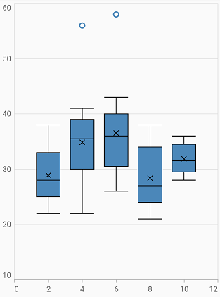

# Box and Whisker Chart in Flutter Cartesian Charts (SfCartesianChart)

The [Flutter Box and Whisker Charts](https://www.syncfusion.com/flutter-widgets/flutter-charts/chart-types/box-and-whisker-chart) can be used to visualize a group of numerical data through their quartiles. It is also referred to as box plot. Box plots may also have lines extending vertically from the boxes (whiskers) indicating variability outside the upper and lower quartiles.

To render a Box and Whisker chart, create an instance of [`BoxAndWhiskerSeries`](https://pub.dev/documentation/syncfusion_flutter_charts/latest/charts/BoxAndWhiskerSeries-class.html), and add it to the [`series`](https://pub.dev/documentation/syncfusion_flutter_charts/latest/charts/SfCartesianChart/series.html) collection property of [`SfCartesianChart`](https://pub.dev/documentation/syncfusion_flutter_charts/latest/charts/SfCartesianChart/SfCartesianChart.html). The following properties to customize the appearance.

* [`color`](https://pub.dev/documentation/syncfusion_flutter_charts/latest/charts/CartesianSeries/color.html) - changes the color of the series.
* [`opacity`](https://pub.dev/documentation/syncfusion_flutter_charts/latest/charts/CartesianSeries/opacity.html) - controls the transparency of the chart series.
* [`width`](https://pub.dev/documentation/syncfusion_flutter_charts/latest/charts/CartesianSeries/width.html) - changes the stroke width of the series.
* [`BoxPlotMode`](https://pub.dev/documentation/syncfusion_flutter_charts/latest/charts/BoxAndWhiskerSeries/boxPlotMode.html) - used to change the box plot rendering mode. This property is applicable for 
[`BoxPlotMode.normal`](https://pub.dev/documentation/syncfusion_flutter_charts/latest/charts/BoxPlotMode.html), [`BoxPlotMode.exclusive`](https://pub.dev/documentation/syncfusion_flutter_charts/latest/charts/BoxPlotMode.html), and [`BoxPlotMode.inclusive`](https://pub.dev/documentation/syncfusion_flutter_charts/latest/charts/BoxPlotMode.html) values.
* [`showMean`](https://pub.dev/documentation/syncfusion_flutter_charts/latest/charts/BoxAndWhiskerSeries/showMean.html) - indication for mean value in box plot. It is set to be true, a cross symbol will be displayed at the mean value, for each data point in box plot. Else, it will not be displayed.
* [`spacing`](https://pub.dev/documentation/syncfusion_flutter_charts/latest/charts/BoxAndWhiskerSeries/spacing.html) - spacing between the box plots.The value ranges from 0 to 1, where 1 represents 100% and 0 represents 0% of the available space.




    @override
    Widget build(BuildContext context) {
        return Scaffold(
            body: Center(
                child: Container(
                    child: SfCartesianChart(
                        series: <CartesianSeries<ChartData, double>>[
                           BoxAndWhiskerSeries<ChartData, double>(
                                dataSource: data,
                                boxPlotMode: BoxPlotMode.exclusive,
                                xValueMapper: (ChartData data, _) => data.x,
                                yValueMapper: (ChartData data, _) => data.y
                            )
                        ]
                    )
                )
            )   
        );
    }




#### See Also

* [Color palette](/flutter/cartesian-charts/series-customization#color-palette) 
* [Color mapping](/flutter/cartesian-charts/series-customization#color-mapping-for-data-points)
* [Animation](/flutter/cartesian-charts/series-customization#animation)
* [Gradient](/flutter/cartesian-charts/series-customization#gradient-fill)
* [Empty points](/flutter/cartesian-charts/series-customization#empty-points)
* [Sorting](/flutter/cartesian-charts/series-customization#sorting)