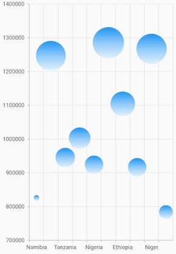

# Bubble Chart in Flutter Cartesian Charts (SfCartesianChart)

To render a bubble chart, create an instance of [`BubbleSeries`](https://pub.dev/documentation/syncfusion_flutter_charts/latest/charts/BubbleSeries-class.html), and add it to the [`series`](https://pub.dev/documentation/syncfusion_flutter_charts/latest/charts/SfCartesianChart/series.html) collection property of [`SfCartesianChart`](https://pub.dev/documentation/syncfusion_flutter_charts/latest/charts/SfCartesianChart-class.html).

Bubble chart requires three fields (X, Y, and Size) to plot a point. Here, [`sizeValueMapper`](https://pub.dev/documentation/syncfusion_flutter_charts/latest/charts/CartesianSeries/sizeValueMapper.html) is used to map the size of each bubble segment from data source.

* [`color`](https://pub.dev/documentation/syncfusion_flutter_charts/latest/charts/CartesianSeries/color.html) - changes the color of the series.
* [`opacity`](https://pub.dev/documentation/syncfusion_flutter_charts/latest/charts/CartesianSeries/opacity.html) - controls the transparency of the chart series.
* [`borderColor`](https://pub.dev/documentation/syncfusion_flutter_charts/latest/charts/CartesianSeries/borderColor.html) - changes the stroke width of the series.
* [`borderWidth`](https://pub.dev/documentation/syncfusion_flutter_charts/latest/charts/CartesianSeries/borderWidth.html) - changes the stroke color of the series.


 
    
    @override
    Widget build(BuildContext context) {
         final List<ChartData> chartData = [
            ChartData(DateTime(2010), 35, 0.32),
            ChartData(DateTime(2011), 38, 0.21),
            ChartData(DateTime(2012), 34, 0.38),
            ChartData(DateTime(2013), 52, 0.29),
            ChartData(DateTime(2014), 40, 0.34)
        ];

        return Scaffold(
            body: Center(
                child: Container(
                    child: SfCartesianChart(
                        primaryXAxis: DateTimeAxis(),
                        series: <CartesianSeries>[
                            // Renders bubble chart
                            BubbleSeries<ChartData, DateTime>(
                                dataSource: chartData,
                                sizeValueMapper: (ChartData data, _) => data.size,
                                xValueMapper: (ChartData data, _) => data.x,
                                yValueMapper: (ChartData data, _) => data.y
                            )
                        ]
                    )
                )   
            )
        );
    }

    class ChartData {
        ChartData(this.x, this.y, this.size);
            final DateTime x;
            final double y;
            final double size;
    }




## Change the min and max radius of bubble

The [`minimumRadius`](https://pub.dev/documentation/syncfusion_flutter_charts/latest/charts/BubbleSeries/minimumRadius.html) property is used to change the minimum size of the series and the [`maximumRadius`](https://pub.dev/documentation/syncfusion_flutter_charts/latest/charts/BubbleSeries/maximumRadius.html) property is used to change the maximum size of the series.


 
    
    @override
    Widget build(BuildContext context) {
        return Scaffold(
            body: Center(
                child: Container(
                    child: SfCartesianChart(
                        primaryXAxis: DateTimeAxis(),
                        series: <CartesianSeries>[
                            BubbleSeries<ChartData, DateTime>(
                                dataSource: chartData,
                                sizeValueMapper: (ChartData data, _) => data.size,
                                // Minimum radius of bubble
                                minimumRadius:9, 
                                // Maximum radius of bubble
                                maximumRadius: 15, 
                                xValueMapper: (ChartData data, _) => data.x,
                                yValueMapper: (ChartData data, _) => data.y
                            )
                        ]
                    )
                )   
            )
        );
    }




Also refer, [color palette](./series-customization#color-palette), [color mapping](./series-customization#color-mapping-for-data-points), [animation](./series-customization#animation), [gradient](./series-customization#gradient-fill) and [empty points](./series-customization#empty-points) for customizing the bubble series further.

## Bubble with various color

Using the [`pointColorMapper`](https://pub.dev/documentation/syncfusion_flutter_charts/latest/charts/CartesianSeries/pointColorMapper.html) and [`sizeValueMapper`](https://pub.dev/documentation/syncfusion_flutter_charts/latest/charts/CartesianSeries/sizeValueMapper.html) properties in the Cartesian charts, the Bubble series with different colors and sizes can be rendered.


 
    
    @override
    Widget build(BuildContext context) {
        return Scaffold(
            body: Center(
                child: Container(
                    child: SfCartesianChart(
                        primaryXAxis: CategoryAxis(),
                        series: <CartesianSeries>[
                            BubbleSeries<ChartData, String>(
                                dataSource: chartData,
                                sizeValueMapper: (ChartData data, _) => data.size,
                                pointColorMapper:(ChartData data, _) => data.pointColor,
                                xValueMapper: (ChartData data, _) => data.x,
                                yValueMapper: (ChartData data, _) => data.y
                            )
                        ]
                    )
                )   
            )
        );
    }




## Bubble with gradients

The [`gradient`](https://pub.dev/documentation/syncfusion_flutter_charts/latest/charts/CartesianSeries/gradient.html) property is used to define the gradient colors. The colors from this property is used for series.


 

    @override
    Widget build(BuildContext context) {
        final List<Color> color = <Color>[];
        color.add(Colors.blue[50]!);
        color.add(Colors.blue[200]!);
        color.add(Colors.blue);

        final List<double> stops = <double>[];
        stops.add(0.0);
        stops.add(0.5);
        stops.add(1.0);

        final LinearGradient gradientColors =
            LinearGradient(colors: color, stops: stops);

        return Scaffold(
            body: Center(
                child: Container(
                    child: SfCartesianChart(
                        primaryXAxis: CategoryAxis(),
                        series: <CartesianSeries>[
                            BubbleSeries<ChartData, String>(
                                dataSource: chartData,
                                xValueMapper: (ChartData data, _) => data.x,
                                yValueMapper: (ChartData data, _) => data.y,
                                 sizeValueMapper:(ChartData data, _) => data.size,
                                // Applies gradient color
                                gradient: gradientColors
                            )
                        ]
                    )
                )
            )
        );
    }




## Bubble with multiple series

Using the [`dataSource`](https://pub.dev/documentation/syncfusion_flutter_charts/latest/charts/CartesianSeries/dataSource.html) property in the Map charts, multiple series can be rendered in a bubble chart.


 
    
    @override
    Widget build(BuildContext context) {
        return Scaffold(
            body: Center(
                child: Container(
                    child: SfCartesianChart(
                        series: <CartesianSeries>[
                            BubbleSeries<ChartData, num>(
                                  dataSource: northAmerica,
                                  xValueMapper: (ChartData data, _) => data.xValue,
                                  yValueMapper: (ChartData data, _) => data.y,
                                  sizeValueMapper: (ChartData data, _) => data.size),
                            BubbleSeries<ChartData, num>(
                                  dataSource: europe,
                                  xValueMapper: (ChartData data, _) => data.xValue,
                                  yValueMapper: (ChartData data, _) => data.y,
                                  sizeValueMapper:(ChartData data, _) => data.size),
                            BubbleSeries<ChartData, num>(
                                  dataSource: asia,
                                  xValueMapper: (ChartData data, _) => data.xValue,
                                  yValueMapper: (ChartData data, _) => data.y,
                                  sizeValueMapper: (ChartData data, _) => data.size),
                            BubbleSeries<ChartData, num>(
                                  dataSource: africa,
                                  xValueMapper: (ChartData data, _) => data.xValue,
                                  yValueMapper: (ChartData data, _) => data.y,
                                  sizeValueMapper: (ChartData data, _) => data.size),
                        ]
                    )
                )   
            )
        );
    }




>**Note**: You can refer to our [Flutter Bubble Chart](https://www.syncfusion.com/flutter-widgets/flutter-charts/chart-types/bubble-chart) feature tour page for its groundbreaking feature representations. You can also explore our [Flutter Bubble Chart example](https://flutter.syncfusion.com/#/cartesian-charts/chart-types/bubble/default-bubble-chart) that shows how to easily configure with built-in support for creating stunning visual effects.