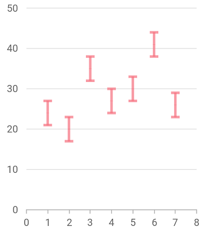
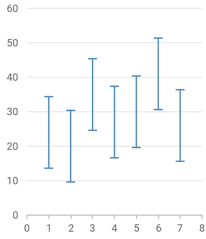
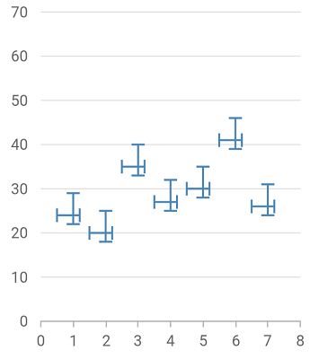
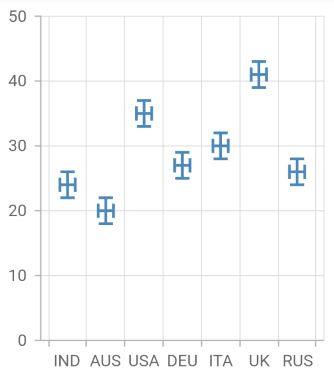
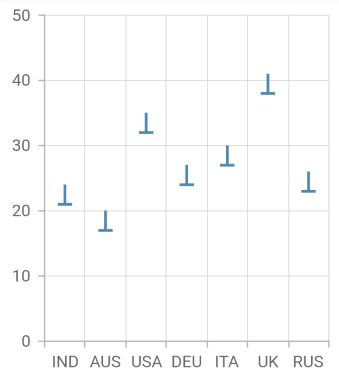
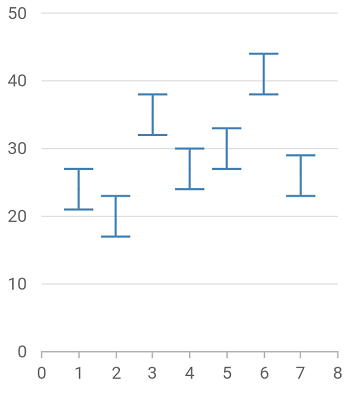

# Error bar chart in Flutter Cartesian Charts (SfCartesianChart)

Error bars are graphical representations of the variability of data and used on graphs to indicate the error or uncertainty in a reported measurement.

To render an error bar chart, create an instance of [`ErrorBarSeries`](https://pub.dev/documentation/syncfusion_flutter_charts/latest/charts/ErrorBarSeries-class.html), and add it to the [`series`](https://pub.dev/documentation/syncfusion_flutter_charts/latest/charts/XyDataSeries-class.html) collection property of [`SfCartesianChart`](https://pub.dev/documentation/syncfusion_flutter_charts/latest/charts/SfCartesianChart/SfCartesianChart.html). The following properties can be used to customize the appearance:

* [`color`](https://pub.dev/documentation/syncfusion_flutter_charts/latest/charts/CartesianSeries/color.html) - changes the stroke width of the line.
* [`opacity`](https://pub.dev/documentation/syncfusion_flutter_charts/latest/charts/CartesianSeries/opacity.html) - controls the transparency of the chart series.
* [`width`](https://pub.dev/documentation/syncfusion_flutter_charts/latest/charts/CartesianSeries/width.html) - changes the stroke width of the line.
* [`dashArray`](https://pub.dev/documentation/syncfusion_flutter_charts/latest/charts/CartesianSeries/dashArray.html) - renders error bar with dashes.
* [`pointColorMapper`](https://pub.dev/documentation/syncfusion_flutter_charts/latest/charts/CartesianSeries/pointColorMapper.html)- maps the individual colors to the data point.

[`Marker`](https://pub.dev/documentation/syncfusion_flutter_charts/latest/charts/MarkerSettings/MarkerSettings.html), [`data label`](https://pub.dev/documentation/syncfusion_flutter_charts/latest/charts/DataLabelSettings-class.html), [`trendline`](https://pub.dev/documentation/syncfusion_flutter_charts/latest/charts/Trendline-class.html), [`Technical indicators`](https://pub.dev/documentation/syncfusion_flutter_charts/latest/charts/TechnicalIndicators-class.html), and other user interaction features are not applicable for error bar series. And events like [`onPointTap`](https://pub.dev/documentation/syncfusion_flutter_charts/latest/charts/CartesianSeries/onPointTap.html), [`onPointDoubleTap`](https://pub.dev/documentation/syncfusion_flutter_charts/latest/charts/CartesianSeries/onPointDoubleTap.html) and [`onPointLongPress`](https://pub.dev/documentation/syncfusion_flutter_charts/latest/charts/CartesianSeries/onPointLongPress.html) are not applicable for this series.



    @override
    Widget build(BuildContext context) {
    final dynamic chartData = [
      ChartData(1, 24),
      ChartData(2, 20),
      ChartData(3, 35),
      ChartData(4, 27),
      ChartData(5, 30),
      ChartData(6, 41),
      ChartData(7, 26)
    ];

    return Scaffold(
        body: SfCartesianChart(
              series: <ChartSeries<ChartData, int>>[
                ErrorBarSeries<ChartData, int>(
                  width: 3.0,
                  opacity: 0.7,
                  color: Color.fromRGBO(246, 114, 128, 1),
                  dataSource: chartData,
                  xValueMapper: (ChartData data, _) => data.x,
                  yValueMapper: (ChartData data, _) => data.y
               )
             ]
           )
        );
      }
    }

    class ChartData {
      ChartData(this.x, this.y);
      final int x;
      final int? y;
    }



## Type

The [`type`](https://pub.dev/documentation/syncfusion_flutter_charts/latest/charts/ErrorBarSeries/type.html) property is used to define the error bar type value. The default value of this property is [`ErrorBarType.fixed`](https://pub.dev/documentation/syncfusion_flutter_charts/latest/charts/ErrorBarType.html), and other values are [`ErrorBarType.custom`](https://pub.dev/documentation/syncfusion_flutter_charts/latest/charts/ErrorBarType.html), [`ErrorBarType.percentage`](https://pub.dev/documentation/syncfusion_flutter_charts/latest/charts/ErrorBarType.html), [`ErrorBarType.standardDeviation`](https://pub.dev/documentation/syncfusion_flutter_charts/latest/charts/ErrorBarType.html) and [`ErrorBarType.standardError`](https://pub.dev/documentation/syncfusion_flutter_charts/latest/charts/ErrorBarType.html).

You can customize the error bar depending on the error value by setting the values for [`horizontalErrorValue`](https://pub.dev/documentation/syncfusion_flutter_charts/latest/charts/ErrorBarSeries/horizontalErrorValue.html) and [`verticalErrorValue`](https://pub.dev/documentation/syncfusion_flutter_charts/latest/charts/ErrorBarSeries/verticalErrorValue.html) for all types except [`ErrorBarType.custom`](https://pub.dev/documentation/syncfusion_flutter_charts/latest/charts/ErrorBarType.html).

* [`horizontalErrorValue`](https://pub.dev/documentation/syncfusion_flutter_charts/latest/charts/ErrorBarSeries/horizontalErrorValue.html) - This property horizontally depicts the error value in positive and negative directions. The default value is `1`.
* [`verticalErrorValue`](https://pub.dev/documentation/syncfusion_flutter_charts/latest/charts/ErrorBarSeries/verticalErrorValue.html) - This property vertically depicts the error value in positive and negative directions. The default value is `3`.



    @override
    Widget build(BuildContext context) {
      final dynamic chartData = [
        ChartData(1, 24),
        ChartData(2, 20),
        ChartData(3, 35),
        ChartData(4, 27),
        ChartData(5, 30),
        ChartData(6, 41),
        ChartData(7, 26)
      ];

      return Scaffold(
        body: SfCartesianChart(
            series: <ChartSeries<ChartData, int>>[
              ErrorBarSeries<ChartData, int>(
                dataSource: chartData,
                xValueMapper: (ChartData data, _) => data.x,
                yValueMapper: (ChartData data, _) => data.y,
                width: 1.5,
                type: ErrorBarType.standardError)
              ],
            )
         );
      }



### Custom type

For [`custom`]([`ErrorBarType.custom`](https://pub.dev/documentation/syncfusion_flutter_charts/latest/charts/ErrorBarType.html)) type, you can customize the error bar depending on the error value by setting the values for [`horizontalPositiveErrorValue`](https://pub.dev/documentation/syncfusion_flutter_charts/latest/charts/ErrorBarSeries/horizontalPositiveErrorValue.html), [`horizontalNegativeErrorValue`](https://pub.dev/documentation/syncfusion_flutter_charts/latest/charts/ErrorBarSeries/horizontalNegativeErrorValue.html), [`verticalPositiveErrorValue`](https://pub.dev/documentation/syncfusion_flutter_charts/latest/charts/ErrorBarSeries/verticalPositiveErrorValue.html) and [`verticalNegativeErrorValue`](https://pub.dev/documentation/syncfusion_flutter_charts/latest/charts/ErrorBarSeries/verticalNegativeErrorValue.html).

* [`horizontalPositiveErrorValue`](https://pub.dev/documentation/syncfusion_flutter_charts/latest/charts/ErrorBarSeries/horizontalPositiveErrorValue.html)- This property horizontally depicts the error value in positive direction. The default value is `1`.
* [`horizontalNegativeErrorValue`](https://pub.dev/documentation/syncfusion_flutter_charts/latest/charts/ErrorBarSeries/horizontalNegativeErrorValue.html) - This property horizontally depicts the error value in negative direction. The default value is `1`.
* [`verticalPositiveErrorValue`](https://pub.dev/documentation/syncfusion_flutter_charts/latest/charts/ErrorBarSeries/verticalPositiveErrorValue.html) - This property vertically depicts the error value in positive direction. The default value is `3`.
* [`verticalNegativeErrorValue`](https://pub.dev/documentation/syncfusion_flutter_charts/latest/charts/ErrorBarSeries/verticalNegativeErrorValue.html) - This property vertically depicts the error value in negative direction. The default value is `3`.



    @override
    Widget build(BuildContext context) {
      final dynamic chartData = [
        ChartData(1, 24),
        ChartData(2, 20),
        ChartData(3, 35),
        ChartData(4, 27),
        ChartData(5, 30),
        ChartData(6, 41),
        ChartData(7, 26)
      ];

      return Scaffold(
        body: SfCartesianChart(
            series: <ChartSeries<ChartData, int>>[
              ErrorBarSeries<ChartData, int>(
                dataSource: chartData,
                xValueMapper: (ChartData data, _) => data.x,
                yValueMapper: (ChartData data, _) => data.y,
                width: 1.5,
                type: ErrorBarType.custom,
                mode: RenderingMode.both,
                verticalPositiveErrorValue: 5,
                verticalNegativeErrorValue: 2,
                horizontalPositiveErrorValue: 0.2,
                horizontalNegativeErrorValue: 0.5)
            ],
          )
        );
    }



## Mode

The error bar [`mode`](https://pub.dev/documentation/syncfusion_flutter_charts/latest/charts/ErrorBarSeries/mode.html) specifies whether the error bar should be drawn [`RenderingMode.horizontally`](https://pub.dev/documentation/syncfusion_flutter_charts/latest/charts/RenderingMode.html), [`RenderingMode.vertically`](https://pub.dev/documentation/syncfusion_flutter_charts/latest/charts/RenderingMode.html), or [`RenderingMode.both`](https://pub.dev/documentation/syncfusion_flutter_charts/latest/charts/RenderingMode.html), ways. Use the [`mode`](https://pub.dev/documentation/syncfusion_flutter_charts/latest/charts/ErrorBarSeries/mode.html) option to switch the error bar mode. 

The default value is [`RenderingMode.vertical`](https://pub.dev/documentation/syncfusion_flutter_charts/latest/charts/ErrorBarSeries/mode.html). You can use the following properties to customize the [`mode`](https://pub.dev/documentation/syncfusion_flutter_charts/latest/charts/ErrorBarSeries/mode.html).

* [`RenderingMode.vertical`](https://pub.dev/documentation/syncfusion_flutter_charts/latest/charts/RenderingMode.html) - This property displays vertical error value only.
* [`RenderingMode.horizontal`](https://pub.dev/documentation/syncfusion_flutter_charts/latest/charts/RenderingMode.html) - This property displays horizontal error value only.
* [`RenderingMode.both`](https://pub.dev/documentation/syncfusion_flutter_charts/latest/charts/RenderingMode.html)  - This property displays both vertical and horizontal error values.



    @override
    Widget build(BuildContext context) {
      final dynamic chartData = [
        ChartData(1, 24),
        ChartData(2, 20),
        ChartData(3, 35),
        ChartData(4, 27),
        ChartData(5, 30),
        ChartData(6, 41),
        ChartData(7, 26)
      ];

      return Scaffold(
        body: SfCartesianChart(
            series: <ChartSeries<ChartData, int>>[
              ErrorBarSeries<ChartData, int>(
                dataSource: chartData,
                xValueMapper: (ChartData data, _) => data.x,
                yValueMapper: (ChartData data, _) => data.y,
                width: 1.5,
                mode:RenderingMode.both,
                verticalErrorValue:2,
                horizontalErrorValue:0.2
              )
          ],
        )
      );
    }



## Direction

Using the [`direction`](https://pub.dev/documentation/syncfusion_flutter_charts/latest/charts/ErrorBarSeries/direction.html) option, you can alter the error bar direction to [`Direction.plus`](https://pub.dev/documentation/syncfusion_flutter_charts/latest/charts/Direction.html), [`Direction.minus`](https://pub.dev/documentation/syncfusion_flutter_charts/latest/charts/Direction.html), or [`Direction.both`](https://pub.dev/documentation/syncfusion_flutter_charts/latest/charts/Direction.html) sides. 

The default value is [`Direction.both`](https://pub.dev/documentation/syncfusion_flutter_charts/latest/charts/Direction.html). You can use the following properties to customize the [`direction`](https://pub.dev/documentation/syncfusion_flutter_charts/latest/charts/ErrorBarSeries/direction.html).

* [`Direction.both`](https://pub.dev/documentation/syncfusion_flutter_charts/latest/charts/Direction.html) - Used to set error value in positive and negative directions.
* [`Direction.minus`](https://pub.dev/documentation/syncfusion_flutter_charts/latest/charts/Direction.html) - Used to set error value in a negative direction.
* [`Direction.plus`](https://pub.dev/documentation/syncfusion_flutter_charts/latest/charts/Direction.html) - Used to set error value in a positive direction.



    @override
    Widget build(BuildContext context) {
      final dynamic chartData = [
        ChartData(1, 24),
        ChartData(2, 20),
        ChartData(3, 35),
        ChartData(4, 27),
        ChartData(5, 30),
        ChartData(6, 41),
        ChartData(7, 26)
      ];

      return Scaffold(
        body: SfCartesianChart(
            series: <ChartSeries<ChartData, int>>[
              ErrorBarSeries<ChartData, int>(
                dataSource: chartData,
                xValueMapper: (ChartData data, _) => data.x,
                yValueMapper: (ChartData data, _) => data.y,
                width: 1.5,
                direction: Direction.minus
              )
           ],
         )
      );
    }



## Cap length

The [`capLength`](https://pub.dev/documentation/syncfusion_flutter_charts/latest/charts/ErrorBarSeries/capLength.html) property is used to customize the length of the error bar's cap. The default value is `10`.



    @override
    Widget build(BuildContext context) {
      final dynamic chartData = [
        ChartData(1, 24),
        ChartData(2, 20),
        ChartData(3, 35),
        ChartData(4, 27),
        ChartData(5, 30),
        ChartData(6, 41),
        ChartData(7, 26)
      ];

      return Scaffold(
        body: SfCartesianChart(
            series: <ChartSeries<ChartData, int>>[
              ErrorBarSeries<ChartData, int>(
                dataSource: chartData,
                xValueMapper: (ChartData data, _) => data.x,
                yValueMapper: (ChartData data, _) => data.y,
                width: 1.5,
                capLength: 20.0
              )
           ],
         )
      );
    }



#### See Also

* [color palette](https://help.syncfusion.com/flutter/cartesian-charts/series-customization#color-palette) 
* [color mapping](https://help.syncfusion.com/flutter/cartesian-charts/series-customization#color-mapping-for-data-points)
* [animation](https://help.syncfusion.com/flutter/cartesian-charts/series-customization#animation)
* [gradient](https://help.syncfusion.com/flutter/cartesian-charts/series-customization#gradient-fill)
* [empty points](https://help.syncfusion.com/flutter/cartesian-charts/series-customization#empty-points)
* [Sorting]((https://help.syncfusion.com/flutter/cartesian-charts/series-customization##sorting) 