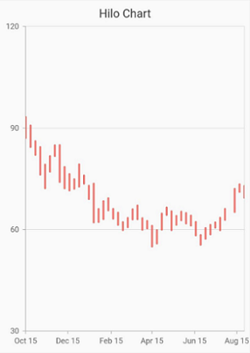

# HiLo Chart in Flutter Cartesian Charts (SfCartesianChart)

To create a Flutter hilo chart quickly, you can check this video.

<iframe id='flutterHiloChartTutorial' src='https://www.youtube.com/embed/uSsKhlRzC2Q'></iframe>

HiLo Series illustrates the price movements in stock using the high and low values.

To render a HiLo chart, create an instance of [`HiloSeries`](https://pub.dev/documentation/syncfusion_flutter_charts/latest/charts/HiloSeries-class.html), and add it to the [`series`](https://pub.dev/documentation/syncfusion_flutter_charts/latest/charts/SfCartesianChart/series.html) collection property of [`SfCartesianChart`](https://pub.dev/documentation/syncfusion_flutter_charts/latest/charts/SfCartesianChart/SfCartesianChart.html). The following properties can be used to customize the appearance:

* [`color`](https://pub.dev/documentation/syncfusion_flutter_charts/latest/charts/CartesianSeries/color.html) - changes the color of the series.
* [`opacity`](https://pub.dev/documentation/syncfusion_flutter_charts/latest/charts/CartesianSeries/opacity.html) - controls the transparency of the chart series.
* [`borderWidth`](https://pub.dev/documentation/syncfusion_flutter_charts/latest/charts/CartesianSeries/borderWidth.html) - changes the stroke width of the series.
* [`borderColor`](https://pub.dev/documentation/syncfusion_flutter_charts/latest/charts/CartesianSeries/borderColor.html) - changes the stroke color of the series.
* [`lowValueMapper`](https://pub.dev/documentation/syncfusion_flutter_charts/latest/charts/CartesianSeries/lowValueMapper.html) - used to get the low values from the series.
* [`highValueMapper`](https://pub.dev/documentation/syncfusion_flutter_charts/latest/charts/CartesianSeries/highValueMapper.html) - used to get the high values from the series.

 
    
    @override
    Widget build(BuildContext context) {
        return Scaffold(
            body: Center(
                child: Container(
                    child: SfCartesianChart(
                        primaryXAxis: DateTimeAxis(),
                        series: <ChartSeries>[
                            // Renders bar chart
                            HiloSeries<ChartData, DateTime>(
                                dataSource: chartData,
                                xValueMapper: (ChartData sales, _) => sales.year,
                                  lowValueMapper: (Sample sales, _) => sales.low,
              highValueMapper: (Sample sales, _) => sales.high
                            )
                        ]
                    )
                )   
            )
        );
    }



