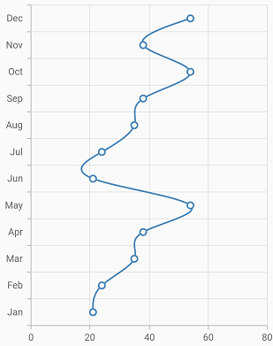

# Spline Chart in Flutter Cartesian Charts (SfCartesianChart)

To render a spline chart, create an instance of [`SplineSeries`](https://pub.dev/documentation/syncfusion_flutter_charts/latest/charts/SplineSeries-class.html), and add it to the [`series`](https://pub.dev/documentation/syncfusion_flutter_charts/latest/charts/SfCartesianChart/series.html) collection property of [`SfCartesianChart`](https://pub.dev/documentation/syncfusion_flutter_charts/latest/charts/SfCartesianChart/SfCartesianChart.html). The following properties can be used to customize the appearance of spline segment:

* [`color`](https://pub.dev/documentation/syncfusion_flutter_charts/latest/charts/CartesianSeries/color.html) - changes the color of the series.
* [`opacity`](https://pub.dev/documentation/syncfusion_flutter_charts/latest/charts/CartesianSeries/opacity.html) - controls the transparency of the chart series.
* [`width`](https://pub.dev/documentation/syncfusion_flutter_charts/latest/charts/CartesianSeries/width.html) - changes the stroke width of the series.

 

    @override
    Widget build(BuildContext context) {
        final List<ChartData> chartData = [
            ChartData(2010, 35),
            ChartData(2011, 13),
            ChartData(2012, 34),
            ChartData(2013, 27),
            ChartData(2014, 40)
        ];
        return Scaffold(
            body: Center(
                child: Container(
                    child: SfCartesianChart(
                        series: <ChartSeries>[
                            // Renders spline chart
                            SplineSeries<ChartData, int>(
                                dataSource: chartData,
                                xValueMapper: (ChartData data, _) => data.x,
                                yValueMapper: (ChartData data, _) => data.y
                                )
                            ]
                        )
                    )
                )
            );
        }
    }
    class ChartData {
        ChartData(this.x, this.y);
        final int x;
        final double? y;
    }



## Spline rendering types

The [`splineType`](https://pub.dev/documentation/syncfusion_flutter_charts/latest/charts/SplineSeries/splineType.html) allows you to change the spline curve in series. The following types can be used in [`SplineSeries`](https://pub.dev/documentation/syncfusion_flutter_charts/latest/charts/SplineSeries/SplineSeries.html):

* natural
* monotonic
* cardinal
* clamped

By default, the value of [`splineType`](https://pub.dev/documentation/syncfusion_flutter_charts/latest/charts/SplineSeries/splineType.html) is [`natural`](https://pub.dev/documentation/syncfusion_flutter_charts/latest/charts/SplineType.html).

The following code sample demonstrates how to set the [`splineType`](https://pub.dev/documentation/syncfusion_flutter_charts/latest/charts/SplineSeries/splineType.html) value to [`cardinal`](https://pub.dev/documentation/syncfusion_flutter_charts/latest/charts/SplineType.html). When you set the cardinal type, you can specify the desired line tension of the [`cardinal`](https://pub.dev/documentation/syncfusion_flutter_charts/latest/charts/SplineType.html) spline using the [`cardinalSplineTension`](https://pub.dev/documentation/syncfusion_flutter_charts/latest/charts/SplineSeries/cardinalSplineTension.html) property. The value of this property ranges from 0 to 1.

 
    
    @override
    Widget build(BuildContext context) {
        final List<ChartData> chartData = [
            ChartData(2010, 35),
            ChartData(2011, 13),
            ChartData(2012, 34),
            ChartData(2013, 27),
            ChartData(2014, 40)
        ];
        return Scaffold(
            body: Center(
                child: Container(
                    child: SfCartesianChart(
                        series: <ChartSeries>[
                            SplineSeries<ChartData, int>(
                                dataSource: chartData,
                                // Type of spline
                                splineType: SplineType.cardinal,
                                cardinalSplineTension: 0.9,
                                xValueMapper: (ChartData data, _) => data.x,
                                yValueMapper: (ChartData data, _) => data.y
                                )
                            ]
                        )
                    )
                )
            );
        }
    }



## Dashed spline

The [`dashArray`](https://pub.dev/documentation/syncfusion_flutter_charts/latest/charts/CartesianSeries/dashArray.html) property of the [`SplineSeries`](https://pub.dev/documentation/syncfusion_flutter_charts/latest/charts/SplineSeries/SplineSeries.html) is used to render spline series with dashes. Odd value is considered as rendering size and even value is considered as gap.

 
    
    @override
    Widget build(BuildContext context) {
        final List<ChartData> chartData = [
            ChartData(2010, 35),
            ChartData(2011, 13),
            ChartData(2012, 34),
            ChartData(2013, 27),
            ChartData(2014, 40)
        ];
        return Scaffold(
            body: Center(
                child: Container(
                    child: SfCartesianChart(
                        series: <ChartSeries>[
                            SplineSeries<ChartData, int>(
                                dataSource: chartData,
                                // Dash values for spline
                                dashArray: <double>[5, 5],
                                xValueMapper: (ChartData data, _) => data.x,
                                yValueMapper: (ChartData data, _) => data.y
                                )
                            ]
                        )
                    )
                )
            );
        }
    }



## Vertical spline chart

The [`isTransposed`](https://pub.dev/documentation/syncfusion_flutter_charts/latest/charts/SfCartesianChart/isTransposed.html) property of [`CartesianSeries`](https://pub.dev/documentation/syncfusion_flutter_charts/latest/charts/CartesianSeries-class.html) is used to transpose the horizontal and vertical axes, to view the data in a different perspective. Using this feature, you can render vertical Spline chart.

 

    @override
    Widget build(BuildContext context) {
        final List<ChartData> chartData = <ChartData>[
                ChartData('Jan', 21),
                ChartData('Feb', 24),
                ChartData('Mar', 35),
                ChartData('Apr', 38),
                ChartData('May', 54),
                ChartData('Jun', 21),
                ChartData('Jul', 24),
                ChartData('Aug', 35),
                ChartData('Sep', 38),
                ChartData('Oct', 54),
                ChartData('Nov', 38),
                ChartData('Dec', 54)
             ];
        return Scaffold(
            body: Center(
                child: Container(
                    child: SfCartesianChart(
                        isTransposed: true,
                        primaryXAxis: CategoryAxis(),
                        series: <ChartSeries>[
                            SplineSeries<ChartData, String>(
                                dataSource: chartData,
                                xValueMapper: (ChartData data, _) => data.x,
                                yValueMapper: (ChartData data, _) => data.y
                                )
                            ]
                        )
                    )
                )
            );
        }
    }
    class ChartData {
        ChartData(this.x, this.y);
        final String x;
        final double? y;
    }



#### See Also

* [Color palette](/flutter/cartesian-charts/series-customization#color-palette) 
* [Color mapping](/flutter/cartesian-charts/series-customization#color-mapping-for-data-points)
* [Animation](/flutter/cartesian-charts/series-customization#animation)
* [Gradient](/flutter/cartesian-charts/series-customization#gradient-fill)
* [Empty points](/flutter/cartesian-charts/series-customization#empty-points)