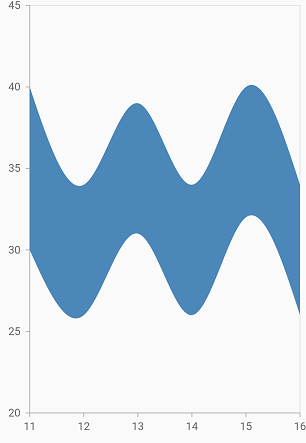

# Spline range area Chart in Flutter Cartesian Charts (SfCartesianChart)

To create a Flutter spline range area chart quickly, you can check this video.

<iframe id='flutterSplinerangecolumnChartTutorial' src='https://www.youtube.com/embed/uSsKhlRzC2Q'></iframe>

To render a spline range area chart, create an instance of the [`SplineRangeAreaSeries`](https://pub.dev/documentation/syncfusion_flutter_charts/latest/charts/SplineRangeAreaSeries-class.html), and add to the series collection property of [`SfCartesianChart`](https://pub.dev/documentation/syncfusion_flutter_charts/latest/charts/SfCartesianChart/SfCartesianChart.html).

 [`SplineRangeAreaSeries`](https://pub.dev/documentation/syncfusion_flutter_charts/latest/charts/SplineRangeAreaSeries-class.html) requires two Y values for a point, data should contain high and low values. The high and low values specify the maximum and minimum ranges of a point.

* [`highValueMapper`](https://pub.dev/documentation/syncfusion_flutter_charts/latest/charts/CartesianSeries/highValueMapper.html) - field in the data source, which is considered as high value for the data points.
* [`lowValueMapper`](https://pub.dev/documentation/syncfusion_flutter_charts/latest/charts/CartesianSeries/lowValueMapper.html) - field in the data source, which is considered as low value for the data points.

 

    @override
    Widget build(BuildContext context) {
        final List<ChartData> chartData = [
        ChartData(11, 30, 40),
        ChartData(12, 26, 34),
        ChartData(13, 32, 39),
        ChartData(14, 27, 34),
        ChartData(15, 32, 40),
        ChartData(16, 26, 34),
        ];
        return Scaffold(
            body: Center(
                child: SfCartesianChart(
                    series: <CartesianSeries<ChartData, num>>[
                    SplineRangeAreaSeries<ChartData, num>(
                        dataSource: chartData,
                        xValueMapper: (ChartData data, _) => data.xValue,
                        lowValueMapper: (ChartData data, _) =>
                        data.lowValue,
                        highValueMapper: (ChartData data, _) =>
                        data.highValue,),
                    ]
                )
            );
        }
    class ChartData {
      ChartData(this.xValue, this.lowValue, this.highValue);
      final num xValue;
      final int lowValue;
      final int highValue;
    }



##	Spline rendering types

The [`splineType`](https://pub.dev/documentation/syncfusion_flutter_charts/latest/charts/SplineSeries/splineType.html) allows you to change the spline curve in series. The following types can be used in [`SplineRangeAreaSeries`](https://pub.dev/documentation/syncfusion_flutter_charts/latest/charts/SplineRangeAreaSeries-class.html).

* natural
* monotonic
* cardinal
* clamped

By default, the value of [`splineType`](https://pub.dev/documentation/syncfusion_flutter_charts/latest/charts/SplineSeries/splineType.html) is [`SplineType.natural`](https://pub.dev/documentation/syncfusion_flutter_charts/latest/charts/SplineType.html).

The following code sample demonstrates how to set the [`splineType`](https://pub.dev/documentation/syncfusion_flutter_charts/latest/charts/SplineSeries/splineType.html) value to [`SplineType.cardinal`](https://pub.dev/documentation/syncfusion_flutter_charts/latest/charts/SplineType.html). When you set the cardinal type, you can specify the desired line tension of the [`SplineType.cardinal`](https://pub.dev/documentation/syncfusion_flutter_charts/latest/charts/SplineType.html) spline using the [`SplineType.cardinalSplineTension`](https://pub.dev/documentation/syncfusion_flutter_charts/latest/charts/SplineSeries/cardinalSplineTension.html) property. The value of this property ranges from 0 to 1.

 

    @override
    Widget build(BuildContext context) {
        return Scaffold(
            body: Center(
                    child: SfCartesianChart(
                        series: <CartesianSeries<ChartData, num>>[
                            SplineRangeAreaSeries<ChartData, num>(
                                dataSource: chartData,
                                splineType: SplineType.cardinal,
                                cardinalSplineTension: 0.8,
                                xValueMapper: (ChartData data, _) => data.xValue,
                                lowValueMapper: (ChartData data, _) => data.lowValue,
                                highValueMapper: (ChartData data, _) => data.highValue
                            )
                        ]
                    )
                )
            );
        }



## Border customization

The borders of the spline range area chart can be customized using the [`borderDrawMode`](https://pub.dev/documentation/syncfusion_flutter_charts/latest/charts/SplineRangeAreaSeries/borderDrawMode.html) property. The default value of the [`borderDrawMode`](https://pub.dev/documentation/syncfusion_flutter_charts/latest/charts/SplineRangeAreaSeries/borderDrawMode.html) property is [`RangeAreaBorderMode.all`](https://pub.dev/documentation/syncfusion_flutter_charts/latest/charts/RangeAreaBorderMode.html) and the other value is [`RangeAreaBorderMode.excludeSides`](https://pub.dev/documentation/syncfusion_flutter_charts/latest/charts/RangeAreaBorderMode.html).

 

    @override
    Widget build(BuildContext context) {
        return Scaffold(
            body: Center(
                    child: SfCartesianChart(
                        series: <CartesianSeries<ChartData, num>>[
                            SplineRangeAreaSeries<ChartData, num>(
                                borderDrawMode:RangeAreaBorderMode.all,
                                dataSource: chartData,
                                borderWidth:2,
                                borderColor: Colors.red,
                                xValueMapper: (ChartData data, _) => data.xValue,
                                lowValueMapper: (ChartData data, _) => data.lowValue,
                                highValueMapper: (ChartData data, _) => data.highValue
                            )
                        ]
                    )
                )
            );
        }



#### See Also

* [Color palette](/flutter/cartesian-charts/series-customization#color-palette) 
* [Color mapping](/flutter/cartesian-charts/series-customization#color-mapping-for-data-points)
* [Animation](/flutter/cartesian-charts/series-customization#animation)
* [Gradient](/flutter/cartesian-charts/series-customization#gradient-fill)
* [Empty points](/flutter/cartesian-charts/series-customization#empty-points)
* [Sorting](/flutter/cartesian-charts/series-customization#sorting)