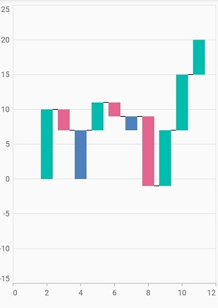

# Waterfall Chart in Flutter Cartesian Charts (SfCartesianChart)

The waterfall chart explains gradual changes in the quantitative value of an entity that is subject to changes by increments or decrements. Using the waterfall chart, you can quickly illustrate changes in revenues.

To render a waterfall chart, create an instance of [`WaterfallSeries`](https://pub.dev/documentation/syncfusion_flutter_charts/latest/charts/WaterfallSeries-class.html) and add to the [`series`](https://pub.dev/documentation/syncfusion_flutter_charts/latest/charts/SfCartesianChart/series.html) collection property of [`SfCartesianChart`](https://pub.dev/documentation/syncfusion_flutter_charts/latest/charts/SfCartesianChart/SfCartesianChart.html). The following properties to customize the appearance.

* [`negativePointsColor`](https://pub.dev/documentation/syncfusion_flutter_charts/latest/charts/WaterfallSeries/negativePointsColor.html) - changes the color of the negative data points in the series. If no color is specified, then the negative data points will be rendered with the series default color.
* [`intermediateSumColor`](https://pub.dev/documentation/syncfusion_flutter_charts/latest/charts/WaterfallSeries/intermediateSumColor.html) - changes the color of the intermediate sum points in the series. If no color is specified, then the intermediate sum points will be rendered with the series default color.
* [`totalSumColor`](https://pub.dev/documentation/syncfusion_flutter_charts/latest/charts/WaterfallSeries/totalSumColor.html) - changes the color of the total sum points in the series. If no color is specified, then the total sum points will be rendered with the series default color.
* [`color`](https://pub.dev/documentation/syncfusion_flutter_charts/latest/charts/CartesianSeries/color.html) - changes the color of the series. If no color is specified, then the series will be rendered with the default palette color.
* [`connectorLineSettings`](https://pub.dev/documentation/syncfusion_flutter_charts/latest/charts/WaterfallSeries/connectorLineSettings.html) - used to customize the waterfall chart connector line. Data points in waterfall chart are connected using the connector line. Provides the options to change the [`width`](https://pub.dev/documentation/syncfusion_flutter_charts/latest/charts/ConnectorLineSettings/width.html), [`color`](https://pub.dev/documentation/syncfusion_flutter_charts/latest/charts/ConnectorLineSettings/color.html) and [`dashArray`](https://pub.dev/documentation/syncfusion_flutter_charts/latest/charts/WaterfallConnectorLineSettings/dashArray.html) of the connector line to customize the appearance.
* [`spacing`](https://pub.dev/documentation/syncfusion_flutter_charts/latest/charts/WaterfallSeries/spacing.html) - used to provide spacing between the data points in waterfall chart. The value ranges from 0 to 1, where 1 represents 100% and 0 represents 0% of the available space.
* [`intermediateSumPredicate`](https://pub.dev/documentation/syncfusion_flutter_charts/latest/charts/CartesianSeries/intermediateSumPredicate.html) - used to predict the intermediate sum based on which the data point will be considered as an intermediate sum or not. If this has true value, then that point will be considered as an intermediate sum. Else if it has false, then it will be considered as a normal data point in the chart.

* [`totalSumPredicate`](https://pub.dev/documentation/syncfusion_flutter_charts/latest/charts/CartesianSeries/totalSumPredicate.html) - used to predict the total sum based on which the data point will be considered as as total sum or not. If this has true value, then that point will be considered as a total sum. Else if it has false, then it will be considered as a normal data point in chart.



    @override
    Widget build(BuildContext context) {
        return Scaffold(
            body: Center(
                child: Container(
                    child:SfCartesianChart(
                    primaryXAxis:
                        NumericAxis(minimum: 0, interval: 2, maximum: 12),
                    series: <ChartSeries<SalesData, double>>[
              WaterfallSeries<SalesData, double>(
                  dataSource: <SalesData>[
                    SalesData(2, 10),
                    SalesData(3, -3),
                    SalesData(4, 5, true),
                    SalesData(5, 4),
                    SalesData(6, -2),
                    SalesData(7, -5, true),
                    SalesData(8, -10),
                    SalesData(9, 8),
                    SalesData(10, 8),
                    SalesData(11, 5, false),
                  ],
                  negativePointsColor: const Color.fromRGBO(229, 101, 144, 1),
                  intermediateSumColor: const Color.fromRGBO(79, 129, 188, 1),
                  totalSumColor: const Color.fromRGBO(79, 129, 188, 1),
                  color: const Color.fromRGBO(0, 189, 174, 1),
                  xValueMapper: (SalesData sales, _) => sales.x,
                  yValueMapper: (SalesData sales, _) => sales.y,
                  intermediateSumPredicate: (SalesData sales, _) =>
                      sales.isIntermediate,
                  totalSumPredicate: (SalesData sales, _) => sales.isTotal,
                  connectorLineSettings:
                      WaterfallConnectorLineSettings(width: 2.5))
                           ]
                        )
                )
            )   
        );
    }

    class SalesData {
        SalesData([this.x, this.y, this.isIntermediate, this.isTotal]);
        final double? x;
        final num? y;
        final bool? isIntermediate;
        final bool? isTotal;
    }



