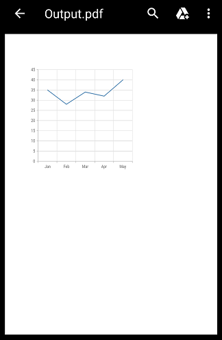

# Exporting in Flutter Cartesian Charts (SfCartesianChart)

[`SfCartesianChart`](https://pub.dev/documentation/syncfusion_flutter_charts/latest/charts/SfCartesianChart-class.html) provides support to export the Cartesian chart as a PNG image or as PDF document.

## Export image

To export the Cartesian chart as a PNG image, we can get the image by calling [`toImage`](https://api.flutter.dev/flutter/rendering/RenderRepaintBoundary/toImage.html) method in repaint boundary.


 

    // Dart import
    import 'dart:async';
    import 'dart:io';
    import 'dart:ui' as dart_ui;

    // Package imports
    import 'package:flutter/material.dart';
    import 'package:flutter/services.dart';
    import 'package:path_provider/path_provider.dart';

    // Chart import
    import 'package:syncfusion_flutter_charts/charts.dart';

    class Export extends SampleView {
      const Export(Key key) : super(key: key);
    
      @override
      _ExportState createState() => _ExportState();
    }

    class _ExportState extends SampleViewState {
      _ExportState();
      final GlobalKey<SfCartesianChartState> _chartKey = GlobalKey();
      // ScaffoldState _scaffoldState;
      GlobalKey<ScaffoldState> scaffoldKey = GlobalKey<ScaffoldState>();
      @override
      Widget build(BuildContext context) {
        return Scaffold(
          key: scaffoldKey,
          body: Column(
            children: <Widget>[
              SfCartesianChart(
                key: _chartKey,
                // Other chart configurations 
              ),
              Container(
                child: IconButton(
                  onPressed: () {
                    duration: Duration(milliseconds: 100);
                    content:
                      Text('Chart has been exported as PNG image');
                    _renderImage();
                  }, 
                  icon: const Icon(Icons.image, color: Colors.white),
                  )
                )
            ]
          )
        )        
      }
       
    Future<void> _renderImage() async {
      final List<int> bytes = await _readImageData();
      if (bytes != null) {
        final Directory documentDirectory =
          await getApplicationDocumentsDirectory();
        final String path = documentDirectory.path;
        const String imageName = 'cartesianchart.png';
        imageCache!.clear();
        final File file = File('$path/$imageName');
        file.writeAsBytesSync(bytes);
        await Navigator.of(context).push<dynamic>(
          MaterialPageRoute<dynamic>(
            builder: (BuildContext context) {
              return Scaffold(
                appBar: AppBar(),
                body: Center(
                  child: Container(
                    color: Colors.white,
                    child: Image.file(file),
                  ),
                ),
              );
            },
          ),
        );
      }
    }

      Future<List<int>> _readImageData() async {
        final dart_ui.Image data =
        await _chartKey.currentState!.toImage(pixelRatio: 3.0);
        final ByteData? bytes =
        await data.toByteData(format: dart_ui.ImageByteFormat.png);
        return bytes!.buffer.asUint8List(bytes.offsetInBytes, bytes.lengthInBytes);
      }
    }




## Export PDF

Similar to the above way, we can also export the rendered chart as a PDF document. We create the pdf document using pdf component. This can be done in the application level itself and please find the code snippet below.


 

    // Dart import
    import 'dart:async';
    import 'dart:io';
    import 'dart:ui' as dart_ui;

    // Package imports
    import 'package:flutter/material.dart';
    import 'package:flutter/services.dart';
    import 'package:path_provider/path_provider.dart';

    // Chart import
    import 'package:syncfusion_flutter_charts/charts.dart';

    // Pdf import
    import 'package:syncfusion_flutter_pdf/pdf.dart';

    class Export extends SampleView {
      const Export(Key key) : super(key: key);
    
       @override
      _ExportState createState() => _ExportState();
    }

     class _ExportState extends SampleViewState {
      _ExportState();
      final GlobalKey<SfCartesianChartState> _chartKey = GlobalKey();
      // ScaffoldState _scaffoldState;
      GlobalKey<ScaffoldState> scaffoldKey = GlobalKey<ScaffoldState>();
      @override
      Widget build(BuildContext context) {
        return Scaffold(
          key: scaffoldKey,
          body: Column(
            children: <Widget>[
              SfCartesianChart(
                key: _chartKey,
                // Other chart configurations
              ),
              Container(
                child: IconButton(
                  onPressed: () {
                    duration: Duration(milliseconds: 100),
                    content:
                      Text('Chart has been exported as PDF document'),
                    _renderPdf();
                  }, 
                  icon: const Icon(Icons.image, color: Colors.white),
                  )
                )
            ]
          )
        )        
      }
       
    Future<void> _renderPdf() async {
      final PdfDocument document = PdfDocument();
      final PdfBitmap bitmap = PdfBitmap(await _readImageData());
      document.pageSettings.orientation =
        MediaQuery.of(context).orientation == Orientation.landscape
            ? PdfPageOrientation.landscape
            : PdfPageOrientation.portrait;
      document.pageSettings.margins.all = 0;
      document.pageSettings.size =
        Size(bitmap.width.toDouble(), bitmap.height.toDouble());
      final PdfPage page = document.pages.add();
      final Size pageSize = page.getClientSize();
      page.graphics.drawImage(
        bitmap, Rect.fromLTWH(0, 0, pageSize.width, pageSize.height));
      ScaffoldMessenger.of(context).hideCurrentSnackBar();
      ScaffoldMessenger.of(context).showSnackBar(const SnackBar(
      behavior: SnackBarBehavior.floating,
      shape: RoundedRectangleBorder(
          borderRadius: BorderRadius.all(Radius.circular(5))),
      duration: Duration(milliseconds: 200),
      content: Text('Chart has been exported as PDF document'),
      ));
      final List<int> bytes = document.save();
      document.dispose();
      await FileSaveHelper.saveAndLaunchFile(bytes, 'cartesian_chart.pdf');
    }

      Future<List<int>> _readImageData() async {
        final dart_ui.Image data =
        await _chartKey.currentState!.toImage(pixelRatio: 3.0);
        final ByteData? bytes =
        await data.toByteData(format: dart_ui.ImageByteFormat.png);
        return bytes!.buffer.asUint8List(bytes.offsetInBytes, bytes.lengthInBytes);
      }
    }




