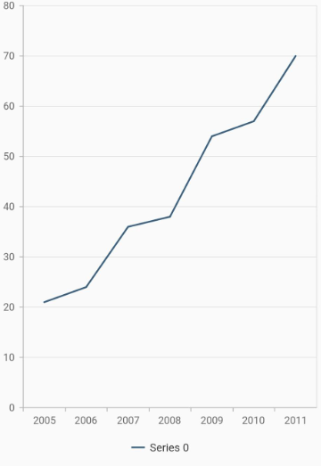
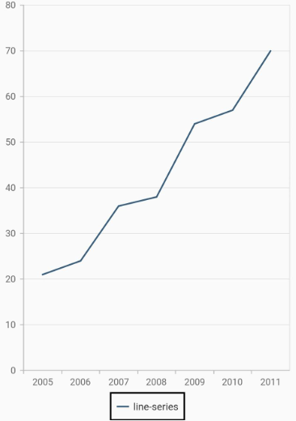
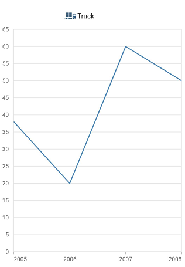
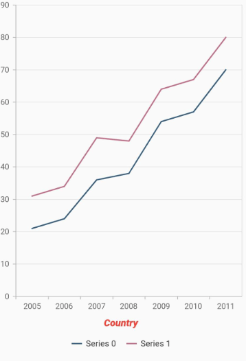
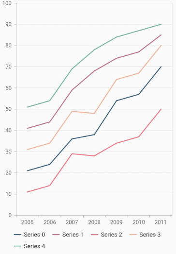
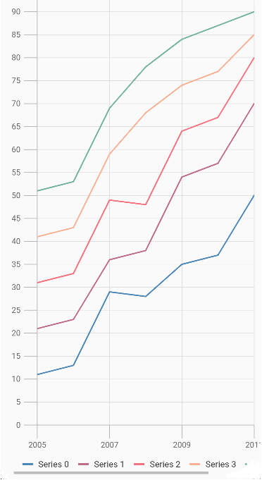
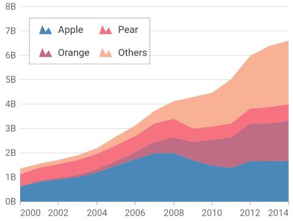

# Legend in Flutter Cartesian Charts (SfCartesianChart)

The [`legend`](https://pub.dev/documentation/syncfusion_flutter_charts/latest/charts/SfCartesianChart/legend.html) contains list of chart series/data points in chart. The information provided in each legend item helps to identify the corresponding data series in chart.


 

    @override
    Widget build(BuildContext context) {
      return Scaffold(
        body: Center(
          child: Container(
              child:SfCartesianChart(
                primaryXAxis: DateTimeAxis(),
                // Enables the legend
                legend: Legend(isVisible: true),
                series: <LineSeries>[
                  LineSeries<ChartData, DateTime>(
                    dataSource: chartData,
                    xValueMapper: (ChartData data, _) => data.x,
                    yValueMapper: (ChartData data, _) => data.y
                  )
                ]
              )
            )
          )
        );
      }

      class ChartData {
          ChartData(this.x, this.y);
          final DateTime x;
          final double? y;
      }




## Customizing legend 

The [`name`](https://pub.dev/documentation/syncfusion_flutter_charts/latest/charts/CartesianSeries/name.html) property of [`CartesianSeries`](https://pub.dev/documentation/syncfusion_flutter_charts/latest/charts/CartesianSeries-class.html) is used to define the label for the corresponding series legend item .The appearance of the label can be customized using the below properties.
* [`borderWidth`](https://pub.dev/documentation/syncfusion_flutter_charts/latest/charts/Legend/borderWidth.html) - used to change the stroke width of the legend shape.
* [`borderColor`](https://pub.dev/documentation/syncfusion_flutter_charts/latest/charts/Legend/borderColor.html) - used to change the stroke color of the legend shape.
* [`backgroundColor`](https://pub.dev/documentation/syncfusion_flutter_charts/latest/charts/Legend/backgroundColor.html) - used to change the background color of legend shape.
* [`opacity`](https://pub.dev/documentation/syncfusion_flutter_charts/latest/charts/Legend/opacity.html) - used to control the transparency of the legend icon shape.
* [`padding`](https://pub.dev/documentation/syncfusion_flutter_charts/latest/charts/Legend/padding.html) - used to add padding between the icon shape and the text.
* [`iconHeight`](https://pub.dev/documentation/syncfusion_flutter_charts/latest/charts/Legend/iconHeight.html) - used to change the height of the icon shape.
* [`iconWidth`](https://pub.dev/documentation/syncfusion_flutter_charts/latest/charts/Legend/iconWidth.html) - used to change the width of the icon shape.
* [`borderWidth`](https://pub.dev/documentation/syncfusion_flutter_charts/latest/charts/Legend/borderWidth.html) - used to change the stroke width of the legend icon shape.
* [`iconBorderColor`](https://pub.dev/documentation/syncfusion_flutter_charts/latest/charts/Legend/iconBorderColor.html) - used to change the stroke color of the legend icon shape.
* [`itemPadding`](https://pub.dev/documentation/syncfusion_flutter_charts/latest/charts/Legend/itemPadding.html) - used to add padding between the first legend text and the second legend icon shape.
* [`height`](https://pub.dev/documentation/syncfusion_flutter_charts/latest/charts/Legend/height.html) - the height of the legend.
* [`width`](https://pub.dev/documentation/syncfusion_flutter_charts/latest/charts/Legend/width.html) - the width of the legend.
* [`isResponsive`](https://pub.dev/documentation/syncfusion_flutter_charts/latest/charts/Legend/isResponsive.html) - toggles the visibility of the legend. If the width or height of the legend is greater than the plot area bounds.
* [`iconBorderWidth`](https://pub.dev/documentation/syncfusion_flutter_charts/latest/charts/Legend/iconBorderWidth.html) - border width of the icon in the legend items. Used to change the stroke width of the legend icon shape.
* [`overflowMode`](https://pub.dev/documentation/syncfusion_flutter_charts/latest/charts/Legend/overflowMode.html) - overflow legend items.
* The [`legendIconType`](https://pub.dev/documentation/syncfusion_flutter_charts/latest/charts/ChartSeries/legendIconType.html) property of [`ChartSeries`](https://pub.dev/documentation/syncfusion_flutter_charts/latest/charts/ChartSeries-class.html) is used to set the shape for the legend icon. Any shape in the [`LegendIconType`](https://pub.dev/documentation/syncfusion_flutter_charts/latest/charts/CartesianSeries/legendIconType.html) can be applied to this property.


 

    @override
    Widget build(BuildContext context) {
      return Scaffold(
        body: Center(
          child: Container(
            child:SfCartesianChart(
              primaryXAxis: DateTimeAxis(),
              legend: Legend(
                isVisible: true,
                // Border color and border width of legend
                borderColor: Colors.black,
                borderWidth: 2
              ),
              series: <CartesianSeries>[
                LineSeries<ChartData, DateTime>(
                  name:'line-series',
                  dataSource: chartData,
                  xValueMapper: (ChartData data, _) => data.x,
                  yValueMapper: (ChartData data, _) => data.y
                )
              ]
            )
          )
        )
      );
    }

     class ChartData {
        ChartData(this.x, this.y);
        final DateTime x;
        final double? y;
      }




### Legend icon with image

The legend icon shape can be changed using the [`legendIconType`](https://pub.dev/documentation/syncfusion_flutter_charts/latest/charts/ChartSeries/legendIconType.html) of the [`ChartSeries`](https://pub.dev/documentation/syncfusion_flutter_charts/latest/charts/ChartSeries-class.html). To use the legend icon as image, specify the [`legendIconType`](https://pub.dev/documentation/syncfusion_flutter_charts/latest/charts/ChartSeries/legendIconType.html) as `LegendIconType.image`, add the image using the [`image`](https://pub.dev/documentation/syncfusion_flutter_charts/latest/charts/Legend/image.html) property of [`legend`](https://pub.dev/documentation/syncfusion_flutter_charts/latest/charts/Legend-class.html). Ensure that the image or image folder is included as an asset in the pubspec.yaml file.


 

    @override
    Widget build(BuildContext context) {
      final List<ChartData> chartData = [
        ChartData(2005,38),
        ChartData(2006,20),
        ChartData(2007,60),
        ChartData(2008,50)
      ];
      return SfCartesianChart(
        legend: Legend(
          isVisible: true,
          image: AssetImage('images/truck_legend.png'),
        ),
        series: <CartesianSeries>[
          LineSeries<ChartData, num>(
            legendIconType: LegendIconType.image,
            dataSource: chartData!,
            xValueMapper: (ChartData data, _) => data.x,
            yValueMapper: (ChartData data, _) => data.y,
            name: 'Truck',
          ),
        ]
      );
    }

    class ChartData {
      ChartData(this.x, this.y);
        final num x;
        final num y;
    }




## Legend title

The following properties can be used to define and customize the [`title`](https://pub.dev/documentation/syncfusion_flutter_charts/latest/charts/Legend/title.html) of [`legend`](https://pub.dev/documentation/syncfusion_flutter_charts/latest/charts/SfCartesianChart/legend.html).

* [`text`](https://pub.dev/documentation/syncfusion_flutter_charts/latest/charts/LegendTitle/text.html) - used to change the text of the title.
* [`textStyle`](https://pub.dev/documentation/syncfusion_flutter_charts/latest/charts/Legend/textStyle.html) - used to change the text color, size, font family, fontStyle, and font weight.
* [`textStyle.color`](https://pub.dev/documentation/syncfusion_flutter_charts/latest/charts/Legend/textStyle.html) - used to change the color of the text.
* [`textStyle.fontFamily`](https://pub.dev/documentation/syncfusion_flutter_charts/latest/charts/Legend/textStyle.html) - used to change the font family for legend text. 
* [`textStyle.fontStyle`](https://pub.dev/documentation/syncfusion_flutter_charts/latest/charts/Legend/textStyle.html) - used to change the font style for the legend text.
* [`textStyle.fontSize`](https://pub.dev/documentation/syncfusion_flutter_charts/latest/charts/Legend/textStyle.html) - used to change the font size for the legend text.
* [`alignment`](https://pub.dev/documentation/syncfusion_flutter_charts/latest/charts/Legend/textStyle.html) - used to change the alignment of the title text, it can be near, center, or far.


 

    @override
    Widget build(BuildContext context) {
      return Scaffold(
        body: Center(
            child: Container(
                child:SfCartesianChart(
                primaryXAxis: DateTimeAxis(),
                legend: Legend(
                    isVisible: true,
                    // Legend title
                    title: LegendTitle(
                      text:'Country',
                      textStyle: TextStyle(
                      color: Colors.red,
                      fontSize: 15,
                      fontStyle: FontStyle.italic,
                      fontWeight: FontWeight.w900
                    )
                  ),
                ),
                series: <CartesianSeries>[
                  LineSeries<ChartData, DateTime>(
                    dataSource: chartData,
                    xValueMapper: (ChartData data, _) => data.x,
                    yValueMapper: (ChartData data, _) => data.y
              ),
                  LineSeries<ChartData, DateTime>(
                    dataSource: chartData1,
                    xValueMapper: (ChartData data, _) => data.x,
                    yValueMapper: (ChartData data, _) => data.y
                )
              ]
            )
          )
        )
      );
    }

     class ChartData {
        ChartData(this.x, this.y);
        final DateTime x;
        final double? y;
      }




## Toggles the series visibility

You can control the visibility of the series by tapping the legend item. You can enable this feature by enabling the [`toggleSeriesVisibility`](https://pub.dev/documentation/syncfusion_flutter_charts/latest/charts/Legend/toggleSeriesVisibility.html) property.


 

    @override
    Widget build(BuildContext context) {
      return Scaffold(
        body: Center(
          child: Container(
            child:SfCartesianChart(
              primaryXAxis: CategoryAxis(),
              legend: Legend(
                isVisible: true,
                // Toggles the series visibility on tapping the legend item
                toggleSeriesVisibility: true
              ),
              series: <CartesianSeries>[
                LineSeries<ChartData, String>(
                  dataSource: chartData,
                  xValueMapper: (ChartData data, _) => data.x,
                  yValueMapper: (ChartData data, _) => data.y
                )
              ]
            )
          )
        )
      );
    }

     class ChartData {
        ChartData(this.x, this.y);
        final String x;
        final double? y;
      }




## Legend visibility

The [`isVisible`](https://pub.dev/documentation/syncfusion_flutter_charts/latest/charts/Legend/isVisible.html) property of [`legend`](https://pub.dev/documentation/syncfusion_flutter_charts/latest/charts/SfCartesianChart/legend.html) is used to toggle the visibility of legend.


 

    @override
    Widget build(BuildContext context) {
      return Scaffold(
        body: Center(
          child: Container(
            child:SfCartesianChart(
              primaryXAxis: CategoryAxis(),
              legend: Legend(
                // Visibility of legend
                isVisible: false
              ),
              series: <CartesianSeries>[
                LineSeries<ChartData, String>(
                  dataSource: chartData,
                  xValueMapper: (ChartData data, _) => data.x,
                  yValueMapper: (ChartData data, _) => data.y
                )
              ]
            )
          )
        )
      );
    }

    class ChartData {
        ChartData(this.x, this.y);
        final String x;
        final double? y;
      }




## Legend item visibility

You can control the visibility of a particular series legend item using the [`isVisibleInLegend`](https://pub.dev/documentation/syncfusion_flutter_charts/latest/charts/CartesianSeries/isVisibleInLegend.html) property of series. The default value of the [`isVisibleInLegend`](https://pub.dev/documentation/syncfusion_flutter_charts/latest/charts/CartesianSeries/isVisibleInLegend.html) property is true. If it is set to false, then the legend item for this specific series will not be displayed in the legend.


 

    @override
    Widget build(BuildContext context) {
      return Scaffold(
        body: Center(
          child: Container(
            child: SfCartesianChart(
              legend: Legend(
                isVisible: true
              ),
              primaryXAxis: CategoryAxis(),
              series: <ColumnSeries>[
                ColumnSeries<ChartData, String>(                  
                  dataSource: chartData,
                  xValueMapper: (ChartData data, _) => data.x,
                  yValueMapper: (ChartData data, _) => data.y
                ),
                ColumnSeries<ChartData, String>(
                  // Hiding the legend item for this series
                  isVisibleInLegend: false,
                  dataSource: chartData1,
                  xValueMapper: (ChartData data, _) => data.x,
                  yValueMapper: (ChartData data, _) => data.y
                )
              ]
            )
          )
        )
      );
    }

    class ChartData {
        ChartData(this.x, this.y);
        final String x;
        final double? y;
      }




## Legend overflow

The legend items can be placed in multiple rows or scroll can be enabled using the [`overflowMode`](https://pub.dev/documentation/syncfusion_flutter_charts/latest/charts/Legend/overflowMode.html) property if size of the total legend items exceeds the available size. The default value of the [`overflowMode`](https://pub.dev/documentation/syncfusion_flutter_charts/latest/charts/Legend/overflowMode.html) property is [`LegendItemOverflowMode.scroll`](https://pub.dev/documentation/syncfusion_flutter_charts/latest/charts/LegendItemOverflowMode.html).


 

    @override
    Widget build(BuildContext context) {
      final List<ChartData> chartData = <ChartData>[
      ChartData(2005, 11, 21, 31, 41, 51),
      ChartData(2006, 13, 23, 33, 43, 53),
      ChartData(2007, 29, 36, 49, 59, 69),
      ChartData(2008, 28, 38, 48, 68, 78),
      ChartData(2009, 35, 54, 64, 74, 84),
      ChartData(2010, 37, 57, 67, 77, 87),
      ChartData(2011, 50, 70, 80, 85, 90),
    ];
      return Scaffold(
        body: Center(
          child: Container(
            child: SfCartesianChart(
              legend: Legend(
                isVisible: true,
                // Overflowing legend content will be wraped
                overflowMode: LegendItemOverflowMode.wrap
              ),
              series: <CartesianSeries<ChartData, int>>[
                LineSeries<ChartData, int>(
                  dataSource: chartData,
                  xValueMapper: (ChartData data, _) => data.x,
                  yValueMapper: (ChartData data, _) => data.series0
                ),
                LineSeries<ChartData, int>(
                  dataSource: chartData,
                  xValueMapper: (ChartData data, _) => data.x,
                  yValueMapper: (ChartData data, _) => data.series1
                ),
                LineSeries<ChartData, int>(
                  dataSource: chartData,
                  xValueMapper: (ChartData data, _) => data.x,
                  yValueMapper: (ChartData data, _) => data.series2
                ),
                LineSeries<ChartData, int>(
                  dataSource: chartData,
                  xValueMapper: (ChartData data, _) => data.x,
                  yValueMapper: (ChartData data, _) => data.series3
                ),
                LineSeries<ChartData, int>(
                  dataSource: chartData,
                  xValueMapper: (ChartData data, _) => data.x,
                  yValueMapper: (ChartData data, _) => data.series4
                )
              ]
            )
          )
        )
      );
    }

    class ChartData {
      ChartData(this.x, this.series0, this.series1, this.series2, this.series3,
      this.series4);
      final int x;
      final double series0;
      final double series1;
      final double series2;
      final double series3;
      final double series4;
    }




## Scrollbar for Legend

The legend's overFlowMode is scroll, the scrolling will be enabled for the items which exceeds the bounds and now using the legend's [`shouldAlwaysShowScrollbar`]() property enable the scrollbar to make it visible.


 

    @override
    Widget build(BuildContext context) {
      final List<ChartData> chartData = <ChartData>[
      ChartData(2005, 11, 21, 31, 41, 51),
      ChartData(2006, 13, 23, 33, 43, 53),
      ChartData(2007, 29, 36, 49, 59, 69),
      ChartData(2008, 28, 38, 48, 68, 78),
      ChartData(2009, 35, 54, 64, 74, 84),
      ChartData(2010, 37, 57, 67, 77, 87),
      ChartData(2011, 50, 70, 80, 85, 90),
    ];
      return Scaffold(
        body: Center(
          child: Container(
            child: SfCartesianChart(
              legend: Legend(
                isVisible: true,
                position: LegendPosition.bottom,
                // Overflowing legend content will be scrolled
                overflowMode: LegendItemOverflowMode.scroll,
                // The scrollbar is make it visible
                shouldAlwaysShowScrollbar: true,
              ),
              series: <CartesianSeries<ChartData, int>>[
                LineSeries<ChartData, int>(
                  dataSource: chartData,
                  xValueMapper: (ChartData data, _) => data.x,
                  yValueMapper: (ChartData data, _) => data.series0
                ),
                LineSeries<ChartData, int>(
                  dataSource: chartData,
                  xValueMapper: (ChartData data, _) => data.x,
                  yValueMapper: (ChartData data, _) => data.series1
                ),
                LineSeries<ChartData, int>(
                  dataSource: chartData,
                  xValueMapper: (ChartData data, _) => data.x,
                  yValueMapper: (ChartData data, _) => data.series2
                ),
                LineSeries<ChartData, int>(
                  dataSource: chartData,
                  xValueMapper: (ChartData data, _) => data.x,
                  yValueMapper: (ChartData data, _) => data.series3
                ),
                LineSeries<ChartData, int>(
                  dataSource: chartData,
                  xValueMapper: (ChartData data, _) => data.x,
                  yValueMapper: (ChartData data, _) => data.series4
                )
              ]
            )
          )
        )
      );
    }

    class ChartData {
      ChartData(this.x, this.series0, this.series1, this.series2, this.series3,
      this.series4);
      final int x;
      final double series0;
      final double series1;
      final double series2;
      final double series3;
      final double series4;
    }




## Positioning the legend

You can change the position of the legend inside the chart. The following properties can be used to customize the position of legend. auto position will place the legend at the right, if the chart's width is greater than the chart's height. Else the legend will be placed at the bottom position.

* [`position`](https://pub.dev/documentation/syncfusion_flutter_charts/latest/charts/Legend/position.html) - used to position the legend relatively. The available options are auto, bottom, left, right, and top. Defaults to [`LegendPosition.auto`](https://pub.dev/documentation/syncfusion_flutter_charts/latest/charts/LegendPosition.html).
* [`orientation`](https://pub.dev/documentation/syncfusion_flutter_charts/latest/charts/Legend/orientation.html) - used to change the orientation of the legend, the default value is auto. Also you can set [`LegendItemOrientation.horizontal`](https://pub.dev/documentation/syncfusion_flutter_charts/latest/charts/LegendItemOrientation.html) or [`LegendItemOrientation.vertical`](https://pub.dev/documentation/syncfusion_flutter_charts/latest/charts/LegendItemOrientation.html).


 

    @override
    Widget build(BuildContext context) {
      return Scaffold(
        body: Center(
          child: Container(
            child: SfCartesianChart(
              primaryXAxis: DateTimeAxis(),
              legend: Legend(
                isVisible: true,
                // Legend will be placed at the left
                position: LegendPosition.left
              ),
              series: <CartesianSeries>[
                AreaSeries<ChartData, DateTime>(
                  dataSource: chartData,
                  xValueMapper: (ChartData data, _) => data.x,
                  yValueMapper: (ChartData data, _) => data.y
                ),
              ]
            )
          )
        )
      );
    }

    class ChartData {
        ChartData(this.x, this.y);
        final DateTime x;
        final double? y;
      }




## Floating legend

Places the legend in custom position. If the [`offset`](https://pub.dev/documentation/syncfusion_flutter_charts/latest/charts/Legend/offset.html) has been set, the legend is moved from its actual position. For example, if the [`position`](https://pub.dev/documentation/syncfusion_flutter_charts/latest/charts/Legend/position.html) is [`LegendPosition.top`](https://pub.dev/documentation/syncfusion_flutter_charts/latest/charts/LegendPosition.html), then the legend will be placed in the top but in the position added to the actual top position. 
Also, the legend will not take a dedicated position for it and will be drawn on the top of the chart's plot area.




    @override
    Widget build(BuildContext context) {
      return Scaffold(
          body: Center(
              child: Container(
                  child: SfCartesianChart(
                      primaryXAxis: DateTimeAxis(),
                      legend: Legend(
                          isVisible: true,
                          // Legend will placed at the specified offset
                          offset: Offset(20, 40)),
                     series: <CartesianSeries>[
            AreaSeries<ChartData, DateTime>(
                dataSource: chartData,
                xValueMapper: (ChartData data, _) => data.x,
                yValueMapper: (ChartData data, _) => data.y),
                ]
              )
            )
          )
        );
      }

    class ChartData {
        ChartData(this.x, this.y);
        final DateTime x;
        final double? y;
    }




## Legend item template

You can customize the appearance of legend items with your template by using [`legendItemBuilder`](https://pub.dev/documentation/syncfusion_flutter_charts/latest/charts/Legend/legendItemBuilder.html) property of [`legend`](https://pub.dev/documentation/syncfusion_flutter_charts/latest/charts/SfCartesianChart/legend.html). Here you can specify the content that needs to be displayed in the legend text as widget.


 

    @override
    Widget build(BuildContext context) {
      return Scaffold(
        body: Center(
          child: Container(
            child: SfCartesianChart(
              primaryXAxis: CategoryAxis(),
              legend: Legend(
                isVisible: true,
                // Templating the legend item
                legendItemBuilder: (String name, dynamic series, dynamic point, int index) {
                  return Container(
                    child: Container(
                      child: Text('template'))
                  );
                }
              ),
              series: <CartesianSeries>[
                AreaSeries<ChartData, String>(
                  dataSource: chartData,
                  xValueMapper: (ChartData data, _) => data.x,
                  yValueMapper: (ChartData data, _) => data.y
                )
              ]
            )
          )
        )
      );
    }

    class ChartData {
        ChartData(this.x, this.y);
        final String x;
        final double? y;
      }




>**Note**: `chartData` in the above code snippets is a class type list and holds the data for binding to the chart series. Refer [Bind data source](https://help.syncfusion.com/flutter/cartesian-charts/getting-started#bind-data-source) topic for more details.
