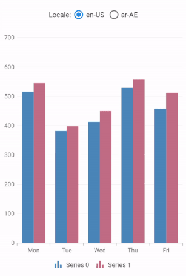
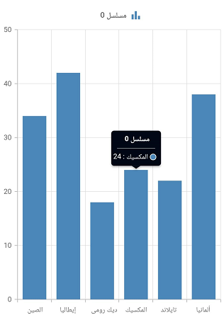

# Localization in Flutter Cartesian Charts (SfCartesianChart)

By default, the Cartesian charts widget supports US English localizations. You can change the other languages by specifying the [`MaterialApp`](https://api.flutter.dev/flutter/material/MaterialApp/MaterialApp.html) properties and adding the `flutter_localizations` package to your application.

To use `flutter_localizations`, add the package as dependency to `pubspec.yaml` file.




    dependencies:
      flutter_localizations:
        sdk: flutter




Next, import the `flutter_localizations` library and specify [`localizationsDelegates`](https://api.flutter.dev/flutter/material/MaterialApp/localizationsDelegates.html) and [`supportedLocales`](https://api.flutter.dev/flutter/material/MaterialApp/supportedLocales.html) for [`MaterialApp`](https://api.flutter.dev/flutter/material/MaterialApp/MaterialApp.html).




    import 'package:flutter_localizations/flutter_localizations.dart'; 

    @override
    Widget build(BuildContext context) {
      return MaterialApp(
        localizationsDelegates: const [
          GlobalMaterialLocalizations.delegate,
          GlobalWidgetsLocalizations.delegate,
        ],
        supportedLocales: [
          const Locale('en'),
          const Locale('fr'),
          const Locale('ar'),
        ],
        locale: const Locale('ar'),
        title: 'Cartesian Chart Localization',
        home: Scaffold(
          body: SfCartesianChart(

            // Other Configurations..

          ),
        ),
      );
    }




## Localization support for built-in text

Based on the current locale, the built-in text in the legend and tooltips are translated automatically.

## Localize the custom text in chart

Cartesian chart custom text can be localized using the [`syncfusion_localizations`](https://pub.dev/packages/syncfusion_localizations) package and specifying [`localizationsDelegates`](https://api.flutter.dev/flutter/material/MaterialApp/localizationsDelegates.html) in [`MaterialApp`](https://api.flutter.dev/flutter/material/MaterialApp/MaterialApp.html).

To use [`syncfusion_localizations`](https://pub.dev/packages/syncfusion_localizations), add the package as dependency to `pubspec.yaml` file.




    dependencies:
      syncfusion_localizations: ^xx.x.xx




>**Note**: Here xx.x.xx denotes the current version of [`syncfusion_localizations`](https://pub.dev/packages/syncfusion_localizations) package.

Next, import the [`syncfusion_localizations`](https://pub.dev/packages/syncfusion_localizations) library.




    import 'package:syncfusion_localizations/syncfusion_localizations.dart';




Then, declare the [`SfGlobalLocalizations.delegate`](https://pub.dev/documentation/syncfusion_localizations/latest/syncfusion_localizations/SfGlobalLocalizations-class.html) in the [`localizationsDelegates`](https://api.flutter.dev/flutter/material/MaterialApp/localizationsDelegates.html), which is used to localize the custom string (series name displayed in legend) in the Cartesian chart and specify the [`supportedLocales`](https://api.flutter.dev/flutter/material/MaterialApp/supportedLocales.html) as well.




    late TooltipBehavior _tooltipBehavior;

    @override
    void initState(){
      _tooltipBehavior = TooltipBehavior(enable: true);
      super.initState(); 
    }

    @override
    Widget build(BuildContext context) {
      final List<ChartData> chartData = <ChartData>[
        ChartData(x: 'الصين', y: 34),
        ChartData(x: 'إيطاليا', y: 42),
        ChartData(x: 'ديك رومى', y: 18),
        ChartData(x: 'المكسيك', y: 24),
        ChartData(x: 'تايلاند', y: 22),
        ChartData(x: 'ألمانيا', y: 38)
      ];
      return MaterialApp(
        localizationsDelegates: [
          GlobalMaterialLocalizations.delegate,
          GlobalWidgetsLocalizations.delegate,
          SfGlobalLocalizations.delegate
        ],
        supportedLocales: [
          const Locale('en'),
          const Locale('fr'),
          const Locale('ar'),
        ],
        locale: const Locale('ar'),
        home: Scaffold(
          body: SfCartesianChart(
            legend: Legend(isVisible: true),
            tooltipBehavior: _tooltipBehavior,
            primaryAxis: CategoryAxis(),
            series: <CartesianSeries<ChartData, int>>[
              LineSeries<ChartData, int>(
                dataSource: chartData,
                xValueMapper: (ChartData data, _) => data.x,
                yValueMapper: (ChartData data, _) => data.y,
              ),
            ]
          ),
        ),
      );
    }

    class ChartData {
      ChartData(this.x, this.y);
        final String x;
        final int y;
    }




