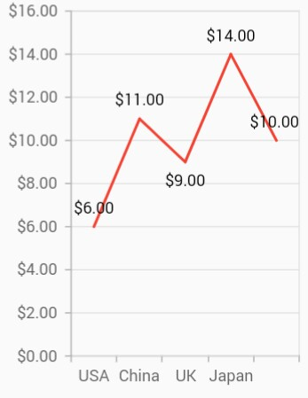
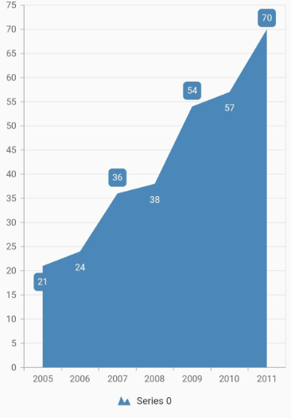
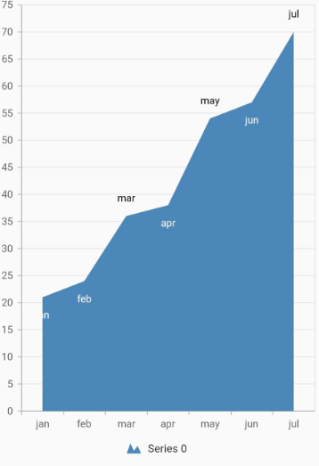
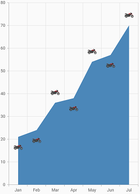
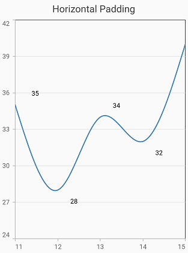
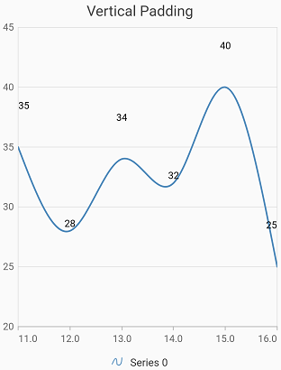
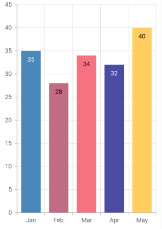

# Marker and data label in Flutter Cartesian Charts (SfCartesianChart)

## Marker

Markers are used to provide information about the exact point location. You can add a shape to adorn each data point. Markers can be enabled by using the [`isVisible`](https://pub.dev/documentation/syncfusion_flutter_charts/latest/charts/MarkerSettings/isVisible.html) property of [`markerSettings`](https://pub.dev/documentation/syncfusion_flutter_charts/latest/charts/CartesianSeries/markerSettings.html). You can use the following properties to customize the appearance.

* [`color`](https://pub.dev/documentation/syncfusion_flutter_charts/latest/charts/MarkerSettings/color.html) - used to change the color of the marker shape.
* [`borderWidth`](https://pub.dev/documentation/syncfusion_flutter_charts/latest/charts/MarkerSettings/borderWidth.html) - used to change the stroke width of the marker shape.
* [`borderColor`](https://pub.dev/documentation/syncfusion_flutter_charts/latest/charts/MarkerSettings/borderColor.html) - used to change the stroke color of the marker shape.
* [`height`](https://pub.dev/documentation/syncfusion_flutter_charts/latest/charts/MarkerSettings/height.html) - used to change the height of the marker shape.
* [`width`](https://pub.dev/documentation/syncfusion_flutter_charts/latest/charts/MarkerSettings/width.html) - used to change the width of the marker shape.

 

    @override
    Widget build(BuildContext context) {
        return Scaffold(
            body: Center(
                child: Container(
                    child: SfCartesianChart(
                        primaryXAxis: CategoryAxis(),
                        series: <CartesianSeries>[
                            LineSeries<ChartData, String>(
                                dataSource: chartData,
                                xValueMapper: (ChartData data, _) => data.x,
                                yValueMapper: (ChartData data, _) => data.y,
                                // Renders the marker 
                                markerSettings: MarkerSettings(
                                    isVisible: true
                                )
                            )
                        ]
                    )
                )
            )
        );
    }

    class ChartData {
        ChartData(this.x, this.y);
        final String x;
        final double? y;
      }



### Customizing marker shapes

Markers can be assigned with different shapes using the [`shape`](https://pub.dev/documentation/syncfusion_flutter_charts/latest/charts/MarkerSettings/MarkerSettings.html) property. By default, markers are rendered with [`DataMarkerType.circle`](https://pub.dev/documentation/syncfusion_flutter_core/latest/core/DataMarkerType.html) shape. The available shapes of markers are listed below.

* circle
* rectangle
* image
* pentagon
* verticalLine
* horizontalLine
* diamond
* triangle
* invertedTriangle

 

    @override
    Widget build(BuildContext context) {
        return Scaffold(
            body: Center(
                child: Container(
                    child: SfCartesianChart(
                        primaryXAxis: CategoryAxis(),
                        series: <CartesianSeries>[
                            LineSeries<ChartData, String>(
                                dataSource: chartData,
                                xValueMapper: (ChartData data, _) => data.x,
                                yValueMapper: (ChartData data, _) => data.y,
                                markerSettings: MarkerSettings(
                                    isVisible: true,
                                    // Marker shape is set to diamond
                                    shape: DataMarkerType.diamond
                                )
                            )
                        ]
                    )
                )
            )
        );
    }

    class ChartData {
        ChartData(this.x, this.y);
        final String x;
        final double? y;
      }



### Image marker

The markers can be rendered with desired image as shape. For this you have to specify the [`shape`](https://pub.dev/documentation/syncfusion_flutter_charts/latest/charts/MarkerSettings/MarkerSettings.html) as [`DataMarkerType.image`](https://pub.dev/documentation/syncfusion_flutter_core/latest/core/DataMarkerType.html) and provide the image using [`DataMarkerType.image`](https://pub.dev/documentation/syncfusion_flutter_charts/latest/charts/MarkerSettings/image.html) property.

 

    @override
    Widget build(BuildContext context) {
        return Scaffold(
            body: Center(
                child: Container(
                    child: SfCartesianChart(
                        primaryXAxis: CategoryAxis(),
                        series: <CartesianSeries>[
                            LineSeries<ChartData, String>(
                                dataSource: chartData,
                                xValueMapper: (ChartData data, _) => data.x,
                                yValueMapper: (ChartData data, _) => data.y,
                                markerSettings: MarkerSettings(
                                    isVisible: true,
                                    shape: DataMarkerType.image,
                                    // Renders the image as marker
                                    imageUrl: 'images/livechart.png'
                                )
                            )
                        ]
                    )
                )
            )
        );
    }

    class ChartData {
        ChartData(this.x, this.y);
        final String x;
        final double? y;
      }



## Data label

Data label can be added to a chart series by enabling the [`isVisible`](https://pub.dev/documentation/syncfusion_flutter_charts/latest/charts/DataLabelSettings/isVisible.html) property in the [`dataLabelSettings`](https://pub.dev/documentation/syncfusion_flutter_charts/latest/charts/CartesianSeries/dataLabelSettings.html). You can use the following properties to customize the appearance.

* [`color`](https://pub.dev/documentation/syncfusion_flutter_charts/latest/charts/DataLabelSettings/color.html) - used to change the background color of the data label shape.
* [`borderWidth`](https://pub.dev/documentation/syncfusion_flutter_charts/latest/charts/DataLabelSettings/borderWidth.html) - used to change the stroke width of the data label shape.
* [`borderColor`](https://pub.dev/documentation/syncfusion_flutter_charts/latest/charts/DataLabelSettings/borderColor.html) - used to change the stroke color of the data label shape.
* [`alignment`](https://pub.dev/documentation/syncfusion_flutter_charts/latest/charts/DataLabelSettings/alignment.html) - aligns the data label text to [`ChartAlignment.near`](https://pub.dev/documentation/syncfusion_flutter_charts/latest/charts/ChartAlignment.html), [`ChartAlignment.center`](https://pub.dev/documentation/syncfusion_flutter_charts/latest/charts/ChartAlignment.html) and [`ChartAlignment.far`](https://pub.dev/documentation/syncfusion_flutter_charts/latest/charts/ChartAlignment.html).
* [`textStyle`](https://pub.dev/documentation/syncfusion_flutter_charts/latest/charts/DataLabelSettings/textStyle.html) - used to change the data label text color, size, font family, font style, and font weight.
* [`color`](https://pub.dev/documentation/syncfusion_flutter_charts/latest/charts/DataLabelSettings/color.html) - used to change the color of the data label.
* [`fontFamily`](https://api.flutter.dev/flutter/painting/TextStyle/fontFamily.html) - used to change the font family for the data label.
* [`fontStyle`](https://api.flutter.dev/flutter/painting/TextStyle/fontStyle.html) - used to change the font style for the data label.
* [`fontWeight`](https://api.flutter.dev/flutter/painting/TextStyle/fontWeight.html) - used to change the font weight for the data label.
* [`fontSize`](https://api.flutter.dev/flutter/painting/TextStyle/fontSize.html) - used to change the font size for the data label.
* [`margin`](https://pub.dev/documentation/syncfusion_flutter_charts/latest/charts/DataLabelSettings/margin.html) - used to change the margin size for data labels.
* [`opacity`](https://pub.dev/documentation/syncfusion_flutter_charts/latest/charts/DataLabelSettings/opacity.html) - used to control the transparency of the data label.
* [`labelAlignment`](https://pub.dev/documentation/syncfusion_flutter_charts/latest/charts/DataLabelSettings/labelAlignment.html) - used to align the Cartesian data label positions. The available options to customize the positions are [`ChartDataLabelAlignment.outer`](https://pub.dev/documentation/syncfusion_flutter_charts/latest/charts/ChartDataLabelAlignment.html), [`ChartDataLabelAlignment.auto`](https://pub.dev/documentation/syncfusion_flutter_charts/latest/charts/ChartDataLabelAlignment.html), [`ChartDataLabelAlignment.top`](https://pub.dev/documentation/syncfusion_flutter_charts/latest/charts/ChartDataLabelAlignment.html), [`ChartDataLabelAlignment.bottom`](https://pub.dev/documentation/syncfusion_flutter_charts/latest/charts/ChartDataLabelAlignment.html) and [`ChartDataLabelAlignment.middle`](https://pub.dev/documentation/syncfusion_flutter_charts/latest/charts/ChartDataLabelAlignment.html).
* [`borderRadius`](https://pub.dev/documentation/syncfusion_flutter_charts/latest/charts/DataLabelSettings/borderRadius.html) - used to add the rounded corners to the data label shape.
* [`angle`](https://pub.dev/documentation/syncfusion_flutter_charts/latest/charts/DataLabelSettings/angle.html) - used to rotate the labels.
* [`offset`](https://pub.dev/documentation/syncfusion_flutter_charts/latest/charts/DataLabelSettings/offset.html) - used to move the data label vertically or horizontally from its position.
* [`showCumulativeValues`](https://pub.dev/documentation/syncfusion_flutter_charts/latest/charts/DataLabelSettings/showCumulativeValues.html) - to show the cumulative values in stacked type series charts.
* [`labelIntersectAction`](https://pub.dev/documentation/syncfusion_flutter_charts/latest/charts/DataLabelSettings/labelIntersectAction.html) - action on data labels intersection. The intersecting data labels can be hidden.
* [`labelPosition`](https://pub.dev/documentation/syncfusion_flutter_charts/latest/charts/DataLabelSettings/labelPosition.html) - position of the data label.

 

    @override
    Widget build(BuildContext context) {
        return Scaffold(
            body: Center(
                child: Container(
                    child: SfCartesianChart(
                        primaryXAxis: CategoryAxis(),
                        series: <CartesianSeries>[
                            LineSeries<ChartData, String>(
                                dataSource: chartData,
                                xValueMapper: (ChartData data, _) => data.x,
                                yValueMapper: (ChartData data, _) => data.y,
                                dataLabelSettings: DataLabelSettings(
                                    // Renders the data label
                                    isVisible: true
                                )
                            )
                        ]
                    )
                )
            )
        );
    }

    class ChartData {
        ChartData(this.x, this.y);
        final String x;
        final double? y;
      }



### Formatting label content

Data label considers the format used in the vertical axis by default. In the below code snippet, we have specified format to y-axis and you can see that the same format is applied to the data label.

 

    @override
    Widget build(BuildContext context) {
        return Scaffold(
            body: Center(
                child: Container(
                    child: SfCartesianChart(
                        // Applies currency format for y axis labels and also for data labels
                        primaryXAxis: CategoryAxis(),
                        primaryYAxis: NumericAxis(numberFormat: NumberFormat.simpleCurrency()),
                        series: <CartesianSeries>[
                            LineSeries<ChartData, String>(
                                dataSource: chartData,
                                color: Colors.red,
                                xValueMapper: (ChartData data, _) => data.x,
                                yValueMapper: (ChartData data, _) => data.y,
                                dataLabelSettings: DataLabelSettings(
                                    isVisible: true
                                )
                            )
                        ]
                    )
                )
            )
        );
    }

    class ChartData {
        ChartData(this.x, this.y);
        final String x;
        final double? y;
      }



import

Import the following package to use label format in your package in your application, `import "package:intl/intl.dart";`.

### Label position

The [`labelAlignment`](https://pub.dev/documentation/syncfusion_flutter_charts/latest/charts/ChartDataLabelAlignment.html) property is used to position the Cartesian chart type data labels at [`ChartDataLabelAlignment.top`](https://pub.dev/documentation/syncfusion_flutter_charts/latest/charts/ChartDataLabelAlignment.html), [`ChartDataLabelAlignment.bottom`](https://pub.dev/documentation/syncfusion_flutter_charts/latest/charts/ChartDataLabelAlignment.html), [`ChartDataLabelAlignment.auto`](https://pub.dev/documentation/syncfusion_flutter_charts/latest/charts/ChartDataLabelAlignment.html), [`ChartDataLabelAlignment.outer`](https://pub.dev/documentation/syncfusion_flutter_charts/latest/charts/ChartDataLabelAlignment.html) and [`ChartDataLabelAlignment.middle`](https://pub.dev/documentation/syncfusion_flutter_charts/latest/charts/ChartDataLabelAlignment.html) position of the actual data point position. By default, labels are [`ChartDataLabelAlignment.auto`](https://pub.dev/documentation/syncfusion_flutter_charts/latest/charts/ChartDataLabelAlignment.html) positioned. You can move the labels horizontally and vertically using OffsetX and OffsetY properties respectively.

 

    @override
    Widget build(BuildContext context) {
        return Scaffold(
            body: Center(
                child: Container(
                    child: SfCartesianChart(
                        primaryXAxis: DateTimeAxis(),
                        series: <CartesianSeries>[
                            AreaSeries<ChartData, DateTime>(
                                dataSource: chartData,
                                xValueMapper: (ChartData data, _) => data.x,
                                yValueMapper: (ChartData data, _) => data.y,
                                dataLabelSettings: DataLabelSettings(
                                    isVisible: true,
                                    // Positioning the data label
                                    labelAlignment: ChartDataLabelAlignment.top
                                )
                            )
                        ]
                    )
                )
            )
        );
    }

    class ChartData {
        ChartData(this.x, this.y);
        final DateTime x;
        final double? y;
      }



### Apply series color

The [`useSeriesColor`](https://pub.dev/documentation/syncfusion_flutter_charts/latest/charts/DataLabelSettings/useSeriesColor.html) property is used to apply the series color to background color of the data labels. The default value of this property is false.

 

    @override
    Widget build(BuildContext context) {
        return Scaffold(
            body: Center(
                child: Container(
                    child: SfCartesianChart(
                        primaryXAxis: DateTimeAxis(),
                        series: <CartesianSeries>[
                            AreaSeries<ChartData, DateTime>(
                                dataSource: chartData,
                                xValueMapper: (ChartData data, _) => data.x,
                                yValueMapper: (ChartData data, _) => data.y,
                                dataLabelSettings: DataLabelSettings(
                                    isVisible: true,
                                    // Positioning the data label
                                    useSeriesColor: true,
                                )
                            )
                        ]
                    )
                )
            )
        );
    }

    class ChartData {
        ChartData(this.x, this.y);
        final DateTime x;
        final double? y;
      }



### Point text mapping

The [`dataLabelMapper`](https://pub.dev/documentation/syncfusion_flutter_charts/latest/charts/CircularSeries/dataLabelMapper.html) property is used to map the text from data source. 

 

    @override
    Widget build(BuildContext context) {
        final List<ChartData> chartData =[
        ChartData('jan', 21),
        ChartData('feb', 24),
        ChartData('mar', 36),
        ChartData('apr', 38),
        ChartData('may', 54),
        ChartData('jun', 57),
        ChartData('jul', 70)
     ];

        return Scaffold(
            body: Center(
                child: Container(
                    child:SfCartesianChart(
                        primaryXAxis: CategoryAxis(),
                        series: <CartesianSeries>[
                            AreaSeries<ChartData, String>(
                                dataSource: chartData,
                                xValueMapper: (ChartData data, _) => data.x,
                                yValueMapper: (ChartData data, _) => data.y,
                                // Map the data label text for each point from the data source
                                dataLabelMapper: (ChartData data, _) => data.x,
                                dataLabelSettings: DataLabelSettings(
                                    isVisible: true
                                )
                            )
                        ]
                    )
                )
            )
        );
    }

    class ChartData {
        ChartData(this.x, this.y);
        final String x;
        final double? y;
    }



### Label template

You can customize the appearance of the data label with your own template using the [`builder`](https://pub.dev/documentation/syncfusion_flutter_charts/latest/charts/DataLabelSettings/builder.html) property of [`dataLabelSettings`](https://pub.dev/documentation/syncfusion_flutter_charts/latest/charts/CartesianSeries/dataLabelSettings.html).

 

    @override
    Widget build(BuildContext context) {
        return Scaffold(
            body: Center(
                child: Container(
                    child:SfCartesianChart(
                        series: <CartesianSeries>[
                            AreaSeries<ChartData, String>(
                                dataSource: chartData,
                                xValueMapper: (ChartData data, _) => data.x,
                                yValueMapper: (ChartData data, _) => data.y,
                                dataLabelMapper: (ChartData data, _) => data.x,
                                dataLabelSettings: DataLabelSettings(
                                    isVisible: true,
                                    // Templating the data label
                                    builder: (dynamic data, dynamic point, dynamic series, int pointIndex, int seriesIndex) {
                                        return Container(
                                        height: 30,
                                        width: 30,
                                        child: Image.asset('images/livechart.png')
                                        );
                                    }
                                )
                            )
                        ]
                    )
                )
            )
        );
    }

    class ChartData {
        ChartData(this.x, this.y);
        final String x;
        final double? y;
      }



### Hide data label for 0 value

Data label and its connector line in the Cartesian charts for the point value 0 can be hidden using the [`showZeroValue`](https://pub.dev/documentation/syncfusion_flutter_charts/latest/charts/DataLabelSettings/showZeroValue.html) property. This defaults to `true`.

 

    @override
    Widget build(BuildContext context) {
        return Scaffold(
            body: Center(
                    child:SfCartesianChart(
                        series: <CartesianSeries<SalesData,num>>[
                            SplineSeries<SalesData, num>(
                                dataLabelSettings: DataLabelSettings(
                                    showZeroValue: false, 
                                    isVisible: true
                                ),
                            )
                        ]
                    )
            )
        );
    }

    class SalesData {
        SalesData(this.x, this.y);
        final num x;
        final double? y;
      }
    


### Data label padding

The [`offset`](https://pub.dev/documentation/syncfusion_flutter_charts/latest/charts/DataLabelSettings/offset.html) property of [`dataLabelSettings`](https://pub.dev/documentation/syncfusion_flutter_charts/latest/charts/CartesianSeries/dataLabelSettings.html) can be used to add padding for the data label to move it in both vertically and horizontally direction from its position. It takes the logical pixel value for x and y values as input.

N>: This is not applicable for other widgets like Circular, Pyramid and Funnel charts.

#### Horizontal padding

In Horizontal padding, providing positive value for x moves the data label to right and negative value moves to left.

 

    @override
    Widget build(BuildContext context) {
        return Scaffold(
            body: Center(
                    child:SfCartesianChart(
                        series: <CartesianSeries<SalesData,num>>[
                            SplineSeries<SalesData, num>(
                                dataLabelSettings: DataLabelSettings(
                                    isVisible: true,
                                    offset: Offset(30, 0),
                                ),
                            )
                        ]
                    )
            )
        );
    }

    class SalesData {
        SalesData(this.x, this.y);
        final num x;
        final double? y;
      }
    


#### Vertical padding

In Vertical padding, providing positive value for y moves the data label upwards and negative value moves downwards.

 

    @override
    Widget build(BuildContext context) {
        return Scaffold(
            body: Center(
                    child:SfCartesianChart(
                        series: <CartesianSeries<SalesData,num>>[
                            SplineSeries<SalesData, num>(
                                dataLabelSettings: DataLabelSettings(
                                    isVisible: true,
                                    offset: Offset(0, 30),
                                ),
                            )
                        ]
                    )
            )
        );
    }

     class SalesData {
        SalesData(this.x, this.y);
        final num x;
        final double? y;
      }
    


### Data label saturation color

If the user didn’t provide text color to the data label, then by default, the saturation color is applied to the data label text. i.e., if the data points background color intensity is dark, then the data label will render in white color (#FFFFFF) and if the data points background color intensity is light, data label will render in black color (#000000).

>**NOTE**:`chartData` in the above code snippets is a class type list and holds the data for binding to the chart series. Refer [Bind data source](https://help.syncfusion.com/flutter/cartesian-charts/getting-started#bind-data-source) topic for more details.
