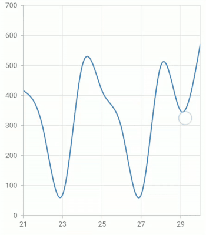

# On-demand loading in Flutter Cartesian Charts (SfCartesianChart)

[`SfCartesianChart`](https://pub.dev/documentation/syncfusion_flutter_charts/latest/charts/SfCartesianChart-class.html) provides support to return a widget which can be used to load more data to the chart when the visible range reaches the end on dragging in the chart with the help of the [`loadMoreIndicatorBuilder`](https://pub.dev/documentation/syncfusion_flutter_charts/latest/charts/SfCartesianChart/loadMoreIndicatorBuilder.html) builder.

## Infinite scrolling

The [`loadMoreIndicatorBuilder`](https://pub.dev/documentation/syncfusion_flutter_charts/latest/charts/SfCartesianChart/loadMoreIndicatorBuilder.html) builds the widget at the top of the chart area (ex., loading indicator or load more button) when horizontal scrolling reaches the start or end of the chart and if the chart is transposed then, this will be called when the vertical scrolling reaches the top or bottom of the chart. this can be used to achieve the functionalities like infinite scrolling in the chart.

The below example demonstrates the infinite scrolling by showing the circular progress indicator until the data is loaded when horizontal scrolling reaches the end of the chart.



    @override
    Widget build(BuildContext context) {
      return Container(
          child: SfCartesianChart(
             loadMoreIndicatorBuilder:
               (BuildContext context, ChartSwipeDirection direction) =>
                   getLoadMoreViewBuilder(context, direction),
             series: <ChartSeries<ChartData, num>>[
                  LineSeries<ChartData, num>(
                      dataSource: chartData,
                  ),
                ],
            )
        );
    }

    Widget getLoadMoreViewBuilder(
      BuildContext context, ChartSwipeDirection direction) {
       if (direction == ChartSwipeDirection.end) {
         return FutureBuilder<String>(
           future: _updateData(), /// Adding data by updateDataSource method
           builder:
            (BuildContext futureContext, AsyncSnapshot<String> snapShot) {
             return snapShot.connectionState != ConnectionState.done
                 ? const CircularProgressIndicator()
                 : SizedBox.fromSize(size: Size.zero);
            },
         );
       } else {
         return SizedBox.fromSize(size: Size.zero);
       }
    }

    class ChartData {
        ChartData(this.x, this.y);
        final num x;
        final double? y;
      }



>**Note**: `chartData` in the above code snippets is a class type list and holds the data for binding to the chart series. Refer [Bind data source](https://help.syncfusion.com/flutter/cartesian-charts/getting-started#bind-data-source) topic for more details.

#### See Also

* [How to lazily load more data to the chart (SfCartesianChart)](https://www.syncfusion.com/kb/12535/how-to-lazily-load-more-data-to-the-chart-sfcartesianchart).