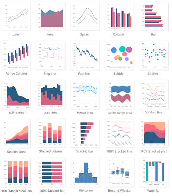
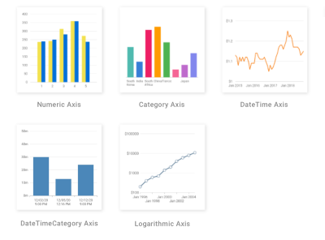
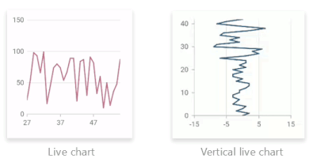

# Flutter Cartesian Charts (SfCartesianChart) Overview

Syncfusion Flutter Cartesian Charts (SfCartesianChart) widget is written natively in Dart for creating beautiful and high-performance Cartesian charts, which are used to craft high-quality applications using Flutter.

To get start quickly with our Flutter chart widget, you can check on this video.

<iframe id='flutterChartVideoTutorial' src='https://www.youtube.com/embed/FwUSJtv-3NY'></iframe>

## Key Features

* **Chart types** - Supports more than 30+ different chart types such as  [`line`](https://www.syncfusion.com/flutter-widgets/flutter-charts/chart-types/line-chart), [`spline`](https://www.syncfusion.com/flutter-widgets/flutter-charts/chart-types/spline-chart), [`column`](https://www.syncfusion.com/flutter-widgets/flutter-charts/chart-types/column-chart), [`bar`](https://www.syncfusion.com/flutter-widgets/flutter-charts/chart-types/bar-chart), [`area`](https://www.syncfusion.com/flutter-widgets/flutter-charts/chart-types/area-chart), [`bubble`](https://www.syncfusion.com/flutter-widgets/flutter-charts/chart-types/bubble-chart), [`box and whisker`](https://www.syncfusion.com/flutter-widgets/flutter-charts/chart-types/box-and-whisker-chart), [`scatter`](https://www.syncfusion.com/flutter-widgets/flutter-charts/chart-types/scatter-chart), [`step line`](https://www.syncfusion.com/flutter-widgets/flutter-charts/chart-types/step-line-chart), [`fast line`](https://www.syncfusion.com/flutter-widgets/flutter-charts/chart-types/line-chart), [`range column`](https://www.syncfusion.com/flutter-widgets/flutter-charts/chart-types/range-column-chart), [`range area`](https://www.syncfusion.com/flutter-widgets/flutter-charts/chart-types/range-area-chart), [`candle`](https://www.syncfusion.com/flutter-widgets/flutter-charts/chart-types/candle-chart), [`hilo`](https://www.syncfusion.com/flutter-widgets/flutter-charts/chart-types/hilo-chart), [`OHLC`](https://www.syncfusion.com/flutter-widgets/flutter-charts/chart-types/ohlc-chart), [`histogram`](https://www.syncfusion.com/flutter-widgets/flutter-charts/chart-types/histogram-chart), [`step area`](https://www.syncfusion.com/flutter-widgets/flutter-charts/chart-types/step-area-chart), [`spline area`](https://www.syncfusion.com/flutter-widgets/flutter-charts/chart-types/spline-area-chart), [`spline range area`](https://www.syncfusion.com/flutter-widgets/flutter-charts/chart-types/spline-range-area-chart), [`stacked area`](https://www.syncfusion.com/flutter-widgets/flutter-charts/chart-types/stacked-area-chart), [`stacked bar`](https://www.syncfusion.com/flutter-widgets/flutter-charts/chart-types/stacked-bar-chart), [`stacked column`](https://www.syncfusion.com/flutter-widgets/flutter-charts/chart-types/stacked-column-chart), [`stacked line`](https://www.syncfusion.com/flutter-widgets/flutter-charts/chart-types/stacked-line-chart), [`100% stacked area`](https://www.syncfusion.com/flutter-widgets/flutter-charts/chart-types/stacked-area-100-chart), [`100% stacked bar`](https://www.syncfusion.com/flutter-widgets/flutter-charts/chart-types/stacked-bar-100-chart), [`100% stacked column`](https://www.syncfusion.com/flutter-widgets/flutter-charts/chart-types/stacked-column-100-chart), [`100% stacked line`](https://www.syncfusion.com/flutter-widgets/flutter-charts/chart-types/stacked-line-100-chart), [`waterfall`](https://www.syncfusion.com/flutter-widgets/flutter-charts/chart-types/waterfall-chart), [`pie`](https://www.syncfusion.com/flutter-widgets/flutter-charts/chart-types/pie-chart), [`doughnut`](https://www.syncfusion.com/flutter-widgets/flutter-charts/chart-types/doughnut-chart), [`radial bar`](https://www.syncfusion.com/flutter-widgets/flutter-charts/chart-types/radial-bar-chart), [`pyramid`](https://www.syncfusion.com/flutter-widgets/flutter-charts/chart-types/pyramid-chart), [`funnel`](https://www.syncfusion.com/flutter-widgets/flutter-charts/chart-types/funnel-chart). Each type represents data in a unique style. It is more user friendly and has greater UI visualization.

  

* **Axis types** - Plot various types of data in a graph with the help of numeric, category, date-time, date-time category and log axis types. The built-in axis features allow to customize an axis elements further to make the axis more readable. 

  

* **User interaction** - The end-user experience is greatly enhanced by including the user interaction features such as zooming and panning, crosshair, trackball, callbacks, selection, tooltip, and auto-scrolling in chart. 

  

* **Legends** - Display additional information about the chart series. The chart legend can also be used to collapse the series. The legends can be wrapped or scrolled if an item exceeds the available bounds. 

* **Dynamic update** - Updates the chart dynamically or lazily with live data that changes over seconds or minutes like stock prices, temperature, speed, etc. 

  

N> You can refer to our [Flutter Charts](https://www.syncfusion.com/flutter-widgets/flutter-charts) feature tour page for its groundbreaking feature representations. You can also explore our [Flutter Charts example](https://flutter.syncfusion.com/#/cartesian-charts/chart-types/line/default-line-chart) that shows how to render various chart types as well as how to easily configure with built-in support for creating stunning visual effects.

#### See Also

* [Integrating syncfusion flutter charts in a flutter web application](https://www.syncfusion.com/kb/11551/how-to-integrate-syncfusion-charts-in-flutter-web-application-sfcartesianchart).