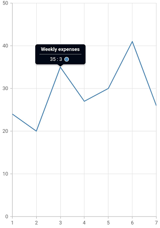
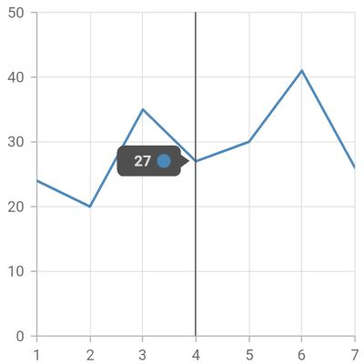
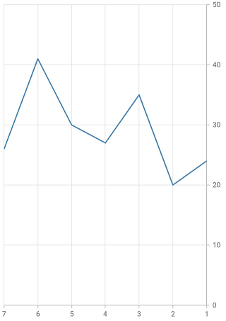

# Right To Left (RTL) in Flutter Cartesian Chart (SfCartesianChart)

Cartesian chart supports the right to left rendering. But chart axis, series, and other chart elements rendering will be the same for both LTR and RTL except trackball, tooltip, and legend.

## RTL rendering ways

Right to left rendering can be switched in the following ways:

### Wrapping the SfCartesianChart with Directionality widget

To change the rendering direction from right to left, you can wrap the [`SfCartesianChart`](https://pub.dev/documentation/syncfusion_flutter_charts/latest/charts/SfCartesianChart-class.html) widget inside the [`Directionality`](https://api.flutter.dev/flutter/widgets/Directionality-class.html) widget and set the [`textDirection`](https://api.flutter.dev/flutter/widgets/Directionality/textDirection.html) property as [`TextDirection.rtl`](https://api.flutter.dev/flutter/dart-ui/TextDirection.html).



    @override
    Widget build(BuildContext context) {
      return Scaffold(
        body: Directionality(
          textDirection: TextDirection.rtl,
          child: SfCartesianChart(
              //...
          ),
        ),
      );
    }



### Changing the locale to RTL languages

To change the chart rendering direction from right to left, you can change the [`locale`](https://api.flutter.dev/flutter/material/MaterialApp/locale.html) to any of the RTL languages such as Arabic, Persian, Hebrew, Pashto, Urdu.



    /// Package import
    import 'package:flutter_localizations/flutter_localizations.dart';

    // ...

    @override
    Widget build(BuildContext context) {
      return MaterialApp(
        localizationsDelegates: [
          GlobalMaterialLocalizations.delegate,
          GlobalWidgetsLocalizations.delegate,
        ],
        supportedLocales: <Locale>[
          Locale('en'),
          Locale('ar'),
          // ... other locales the app supports
        ],
        locale: Locale('ar'),
        home: Scaffold(
          body: SfCartesianChart(
            //...
          ),
        )
      );
    }



## RTL supported chart elements

### Legend

Right to left rendering is applicable for the [`legend`](https://pub.dev/documentation/syncfusion_flutter_charts/latest/charts/Legend-class.html) in the chart. Legend items will be rendered from right to left direction. In right-to-left rendering, the legend text will appear on the left first, followed by the legend icon on the right. i.e. the legend text will appear on the left first, followed by the legend icon on the right.



    @override
    Widget build(BuildContext context) {
      final List<ChartData> chartData = <ChartData>[
        ChartData(1, 24),
        ChartData(2, 20),
        ChartData(3, 35),
        ChartData(4, 27),
        ChartData(5, 30),
        ChartData(6, 41),
        ChartData(7, 26)
      ];
      return Scaffold(
        body: Directionality(
          textDirection: TextDirection.rtl,
          child: SfCartesianChart(
            legend: Legend(
              isVisible: true
            ),
            series: <ChartSeries<ChartData, int>>[
              LineSeries<ChartData, int>(
                name: 'Weekly expenses',
                dataSource: chartData,
                xValueMapper: (ChartData data, _) => data.x,
                yValueMapper: (ChartData data, _) => data.y,
              )
            ]
          )
        )
      );
    }  

    class ChartData {
      ChartData(this.x, this.y);
        final int x;
        final int y;
    }



### Tooltip

Right-to-left rendering is applicable for [`tooltip`](https://pub.dev/documentation/syncfusion_flutter_charts/latest/charts/TooltipBehavior-class.html) elements. Here, the tooltip content renders at first and followed by that the marker on the right. By default, the tooltip content will be `point.x : point.y`, in RTL rendering the tooltip content will be `point.y : point.x`. There will not be any change in the header content. If you wish the format to be applied as it is despite RTL rendering in this case, you can make use of [`onTooltipRender`](https://pub.dev/documentation/syncfusion_flutter_charts/latest/charts/SfCartesianChart/onTooltipRender.html) callback.



    late TooltipBehavior _tooltipBehavior;
    @override
    void initState(){
      _tooltipBehavior = TooltipBehavior(enable: true);
      super.initState(); 
    }

    @override
    Widget build(BuildContext context) {
      final List<ChartData> chartData = <ChartData>[
        ChartData(1, 24),
        ChartData(2, 20),
        ChartData(3, 35),
        ChartData(4, 27),
        ChartData(5, 30),
        ChartData(6, 41),
        ChartData(7, 26)
      ];
      return Scaffold(
        body: Directionality(
          textDirection: TextDirection.rtl,
          child: SfCartesianChart(
            tooltipBehavior = _tooltipBehavior;
            series: <ChartSeries<ChartData, int>>[
              LineSeries<ChartData, int>(
                name: 'Weekly expenses',
                dataSource: chartData,
                xValueMapper: (ChartData data, _) => data.x,
                yValueMapper: (ChartData data, _) => data.y,
              )
            ]
          )
        )
      );
    }  

    class ChartData {
      ChartData(this.x, this.y);
        final int x;
        final int y;
    }



### Trackball

Right-to-left rendering is applicable for trackball tooltip elements.

* The trackball tooltip will render on the right side of the trackball line in LTR rendering if adequate space is available else will be moved to the left.
* The trackball tooltip will render on the left side of the trackball line in RTL rendering if adequate space is available else moved to the right and this is the default behavior.



    late TrackballBehavior _trackballBehavior;

    @override
    void initState() {
      _trackballBehavior = TrackballBehavior(enable: true);
      super.initState(); 
    }

    @override
    Widget build(BuildContext context) {
      final List<ChartData> chartData = <ChartData>[
        ChartData(1, 24),
        ChartData(2, 20),
        ChartData(3, 35),
        ChartData(4, 27),
        ChartData(5, 30),
        ChartData(6, 41),
        ChartData(7, 26)
      ];
      return Scaffold(
        body: Directionality(
          textDirection: TextDirection.rtl,
          child: SfCartesianChart(
            trackballBehavior = _trackballBehavior;
            series: <ChartSeries<ChartData, int>>[
              LineSeries<ChartData, int>(
                dataSource: chartData,
                xValueMapper: (ChartData data, _) => data.x,
                yValueMapper: (ChartData data, _) => data.y,
              )
            ]
          )
        )
      );
    }  

    class ChartData {
      ChartData(this.x, this.y);
        final int x;
        final int y;
    }



In addition, if you want the chart series and axis to look like it is rendering from right to left direction, set the [`opposedPosition`](https://pub.dev/documentation/syncfusion_flutter_charts/latest/charts/ChartAxis/opposedPosition.html) property in [`primaryYAxis`](https://pub.dev/documentation/syncfusion_flutter_charts/latest/charts/SfCartesianChart/primaryYAxis.html) to true and [`isInversed`](https://pub.dev/documentation/syncfusion_flutter_charts/latest/charts/ChartAxis/isInversed.html) property in [`primaryXAxis`](https://pub.dev/documentation/syncfusion_flutter_charts/latest/charts/SfCartesianChart/primaryXAxis.html) to true.



    @override
    Widget build(BuildContext context) {
      final List<ChartData> chartData = <ChartData>[
        ChartData(1, 24),
        ChartData(2, 20),
        ChartData(3, 35),
        ChartData(4, 27),
        ChartData(5, 30),
        ChartData(6, 41),
        ChartData(7, 26)
      ];
      return Scaffold(
        body: SfCartesianChart(
          primaryXAxis: NumericAxis(
            isInversed: true,
          ),
          primaryYAxis: NumericAxis(
            opposedPosition: true,
          ),
          series: <ChartSeries<ChartData, int>>[
            LineSeries<ChartData, int>(
              dataSource: chartData,
              xValueMapper: (ChartData data, _) => data.x,
              yValueMapper: (ChartData data, _) => data.y,
            )
          ]
        )
      );
    }  

    class ChartData {
      ChartData(this.x, this.y);
        final int x;
        final int y;
    }



