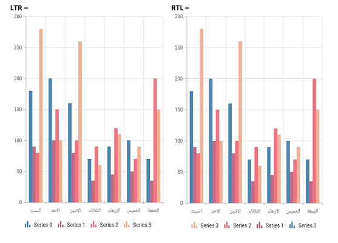
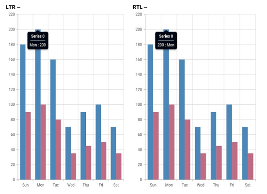
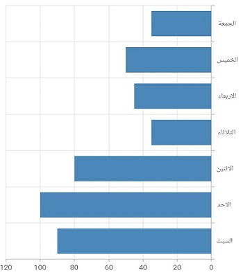

# Right To Left (RTL) in Flutter Cartesian Chart (SfCartesianChart)

Cartesian chart supports right to left rendering. But chart axis, series, and other chart elements rendering will be the same for both LTR and RTL. Only, the legend rendering will be changed.

## RLT rendering ways

Right to left rendering can be switched in the following ways:

### Wrapping the SfCartesianChart with Directionality widget

To change the rendering direction from right to left, you can wrap the [`SfCartesianChart`](https://pub.dev/documentation/syncfusion_flutter_charts/latest/charts/SfCartesianChart-class.html) widget inside the [`Directionality`](https://api.flutter.dev/flutter/widgets/Directionality-class.html) widget and set the [`textDirection`](https://api.flutter.dev/flutter/widgets/Directionality/textDirection.html) property as [`TextDirection.rtl`](https://api.flutter.dev/flutter/dart-ui/TextDirection.html).



    @override
    Widget build(BuildContext context) {
        return Scaffold(
            body: Directionality(
                textDirection: TextDirection.rtl,
                child: SfCartesianChart(
                        //...
                ),
            ),
        );
    }



### Changing the locale to RTL languages

To change the chart rendering direction from right to left, you can change the [`locale`](https://api.flutter.dev/flutter/material/MaterialApp/locale.html) to any of the RTL languages such as Arabic, Persian, Hebrew, Pashto, Urdu and so on.


    
    /// Package import
    import 'package:flutter_localizations/flutter_localizations.dart';
    import 'package:syncfusion_localizations/syncfusion_localizations.dart';

    // ...

    @override
    Widget build(BuildContext context) {
        return MaterialApp(
            localizationsDelegates: [
                GlobalMaterialLocalizations.delegate,
                // ... app-specific localization delegate[s] here
                SfGlobalLocalizations.delegate,
            ],
            supportedLocales: <Locale>[
                Locale('en'),
                Locale('ar'),
                // ... other locales the app supports
            ],
            locale: Locale('en'),
            home: Scaffold(
                body: SfCartesianChart(
                    //...
                ),
            )
        );
    }



## RTL supported chart elements

### Legend

Right to left rendering is only for the [`legend`](https://pub.dev/documentation/syncfusion_flutter_charts/latest/charts/Legend-class.html) in the chart. Legend items will be rendered from right to left direction.


    
    
    @override
    Widget build(BuildContext context) {
            home: Scaffold(
                body: SfCartesianChart(
                    legend: Legend(true),
                    
                    //...other configuration
                ),
            )
        );
    }



### Tooltip

if you want to change the tooltip’s content, to look like it is rendering from right to left, then you can set the [`format`](https://pub.dev/documentation/syncfusion_flutter_charts/latest/charts/TooltipBehavior/format.html) property in [`TooltipBehavior`](https://pub.dev/documentation/syncfusion_flutter_charts/latest/charts/TooltipBehavior-class.html) as `point.y : point.x`. By default, the tooltip format will be `point.x : point.y`.


    
    late TooltipBehavior _tooltipBehavior;

    @override
    void initState(){
      _tooltipBehavior =  TooltipBehavior(enable: true,
      format: 'point.y : point.x');
      super.initState(); 
    }
    SfCartesianChart(
        tooltipBehavior: _tooltipBehavior,
        //...
    )



In addition, if you want the chart series and axis to look like it is rendering from right to left direction, set the [`opposedPosition`](https://pub.dev/documentation/syncfusion_flutter_charts/latest/charts/ChartAxis/opposedPosition.html) property in [`primaryXAxis`](https://pub.dev/documentation/syncfusion_flutter_charts/latest/charts/SfCartesianChart/primaryXAxis.html) to true and [`isInversed`](https://pub.dev/documentation/syncfusion_flutter_charts/latest/charts/ChartAxis/isInversed.html) property in [`primaryYAxis`](https://pub.dev/documentation/syncfusion_flutter_charts/latest/charts/SfCartesianChart/primaryYAxis.html) to true.



    SfCartesianChart(
        primaryXAxis: NumericAxis(
            opposedPosition: true
        ),
        primaryYAxis: NumericAxis(
            isInversed: true
        ),
        //...
    )



