# Trackball and Crosshair in Flutter Cartesian Charts (SfCartesianChart)

## Trackball

Trackball feature displays the tooltip for the data points that are closer to the point where you touch on the chart area. This feature, especially, can be used instead of data label feature when you cannot show data labels for all data points due to space constraint. This feature can be enabled using [`enable`](https://pub.dev/documentation/syncfusion_flutter_charts/latest/charts/TrackballBehavior/enable.html) property of [`trackballBehavior`](https://pub.dev/documentation/syncfusion_flutter_charts/latest/charts/SfCartesianChart/trackballBehavior.html). Trackball will be activated once you long-press anywhere on the chart area. Once it is activated, it will appear in the UI and move based on your touch movement until you stop touching on the chart.

The trackball state will be preserved on the device's orientation change and on browser resize. For example, if the trackball's [`hideDelay`](https://pub.dev/documentation/syncfusion_flutter_charts/latest/charts/TrackballBehavior/hideDelay.html) is set to 10,000ms, and when you change the orientation of your device from portrait to landscape after 5,000ms of trackball display, the trackball will be displayed for the next 5,000ms in landscape mode before disappearing.

You can use the following properties to customize the appearance of trackball tooltip.

* [`lineType`](https://pub.dev/documentation/syncfusion_flutter_charts/latest/charts/TrackballBehavior/lineType.html) - specifies the type of trackball line. By default, vertical line will be displayed.
* [`lineColor`](https://pub.dev/documentation/syncfusion_flutter_charts/latest/charts/TrackballBehavior/lineColor.html) - specifies the color of the trackball line.
* [`lineWidth`](https://pub.dev/documentation/syncfusion_flutter_charts/latest/charts/TrackballBehavior/lineWidth.html) - specifies the stroke width of the trackball line.
* [`lineDashArray`](https://pub.dev/documentation/syncfusion_flutter_charts/latest/charts/TrackballBehavior/lineDashArray.html)- used to render trackball line with dashes.
* [`shouldAlwaysShow`](https://pub.dev/documentation/syncfusion_flutter_charts/latest/charts/TrackballBehavior/shouldAlwaysShow.html) - used to show the trackball even after the touch end.
* [`borderWidth`](https://pub.dev/documentation/syncfusion_flutter_charts/latest/charts/InteractiveTooltip/borderWidth.html) - used to change the stroke width of the axis tooltip.
* [`borderColor`](https://pub.dev/documentation/syncfusion_flutter_charts/latest/charts/InteractiveTooltip/borderColor.html) - used to change the stroke color of the axis tooltip.
* [`arrowLength`](https://pub.dev/documentation/syncfusion_flutter_charts/latest/charts/InteractiveTooltip/arrowLength.html) - specifies the length of the tooltip arrow.
* [`arrowWidth`](https://pub.dev/documentation/syncfusion_flutter_charts/latest/charts/InteractiveTooltip/arrowWidth.html) - specifies the width of the tooltip arrow.
* [`format`](https://pub.dev/documentation/syncfusion_flutter_charts/latest/charts/InteractiveTooltip/format.html) - by default, axis value will be displayed in the tooltip, and it can be customized by adding desired text as prefix or suffix.
* [`textStyle`](https://pub.dev/documentation/syncfusion_flutter_charts/latest/charts/InteractiveTooltip/textStyle.html) - used to change the text color, size, font family, fontStyle, and font weight.
* [`textStyle.color`](https://pub.dev/documentation/syncfusion_flutter_charts/latest/charts/InteractiveTooltip/textStyle.html) - used to change the color of the tooltip text.
* [`textStyle.fontFamily`](https://pub.dev/documentation/syncfusion_flutter_charts/latest/charts/InteractiveTooltip/textStyle.html) - used to change the font family for tooltip text.
* [`textStyle.fontStyle`](https://pub.dev/documentation/syncfusion_flutter_charts/latest/charts/InteractiveTooltip/textStyle.html) - used to change the font style for tooltip text.
* [`textStyle.fontSize`](https://pub.dev/documentation/syncfusion_flutter_charts/latest/charts/InteractiveTooltip/textStyle.html) - used to change the font size for tooltip text.
* [`hideDelay`](https://pub.dev/documentation/syncfusion_flutter_charts/latest/charts/TrackballBehavior/hideDelay.html ) - used to specify disappear delay for trackball.

>**Note**: The above mentioned properties are only applicable for SfCartesian types of charts.



    
    late TrackballBehavior _trackballBehavior;

    @override
    void initState(){
      _trackballBehavior = TrackballBehavior(
                  // Enables the trackball
                  enable: true,
                  tooltipSettings: InteractiveTooltip(
                    enable: true,
                    color: Colors.red
                  )
                );
      super.initState();
    }

    @override
    Widget build(BuildContext context) {
      return Scaffold(
        body: SafeArea(
          child: Center(
            child: Container(
              child: SfCartesianChart(
                trackballBehavior: _trackballBehavior,
                series: <LineSeries<ChartData, String>>[
                      LineSeries<ChartData, String>(
                          dataSource: chartData,
                          xValueMapper: (ChartData data, _) => data.x,
                          yValueMapper: (ChartData data, _) => data.y),
                          ]
                      )
                  )
              )
          )
      );
    }




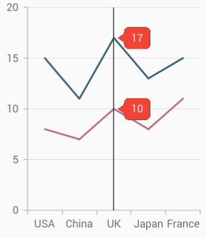

### Label display mode

The [`tooltipDisplayMode`](https://pub.dev/documentation/syncfusion_flutter_charts/latest/charts/TrackballBehavior/tooltipDisplayMode.html) property is used to specify whether to display label for all the data points along the vertical line or display only single label. Following are the options you can set to this property,

* [`TrackballDisplayMode.floatAllPoints`](https://pub.dev/documentation/syncfusion_flutter_charts/latest/charts/TrackballDisplayMode.html#floatAllPoints) - displays label for all the data points along the tracker line.
* [`TrackballDisplayMode.nearestPoint`](https://pub.dev/documentation/syncfusion_flutter_charts/latest/charts/TrackballDisplayMode.html#nearestPoint) - displays label for single data point that is nearer to the touch contact position.
* [`TrackballDisplayMode.groupAllPoints`](https://pub.dev/documentation/syncfusion_flutter_charts/latest/charts/TrackballDisplayMode.html#groupAllPoints) - displays label for all the data points grouped and positioned at the top of the chart area.
* [`TrackballDisplayMode.none`](https://pub.dev/documentation/syncfusion_flutter_charts/latest/charts/TrackballDisplayMode.html#none) - doesn't display the label.



    
    late TrackballBehavior _trackballBehavior;

    @override
    void initState(){
      _trackballBehavior = TrackballBehavior(
                  enable: true,
                  // Display mode of trackball tooltip
                  tooltipDisplayMode: TrackballDisplayMode.floatAllPoints
                );
      super.initState();
    }

    @override
    Widget build(BuildContext context) {
      return Scaffold(
        body: SafeArea(
          child: Center(
            child: Container(
              child: SfCartesianChart(
                trackballBehavior: _trackballBehavior, 
                series: <LineSeries<ChartData, num>>[
                      LineSeries<ChartData, num>(
                          dataSource: chartData,
                          xValueMapper: (ChartData data, _) => data.x,
                          yValueMapper: (ChartData data, _) => data.y),
                          ]
                      )
                  )
              )
          )
      );
    }




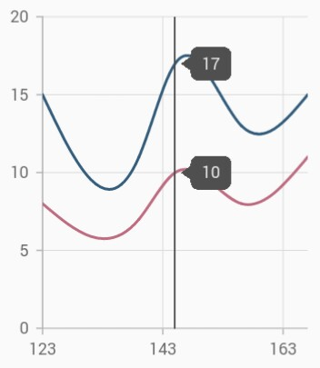

### Label alignment

The position of trackball tooltip can be changed using the [`tooltipAlignment`](https://pub.dev/documentation/syncfusion_flutter_charts/latest/charts/TrackballBehavior/tooltipAlignment.html) property of [`trackballBehavior`](https://pub.dev/documentation/syncfusion_flutter_charts/latest/charts/SfCartesianChart/trackballBehavior.html). The following options are available in [`tooltipAlignment`](https://pub.dev/documentation/syncfusion_flutter_charts/latest/charts/TrackballBehavior/tooltipAlignment.html).

* [`ChartAlignment.near`](https://pub.dev/documentation/syncfusion_flutter_charts/latest/charts/ChartAlignment.html#near) - aligns the trackball tooltip to the top position of plot area.
* [`ChartAlignment.far`](https://pub.dev/documentation/syncfusion_flutter_charts/latest/charts/ChartAlignment.html#far) - aligns the trackball tooltip to the bottom position of plot area.
* [`ChartAlignment.center`](https://pub.dev/documentation/syncfusion_flutter_charts/latest/charts/ChartAlignment.html#center) - aligns the trackball tooltip to the center position of plot area. 

>**Note**: The [`tooltipAlignment`](https://pub.dev/documentation/syncfusion_flutter_charts/latest/charts/TrackballBehavior/tooltipAlignment.html) is only applicable for trackball display mode [`TrackballDisplayMode.groupAllPoints`](https://pub.dev/documentation/syncfusion_flutter_charts/latest/charts/TrackballDisplayMode.html#groupAllPoints).



    
    late TrackballBehavior _trackballBehavior;

    @override
    void initState(){
      _trackballBehavior = TrackballBehavior(
                  enable: true,
                  tooltipAlignment: ChartAlignment.near,
                  tooltipDisplayMode: TrackballDisplayMode.groupAllPoints
                );
      super.initState();
    }

    @override
    Widget build(BuildContext context) {
      return Scaffold(
        body: SafeArea(
          child: Center(
            child: Container(
              child: SfCartesianChart(
                trackballBehavior: _trackballBehavior,
                series: <LineSeries<ChartData, num>>[
                      LineSeries<ChartData, num>(
                          dataSource: chartData,
                          xValueMapper: (ChartData data, _) => data.x,
                          yValueMapper: (ChartData data, _) => data.y),
                          ]
                      )
                  )
              )
          )
      );
    }




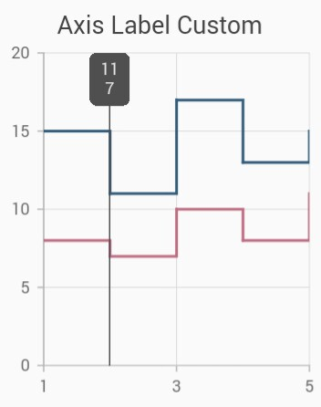

>**Note**: This is applicable only when the [`tooltipDisplayMode`](https://pub.dev/documentation/syncfusion_flutter_charts/latest/charts/TrackballBehavior/tooltipDisplayMode.html) is set to [`TrackballDisplayMode.groupAllPoints`](https://pub.dev/documentation/syncfusion_flutter_charts/latest/charts/TrackballDisplayMode.html#groupAllPoints).

### Label format

By default, axis value will be displayed in the tooltip, and it can be customized using [`format`](https://pub.dev/documentation/syncfusion_flutter_charts/latest/charts/InteractiveTooltip/format.html) property by adding desired text as prefix or suffix.



    
    late TrackballBehavior _trackballBehavior;

    @override
    void initState(){
      _trackballBehavior = TrackballBehavior(
                  enable: true,
                  tooltipSettings: InteractiveTooltip(
                    // Formatting trackball tooltip text
                    format: 'point.x : point.y%'
                  )
                );
      super.initState();
    }

    @override
    Widget build(BuildContext context) {
      return Scaffold(
        body: SafeArea(
          child: Center(
            child: Container(
              child: SfCartesianChart(
                trackballBehavior: _trackballBehavior,
                series: <LineSeries<ChartData, String>>[
                      LineSeries<ChartData, String>(
                          dataSource: chartData,
                          xValueMapper: (ChartData data, _) => data.x,
                          yValueMapper: (ChartData data, _) => data.y),
                          ]
                      )
                  )
              )
          )
      );
    }



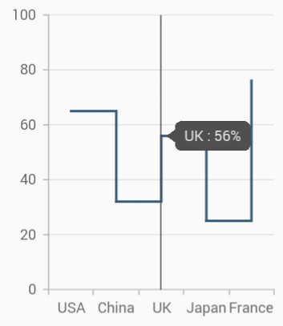

###	Activation mode

The [`activationMode`](https://pub.dev/documentation/syncfusion_flutter_charts/latest/charts/TrackballBehavior/activationMode.html) property is used to restrict the visibility of trackball based on the touch actions. The default value of this property is [`ActivationMode.longPress`](https://pub.dev/documentation/syncfusion_flutter_charts/latest/charts/TrackballBehavior/activationMode.html).

The ActivationMode enum contains the following values:

* [`ActivationMode.longPress`](https://pub.dev/documentation/syncfusion_flutter_charts/latest/charts/ActivationMode.html#longPress) - activates trackball only when performing the long press action.
* [`ActivationMode.singleTap`](https://pub.dev/documentation/syncfusion_flutter_charts/latest/charts/ActivationMode.html#singleTap) - activates trackball only when performing single tap action.
* [`ActivationMode.doubleTap`](https://pub.dev/documentation/syncfusion_flutter_charts/latest/charts/ActivationMode.html#doubleTap) - activates trackball only when performing double tap action.
* [`ActivationMode.none`](https://pub.dev/documentation/syncfusion_flutter_charts/latest/charts/ActivationMode.html#none) - Hides the visibility of trackball when setting activation mode to none. It will be activated when calling the [`show`](https://pub.dev/documentation/syncfusion_flutter_charts/latest/charts/TrackballBehavior/show.html) method.



    
    late TrackballBehavior _trackballBehavior;

    @override
    void initState(){
      _trackballBehavior = TrackballBehavior(
                  enable: true,
                    // Displays the trackball on single tap
                    activationMode: ActivationMode.singleTap
                );
      super.initState();
    }

    @override
    Widget build(BuildContext context) {
      return Scaffold(
        body: SafeArea(
          child: Center(
            child: Container(
              child: SfCartesianChart(
                primaryXAxis: DateTimeAxis(),
                trackballBehavior: _trackballBehavior,
                series: <LineSeries<ChartData, DateTime>>[
                      LineSeries<ChartData, DateTime>(
                          dataSource: chartData,
                          xValueMapper: (ChartData data, _) => data.x,
                          yValueMapper: (ChartData data, _) => data.y),
                          ]
                      )
                  )
              )
          )
      );
    }




### Trackball tooltip overlap

[`SfCartesianChart`](https://pub.dev/documentation/syncfusion_flutter_charts/latest/charts/SfCartesianChart-class.html) provides support to avoid the overlapping of two or more tooltips of the trackball and no API is required for this feature as it will be done by default. For example, If we have 2 or more series data points rendered close to each other then, the trackball tooltips of each data point will not be overlap with each other.



    
    late TrackballBehavior _trackballBehavior;

    @override
    void initState(){
      _trackballBehavior = TrackballBehavior(
                  enable: true);
      super.initState();
    }

    @override
    Widget build(BuildContext context) {
      return Scaffold(
          body: Center(
            child: Container(
              child: SfCartesianChart(
                primaryXAxis: DateTimeAxis(),
                trackballBehavior: _trackballBehavior,
                series: <LineSeries<ChartData, DateTime>>[
                      LineSeries<ChartData, DateTime>(
                          dataSource: chartData,
                          markerSettings: MarkerSettings(isVisible: true),
                          xValueMapper: (ChartData data, _) => data.x,
                          yValueMapper: (ChartData data, _) => data.y),
                      LineSeries<ChartData, DateTime>(
                          dataSource: chartData,
                          markerSettings: MarkerSettings(isVisible: true),
                          xValueMapper: (ChartData data, _) => data.x,
                          yValueMapper: (ChartData data, _) => data.y1),
                      LineSeries<ChartData, DateTime>(
                          dataSource: chartData,
                          markerSettings: MarkerSettings(isVisible: true),
                          xValueMapper: (ChartData data, _) => data.x,
                          yValueMapper: (ChartData data, _) => data.y2),
                      LineSeries<ChartData, DateTime>(
                          dataSource: chartData,
                          markerSettings: MarkerSettings(isVisible: true),
                          xValueMapper: (ChartData data, _) => data.x,
                          yValueMapper: (ChartData data, _) => data.y3)
                ]
              )
            )
        )
      );
    }

    class ChartData {
        ChartData(this.x, this.y);
        final DateTime x;
        final double? y;
      }




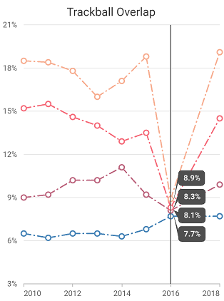

And moreover, the trackball tooltip will render on the right side of the trackball line if adequate space is available else will be moved to the left by default. The trackball tooltip is smartly positioned above the trackball line if there is no space on the right and left sides of the trackball line. However, the trackball tooltip size must be smaller than the chart's plot area size.




    late TrackballBehavior _trackballBehavior;
    final List<ChartData> data = <ChartData>[
      ChartData('Jan', 15, 39, 60),
      ChartData('Feb', 20, 30, 55),
      ChartData('Mar', 25, 28, 48),
      ChartData('Apr', 21, 35, 57),
      ChartData('May', 13, 39, 62),
      ChartData('Jun', 18, 41, 64),
      ChartData('Jul', 24, 45, 57),
      ChartData('Aug', 23, 48, 53),
      ChartData('Sep', 19, 54, 63),
      ChartData('Oct', 31, 55, 50),
      ChartData('Nov', 39, 57, 66),
      ChartData('Dec', 50, 60, 65),
    ];

    @override
    void initState(){
      _trackballBehavior = TrackballBehavior(
        enable: true,
        tooltipDisplayMode: TrackballDisplayMode.groupAllPoints
      );
      super.initState();
    }

    @override
    Widget build(BuildContext context) {
      return SfCartesianChart(
        primaryXAxis: CategoryAxis(),
        trackballBehavior: _trackballBehavior,
        series: <LineSeries<ChartData, String>>[
          LineSeries<ChartData, String>(
            dataSource: data,
            markerSettings: MarkerSettings(isVisible: true),
            name: 'United States of America',
            xValueMapper: (ChartData sales, _) => sales.month,
            yValueMapper: (ChartData sales, _) => sales.firstSale,
          ),
          LineSeries<ChartData, String>(
            dataSource: data,
            markerSettings: MarkerSettings(isVisible: true),
            name: 'Germany',
            xValueMapper: (ChartData sales, _) => sales.month,
            yValueMapper: (ChartData sales, _) => sales.secondSale,
          ),
          LineSeries<ChartData, String>(
            dataSource: data,
            markerSettings: MarkerSettings(isVisible: true),
            name: 'United Kingdom',
            xValueMapper: (ChartData sales, _) => sales.month,
            yValueMapper: (ChartData sales, _) => sales.thirdSale,
          )
        ]
      );
    }

    class ChartData {
      ChartData(
        this.month, 
        this.firstSale, 
        this.secondSale, 
        this.thirdSale
      );

      final String month;
      final double firstSale;
      final double secondSale;
      final double thirdSale;
    }




### Trackball marker settings

Trackball markers are used to provide information about the exact point location. You can add a shape to adorn each data point when the trackball is visible. Trackball markers can be enabled by using the [`markerVisibility`](https://pub.dev/documentation/syncfusion_flutter_charts/latest/charts/TrackballMarkerSettings/markerVisibility.html) property of [`TrackballMarkerSettings`](https://pub.dev/documentation/syncfusion_flutter_charts/latest/charts/TrackballMarkerSettings-class.html). The below [`markerVisibility`](https://pub.dev/documentation/syncfusion_flutter_charts/latest/charts/TrackballMarkerSettings/markerVisibility.html) property determines whether the trackball marker should be visible or not when the trackball is enabled in the chart

* [`TrackballVisibilityMode.auto`](https://pub.dev/documentation/syncfusion_flutter_charts/latest/charts/TrackballVisibilityMode.html#auto) - If the [`isVisible`](https://pub.dev/documentation/syncfusion_flutter_charts/latest/charts/MarkerSettings/isVisible.html) property in the series [`markerSettings`](https://pub.dev/documentation/syncfusion_flutter_charts/latest/charts/MarkerSettings-class.html) is set to true, then the trackball marker will also be displayed for that particular series, else it will not be displayed.
* [`TrackballVisibilityMode.visible`](https://pub.dev/documentation/syncfusion_flutter_charts/latest/charts/TrackballVisibilityMode.html#visible) - Makes the trackball marker visible for all the series irrespective of considering the [`isVisible`](https://pub.dev/documentation/syncfusion_flutter_charts/latest/charts/MarkerSettings/isVisible.html) property's value in the [`markerSettings`](https://pub.dev/documentation/syncfusion_flutter_charts/latest/charts/MarkerSettings-class.html).
* [`TrackballVisibilityMode.hidden`](https://pub.dev/documentation/syncfusion_flutter_charts/latest/charts/TrackballVisibilityMode.html#hidden) - Hides the trackball marker for all the series.

Also refer, [marker customization](./marker-datalabel#Marker) for customizing the appearance of trackball marker.



    
    late TrackballBehavior _trackballBehavior;

    @override
    void initState(){
      _trackballBehavior = TrackballBehavior(
                  enable: true,
                  markerSettings: TrackballMarkerSettings(markerVisibility: TrackballVisibilityMode.visible)
                );
      super.initState();
    }

    @override
    Widget build(BuildContext context) {
      return Scaffold(
          child: Center(
            child: Container(
              child: SfCartesianChart(
                primaryXAxis: DateTimeAxis(),
                trackballBehavior: _trackballBehavior,
                series: <LineSeries<ChartData, DateTime>>[
                      LineSeries<ChartData, DateTime>(
                          dataSource: chartData,
                          xValueMapper: (ChartData data, _) => data.x,
                          yValueMapper: (ChartData data, _) => data.y),
                      LineSeries<ChartData, DateTime>(
                          dataSource: chartData1,
                          xValueMapper: (ChartData data, _) => data.x,
                          yValueMapper: (ChartData data, _) => data.y),
                      LineSeries<ChartData, DateTime>(
                          dataSource: chartData2,
                          xValueMapper: (ChartData data, _) => data.x,
                          yValueMapper: (ChartData data, _) => data.y),
                ]
              )
            )
          )
      );
    }

    class ChartData {
        ChartData(this.x, this.y);
        final DateTime x;
        final double? y;
      }




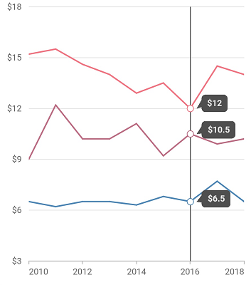

#### See Also

* [Disable marker for a specific series in trackball](https://support.syncfusion.com/kb/article/10485/how-to-disable-the-trackball-marker-for-specific-series-in-cartesian-charts).

### Trackball tooltip template

You can customize the appearance of the trackball tooltip with your own widgets by using the [`builder`](https://pub.dev/documentation/syncfusion_flutter_charts/latest/charts/TrackballBehavior/builder.html) property of [`trackballBehavior`](https://pub.dev/documentation/syncfusion_flutter_charts/latest/charts/TrackballBehavior-class.html). 



    
    late TrackballBehavior _trackballBehavior;

    @override
    void initState() {
      _trackballBehavior = TrackballBehavior(
        enable: true,
        builder: (BuildContext context, TrackballDetails trackballDetails) {
          return Container(
            height: 50,
            width: 150,
            decoration: BoxDecoration(
              color: Color.fromRGBO(0, 8, 22, 0.75),
              borderRadius: BorderRadius.all(Radius.circular(6.0)),
            ),
            child: Row(
              children: [
                Padding(
                    padding: EdgeInsets.only(left: 5),
                    child: SizedBox(
                      child: Image.asset('images/People_Circle16.png'),
                      height: 30,
                      width: 30,
                    )
                  ),
                Center(
                    child: Container(
                        padding: EdgeInsets.only(top: 11, left: 7),
                        height: 40,
                        width: 100,
                        child: Text(
                            '${trackballDetails.point!.x.toString()} : \$${trackballDetails.point!.y.toString()}',
                            style: TextStyle(
                                fontSize: 13,
                                color: Color.fromRGBO(255, 255, 255, 1)
                              )
                            )
                          )
                        )
                    ],
                ),
            );
        },
      );
      super.initState();
    }

    @override
    Widget build(BuildContext context) {
      return Scaffold(
        body: Center(
          child: Container(
            child: SfCartesianChart(
              primaryXAxis: CategoryAxis(),
              trackballBehavior: _trackballBehavior,
              series: <CartesianSeries<ChartData, String>>[
                SplineSeries<ChartData, String>(
                    dataSource: chartData,
                    xValueMapper: (ChartData data, _) => data.x,
                    yValueMapper: (ChartData data, _) => data.y)
              ],
            ),
          ),
        ),
      );
    }

    class ChartData {
        ChartData(this.x, this.y);
        final String x;
        final double? y;
    }




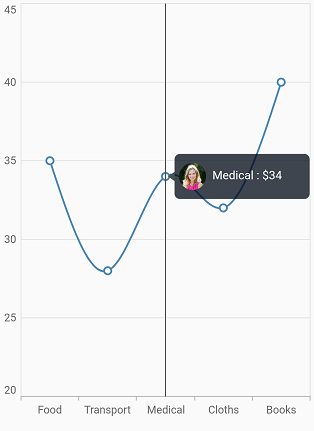

### Trackball grouping mode info
[TrackballGroupingModeInfo](https://pub.dev/documentation/syncfusion_flutter_charts/latest/charts/TrackballGroupingModeInfo-class.html) is store the group mode details of trackball template.

The following properties are available in [`TrackballGroupingModeInfo`](https://pub.dev/documentation/syncfusion_flutter_charts/latest/charts/TrackballGroupingModeInfo-class.html):

* [`points`](https://pub.dev/documentation/syncfusion_flutter_charts/latest/charts/TrackballGroupingModeInfo/points.html) - it specifies the Cartesian chart points.
* [`currentPointIndices`](https://pub.dev/documentation/syncfusion_flutter_charts/latest/charts/TrackballGroupingModeInfo/currentPointIndices.html) - it specifies the current point indices.
* [`visibleSeriesIndices`](https://pub.dev/documentation/syncfusion_flutter_charts/latest/charts/TrackballGroupingModeInfo/visibleSeriesIndices.html) - it specifies the visible series indices.
* [`visibleSeriesList`](https://pub.dev/documentation/syncfusion_flutter_charts/latest/charts/TrackballGroupingModeInfo/visibleSeriesList.html) - it specifies the Cartesian visible series list.

### Trackball tooltip Marker

The [`canShowMarker`](https://pub.dev/documentation/syncfusion_flutter_charts/latest/charts/InteractiveTooltip/canShowMarker.html) is used to toggle the visibility of the marker in the trackball tooltip.

Markers are rendered with the series color and placed near the value in trackball tooltip to convey which value belongs to which series. 

Trackball tooltip marker uses the same shape specified for the series marker. But trackball tooltip marker will render based on the value specified to this property irrespective of considering the series marker's visibility.

Defaults to `true`.




    late TrackballBehavior _trackballBehavior;

    @override
    void initState(){
      _trackballBehavior = TrackballBehavior(
                      enable: true,
                    );
      super.initState();
    }
    
    @override
    Widget build(BuildContext context) {
      return Scaffold(
        child: Center(
            child: Container(
                child: SfCartesianChart(
                    primaryXAxis: CategoryAxis(),
                    trackballBehavior: _trackballBehavior,
                    series: <LineSeries<ChartData, String>>[
                      LineSeries<ChartData, String>(
                          dataSource: chartData,
                          xValueMapper: (ChartData data, _) => data.x,
                          yValueMapper: (ChartData data, _) => data.y),
                      LineSeries<ChartData, String>(
                          dataSource: chartData,
                          xValueMapper: (ChartData data, _) => data.x,
                          yValueMapper: (ChartData data, _) => data.y1),
                      LineSeries<ChartData, String>(
                          dataSource: chartData,
                          xValueMapper: (ChartData data, _) => data.x,
                          yValueMapper: (ChartData data, _) => data.y2),
                      LineSeries<ChartData, String>(
                          dataSource: chartData,
                          xValueMapper: (ChartData data, _) => data.x,
                          yValueMapper: (ChartData data, _) => data.y3),
                    ]
                )
            )
        )
      );
    }

    class ChartData {
      ChartData(this.x, this.y, this,y1, this.y2, this.y3);
      final String x;
      final double? y;
      final double? y1;
      final double? y2;
      final double? y3;
    }




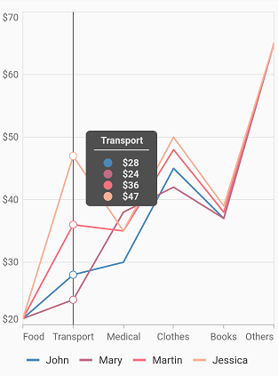

### Enable trackball

The [`enableTrackball`](https://pub.dev/documentation/syncfusion_flutter_charts/latest/charts/ChartSeries/enableTrackball.html) is used to enable or disable the trackball feature for specific series. When enabled this property, the trackball provides additional information about data points when you tap or interact with the chart area.

Defaults to `true`.




    late TrackballBehavior _trackballBehavior;
    late List<ChartData> chartData;

    @override
    void initState() {
      _trackballBehavior = TrackballBehavior(
          enable: true, activationMode: ActivationMode.singleTap);
      chartData = <ChartData>[
        ChartData(x: 'USA', y: 55),
        ChartData(x: 'China', y: 33),
        ChartData(x: 'UK', y: 43),
        ChartData(x: 'Japan', y: 32),
        ChartData(x: 'France', y: 56),
      ];
      super.initState();
    }

    @override
    Widget build(BuildContext context) {
      return Scaffold(
        body: Padding(
          padding: const EdgeInsets.all(20),
          child: SfCartesianChart(
            title: ChartTitle(
              text: 'Enable and disable the trackball for specific series',
              textStyle: TextStyle(
                fontWeight: FontWeight.bold,
              ),
            ),
            legend: Legend(isVisible: true, position: LegendPosition.bottom),
            primaryXAxis: CategoryAxis(),
            series: <CartesianSeries<ChartData, String>>[
              StackedLineSeries<ChartData, String>(
                dataSource: chartData,
                xValueMapper: (ChartData data, int index) => data.x,
                yValueMapper: (ChartData data, int index) => data.y,
                markerSettings: const MarkerSettings(isVisible: true),
                name: 'John',
                enableTrackball: false,
              ),
              StackedLineSeries<ChartData, String>(
                dataSource: chartData,
                xValueMapper: (ChartData data, int index) => data.x,
                yValueMapper: (ChartData data, int index) => data.y,
                markerSettings: const MarkerSettings(isVisible: true),
                name: 'Mary',
                enableTrackball: true,
              ),
            ],
            trackballBehavior: _trackballBehavior,
          ),
        ),
      );
    }

    class ChartData {
      ChartData({this.x, this.y});

      final String? x;
      final num? y;
    }




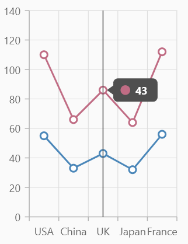

#### See Also

* [Synchronize trackball with multiple charts in Cartesian charts](https://support.syncfusion.com/kb/article/10568/how-to-synchronize-trackball-in-multiple-charts-sfcartesianchart).

* [Hide the marker displayed in the trackball tooltip](https://support.syncfusion.com/kb/article/10857/how-to-hide-the-marker-displayed-in-the-trackball-tooltip-sfcartesianchart).

## Crosshair

Crosshair has a vertical and horizontal line to view the value of the axis. 

Crosshair lines can be enabled by using [`enable`](https://pub.dev/documentation/syncfusion_flutter_charts/latest/charts/CrosshairBehavior/enable.html) property in the [`crosshairBehavior`](https://pub.dev/documentation/syncfusion_flutter_charts/latest/charts/CrosshairBehavior/CrosshairBehavior.html). Likewise tooltip label for an axis can be enabled by using [`enable`](https://pub.dev/documentation/syncfusion_flutter_charts/latest/charts/InteractiveTooltip/enable.html) property of [`interactiveTooltip`](https://pub.dev/documentation/syncfusion_flutter_charts/latest/charts/ChartAxis/interactiveTooltip.html) in the corresponding axis. The [`hideDelay`](https://pub.dev/documentation/syncfusion_flutter_charts/latest/charts/CrosshairBehavior/hideDelay.html) property can be used to specify a disappear delay for the crosshair.

The crosshair state will be preserved on the device's orientation change and on browser resize. For example, if the crosshair's ['hideDelay'](https://pub.dev/documentation/syncfusion_flutter_charts/latest/charts/CrosshairBehavior/hideDelay.html) is set to 10,000ms, and when you change the orientation of your device from portrait to landscape after 5,000ms of crosshair display, the crosshair will be displayed for the next 5,000ms in landscape mode before disappearing.

>**Note**: The above mentioned properties are only applicable for SfCartesian types of charts.



    
    late CrosshairBehavior _crosshairBehavior;

    @override
    void initState(){
      _crosshairBehavior = CrosshairBehavior(
                  // Enables the crosshair
                  enable: true
                );
      super.initState();
    }

    @override
    Widget build(BuildContext context) {
      return Scaffold(
        body: SafeArea(
          child: Center(
            child: Container(
              child: SfCartesianChart(
                primaryXAxis: NumericAxis(
                  interactiveTooltip: InteractiveTooltip(
                    // Enables the crosshair tooltip
                    enable: true
                  )
                ),
                crosshairBehavior: _crosshairBehavior
              )
            )
          )
        )
      );
    }




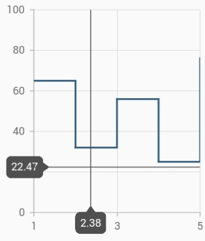

### Track line customization

The appearance of the track line in crosshair can be customized using the following properties.

* [`lineType`](https://pub.dev/documentation/syncfusion_flutter_charts/latest/charts/CrosshairBehavior/lineType.html) - specifies the type of crosshair line.
* [`lineColor`](https://pub.dev/documentation/syncfusion_flutter_charts/latest/charts/CrosshairBehavior/lineColor.html) - specifies the color of the crosshair line.
* [`lineWidth`](https://pub.dev/documentation/syncfusion_flutter_charts/latest/charts/CrosshairBehavior/lineWidth.html) - specifies the stroke width of the crosshair line.
* [`lineDashArray`](https://pub.dev/documentation/syncfusion_flutter_charts/latest/charts/CrosshairBehavior/lineDashArray.html) - used to render crosshair line with dashes.
* [`shouldAlwaysShow`](https://pub.dev/documentation/syncfusion_flutter_charts/latest/charts/CrosshairBehavior/shouldAlwaysShow.html) - enables or disables the crosshair. Defaults to `false`.



    
    late CrosshairBehavior _crosshairBehavior;

    @override
    void initState(){
      _crosshairBehavior = CrosshairBehavior(
                  enable: true,
                  lineColor: Colors.red,
                  lineDashArray: <double>[5,5],
                  lineWidth: 2,
                  lineType: CrosshairLineType.vertical
                );
      super.initState();
    }

    @override
    Widget build(BuildContext context) {
      return Scaffold(
        body: SafeArea(
        child: Center(
          child: Container(
            child: SfCartesianChart(
              crosshairBehavior: _crosshairBehavior
              )
            )
          )
        )
      );
    }




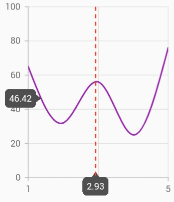

### Show axis tooltip

The axis tooltip can be enabled using [`enable`](https://pub.dev/documentation/syncfusion_flutter_charts/latest/charts/InteractiveTooltip/enable.html) property of [`interactiveTooltip`](https://pub.dev/documentation/syncfusion_flutter_charts/latest/charts/ChartAxis/interactiveTooltip.html). You can customize the appearance of axis tooltip using the following properties.

* [`enable`](https://pub.dev/documentation/syncfusion_flutter_charts/latest/charts/InteractiveTooltip/enable.html) - used to enable the axis tooltip.
* [`borderWidth`](https://pub.dev/documentation/syncfusion_flutter_charts/latest/charts/InteractiveTooltip/borderWidth.html) - used to change the stroke width of the axis tooltip.
* [`borderColor`](https://pub.dev/documentation/syncfusion_flutter_charts/latest/charts/InteractiveTooltip/borderColor.html) - used to change the stroke color of the axis tooltip.
* [`format`](https://pub.dev/documentation/syncfusion_flutter_charts/latest/charts/InteractiveTooltip/format.html) - by default, axis value will be displayed in the tooltip, and it can be customized by adding desired text as prefix or suffix.
* [`textStyle`](https://pub.dev/documentation/syncfusion_flutter_charts/latest/charts/InteractiveTooltip/textStyle.html) - used to change the text color, size, font family, fontStyle, and font weight.
* [`textStyle.color`](https://pub.dev/documentation/syncfusion_flutter_charts/latest/charts/InteractiveTooltip/textStyle.html) - used to change the color of the text.
* [`textStyle.fontFamily`](https://pub.dev/documentation/syncfusion_flutter_charts/latest/charts/InteractiveTooltip/textStyle.html) - used to change the font family for chart title. 
* [`textStyle.fontStyle`](https://pub.dev/documentation/syncfusion_flutter_charts/latest/charts/InteractiveTooltip/textStyle.html) - used to change the font style for the chart title.
* [`textStyle.fontSize`](https://pub.dev/documentation/syncfusion_flutter_charts/latest/charts/InteractiveTooltip/textStyle.html) - used to change the font size for the chart title.

### Activation mode

The [`activationMode`](https://pub.dev/documentation/syncfusion_flutter_charts/latest/charts/CrosshairBehavior/activationMode.html) property is used to restrict the visibility of trackball based on the touch actions. The default value of this property is [`ActivationMode.longPress`](https://pub.dev/documentation/syncfusion_flutter_charts/latest/charts/ActivationMode.html#longPress).

The ActivationMode enum contains the following values:

* [`ActivationMode.longPress`](https://pub.dev/documentation/syncfusion_flutter_charts/latest/charts/ActivationMode.html#longPress) - activates crosshair only when performing the long press action.
* [`ActivationMode.singleTap`](https://pub.dev/documentation/syncfusion_flutter_charts/latest/charts/ActivationMode.html#singleTap) - activates crosshair only when performing single tap action.
* [`ActivationMode.doubleTap`](https://pub.dev/documentation/syncfusion_flutter_charts/latest/charts/ActivationMode.html#doubleTap) - activates crosshair only when performing double tap action.
* [`ActivationMode.none`](https://pub.dev/documentation/syncfusion_flutter_charts/latest/charts/ActivationMode.html#none) - hides the visibility of crosshair when setting activation mode to none. It will be activated when calling the [`show`](https://pub.dev/documentation/syncfusion_flutter_charts/latest/charts/CrosshairBehavior/show.html) method.



    
    late CrosshairBehavior _crosshairBehavior;

    @override
    void initState(){
      _crosshairBehavior = CrosshairBehavior(
                  enable: true,
                  // Displays the crosshair on single tap
                  activationMode: ActivationMode.singleTap
                );
      super.initState();
    }

    @override
    Widget build(BuildContext context) {
      return Scaffold(
        body: SafeArea(
          child: Center(
            child: Container(
              child: SfCartesianChart(
                crosshairBehavior: _crosshairBehavior
              )
            )
          )
        )
      );
    }




Also refer [`crosshair`](https://help.syncfusion.com/flutter/cartesian-charts/callbacks#oncrosshairpositionchanging) and [`trackball`](https://help.syncfusion.com/flutter/cartesian-charts/callbacks#ontrackballpositionchanging) events for customizing the crosshair and trackball further.

#### See Also

* [Disabling trackball tooltip for particular series in Cartesian chart](https://support.syncfusion.com/kb/article/10176/how-to-disable-trackball-tooltip-for-particular-series-in-cartesian-charts-sfcartesianchart).

>**Note**: `chartData` in the above code snippets is a class type list and holds the data for binding to the chart series. Refer [Bind data source](https://help.syncfusion.com/flutter/cartesian-charts/getting-started#bind-data-source) topic for more details.
