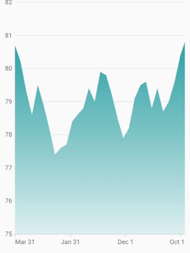
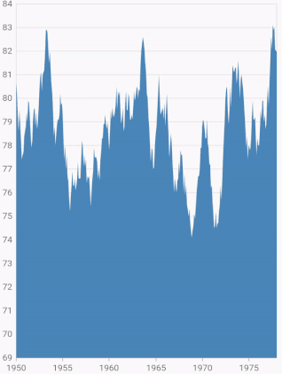

# Zooming and Panning in Flutter Cartesian Charts (SfCartesianChart)

## Pinch zooming

Pinch zooming can be enabled by [`enablePinching`](https://pub.dev/documentation/syncfusion_flutter_charts/latest/charts/ZoomPanBehavior/enablePinching.html) property and defaults to `false`. Pinching can be performed by moving two fingers over the chart.

 

    late ZoomPanBehavior _zoomPanBehavior;
    
    @override
    void initState(){
      _zoomPanBehavior = ZoomPanBehavior(
                  // Enables pinch zooming
                  enablePinching: true
                );
      super.initState();
    }

    @override
    Widget build(BuildContext context) {
      return Scaffold(
        body: SafeArea(
          child: Center(
            child: Container(
              height: 300, 
              width: 350, 
              child: SfCartesianChart(
                zoomPanBehavior: _zoomPanBehavior
              )
            )
          )
        )
      );
    }



## Double tap zooming

Double tap zooming can be enabled using [`enableDoubleTapZooming`](https://pub.dev/documentation/syncfusion_flutter_charts/latest/charts/ZoomPanBehavior/enableDoubleTapZooming.html) property. Defaults to `false`.

 
    
    late ZoomPanBehavior _zoomPanBehavior;
    
    @override
    void initState(){
     _zoomPanBehavior = ZoomPanBehavior(
                  // Performs zooming on double tap
                  enableDoubleTapZooming: true
                );
      super.initState();
    }

    @override
    Widget build(BuildContext context) {
      return Scaffold(
        body: SafeArea(
          child: Center(
            child: Container(
              height: 300, 
              width: 350, 
              child: SfCartesianChart(
                zoomPanBehavior: _zoomPanBehavior
              )
            )
          )
        )
      );
    }



## Selection zooming

By specifying [`enableSelectionZooming`](https://pub.dev/documentation/syncfusion_flutter_charts/latest/charts/ZoomPanBehavior/enableSelectionZooming.html) property to true, you can long press and drag to select a range on the chart to be zoomed in.

**Selection rectangle customization**

You can customize the selection rectangle using the below properties.

* [`selectionRectBorderWidth`](https://pub.dev/documentation/syncfusion_flutter_charts/latest/charts/ZoomPanBehavior/selectionRectBorderWidth.html) - used to change the stroke width of the selection rectangle.
* [`selectionRectBorderColor`](https://pub.dev/documentation/syncfusion_flutter_charts/latest/charts/ZoomPanBehavior/selectionRectBorderColor.html) - used to change the stroke color of the selection rectangle.
* [`selectionRectColor`](https://pub.dev/documentation/syncfusion_flutter_charts/latest/charts/ZoomPanBehavior/selectionRectColor.html) - used to change the background color of the selection rectangle.

 
    
    late ZoomPanBehavior _zoomPanBehavior;
    
    @override
    void initState(){
      _zoomPanBehavior = ZoomPanBehavior(
                  enableSelectionZooming: true,
                  selectionRectBorderColor: Colors.red,
                  selectionRectBorderWidth: 1,
                  selectionRectColor: Colors.grey
                );
      super.initState();
    }

    @override
    Widget build(BuildContext context) {
      return Scaffold(
        body: SafeArea(
          child: Center(
            child: Container(
              height: 300, 
              width: 350, 
              child: SfCartesianChart(
                zoomPanBehavior: _zoomPanBehavior
              )
            )
          )
        )
      );
    }



Following screenshot shows the zoomed area

**Show axis tooltip**

The axis tooltip on selection zooming can be enabled using [`enable`](https://pub.dev/documentation/syncfusion_flutter_charts/latest/charts/CrosshairBehavior/enable.html) property of [`InteractiveTooltip`](https://pub.dev/documentation/syncfusion_flutter_charts/latest/charts/InteractiveTooltip-class.html). You can customize the appearance of axis tooltip using the following properties.

* [`enable`](https://pub.dev/documentation/syncfusion_flutter_charts/latest/charts/InteractiveTooltip/enable.html) - used to enable the axis tooltip.
* [`borderWidth`](https://pub.dev/documentation/syncfusion_flutter_charts/latest/charts/InteractiveTooltip/borderWidth.html) - used to change the stroke width of the axis tooltip.
* [`borderColor`](https://pub.dev/documentation/syncfusion_flutter_charts/latest/charts/InteractiveTooltip/borderColor.html) - used to change the stroke color of the axis tooltip.
* [`format`](https://pub.dev/documentation/syncfusion_flutter_charts/latest/charts/InteractiveTooltip/format.html) - by default, axis value will be displayed in the tooltip, and it can be customized by adding desired text as prefix or suffix.
* [`textStyle`](https://pub.dev/documentation/syncfusion_flutter_charts/latest/charts/InteractiveTooltip/textStyle.html) - used to change the text color, size, font family, fontStyle, and font weight.
* [`color`](https://api.flutter.dev/flutter/painting/TextStyle/color.html) - used to change the color of the text.
* [`fontFamily`](https://api.flutter.dev/flutter/painting/TextStyle/fontFamily.html) - used to change the font family for chart title. 
* [`fontStyle`](https://api.flutter.dev/flutter/painting/TextStyle/fontStyle.html) - used to change the font style for the chart title.
* [`fontSize`](https://api.flutter.dev/flutter/painting/TextStyle/fontSize.html) - used to change the font size for the chart title.

 

    late ZoomPanBehavior _zoomPanBehavior;
    
    @override
    void initState(){
     _zoomPanBehavior = ZoomPanBehavior(
                  enableDoubleTapZooming: true,
                  enablePinching: true,
                  // Enables the selection zooming
                  enableSelectionZooming: true
                );
      super.initState();
    }

    @override
    Widget build(BuildContext context) {
      return Scaffold(
        body: SafeArea(
          child: Center(
            child: Container(
              child: SfCartesianChart(
                primaryXAxis: NumericAxis(
                  interactiveTooltip: InteractiveTooltip(
                  // Displays the x-axis tooltip
                  enable: true,
                  borderColor: Colors.red,
                  borderWidth: 2
                )
              ),
                primaryYAxis: NumericAxis(
                  interactiveTooltip: InteractiveTooltip(
                  // Displays the y-axis tooltip
                  enable: true,
                  borderColor: Colors.red,
                  borderWidth: 2
                )
              ),
                zoomPanBehavior: _zoomPanBehavior
              )
            )
          )
        )
      );
    }



## Mouse wheel zooming

The [`enableMouseWheelZooming`](https://pub.dev/documentation/syncfusion_flutter_charts/latest/charts/ZoomPanBehavior/enableMouseWheelZooming.html) can be performed by rolling the mouse wheel up or down. The place where the cursor is hovering gets zoomed in or out according to the mouse wheel rolling up or down.

 

    late ZoomPanBehavior _zoomPanBehavior;
    
    @override
    void initState(){
     _zoomPanBehavior = ZoomPanBehavior(
            enableMouseWheelZooming : true);
      super.initState();
    }

    @override
    Widget build(BuildContext context) {
      return Scaffold(
        body: SafeArea(
          child: Center(
            child: Container(
              height: 300, 
              width: 350, 
              child: SfCartesianChart(
                zoomPanBehavior: _zoomPanBehavior
              )
            )
          )
        )
      );
    }



## Auto interval on zooming

The [`enableAutoIntervalOnZooming`](https://pub.dev/documentation/syncfusion_flutter_charts/latest/charts/ChartAxis/enableAutoIntervalOnZooming.html) property determines the update of axis interval based on the current visible range while zooming and panning the chart. Default value of this property is true. If this property is false, the nice interval will not be calculated for new range after zoom in and actual interval will be sustained.

 

    @override
    Widget build(BuildContext context) {
      return Scaffold(
        body: SafeArea(
          child: Center(
            child: Container(
              child: SfCartesianChart(
                primaryXAxis: DateTimeAxis(
                  // Intervals will be fixed, not calculated automatically based on the visible range on zooming and panning
                  enableAutoIntervalOnZooming: false
                )
              )
            )
          )
        ) 
      );
    }



## Maximum zoom level

The [`maximumZoomLevel`](https://pub.dev/documentation/syncfusion_flutter_charts/latest/charts/ZoomPanBehavior/maximumZoomLevel.html) property defines the maximum zooming level. Zooming will be stopped after reaching this value. This defaults to `null`.

 

    late ZoomPanBehavior _zoomPanBehavior;
    
    @override
    void initState(){
     _zoomPanBehavior = ZoomPanBehavior(
                  maximumZoomLevel: 3);
      super.initState();
    }

    @override
    Widget build(BuildContext context) {
      return Scaffold(
        body: SafeArea(
          child: Center(
            child: Container(
              child: SfCartesianChart(
                zoomPanBehavior: _zoomPanBehavior
              )
            )
          )
        )
      );
    }



## Panning 

Panning can be performed on a zoomed axis. You can pan the zoomed chart with [`enablePanning`](https://pub.dev/documentation/syncfusion_flutter_charts/latest/charts/ZoomPanBehavior/enablePanning.html) property. Defaults to `false`.

If zoom mode is set to [`zoomMode.x`](https://pub.dev/documentation/syncfusion_flutter_charts/latest/charts/ZoomMode.html) means you can only pan to the  horizontal direction, in case the [`zoomMode.y`](https://pub.dev/documentation/syncfusion_flutter_charts/latest/charts/ZoomMode.html) means you can pan only to the  vertical direction and [`zoomMode.xy`](https://pub.dev/documentation/syncfusion_flutter_charts/latest/charts/ZoomMode.html) means you can pan to both horizontal and vertical directions on the chart.

 
    
    late ZoomPanBehavior _zoomPanBehavior;
    
    @override
    void initState(){
     _zoomPanBehavior = ZoomPanBehavior(
                    enablePinching: true,
                    zoomMode: ZoomMode.x,
                    enablePanning: true,
                );
      super.initState();
    }

    @override
    Widget build(BuildContext context) {
      return Scaffold(
        body: SafeArea(
          child: Center(
            child: Container(
              child: SfCartesianChart(
                zoomPanBehavior: _zoomPanBehavior
              )
            )
          )
        )
      );
    }



Also refer [`zooming`](./callbacks#onzooming), [`zoom start`](./callbacks#onzoomstart) and [`zoom end`](./callbacks#onzoomend) events for customizing the zooming further.

### AnchorRangeToVisiblePoints

[`AnchorRangeToVisiblePoints`](https://pub.dev/documentation/syncfusion_flutter_charts/latest/charts/ChartAxis/anchorRangeToVisiblePoints.html) determines the value axis range, based on the visible data points or based on the overall data points available in chart. By default, value axis range will be calculated automatically based on the visible data points on dynamic changes. The visible data points are changed on performing interactions like pinch zooming, selection zooming, panning and also on specifying [`visibleMinimum`](https://pub.dev/documentation/syncfusion_flutter_charts/latest/charts/DateTimeAxis/visibleMinimum.html) and [`visibleMaximum`](https://pub.dev/documentation/syncfusion_flutter_charts/latest/charts/DateTimeAxis/visibleMaximum.html) values.

To toggle this functionality, this property can be used. i.e. on setting false to this property,
value axis range will be calculated based on all the data points in chart irrespective of
visible points.
 
>**Note**: This is applicable only to the value axis and not for other axis.
  
Defaults to `true`.
  
    
    late ZoomPanBehavior _zoomPanBehavior;
    
    @override
    void initState(){
     _zoomPanBehavior = ZoomPanBehavior(
                    enablePinching: true,
                    zoomMode: ZoomMode.x,
                    enablePanning: true,
                );
      super.initState();
    }

    @override
    Widget build(BuildContext context) {
      return Scaffold(
        body: SafeArea(
          child: Center(
            child: Container(
              child: SfCartesianChart(
                zoomPanBehavior: _zoomPanBehavior,
                 primaryXAxis: DateTimeAxis(),
                 primaryYAxis: NumericAxis(
                          anchorRangeToVisiblePoints: false,),
                 series: <ChartSeries<ChartData, DateTime>>[
                      AreaSeries<ChartData, DateTime>(
                          dataSource: chartData,
                          xValueMapper: (ChartData sales, _) => sales.x,
                          yValueMapper: (ChartData sales, _) => sales.y,s
                        )
                     ]
                  )
                )
              )
            )
          );
        }



#### See Also

* [To Synchronize panning in multiple charts](https://www.syncfusion.com/kb/11533/how-to-synchronize-panning-in-multiple-charts-sfcartesianchart).
