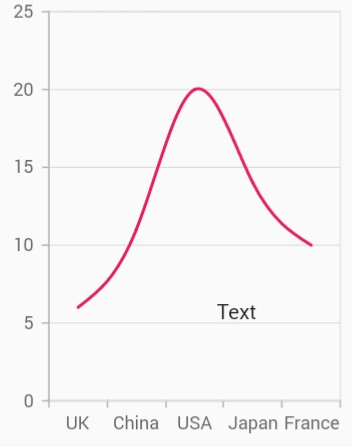
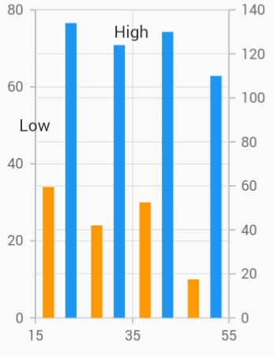

# Annotation

Chart supports annotations which allows you to mark the specific area of interest in the chart area. You can add the custom widgets using this annotations feature as depicted below.

 

    @override
    Widget build(BuildContext context) {
      return Scaffold(
        body: SafeArea(
          child: Center(
            child: Container(
              child: SfCartesianChart(
                annotations: <CartesianChartAnnotation>[
                  CartesianChartAnnotation(
                    child: Container(child: const Text('Annotation')),
                    coordinateUnit: CoordinateUnit.point,
                    x: 'USA',
                    y: 20
                  )
                ]
              )
            )
          )
        )
      );
    }



## Positioning the annotation

The [`x`]() and [`y`]() values can be specified with axis units or pixel units, and these can be identified by using [`coordinateUnit`]() property.

**Positioning based on coordinateUnit as point**

To position the annotation based on axis, set the [`x`]() and [`y`]()properties based on axis range values, and set the [`coordinateUnit`]() value as [`point`]().

 

    @override
    Widget build(BuildContext context) {
      return Scaffold(
        body: SafeArea(
          child: Center(
            child: Container(
              child: SfCartesianChart(
                annotations: <CartesianChartAnnotation>[
                  CartesianChartAnnotation(
                    child: Container(child: const Text('Text')),
                    coordinateUnit: CoordinateUnit.point,
                    x: 20,
                    y: 40
                  )
                ]
              )
            )
          )
        )
      );
    }



**Positioning based on coordinateUnit as pixels**

To position the annotation based on the pixel values, set the [`CoordinateUnit`]() value as [`logicalPixel`](), and the pixel values in [`x`]() and [`y`]() properties of annotation are shown in the following code snippet.

 

    @override
    Widget build(BuildContext context) {
      return Scaffold(
        body: SafeArea(
          child: Center(
            child: Container(
              child: SfCartesianChart(
                annotations: <CartesianChartAnnotation>[
                  CartesianChartAnnotation(
                    child: Container(child: const Text('Text')),
                    coordinateUnit: CoordinateUnit.logicalPixel,
                    x: 150,
                    y: 200
                  )
                ]
              )
            )
          )
        )
      );
    }



## Adding multiple annotation

You can add multiple annotations to the Chart as depicted in below code snippet.

 

    @override
    Widget build(BuildContext context) {
      return Scaffold(
        body: SafeArea(
          child: Center(
            child: Container(
              child: SfCartesianChart(
                annotations: <CartesianChartAnnotation>[
               CartesianChartAnnotation(
                  child: Container(child: const Text('High')),
                  coordinateUnit: CoordinateUnit.logicalPixel,
                  x: 90,
                  y: 200),
              CartesianChartAnnotation(
                  child: Container(child: const Text('Low')),
                  coordinateUnit: CoordinateUnit.logicalPixel,
                  x: 170,
                  y: 200)
            ],
        )),
      )),
    );
  }



## Adding annotation for multiple axes

When there are multiple axes in the chart, annotation can be added for a particular axis by using the [`xAxisName`]() and [`yAxisName`]() properties. It is shown in the below code snippet.

 

    @override
    Widget build(BuildContext context) {
      final List<ChartData> chartData = [
        ChartData(10, 17, 132),
        ChartData(20, 34, 134),
        ChartData(30, 24, 124),
        ChartData(40, 30, 130),
        ChartData(50, 10, 110)
      ];

      return Scaffold(
        body: SafeArea(
          child: Center(
            child: Container(
              child: SfCartesianChart(
                annotations: <CartesianChartAnnotation>[
                  CartesianChartAnnotation(
                    child: Container(child: const Text('Low')),
                    coordinateUnit: CoordinateUnit.point,
                    x: 15,
                    y: 50
                  ),
                  CartesianChartAnnotation(
                    child: Container(child: const Text('High')),
                    coordinateUnit: CoordinateUnit.point,
                    x: 35,
                    y: 130,
                    yAxisName: 'YAxis'
                  )
                ],
                primaryYAxis: NumericAxis(minimum: 0, maximum: 80),
                axes: <ChartAxis>[
                  NumericAxis(name: 'YAxis', opposedPosition: true)
                ],
                series: <CartesianSeries>[
                  ColumnSeries<ChartData, double>(
                    dataSource: chartData,
                    xValueMapper: (ChartData data, _) => data.x,
                    yValueMapper: (ChartData data, _) => data.y,
                  ),
                  ColumnSeries<ChartData, double>(
                    dataSource: chartData,
                    xValueMapper: (ChartData data, _) => data.x,
                    yValueMapper: (ChartData data, _) => data.y2,
                    yAxisName: 'YAxis',
                  )
                ]
              )
            )
          )
        )
      );
    }

    class ChartData {
      ChartData(this.x, this.y, this.y2);
      final double x;
      final double y;
      final double y2;
    }



