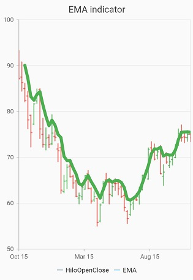
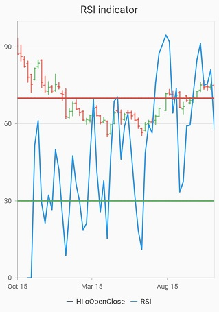
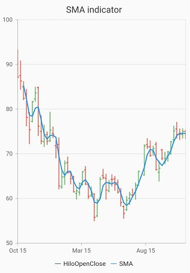
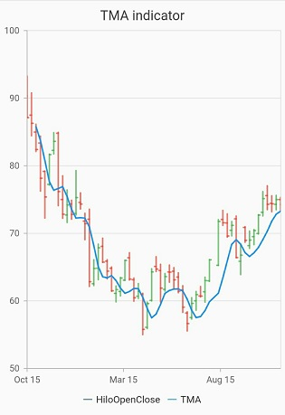

# Technical indicators in Flutter Charts

The different types of technical indicators available in chart are follows:

* [`Accumulation distribution indicator`]() - AD
*	[`Average true range indicator`]() - ATR
*	[`Bollinger band indicator`]()
*	[`Exponential moving average indicator`]() - EMA
* [`Moving average convergence divergence`]() - MACD
*	[`Momentum indicator`]()
*	[`Relative strength index indicator`]() - RSI 
*	[`Simple moving average indicator`]() - SMA 
*	[`Stochastic indicator`]()
*	[`Triangular moving average indicator`]() - TMA 

## Adding Technical indicator into Chart
 
To render any indicator, add it to the [`TechnicalIndicators`]() collection using the [`indicators`]() property in [`SfCartesianChart`](https://pub.dev/documentation/syncfusion_flutter_charts/latest/charts/SfCartesianChart-class.html).The following properties are used to customize the appearance:

* [`isVisible`]() - To check the visibility of the indicator.
* [`period`]()- Used to indicates the moving average period.
* [`signalLineColor`]()- Used to defines the color for the respective indicator line.
* [`signalLineWidth`]() - Used to change the signal line width.
* [`seriesName`]() - Used to bind the data source of chart series to technical indicators, including x and y axis.
* [`xAxisName`](),[`yAxisName`]() - Used to set the x and y axes 
* [`animationDuration`]() - To control the duration of animation 
* [`dataSource`]() - Directly bind the values such as [`xValueMapper`](),[`lowValueMapper`](),[`highValueMapper`](),[`openValueMapper`](),[`closeValueMapper`]()
* [`isVisibleInLegend`](),[`legendItemText`](),[`legendIconType`]() - Used to change the legend visibility,text and Icon type
* [`name`]() - Used to define the label for corresponding indicators.
* [`dashArray`]() - Used to render the indicators with dashes.

N> If you giving series and indicator in the chart, you can add  the same [`seriesName`]() to the series and indicator, otherwise you can directly bind the [`dataSource`]() to the [`indicators`]() property.

## Indicator Types

###  Accumulation distribution indicator (AD)

Accumulation distribution indicator is a volume-based indicator designed to measure the accumulative flow of money into and out of a security. It requires [`volumeValueMapper`]() property additionally with the data source to calculate the signal line.

Refer the following example,



     @override
     Widget build(BuildContext context) {
       return Scaffold(
        body: Center(
          child: SfCartesianChart(
            legend: Legend(isVisible: true,
            indicators: <TechnicalIndicators<Sample,dynamic>>[AccumulationDistributionIndicator<Sample, dynamic>(
                  seriesName: 'HiloOpenClose')],
            series: <ChartSeries<Sample, dynamic>>[
              HiloOpenCloseSeries<Sample, dynamic>(
              dataSource: sample,
              xValueMapper: (Sample sales, _) => sales.x,
              lowValueMapper: (Sample sales, _) => sales.low,
              highValueMapper: (Sample sales, _) => sales.high,
              openValueMapper: (Sample sales, _) => sales.open,
              closeValueMapper: (Sample sales, _) => sales.close,
              name: 'HiloOpenClose'),])));
      }}


### Average true range indicator(ATR)

ATR indicator is a technical analysis volatility indicator. This indicator does not indicate the price trend. simply the degree of price volatility. The average true range is an N-day smoothed moving average (SMMA) of the true range values.

Refer the following example,



    @override
    Widget build(BuildContext context) {
     return Scaffold(
        body: Center(
         child: SfCartesianChart(
          legend: Legend(isVisible: true,
          indicators:
          <TechnicalIndicators<dynamic,   dynamic>>[
          AtrIndicator<dynamic, dynamic>(
            period: 3,
            seriesName: 'HiloOpenClose')],
    series: <CartesianSeries<Sample, dynamic>>[
              name: 'HiloOpenClose'),
              ])));
        }
      }



### Bollinger band Indicator

This indicator also having [`upperLineColor`](), [`lowerLineColor`]()  property for defining the brushes for the indicator lines.

Also, we can specify standard deviation values for BollingerBand indicator using [`standardDeviation`]() property.

Refer the following example,



    @override
    Widget build(BuildContext context) {
     return Scaffold(
       body: Center(
         child: SfCartesianChart(
           legend: Legend(isVisible: true,
           indicators:        <TechnicalIndicators<dynamic, dynamic>[ BollingerBandIndicator<dynamic, dynamic>(
                  period: 3,
                  seriesName: 'HiloOpenClose')],
           series: <CartesianSeries<Sample,dynamic>>[
              HiloOpenCloseSeries<Sample, dynamic>(name: 'HiloOpenClose')
              ])));         
       }
     }



### Exponential moving average indicator (EMA)

An EMA indicator is a simple, arithmetic moving average that is calculated by adding the closing price for the number of time periods and dividing the total value by the number of periods.

It also has a [`valueField`]() property. Based on this property Indicator will render.

Refer the following example,



    @override
    Widget build(BuildContext context) {
      return Scaffold(
        body: Center(
          child: SfCartesianChart(
            legend: Legend(isVisible: true,
            indicators: <TechnicalIndicators<dynamic, dynamic>>[
        EmaIndicator<dynamic, dynamic>(
            seriesName: 'HiloOpenClose',
            valueField: 'high',)],
            series: <ChartSeries<Sample, dynamic>>[
        HiloOpenCloseSeries<Sample, dynamic>(
            name: 'HiloOpenClose')
            ])));
     }
    }



### Moving average convergence divergence (MACD)

This is mostly using indicator having [`shortPeriod`]() and [`longPeriod`]() for defining the motion of the indicator.

Also you can draw **Line**, **Histogram** MACD or **Both** using the  [`macdType`]() property,

The [`macdLineColor`]() property is used to define the color for the MACD line and the [`histogramNegativeColor`]() and [`histogramPositiveColor`]() property is used to define the color for the MACD histogram.

Refer the following example,


    
    @override
    Widget build(BuildContext context) {
     return Scaffold(
       body: Center(
          child: SfCartesianChart(
            legend: Legend(isVisible: true,
            indicators: <TechnicalIndicators<dynamic, dynamic>>[
          MacdIndicator<dynamic, dynamic>(
              longPeriod: 5,
              shortPeriod: 2,
              seriesName: 'HiloOpenClose')],
            series: <CartesianSeries<Sample, dynamic>>[
          HiloOpenCloseSeries<Sample, dynamic>(name: 'HiloOpenClose')
          ])));
       }
     }



### Momentum Indicator

This indicator also having a centerline. The [`centerLineColor`]() and [`centerLineWidth`]() property is used to define center line.

Refer the following example,



    @override
    Widget build(BuildContext context) {
      return Scaffold(
        body: Center(
          child: SfCartesianChart(
            legend: Legend(isVisible: true,
            indicators: <TechnicalIndicators<dynamic, dynamic>>[
          MomentumIndicator<dynamic, dynamic>(
            period: 3,
            seriesName: 'HiloOpenClose',)],
           series: <ChartSeries<Sample, dynamic>>[
          HiloOpenCloseSeries<Sample, dynamic>(name: 'HiloOpenClose')
          ])));
     }
    }



### Relative strength index Indicator(RSI)
The RSI indicator has an additional two lines other than the signal line.They indicate the [`overBought`]() and[`overSold`]() region.

The [`upperLineColor`]() property is used to define the color for the line that indicates [`overBought`]() region, and the [`lowerLineColor`]() property is used to define the color for the line that indicates [`overSold`]() region.

Refer the following example,



    @override
    Widget build(BuildContext context) {
      return Scaffold(
        body: Center(
          child: SfCartesianChart(
            legend: Legend(isVisible: true,
             indicators: <TechnicalIndicators<dynamic, dynamic>>[
          RsiIndicator<dynamic, dynamic>(
            period: 3,
            seriesName: 'HiloOpenClose',
            overbought: 70,
            oversold: 30)],
            series: <ChartSeries<Sample, dynamic>>[
          HiloOpenCloseSeries<Sample, dynamic>(name: 'HiloOpenClose')])));
     }
    }



### Simple moving average indicator(SMA)

The [`Exponential moving average indicator`]() is similar to [`Simple moving average indicator`]() and this can be defined using the following code examples.



    @override
    Widget build(BuildContext context) {
      return Scaffold(
        body: Center(
          child: SfCartesianChart(
            legend: Legend(isVisible: true,
            indicators: <TechnicalIndicators<dynamic, dynamic>>[
          SmaIndicator<dynamic, dynamic>(
            seriesName: 'HiloOpenClose',
            valueField: 'close')],
           series: <ChartSeries<Sample, dynamic>>[
          HiloOpenCloseSeries<Sample, dynamic>(name: 'HiloOpenClose')])));
    }}



### Stochastic indicator

This indicator is used to measure the range and momentum of price movements. It contains [`kPeriod`]() and [`dPeriod`]() property defining the ‘k’ percentage and ‘d’ percentage respectively.

In this indicator [`upperLineColor`](),[`lowerLineColor`]() and [`periodLineColor`]() property are used to define the color for the Stochastic indicator lines.

Refer the following example,



    @override
    Widget build(BuildContext context) {
      return Scaffold(
        body: Center(
          child: SfCartesianChart(
            legend: Legend(isVisible: true,
            indicators: <TechnicalIndicators<dynamic, dynamic>>[
          StochasticIndicator<dynamic, dynamic>(   
              seriesName: 'HiloOpenClose',,
              kPeriod: 2,
              dPeriod: 3)],
             series: <ChartSeries<Sample, dynamic>>[
          HiloOpenCloseSeries<Sample, dynamic>(name: 'HiloOpenClose')])));
    }}



### Triangular moving average indicator (TMA)

A TMA indicator is simply a double-smoothed simple moving average of data calculated over a period where the middle portion of the data has more weight.

Refer the following example,



    @override
    Widget build(BuildContext context) {
      return Scaffold(
        body: Center(
          child: SfCartesianChart(
            legend: Legend(isVisible: true,
            indicators: <TechnicalIndicators<dynamic, dynamic>>[
          TmaIndicator<Sample, dynamic>(
              seriesName: 'HiloOpenClose',
              valueField: 'low')],
            series: <ChartSeries<Sample, dynamic>>[
          HiloOpenCloseSeries<Sample, dynamic>(name: 'HiloOpenClose')])));
    }}


## Legend for technical indicators

Legend provides information about the series rendered in the chart. Legend for the indicator is rendered along with the series legend when the legend is set to be visible. Also when the  [ `name` ]() property is given to an indicator, the legend name is changed based on the indicator name.[`legendItemText`]() can also be provided for changing the name of the legend. In default rendering the [`legendIconShape`]() will be a horizontal line.

The following code example can define the legend.



    @override
    Widget build(BuildContext context){
      return Scaffold(
        body: Center(
          child: SfCartesianChart(
            indicators: <TechnicalIndicators<dynamic, dynamic>>[
              MomentumIndicator<dynamic, dynamic>(
                  seriesName: 'HiloOpenClose',
                  legendIconType: LegendIconType.diamond,
                  legendItemText: 'Indicator')],
            series: <ChartSeries<Sample, dynamic>>[
              HiloOpenCloseSeries<Sample, dynamic>(
                  name: 'HiloOpenClose')])));
    }}



Also refer [`technical indicators event`]() for customizing the tooltip further.

## Tooltip for technical indicators

The chart will display the segment information through the tooltip. It is used to show information about the segment when you tap on the segment. The technical indicator tooltip has the same [`ActivationMode`]()  that has been given in the [`TooltipBehavior`]()  of the series.



    @override
    Widget build(BuildContext context){
      return Scaffold(
        body: Center(
          child: SfCartesianChart(
            tooltipBehavior: TooltipBehavior(enable: true, shared: true),
            indicators: <TechnicalIndicators<dynamic, dynamic>>[
              ATRIndicator<dynamic, dynamic>(
                  seriesName: 'HiloOpenClose',
                  )],
            series: <ChartSeries<Sample, dynamic>>[
              HiloOpenCloseSeries<Sample, dynamic>(
                  enableTooltip: true,
                  name: 'HiloOpenClose')])));
    }}



