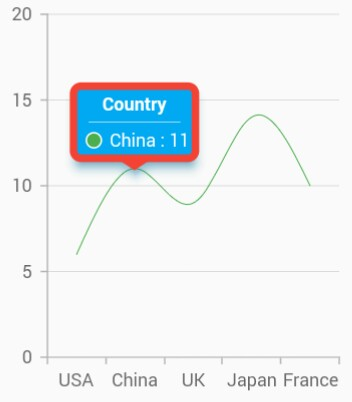
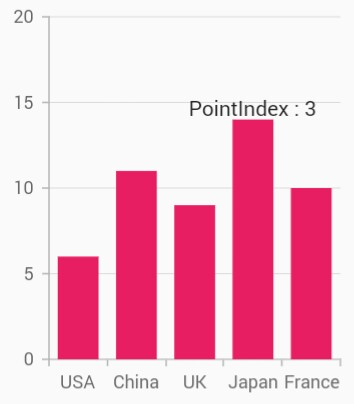

# Tooltip

Chart provides tooltip support for all the series. It is used to show information about the segment, when you tap on the segment. To enable the tooltip, you need to set [`enableTooltip`]() property as *true*.

 

    @override
    Widget build(BuildContext context) {
        return Scaffold(
        body: Center(
            child: Container(
                child:SfCartesianChart(

              //Enables the tooltip for all the series
              tooltipBehavior: TooltipBehavior(
                enable: true
              ),
          series: <CartesianSeries>[
            LineSeries<ChartData, double>(

              //Enables the tooltip for individual series
              enableTooltip: true,
              
            )
          ],
        )
            )
        ));
    }



## Customizing the appearance

You can use the following properties to customize the tooltip appearance.

* [`color`]() – used to change the background color of tooltip.
* [`borderWidth`]() – used to change the stroke width of the tooltip.
* [`borderColor`]() – used to change the stroke color of the tooltip.
* [`opacity`]() - used to control the transparency of the tooltip.
* [`duration`]() - specifies the duration for displaying the tooltip that defaults to 3000.
* [`animationDuration`]() - specifies the duration for animating the tooltip that default to 350.
* [`elevation`]() - specifies the elevation of tooltip.
* [`canShowMarker`]() - toggles the visibility of the marker in the tooltip.
* [`header`]() - specifies the header for tooltip. By default, the series name will be displayed in the header.
* [`format`]() - formats the tooltip text. By default, the tooltip will be rendered with x and y-values. You can add prefix or suffix to x, y, and series name values in the tooltip by formatting them.
* [`shadowColor`]() - specifies the color of the tooltip shadow.

 

    @override
    Widget build(BuildContext context) {
        return Scaffold(
        body: Center(
            child: Container(
                child:SfCartesianChart(
              tooltipBehavior: TooltipBehavior(
                enable: true,
                borderColor: Colors.red,
                borderWidth: 5,
                color: Colors.lightBlue,
              ),
        ))
        ));
    }



## Label format

By default, x and y value will be displayed in the tooltip, and it can be customized using [`format`]() property as depicted in the below code snippet.

 

    @override
    Widget build(BuildContext context) {
      return Scaffold(
        body: Center(
          child: Container(
            child:SfCartesianChart(
              tooltipBehavior: TooltipBehavior(
                enable: true, 
                format: 'point.y%'
              ),
            )
          )
        )
      );
    }



## Tooltip template

You can customize the appearance of the tooltip with your own widget by using the [`builder`]() property of [`tooltipBehavior`]().

 

    @override
    Widget build(BuildContext context) {
        return Scaffold(
        body: Center(
            child: Container(
                child:SfCartesianChart(
              tooltipBehavior: TooltipBehavior(
                enable: true,
               builder: (dynamic data, dynamic point, dynamic series,
                  int pointIndex, int seriesIndex) {
                return Container(
                  child: Text('PointIndex : ${pointIndex.toString()}'),
                );
              }),
        ))
        ));
    }



##	Activation mode

The [`activationMode`]() property is used to restrict the visibility of tooltip based on the touch actions. The default value of this property is [`ActivationMode.singleTap`]().

The ActivationMode enum contains the following values:

* [`longPress`]() – Activates tooltip only when performing the long press action.
* [`singleTap`]() – Activates tooltip only when performing single tap action.
* [`doubleTap`]() - Activates tooltip only when performing double tap action.
* [`none`]() – Hides the visibility of tooltip when setting activation mode to none.

 

    @override
    Widget build(BuildContext context) {
        return Scaffold(
        body: Center(
            child: Container(
                child:SfCartesianChart(
              tooltipBehavior: TooltipBehavior(
                enable: true,
                activationMode: ActivationMode.longPress),
        ))
        ));
    }

