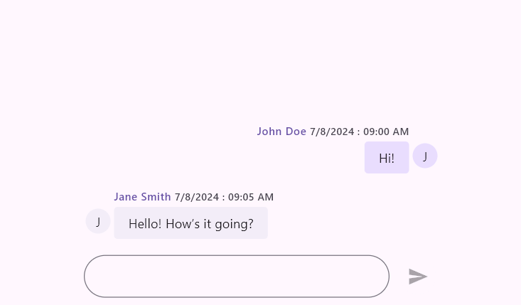
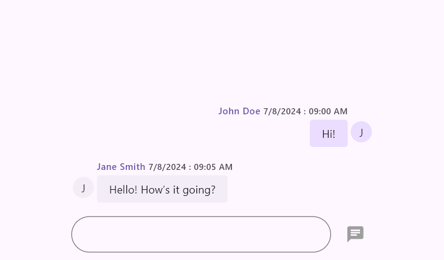
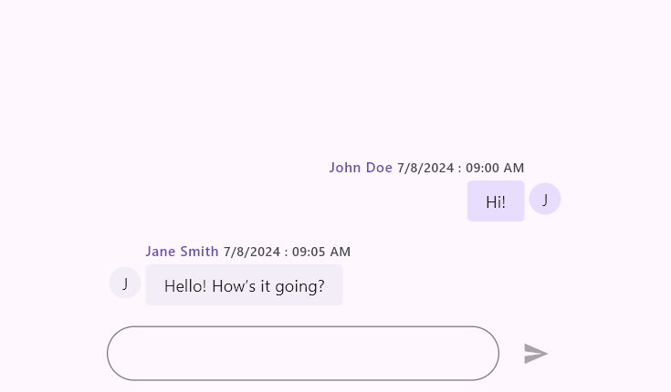
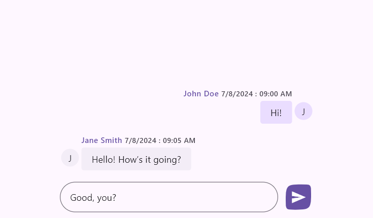

# Action Button in Flutter Chat (SfChat)

This section explains how to add and customize the action button using the various available options.

## Action button

The [`actionButton`](https://pub.dev/documentation/syncfusion_flutter_chat/latest/chat/SfChat/actionButton.html) represents the send button and is not included in the chat by default. To add it, create an instance of [`ChatActionButton`](https://api.flutter.dev/flutter/material/InputDecoration/hintText.html) and assign it to the [`actionButton`](https://pub.dev/documentation/syncfusion_flutter_chat/latest/chat/SfChat/actionButton.html) property.

When the send button is clicked, it invokes the [`ChatActionButton.onPressed`](https://pub.dev/documentation/syncfusion_flutter_chat/latest/chat/ChatActionButton/onPressed.html) callback with the text composed in the default composer (text field), which rebuilds the Chat widget to add the new message to the conversation area.

If [`ChatComposer.builder`](https://pub.dev/documentation/syncfusion_flutter_chat/latest/chat/ChatComposer/builder.html) is used, the parameter of onPressed will always be an empty string.

If [`ChatActionButton.onPressed`](https://pub.dev/documentation/syncfusion_flutter_chat/latest/chat/ChatActionButton/onPressed.html) is null, the action button will always be disabled.

If the default composer is disabled, the action button will also be disabled.

If no composer is added (by specifying the composer as null), the action button will always be enabled.




  @override
  Widget build(BuildContext context) {
    return Scaffold(
      body: Padding(
        padding: const EdgeInsets.symmetric(vertical: 15, horizontal: 100),
        child: SfChat(
          messages: <ChatMessage>[
            ChatMessage(
              text: 'Hi!',
              time: DateTime(2024, 08, 07, 9, 0),
              author: const ChatAuthor(
                id: '123-001',
                name: 'John Doe',
              ),
            ),
            ChatMessage(
              text: 'Hello! How’s it going?',
              time: DateTime(2024, 08, 07, 9, 5),
              author: const ChatAuthor(
                id: '123-002',
                name: 'Jane Smith',
              ),
            ),
          ],
          outgoingUser: '123-001',
          actionButton: ChatActionButton(
            onPressed: (String newMessage) {
              setState(() {
                _messages.add(
                  ChatMessage(
                    text: newMessage,
                    time: DateTime.now(),
                    author: const ChatAuthor(
                      id: '123-001',
                      name: 'John Doe',
                    ),
                  ),
                );
              });
            },
          ),
        ),
      ),
    );
  }




### Child

The [`child`](https://pub.dev/documentation/syncfusion_flutter_chat/latest/chat/ChatActionButton/child.html) property allows you to specify one or more interactive widgets as the content of an action button. This is useful for adding a microphone icon for voice input, attaching files to share documents or images, and more.




  @override
  Widget build(BuildContext context) {
    return Scaffold(
      body: Padding(
        padding: const EdgeInsets.symmetric(vertical: 15, horizontal: 100),
        child: SfChat(
          messages: <ChatMessage>[
            ChatMessage(
              text: 'Hi!',
              time: DateTime(2024, 08, 07, 9, 0),
              author: const ChatAuthor(
                id: '123-001',
                name: 'John Doe',
              ),
            ),
            ChatMessage(
              text: 'Hello! How’s it going?',
              time: DateTime(2024, 08, 07, 9, 5),
              author: const ChatAuthor(
                id: '123-002',
                name: 'Jane Smith',
              ),
            ),
          ],
          outgoingUser: '123-001',
          actionButton: ChatActionButton(
            child: const Icon(Icons.chat, color: Colors.grey, size: 25),
            onPressed: (String newMessage) {
              // Handle the send button click action here.
            },
          ),
        ),
      ),
    );
  }




### onPressed callback

It is a callback that is invoked whenever the action button is pressed. Since the chat widget does not rebuild itself to update the newly composed message, it provides the default text from the composer as a parameter. The user can create a message object and include it in the existing [`messages`](https://pub.dev/documentation/syncfusion_flutter_chat/latest/chat/SfChat/messages.html) list by rebuilding the chat widget to add the newly composed message to the conversational area.




  // Load if there are existing messages.
  final List<ChatMessage> _messages = <ChatMessage>[];

  @override
  Widget build(BuildContext context) {
    return Scaffold(
      body: SfChat(
        messages: _messages,
        outgoingUser: '123-001,
        actionButton: ChatActionButton(
          onPressed: (String newMessage) {
            setState(() {
              _messages.add(
                ChatMessage(
                  text: newMessage,
                  time: DateTime.now(),
                  author: const ChatAuthor(
                    id: '123-001',
                    name: 'John Doe',
                  ),
                ),
              );
            });
          },
        ),
      ),
    );
  }




### Tooltip

The [`tooltip`](https://pub.dev/documentation/syncfusion_flutter_chat/latest/chat/ChatActionButton/tooltip.html) text describes the button's action when pressed. It is displayed when the user long-presses on touch devices or hovers the mouse over it on desktop devices. By default, it is set to null, so no tooltip is shown.




  @override
  Widget build(BuildContext context) {
    return Scaffold(
      body: Padding(
        padding: const EdgeInsets.symmetric(vertical: 15, horizontal: 100),
        child: SfChat(
          messages: <ChatMessage>[
            ChatMessage(
              text: 'Hi!',
              time: DateTime(2024, 08, 07, 9, 0),
              author: const ChatAuthor(
                id: '123-001',
                name: 'John Doe',
              ),
            ),
            ChatMessage(
              text: 'Hello! How’s it going?',
              time: DateTime(2024, 08, 07, 9, 5),
              author: const ChatAuthor(
                id: '123-002',
                name: 'Jane Smith',
              ),
            ),
          ],
          outgoingUser: '123-001',
          actionButton: ChatActionButton(
            tooltip: 'Send Message',
            onPressed: (String newMessage) {
              // Handle the send button click action here.
            },
          ),
        ),
      ),
    );
  }




### Colors

The [`foregroundColor`](https://pub.dev/documentation/syncfusion_flutter_chat/latest/chat/ChatActionButton/foregroundColor.html) property is the color of the default send button icon. The default color is set to `colorScheme.onPrimary`.

The [`backgroundColor`](https://pub.dev/documentation/syncfusion_flutter_chat/latest/chat/ChatActionButton/backgroundColor.html) property is the color of the button's background. The default color is set to `colorScheme.primary`.

The [`focusColor`](https://pub.dev/documentation/syncfusion_flutter_chat/latest/chat/ChatActionButton/focusColor.html) property will replace the background color when the button is in a focused state. The default color is set to `colorScheme.primary.withOpacity(0.86)`.

The [`hoverColor`](https://pub.dev/documentation/syncfusion_flutter_chat/latest/chat/ChatActionButton/hoverColor.html) property color will replace the background color when a pointer is hovering over the button. The default color is set to `colorScheme.primary.withOpacity(0.91)`.

The [`splashColor`](https://pub.dev/documentation/syncfusion_flutter_chat/latest/chat/ChatActionButton/splashColor.html) property is the splash color of the button's InkWell. The default color is set to `colorScheme.primary.withOpacity(0.86)`.




  // Load if there are existing messages.
  final List<ChatMessage> _messages = <ChatMessage>[];

  @override
  Widget build(BuildContext context) {
    return Scaffold(
      body: SfChat(
        messages: _messages,
        outgoingUser: '123-001,
        actionButton: ChatActionButton(
          foregroundColor: Colors.white,
          backgroundColor: Colors.blue,
          focusColor: Colors.lightBlueAccent,
          hoverColor: Colors.blueAccent,
          splashColor: Colors.white.withOpacity(0.3),
          onPressed: (String newMessage) {
            // Handle the send button click action here.
          },
        ),
      ),
    );
  }




### Elevation

The [`elevation`](https://pub.dev/documentation/syncfusion_flutter_chat/latest/chat/ChatActionButton/elevation.html) property is the size of the shadow below the action button in normal state. Defaults to `0.0`.

The [`focusElevation`](https://pub.dev/documentation/syncfusion_flutter_chat/latest/chat/ChatActionButton/focusElevation.html) property defines the elevation of the button when it has focus. Defaults to `0.0`.

The [`hoverElevation`](https://pub.dev/documentation/syncfusion_flutter_chat/latest/chat/ChatActionButton/hoverElevation.html) property sets the elevation of the button when it is hovered over. Defaults to `0.0`.

The [`highlightElevation`](https://pub.dev/documentation/syncfusion_flutter_chat/latest/chat/ChatActionButton/highlightElevation.html) property determines the elevation when the button is pressed. Defaults to `0.0`.




  // Load if there are existing messages.
  final List<ChatMessage> _messages = <ChatMessage>[];

  @override
  Widget build(BuildContext context) {
    return Scaffold(
      body: SfChat(
        messages: _messages,
        outgoingUser: '123-001,
        actionButton: ChatActionButton(
          elevation: 2.0,
          focusElevation: 6.0,
          hoverElevation: 4.0,
          highlightElevation: 8.0,
          onPressed: (String newMessage) {
            // Handle the send button click action here.
          },
        ),
      ),
    );
  }




### Mouse cursor

The [`mouseCursor`](https://pub.dev/documentation/syncfusion_flutter_chat/latest/chat/ChatActionButton/mouseCursor.html) property defines the type of cursor that appears when hovering over the button. It can be set to different values to customize the cursor shape (e.g., [`SystemMouseCursors.click`](https://api.flutter.dev/flutter/services/SystemMouseCursors/click-constant.html), [`SystemMouseCursors.forbidden`](https://api.flutter.dev/flutter/services/SystemMouseCursors/forbidden-constant.html), etc.). If not specified, the default cursor will be used.




  @override
  Widget build(BuildContext context) {
    return Scaffold(
      body: SfChat(
        messages: <ChatMessage>[
          ChatMessage(
            text: 'Hi!',
            time: DateTime(2024, 08, 07, 9, 0),
            author: const ChatAuthor(
              id: '123-001',
              name: 'John Doe',
            ),
          ),
          ChatMessage(
            text: 'Hello! How’s it going?',
            time: DateTime(2024, 08, 07, 9, 5),
            author: const ChatAuthor(
              id: '123-002',
              name: 'Jane Smith',
            ),
          ),
        ],
        outgoingUser: '123-001,
        actionButton: ChatActionButton(
          mouseCursor: SystemMouseCursors.click,
          onPressed: (String newMessage) {
            // Handle the send button click action here.
          },
        ),
      ),
    );
  }




### Shape

The [`shape`](https://pub.dev/documentation/syncfusion_flutter_chat/latest/chat/ChatActionButton/shape.html) property sets the shape of the button's border, such as rounded or circular. By default, it is set to `RoundedRectangleBorder(borderRadius: BorderRadius.all(Radius.circular(20.0)))`.




  @override
  Widget build(BuildContext context) {
    return Scaffold(
      body: SfChat(
        messages: <ChatMessage>[
          ChatMessage(
            text: 'Hi!',
            time: DateTime(2024, 08, 07, 9, 0),
            author: const ChatAuthor(
              id: '123-001',
              name: 'John Doe',
            ),
          ),
          ChatMessage(
            text: 'Hello! How’s it going?',
            time: DateTime(2024, 08, 07, 9, 5),
            author: const ChatAuthor(
              id: '123-002',
              name: 'Jane Smith',
            ),
          ),
        ],
        outgoingUser: '123-001,
        actionButton: ChatActionButton(
          shape: const ContinuousRectangleBorder(
            borderRadius: BorderRadius.only(
              topLeft: Radius.circular(30.0),
              topRight: Radius.circular(15),
              bottomRight: Radius.circular(30.0),
              bottomLeft: Radius.circular(15)
            ),
          ),
          onPressed: (String newMessage) {
            // Handle the send button click action here.
          },
        ),
      ),
    );
  }




### Padding

The [`padding`](https://pub.dev/documentation/syncfusion_flutter_chat/latest/chat/ChatActionButton/padding.html) property defines the space inside the button between its border and the content. By default, it is set to `EdgeInsetsDirectional.only(start: 8.0)`.




  // Load if there are existing messages.
  final List<ChatMessage> _messages = <ChatMessage>[];

  @override
  Widget build(BuildContext context) {
    return Scaffold(
      body: SfChat(
        messages: _messages,
        outgoingUser: '123-001,
        actionButton: ChatActionButton(
          padding: const EdgeInsetsDirectional.only(start: 8.0),
          onPressed: (String newMessage) {
            // Handle the send button click action here.
          },
        ),
      ),
    );
  }




### Size

The [`size`](https://pub.dev/documentation/syncfusion_flutter_chat/latest/chat/ChatActionButton/size.html) property specifies the width and height of the button. By default, it is set to `Size.square(40.0)`.




  // Load if there are existing messages.
  final List<ChatMessage> _messages = <ChatMessage>[];

  @override
  Widget build(BuildContext context) {
    return Scaffold(
      body: SfChat(
        messages: _messages,
        outgoingUser: _outgoingUserId,
        actionButton: ChatActionButton(
          size: const Size.square(40.0),
          onPressed: (String newMessage) {
            // Handle the send button click action here.
          },
        ),
      ),
    );
  }




>You can refer to our [Flutter Chat](https://www.syncfusion.com/flutter-widgets/flutter-chat) feature tour page for its groundbreaking feature representations. You can also explore our [Flutter Chat example](https://flutter.syncfusion.com/#/chat/getting-started) which demonstrates conversations between two or more users in a fully customizable layout and shows how to easily configure the chat with built-in support for creating stunning visual effects.

#### See Also

* You can also customize the above properties using [`SfChatTheme`](https://pub.dev/documentation/syncfusion_flutter_core/latest/theme/SfChatTheme/SfChatTheme.html) by wrapping with [`SfChat`](https://pub.dev/documentation/syncfusion_flutter_chat/latest/chat/SfChat/SfChat.html).