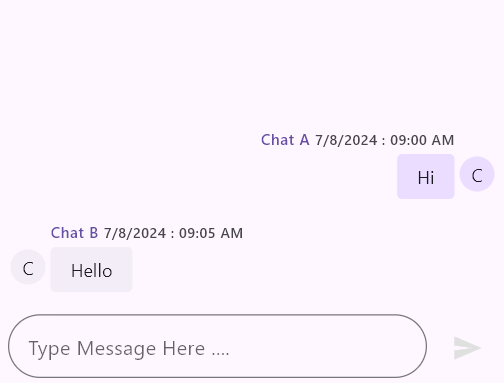
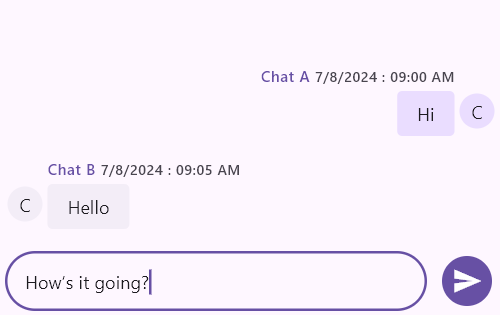

# Action Button in Flutter Chat (SfChat)
This section explains how to integrate and customize the Action Button in the SfChat widget. You can use the following properties to customize the actionButton.

* [`child`] - Used to define the content of the button, such as an icon or text.
* [`tooltip`] - Used to provide a hint or description when the user hovers over the button.
* [`foregroundColor`] - Used to set the color of the button's text and icons.
* [`backgroundColor`] - Used to define the button's background color.
* [`focusColor`] - Used to set the color displayed when the button gains focus.
* [`hoverColor`] - Used to define the color displayed when the button is hovered over.
* [`splashColor`] - Used to specify the color of the ripple effect when the button is pressed.
* [`elevation`] - Used to set the z-coordinate of the button, determining its shadow and elevation.
* [`focusElevation`] - Used to define the elevation of the button when it has focus.
* [`hoverElevation`] - Used to set the elevation of the button when it is hovered over.
* [`highlightElevation`] - Used to determine the elevation when the button is pressed.
* [`mouseCursor`] - Used to define the type of cursor that appears when hovering over the button.
* [`shape`] - Used to set the shape of the button's border, such as rounded or circular.
* [`padding`] - Used to define the space inside the button between its border and the content.
* [`size`] - Used to specify the width and height of the button.
* [`onPressed`] - Used to specify a callback function triggered when the button is pressed.




late List<ChatMessage> _messages;

@override
void initState() {
  _messages = <ChatMessage>[
    ChatMessage(
      text: 'Hi',
      time: DateTime(2024, 08, 07, 9, 0),
      author: ChatAuthor(
        id: '123-001',
        name: 'Chat A',
      ),
    ),
    ChatMessage(
      text: 'Hello',
      time: DateTime(2024, 08, 07, 9, 5),
      author: ChatAuthor(
        id: '123-002',
        name: 'Chat B',
      ),
    ),
  ];
  super.initState();
}

@override
Widget build(BuildContext context) {
  return MaterialApp(
    home: Scaffold(
      body: Center(
        child: Padding(
          padding: const EdgeInsets.all(8.0),
          child: SfChat(
            messages: _messages,
            outgoingUser: '123-001',
            actionButton: ChatActionButton(
              onPressed: (String newMessage) {
                setState(() {
                  _messages.add(
                    ChatMessage(
                      text: newMessage,
                      time: DateTime.now(),
                      author: ChatAuthor(
                        id: '123-001',
                        name: 'Chat A',
                      ),
                    ),
                  );
                });
              },
            ),
          ),
        ),
      ),
    ),
  );
}




