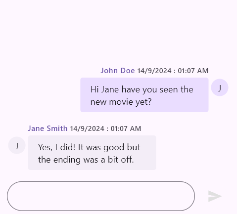
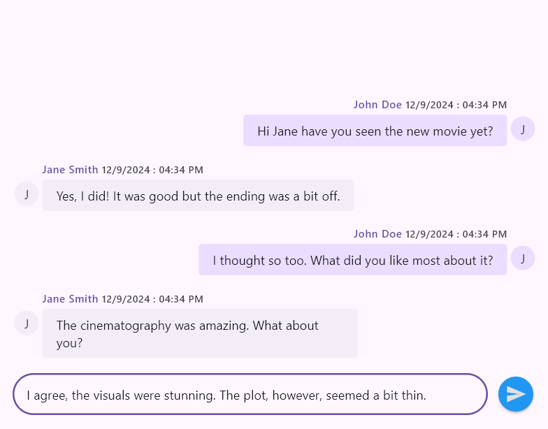

# Action Button in Flutter Chat (SfChat)

This section explains how to integrate and customize the Action Button in the Chat widget. You can use the following properties to customize the actionButton.

## Action Button

By default, the chat widget does not rebuild itself when the send button is clicked. Therefore, it is necessary to create a new message object using the newly composed message passed as a parameter in the `onPressed` callback of the [`ChatActionButton`]. After that, you should rebuild the widget using the `setState` function.




// Load if there are existing messages.
List<ChatMessage> _messages = <ChatMessage>[];
final String _outgoingUserId = '';

@override
Widget build(BuildContext context) {
  return SfChat(
    messages: _messages,
    outgoingUser: _outgoingUserId,
    actionButton: ChatActionButton(
      onPressed: (String newMessage) {
        // Handle the send button click action.
      },
    ),
  );
}




## Custom Action Button

Customize the action button to match your app’s design by adjusting properties like content (text or icons), colors for different states (hover, press), shape, size, elevation, cursor type, and padding. This ensures the button integrates seamlessly into your app and enhances the user experience.

### Child

* The [`child`] property is used to define the content of the button, such as an icon or text.

### Tooltip

* The [`tooltip`] property is used to provide a hint or description when the user hovers over the button.

### Colors

* The [`foregroundColor`] property is used to set the color of the button's text and icons.
* The [`backgroundColor`] property is used to define the button's background color.
* The [`focusColor`] property is used to set the color displayed when the button gains focus.
* The [`hoverColor`] property is used to define the color displayed when the button is hovered over.
* The [`splashColor`] property is used to specify the color of the ripple effect when the button is pressed.

### Elevation

* The [`elevation`] property is used to set the z-coordinate of the button, determining its shadow and elevation.
* The [`focusElevation`] property is used to define the elevation of the button when it has focus.
* The [`hoverElevation`] property is used to set the elevation of the button when it is hovered over.
* The [`highlightElevation`] property is used to determine the elevation when the button is pressed.

### Mouse Cursor

* The [`mouseCursor`] property is used to define the type of cursor that appears when hovering over the button.

### Shape

* The [`shape`] property is used to set the shape of the button's border, such as rounded or circular.

### Padding

* The [`padding`] property is used to define the space inside the button between its border and the content.

### Size

* The [`size`] property is used to specify the width and height of the button.

### Handle onPressed

* The [`onPressed`] property is used to specify a callback function triggered when the button is pressed.




// Load if there are existing messages.
List<ChatMessage> _messages = <ChatMessage>[];
final String _outgoingUserId = '';

@override
Widget build(BuildContext context) {
  return SfChat(
    messages: _messages,
    outgoingUser: _outgoingUserId,
    actionButton: ChatActionButton(
      child: Icon(Icons.send, color: Colors.grey[300]),
      tooltip: 'Send Message',
      foregroundColor: Colors.white,
      backgroundColor: Colors.blue,
      focusColor: Colors.lightBlueAccent,
      hoverColor: Colors.blueAccent,
      splashColor: Colors.white.withOpacity(0.3),
      elevation: 2.0,
      focusElevation: 6.0,
      hoverElevation: 4.0,
      highlightElevation: 8.0,
      mouseCursor: SystemMouseCursors.click,
      shape: RoundedRectangleBorder(
          borderRadius: BorderRadius.circular(25.0)),
      padding: const EdgeInsetsDirectional.only(start: 8.0),
      size: const Size.square(40.0),
      onPressed: (String newMessage) {
        // Handle the send button click action.
      },
    ),
  );
}




#### See Also

* You can also customize the above properties using [`SfChatTheme`] by wrapping with [`SfChat`].