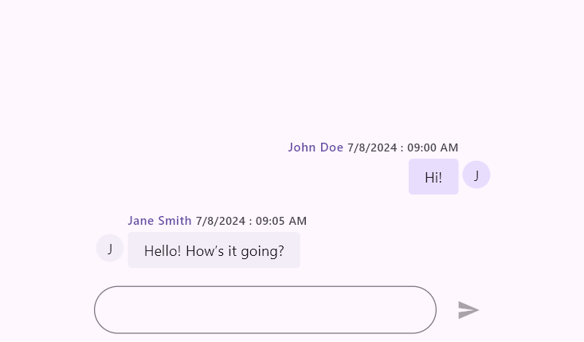
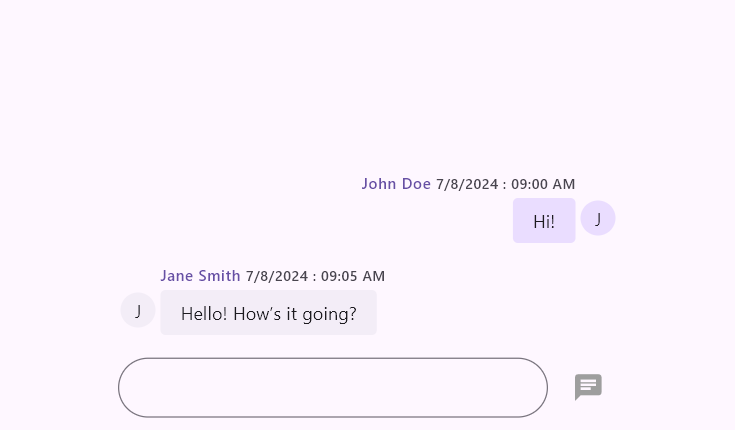
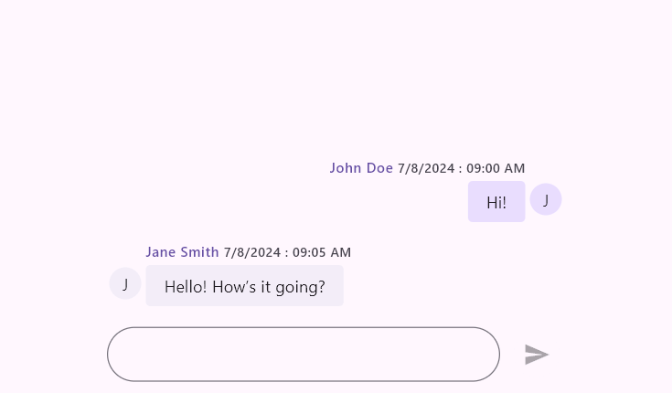
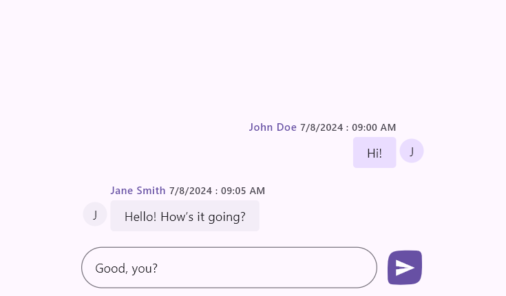

# Action Button in Flutter Chat (SfChat)

This section explains how to add and customize the action button using the available options.

## Action button

The [`actionButton`](https://pub.dev/documentation/syncfusion_flutter_chat/latest/chat/SfChat/actionButton.html) represents the send button and is not included in chat by default. To add it, create an instance of [`ChatActionButton`](https://pub.dev/documentation/syncfusion_flutter_chat/latest/chat/ChatActionButton-class.html) and assign it to the [`actionButton`](https://pub.dev/documentation/syncfusion_flutter_chat/latest/chat/SfChat/actionButton.html) property.

When the button is pressed, [`ChatActionButton.onPressed`](https://pub.dev/documentation/syncfusion_flutter_chat/latest/chat/ChatActionButton/onPressed.html) is called. `SfChat` does not auto-add composed text to the message list, so you must create a `ChatMessage` and add it manually in the callback.

If [`ChatComposer.builder`](https://pub.dev/documentation/syncfusion_flutter_chat/latest/chat/ChatComposer/ChatComposer.builder.html) is used, the `onPressed` text argument is always empty. Read the custom text from your controller and append it to the message list manually. For a builder-based composer flow, see [Composer](composer.md).




import 'package:flutter/material.dart';
import 'package:syncfusion_flutter_chat/chat.dart';

void main() {
  runApp(const DefaultActionButtonExample());
}

class DefaultActionButtonExample extends StatefulWidget {
  const DefaultActionButtonExample({super.key});

  @override
  State<DefaultActionButtonExample> createState() => _DefaultActionButtonExampleState();
}

class _DefaultActionButtonExampleState extends State<DefaultActionButtonExample> {
  late List<ChatMessage> _messages;

  @override
  void initState() {
    super.initState();
    _messages = <ChatMessage>[
      ChatMessage(
        text: 'Hi!',
        time: DateTime(2024, 08, 07, 9, 0),
        author: const ChatAuthor(id: '123-001', name: 'John Doe'),
      ),
      ChatMessage(
        text: 'Hello! How’s it going?',
        time: DateTime(2024, 08, 07, 9, 5),
        author: const ChatAuthor(id: '123-002', name: 'Jane Smith'),
      ),
    ];
  }

  @override
  Widget build(BuildContext context) {
    return MaterialApp(
      home: Scaffold(
        body: Padding(
          padding: const EdgeInsets.symmetric(vertical: 15, horizontal: 100),
          child: SfChat(
            messages: _messages,
            outgoingUser: '123-001',
            actionButton: ChatActionButton(
              onPressed: (String newMessage) {
                if (newMessage.trim().isEmpty) {
                  return;
                }
                setState(() {
                  _messages = <ChatMessage>[
                    ..._messages,
                    ChatMessage(
                      text: newMessage,
                      time: DateTime.now(),
                      author: const ChatAuthor(id: '123-001', name: 'John Doe'),
                    ),
                  ];
                });
              },
            ),
          ),
        ),
      ),
    );
  }
}




### Child

The [`child`](https://pub.dev/documentation/syncfusion_flutter_chat/latest/chat/ChatActionButton/child.html) property allows you to specify interactive content for the button.




import 'package:flutter/material.dart';
import 'package:syncfusion_flutter_chat/chat.dart';

void main() {
  runApp(const ActionButtonChildExample());
}

class ActionButtonChildExample extends StatelessWidget {
  const ActionButtonChildExample({super.key});

  @override
  Widget build(BuildContext context) {
    return MaterialApp(
      home: Scaffold(
        body: SfChat(
          messages: <ChatMessage>[
            ChatMessage(
              text: 'Hi!',
              time: DateTime(2024, 08, 07, 9, 0),
              author: const ChatAuthor(id: '123-001', name: 'John Doe'),
            ),
          ],
          outgoingUser: '123-001',
          actionButton: ChatActionButton(
            child: const Icon(Icons.chat, color: Colors.grey, size: 25),
            onPressed: (String _) {},
          ),
        ),
      ),
    );
  }
}




### onPressed callback

The `onPressed` callback is invoked whenever the action button is pressed.

Use this callback to create a new message and rebuild the widget with the updated [`messages`](https://pub.dev/documentation/syncfusion_flutter_chat/latest/chat/SfChat/messages.html) list.




import 'package:flutter/material.dart';
import 'package:syncfusion_flutter_chat/chat.dart';

void main() {
  runApp(const ActionButtonOnPressedExample());
}

class ActionButtonOnPressedExample extends StatefulWidget {
  const ActionButtonOnPressedExample({super.key});

  @override
  State<ActionButtonOnPressedExample> createState() => _ActionButtonOnPressedExampleState();
}

class _ActionButtonOnPressedExampleState extends State<ActionButtonOnPressedExample> {
  final List<ChatMessage> _messages = <ChatMessage>[];

  @override
  Widget build(BuildContext context) {
    return MaterialApp(
      home: Scaffold(
        body: SfChat(
          messages: _messages,
          outgoingUser: '123-001',
          actionButton: ChatActionButton(
            onPressed: (String newMessage) {
              if (newMessage.trim().isEmpty) {
                return;
              }
              setState(() {
                _messages.add(
                  ChatMessage(
                    text: newMessage,
                    time: DateTime.now(),
                    author: const ChatAuthor(id: '123-001', name: 'John Doe'),
                  ),
                );
              });
            },
          ),
        ),
      ),
    );
  }
}




### Tooltip

The [`tooltip`](https://pub.dev/documentation/syncfusion_flutter_chat/latest/chat/ChatActionButton/tooltip.html) text describes the button action. It appears on long press (touch) or hover (desktop).




import 'package:flutter/material.dart';
import 'package:syncfusion_flutter_chat/chat.dart';

void main() {
  runApp(const ActionButtonTooltipExample());
}

class ActionButtonTooltipExample extends StatelessWidget {
  const ActionButtonTooltipExample({super.key});

  @override
  Widget build(BuildContext context) {
    return MaterialApp(
      home: Scaffold(
        body: SfChat(
          messages: <ChatMessage>[
            ChatMessage(
              text: 'Hi!',
              time: DateTime(2024, 08, 07, 9, 0),
              author: const ChatAuthor(id: '123-001', name: 'John Doe'),
            ),
          ],
          outgoingUser: '123-001',
          actionButton: ChatActionButton(
            tooltip: 'Send message',
            onPressed: (String _) {},
          ),
        ),
      ),
    );
  }
}




### Colors

The [`foregroundColor`](https://pub.dev/documentation/syncfusion_flutter_chat/latest/chat/ChatActionButton/foregroundColor.html) property defines icon color.

The [`backgroundColor`](https://pub.dev/documentation/syncfusion_flutter_chat/latest/chat/ChatActionButton/backgroundColor.html) property defines button background color.

The [`focusColor`](https://pub.dev/documentation/syncfusion_flutter_chat/latest/chat/ChatActionButton/focusColor.html), [`hoverColor`](https://pub.dev/documentation/syncfusion_flutter_chat/latest/chat/ChatActionButton/hoverColor.html), and [`splashColor`](https://pub.dev/documentation/syncfusion_flutter_chat/latest/chat/ChatActionButton/splashColor.html) properties customize interaction colors.




import 'package:flutter/material.dart';
import 'package:syncfusion_flutter_chat/chat.dart';

void main() {
  runApp(const ActionButtonColorsExample());
}

class ActionButtonColorsExample extends StatelessWidget {
  const ActionButtonColorsExample({super.key});

  @override
  Widget build(BuildContext context) {
    return MaterialApp(
      home: Scaffold(
        body: SfChat(
          messages: const <ChatMessage>[],
          outgoingUser: '123-001',
          actionButton: ChatActionButton(
            foregroundColor: Colors.white,
            backgroundColor: Colors.blue,
            focusColor: Theme.of(context).colorScheme.primary.withValues(alpha: 0.86),
            hoverColor: Theme.of(context).colorScheme.primary.withValues(alpha: 0.91),
            splashColor: Colors.white.withValues(alpha: 0.3),
            onPressed: (String _) {},
          ),
        ),
      ),
    );
  }
}




### Elevation

The [`elevation`](https://pub.dev/documentation/syncfusion_flutter_chat/latest/chat/ChatActionButton/elevation.html) property defines shadow depth when the button is not focused, hovered, or pressed.

The [`focusElevation`](https://pub.dev/documentation/syncfusion_flutter_chat/latest/chat/ChatActionButton/focusElevation.html) property defines elevation while focused.

The [`hoverElevation`](https://pub.dev/documentation/syncfusion_flutter_chat/latest/chat/ChatActionButton/hoverElevation.html) property defines elevation while hovered.

The [`highlightElevation`](https://pub.dev/documentation/syncfusion_flutter_chat/latest/chat/ChatActionButton/highlightElevation.html) property defines elevation while pressed.




import 'package:flutter/material.dart';
import 'package:syncfusion_flutter_chat/chat.dart';

void main() {
  runApp(const ActionButtonElevationExample());
}

class ActionButtonElevationExample extends StatelessWidget {
  const ActionButtonElevationExample({super.key});

  @override
  Widget build(BuildContext context) {
    return MaterialApp(
      home: Scaffold(
        body: SfChat(
          messages: const <ChatMessage>[],
          outgoingUser: '123-001',
          actionButton: ChatActionButton(
            elevation: 2.0,
            focusElevation: 6.0,
            hoverElevation: 4.0,
            highlightElevation: 8.0,
            onPressed: (String _) {},
          ),
        ),
      ),
    );
  }
}




### Mouse cursor

The [`mouseCursor`](https://pub.dev/documentation/syncfusion_flutter_chat/latest/chat/ChatActionButton/mouseCursor.html) property defines the cursor shown while hovering over the action button.




import 'package:flutter/material.dart';
import 'package:syncfusion_flutter_chat/chat.dart';

void main() {
  runApp(const ActionButtonMouseCursorExample());
}

class ActionButtonMouseCursorExample extends StatelessWidget {
  const ActionButtonMouseCursorExample({super.key});

  @override
  Widget build(BuildContext context) {
    return MaterialApp(
      home: Scaffold(
        body: SfChat(
          messages: const <ChatMessage>[],
          outgoingUser: '123-001',
          actionButton: ChatActionButton(
            mouseCursor: SystemMouseCursors.click,
            onPressed: (String _) {},
          ),
        ),
      ),
    );
  }
}




### Shape

The [`shape`](https://pub.dev/documentation/syncfusion_flutter_chat/latest/chat/ChatActionButton/shape.html) property sets the button border shape.




import 'package:flutter/material.dart';
import 'package:syncfusion_flutter_chat/chat.dart';

void main() {
  runApp(const ActionButtonShapeExample());
}

class ActionButtonShapeExample extends StatelessWidget {
  const ActionButtonShapeExample({super.key});

  @override
  Widget build(BuildContext context) {
    return MaterialApp(
      home: Scaffold(
        body: SfChat(
          messages: const <ChatMessage>[],
          outgoingUser: '123-001',
          actionButton: ChatActionButton(
            shape: const ContinuousRectangleBorder(
              borderRadius: BorderRadius.only(
                topLeft: Radius.circular(30.0),
                topRight: Radius.circular(15),
                bottomRight: Radius.circular(30.0),
                bottomLeft: Radius.circular(15),
              ),
            ),
            onPressed: (String _) {},
          ),
        ),
      ),
    );
  }
}




### Margin

The [`margin`](https://pub.dev/documentation/syncfusion_flutter_chat/latest/chat/ChatActionButton/margin.html) property defines external spacing around the action button. By default, it is `EdgeInsetsDirectional.only(start: 8.0)`.




import 'package:flutter/material.dart';
import 'package:syncfusion_flutter_chat/chat.dart';

void main() {
  runApp(const ActionButtonMarginExample());
}

class ActionButtonMarginExample extends StatelessWidget {
  const ActionButtonMarginExample({super.key});

  @override
  Widget build(BuildContext context) {
    return MaterialApp(
      home: Scaffold(
        body: SfChat(
          messages: const <ChatMessage>[],
          outgoingUser: '123-001',
          actionButton: ChatActionButton(
            margin: const EdgeInsetsDirectional.only(start: 8.0),
            onPressed: (String _) {},
          ),
        ),
      ),
    );
  }
}




### Size

The [`size`](https://pub.dev/documentation/syncfusion_flutter_chat/latest/chat/ChatActionButton/size.html) property specifies button width and height. The default is `Size.square(40.0)`.




import 'package:flutter/material.dart';
import 'package:syncfusion_flutter_chat/chat.dart';

void main() {
  runApp(const ActionButtonSizeExample());
}

class ActionButtonSizeExample extends StatelessWidget {
  const ActionButtonSizeExample({super.key});

  @override
  Widget build(BuildContext context) {
    return MaterialApp(
      home: Scaffold(
        body: SfChat(
          messages: const <ChatMessage>[],
          outgoingUser: '123-001',
          actionButton: ChatActionButton(
            size: const Size.square(40.0),
            onPressed: (String _) {},
          ),
        ),
      ),
    );
  }
}




### Enable or disable action button

You can control action button interactivity in the following ways:

* Set `onPressed` to `null` to disable the action button.
* When using the default composer, set `ChatComposer.decoration.enabled` to `false` to disable both composer input and action button.
* If `composer` is `null`, action button availability depends on your custom handling and `onPressed`.




import 'package:flutter/material.dart';
import 'package:syncfusion_flutter_chat/chat.dart';

void main() {
  runApp(const ActionButtonDisableExample());
}

class ActionButtonDisableExample extends StatelessWidget {
  const ActionButtonDisableExample({super.key});

  @override
  Widget build(BuildContext context) {
    return MaterialApp(
      home: Scaffold(
        body: SfChat(
          messages: const <ChatMessage>[],
          outgoingUser: '123-001',
          composer: const ChatComposer(
            decoration: InputDecoration(
              enabled: false,
              hintText: 'Composer disabled',
            ),
          ),
          actionButton: const ChatActionButton(onPressed: null),
        ),
      ),
    );
  }
}




>You can refer to our [Flutter Chat](https://www.syncfusion.com/flutter-widgets/flutter-chat) feature tour page for its groundbreaking feature representations. You can also explore our [Flutter Chat example](https://flutter.syncfusion.com/#/chat/getting-started) which demonstrates conversations between two or more users in a fully customizable layout and shows how to easily configure the chat with built-in support for creating stunning visual effects.

#### See Also

* You can customize these properties with [`SfChatTheme`](https://pub.dev/documentation/syncfusion_flutter_core/latest/theme/SfChatTheme/SfChatTheme.html) by wrapping [`SfChat`](https://pub.dev/documentation/syncfusion_flutter_chat/latest/chat/SfChat/SfChat.html).