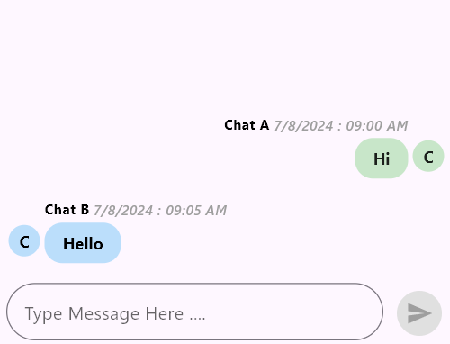
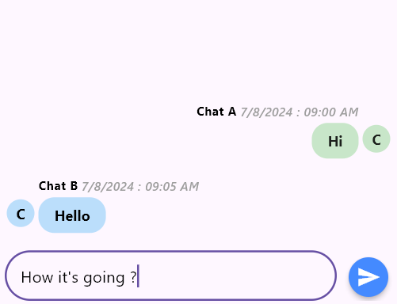

# Theme in Flutter Chat (SfChatTheme)
This section explains how to integrate and customize the Theme in the [`SfChatTheme`] widget. You can use the following properties.

N> You must import the [`theme.dart`] library from the [`Core`] package to use [`SfChatTheme`].

## Action Button Colors

* [`actionButtonForegroundColor`] - Used to customize the color of the text or icon on the action button.
* [`actionButtonBackgroundColor`] - Used to set the color of the action button’s background.
* [`actionButtonFocusColor`] - Used to define the color of the action button when it is focused.
* [`actionButtonHoverColor`] - Used to adjust the color of the action button when hovered over.
* [`actionButtonSplashColor`] - Used to specify the color of the ripple effect when the action button is tapped.
* [`actionButtonDisabledForegroundColor`] - Used to set the color of the text or icon on the action button when it is disabled.
* [`actionButtonDisabledBackgroundColor`] - Used to define the color of the action button’s background when it is disabled.

## Action Button Elevations

* [`actionButtonElevation`] - Used to set the elevation of the action button in its default state.
* [`actionButtonFocusElevation`] - Used to adjust the elevation of the action button when it is focused.
* [`actionButtonHoverElevation`] - Used to define the elevation of the action button when hovered over.
* [`actionButtonHighlightElevation`] - Used to specify the elevation of the action button when it is highlighted.
* [`actionButtonDisabledElevation`] - Used to set the elevation of the action button when it is disabled.

## Action Button Mouse Cursor

* [`actionButtonMouseCursor`] - Used to define the type of cursor displayed when hovering over the action button.

## Action Button Shape

* [`actionButtonShape`] - Used to customize the shape and border radius of the action button.

## Message Bubble Colors

* [`outgoingBubbleContentBackgroundColor`] - Used to set the background color of bubbles containing outgoing messages.
* [`incomingBubbleContentBackgroundColor`] - Used to define the background color of bubbles containing incoming messages.

## Text Styles

* [`editorTextStyle`] - Used to define the style for text in the message editor.
* [`outgoingContentTextStyle`] - Used to customize the style for text in outgoing message bubbles.
* [`incomingContentTextStyle`] - Used to set the style for text in incoming message bubbles.
* [`outgoingPrimaryHeaderTextStyle`] - Used to specify the style for the primary header text in outgoing message bubbles.
* [`incomingPrimaryHeaderTextStyle`] - Used to define the style for the primary header text in incoming message bubbles.
* [`outgoingSecondaryHeaderTextStyle`] - Used to adjust the style for the secondary header text in outgoing message bubbles.
* [`incomingSecondaryHeaderTextStyle`] - Used to set the style for the secondary header text in incoming message bubbles.

## Message Bubble Shapes

* [`outgoingBubbleContentShape`] - Used to customize the shape and border radius of outgoing message bubbles.
* [`incomingBubbleContentShape`] - Used to define the shape and border radius of incoming message bubbles.




late List<ChatMessage> _messages;

@override
void initState() {
  _messages = <ChatMessage>[
    ChatMessage(
      text: 'Hi',
      time: DateTime(2024, 08, 07, 9, 0),
      author: ChatAuthor(
        id: '123-001',
        name: 'Chat A',
      ),
    ),
    ChatMessage(
      text: 'Hello',
      time: DateTime(2024, 08, 07, 9, 5),
      author: ChatAuthor(
        id: '123-002',
        name: 'Chat B',
      ),
    ),
  ];
  super.initState();
}

@override
Widget build(BuildContext context) {
  return MaterialApp(
    home: Scaffold(
      body: Center(
        child: SfChatTheme(
          data: SfChatThemeData(
            actionButtonForegroundColor: Colors.white,
            actionButtonBackgroundColor: Colors.blueAccent,
            actionButtonFocusColor: Colors.blue,
            actionButtonHoverColor: Colors.blueGrey,
            actionButtonSplashColor: Colors.lightBlueAccent,
            actionButtonDisabledForegroundColor: Colors.grey,
            actionButtonDisabledBackgroundColor: Colors.grey[300],
            actionButtonElevation: 4.0,
            actionButtonFocusElevation: 6.0,
            actionButtonHoverElevation: 8.0,
            actionButtonHighlightElevation: 12.0,
            actionButtonDisabledElevation: 0.0,
            actionButtonMouseCursor: SystemMouseCursors.click,
            actionButtonShape: RoundedRectangleBorder(
              borderRadius: BorderRadius.circular(40.0),
            ),
            outgoingBubbleContentBackgroundColor: Colors.green[100],
            incomingBubbleContentBackgroundColor: Colors.blue[100],
            editorTextStyle: const TextStyle(
              color: Colors.black,
              fontSize: 16.0,
              fontWeight: FontWeight.normal,
            ),
            outgoingContentTextStyle: const TextStyle(
              color: Colors.black87,
              fontSize: 14.0,
              fontWeight: FontWeight.bold,
            ),
            incomingContentTextStyle: const TextStyle(
              color: Colors.black,
              fontSize: 14.0,
              fontWeight: FontWeight.bold,
            ),
            outgoingPrimaryHeaderTextStyle: const TextStyle(
              color: Colors.black,
              fontSize: 12.0,
              fontWeight: FontWeight.bold,
            ),
            incomingPrimaryHeaderTextStyle: const TextStyle(
              color: Colors.black,
              fontSize: 12.0,
              fontWeight: FontWeight.bold,
            ),
            outgoingSecondaryHeaderTextStyle: const TextStyle(
              color: Colors.grey,
              fontSize: 12.0,
              fontStyle: FontStyle.italic,
            ),
            incomingSecondaryHeaderTextStyle: const TextStyle(
              color: Colors.grey,
              fontSize: 12.0,
              fontStyle: FontStyle.normal,
            ),
            outgoingBubbleContentShape: RoundedRectangleBorder(
              borderRadius: BorderRadius.circular(16.0),
            ),
            incomingBubbleContentShape: RoundedRectangleBorder(
              borderRadius: BorderRadius.circular(16.0),
            ),
          ),
          child: SfChat(
            messages: _messages,
            outgoingUser: '123-001',
            composer: ChatComposer(
              minLines: 1,
              maxLines: 6,
              decoration: InputDecoration(hintText: 'Type Message Here ....'),
              padding: const EdgeInsets.only(top: 16.0),
            ),
            actionButton: ChatActionButton(
              onPressed: (String newMessage) {
                setState(() {
                  _messages.add(
                    ChatMessage(
                      text: newMessage,
                      time: DateTime.now(),
                      author: ChatAuthor(
                        id: '123-001',
                        name: 'Chat A',
                      ),
                    ),
                  );
                });
              },
            ),
          ),
        ),
      ),
    ),
  );
}




