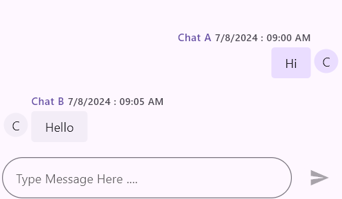

# Composer in Flutter Chat (SfChat)
This section explains how to integrate and customize the composer in the SfChat widget. You can use the following properties to 
customize the composer.

* [`textStyle`] - Used to customize the appearance of the text in the message input field, including color, font size, and style.
* [`minLines`] - Used to set the minimum number of lines that the message input field should display, determining its initial height.
* [`maxLines`]- Used to define the maximum number of lines the message input field can expand to before becoming scrollable.
* [`decoration`] - Used to customize the visual attributes of the message input field, such as hint text, borders, and internal padding, using an InputDecoration object.
* [`padding`] - Used to adjust the space around the input field, controlling its distance from the parent widget.




late List<ChatMessage> _messages;

@override
void initState() {
  _messages = <ChatMessage>[
    ChatMessage(
      text: 'Hi',
      time: DateTime(2024, 08, 07, 9, 0),
      author: ChatAuthor(
        id: '123-001',
        name: 'Chat A',
      ),
    ),
    ChatMessage(
      text: 'Hello',
      time: DateTime(2024, 08, 07, 9, 5),
      author: ChatAuthor(
        id: '123-002',
        name: 'Chat B',
      ),
    ),
  ];
  super.initState();
}

@override
Widget build(BuildContext context) {
  return MaterialApp(
    home: Scaffold(
      body: Center(
        child: SfChat(
          messages: _messages,
          outgoingUser: '123-001',
          composer: ChatComposer(
            textStyle: TextStyle(fontSize: 16.0, color: Colors.black),
            minLines: 1,
            maxLines: 6,
            decoration: InputDecoration(
              border: OutlineInputBorder(
                  borderRadius: BorderRadius.all(Radius.circular(42.0))),
              hintText: 'Type Message Here ...',
            ),
            padding: const EdgeInsets.only(top: 16.0),
          ),
        ),
      ),
    ),
  );
}




