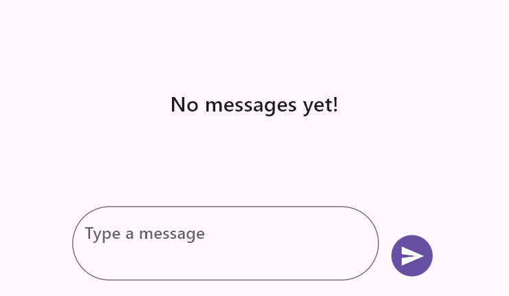
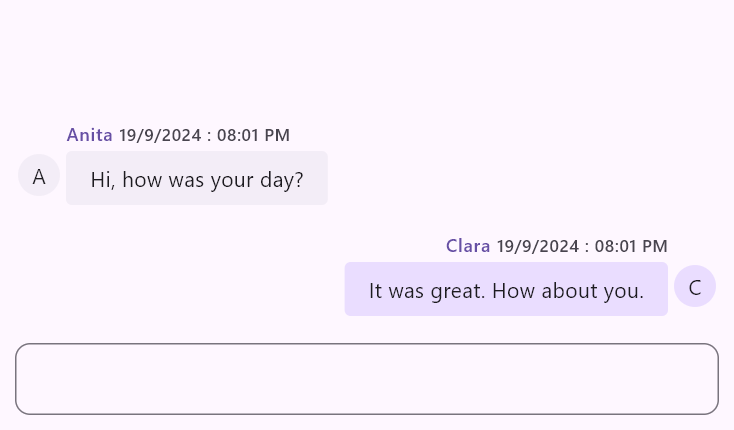
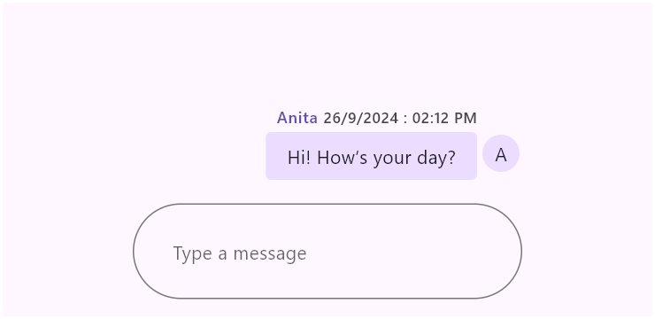
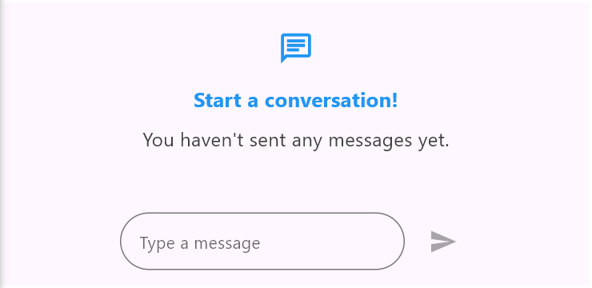
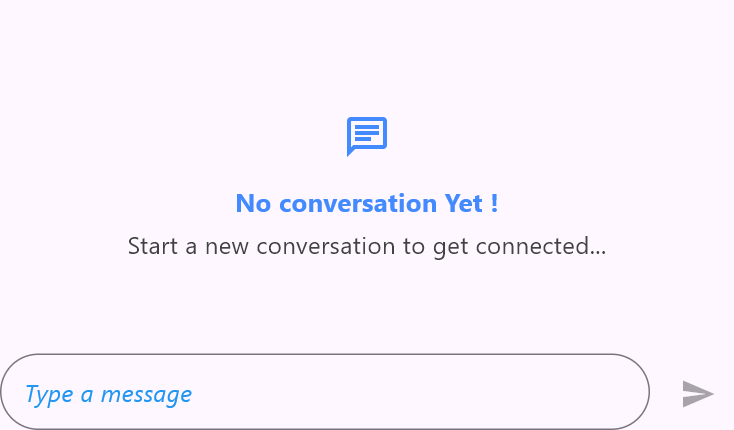
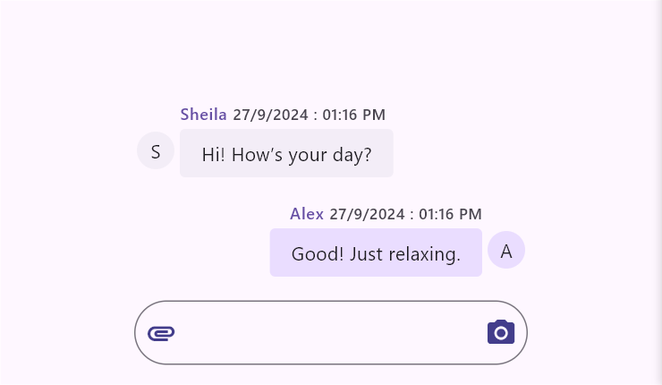
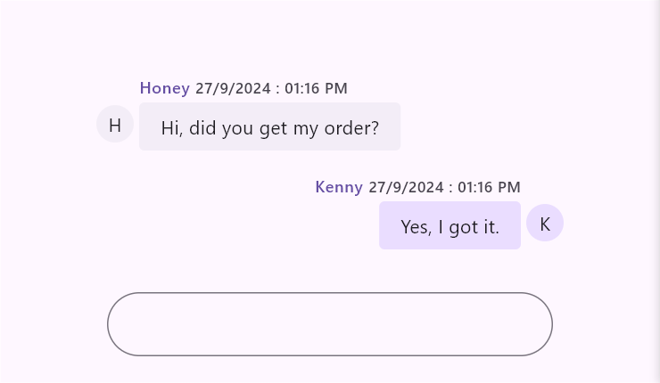
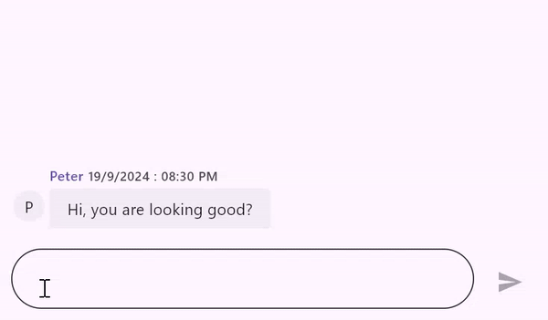
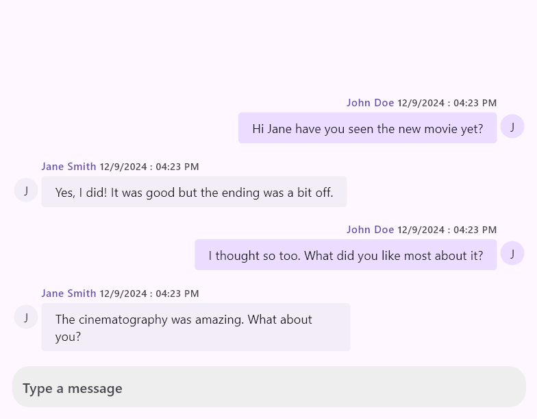

# Composer in Flutter Chat (SfChat)

This section explains the customization options available in [`ChatComposer`](https://pub.dev/documentation/syncfusion_flutter_chat/latest/chat/ChatComposer-class.html), including the option to add any type of widget as a composer.

## Composer

The [`composer`](https://pub.dev/documentation/syncfusion_flutter_chat/latest/chat/SfChat/composer.html) is a customizable text editor designed for typing new messages. It offers options to adjust the appearance and behavior of the text editor, including settings for the `minimum` and `maximum` number of lines, `decoration`, `margin`, `textStyle`, and theme-level `editorTextStyle` (see [Chat theme - Editor text style](chat-theme.md#editor-text-style)).

When the composer is null, no default text field is added to the chat widget.

### Minimum and maximum lines

* [`minLines`](https://pub.dev/documentation/syncfusion_flutter_chat/latest/chat/ChatComposer/minLines.html) specifies the minimum number of lines in the text span, which affects the height of the text field.
* [`maxLines`](https://pub.dev/documentation/syncfusion_flutter_chat/latest/chat/ChatComposer/maxLines.html) defines the maximum number of lines for the text, determining how many lines are visible when the text wraps.

The default value for `minLines` is `1`, and the default value for `maxLines` is `6`.




import 'package:flutter/material.dart';
import 'package:syncfusion_flutter_chat/chat.dart';

void main() {
  runApp(const ComposerMinMaxLinesExample());
}

class ComposerMinMaxLinesExample extends StatelessWidget {
  const ComposerMinMaxLinesExample({super.key});

  @override
  Widget build(BuildContext context) {
    return MaterialApp(
      home: Scaffold(
        body: SfChat(
          messages: const <ChatMessage>[],
          outgoingUser: '123-001',
          composer: const ChatComposer(
            minLines: 2,
            maxLines: 3,
          ),
        ),
      ),
    );
  }
}




### Decoration

The [`decoration`](https://pub.dev/documentation/syncfusion_flutter_chat/latest/chat/ChatComposer/decoration.html) property customizes the visual attributes of the message input field, such as hint text, borders, and internal padding, using an [`InputDecoration`](https://api.flutter.dev/flutter/material/InputDecoration-class.html).

The [`InputDecoration`](https://api.flutter.dev/flutter/material/InputDecoration-class.html) class enhances the composer by utilizing its properties, such as borders, labels, icons, and styles.

The following are major properties available in [`InputDecoration`](https://api.flutter.dev/flutter/material/InputDecoration-class.html) for decorating the composer:
* [`enabled`](https://api.flutter.dev/flutter/material/InputDecoration/enabled.html)
* [`border`](https://api.flutter.dev/flutter/material/InputDecoration/border.html)
* [`contentPadding`](https://api.flutter.dev/flutter/material/InputDecoration/contentPadding.html)
* [`hintText`](https://api.flutter.dev/flutter/material/InputDecoration/hintText.html)
* [`hintStyle`](https://api.flutter.dev/flutter/material/InputDecoration/hintStyle.html)
* [`prefixIcon`](https://api.flutter.dev/flutter/material/InputDecoration/prefixIcon.html) and [`suffixIcon`](https://api.flutter.dev/flutter/material/InputDecoration/suffixIcon.html)
* [`filled`](https://api.flutter.dev/flutter/material/InputDecoration/filled.html) and [`fillColor`](https://api.flutter.dev/flutter/material/InputDecoration/fillColor.html)
* [`labelText`](https://api.flutter.dev/flutter/material/InputDecoration/labelText.html), [`counterText`](https://api.flutter.dev/flutter/material/InputDecoration/counterText.html), and [`focusedBorder`](https://api.flutter.dev/flutter/material/InputDecoration/focusedBorder.html)

#### Enabled

The [`enabled`](https://api.flutter.dev/flutter/material/InputDecoration/enabled.html) property defines whether the compose feature is in an enabled or disabled state. By default, it is set to true. If set to false, the compose feature is disabled, and the default action button is also disabled.

#### Border

The [`border`](https://api.flutter.dev/flutter/material/InputDecoration/border.html) property defines the shape of the border that is drawn around the text field. By default, an [`OutlineInputBorder`](https://api.flutter.dev/flutter/material/OutlineInputBorder-class.html) is used.




import 'package:flutter/material.dart';
import 'package:syncfusion_flutter_chat/chat.dart';

void main() {
  runApp(const ComposerBorderExample());
}

class ComposerBorderExample extends StatelessWidget {
  const ComposerBorderExample({super.key});

  @override
  Widget build(BuildContext context) {
    return MaterialApp(
      home: Scaffold(
        body: SfChat(
          messages: <ChatMessage>[
            ChatMessage(
              text: 'Hi! How’s your day?',
              time: DateTime(2024, 08, 07, 9, 0),
              author: const ChatAuthor(id: '123-001', name: 'Anita'),
            ),
            ChatMessage(
              text: 'It was great.',
              time: DateTime(2024, 08, 07, 9, 1),
              author: const ChatAuthor(id: '123-005', name: 'Clara'),
            ),
          ],
          outgoingUser: '123-005',
          composer: ChatComposer(
            decoration: InputDecoration(
              border: OutlineInputBorder(
                borderRadius: BorderRadius.circular(10),
              ),
            ),
          ),
        ),
      ),
    );
  }
}




#### Content padding

The [`contentPadding`](https://api.flutter.dev/flutter/material/InputDecoration/contentPadding.html) property defines the padding surrounding the text added inside the text field. By default, the `padding` is set to `16` horizontally and `18` vertically.




import 'package:flutter/material.dart';
import 'package:syncfusion_flutter_chat/chat.dart';

void main() {
  runApp(const ComposerContentPaddingExample());
}

class ComposerContentPaddingExample extends StatelessWidget {
  const ComposerContentPaddingExample({super.key});

  @override
  Widget build(BuildContext context) {
    return MaterialApp(
      home: Scaffold(
        body: SfChat(
          messages: <ChatMessage>[
            ChatMessage(
              text: 'Hi! How’s your day?',
              time: DateTime(2024, 08, 07, 9, 0),
              author: const ChatAuthor(id: '123-001', name: 'Anita'),
            ),
          ],
          outgoingUser: '123-001',
          composer: const ChatComposer(
            decoration: InputDecoration(
              hintText: 'Type a message',
              contentPadding: EdgeInsets.all(30),
            ),
          ),
        ),
      ),
    );
  }
}




#### Hint text

The [`hintText`](https://api.flutter.dev/flutter/material/InputDecoration/hintText.html) property sets the placeholder text for the text field. By default, it is set to `null`.




import 'package:flutter/material.dart';
import 'package:syncfusion_flutter_chat/chat.dart';

void main() {
  runApp(const ComposerHintTextExample());
}

class ComposerHintTextExample extends StatelessWidget {
  const ComposerHintTextExample({super.key});

  @override
  Widget build(BuildContext context) {
    return MaterialApp(
      home: Scaffold(
        body: SfChat(
          messages: const <ChatMessage>[],
          outgoingUser: '123-001',
          composer: const ChatComposer(
            decoration: InputDecoration(
              hintText: 'Type a message',
            ),
          ),
        ),
      ),
    );
  }
}




#### Hint text style

The [`hintStyle`](https://api.flutter.dev/flutter/material/InputDecoration/hintStyle.html) property refers to the text style of the hint text.




import 'package:flutter/material.dart';
import 'package:syncfusion_flutter_chat/chat.dart';

void main() {
  runApp(const ComposerHintStyleExample());
}

class ComposerHintStyleExample extends StatelessWidget {
  const ComposerHintStyleExample({super.key});

  @override
  Widget build(BuildContext context) {
    return MaterialApp(
      home: Scaffold(
        body: SfChat(
          messages: const <ChatMessage>[],
          outgoingUser: '123-001',
          composer: const ChatComposer(
            decoration: InputDecoration(
              hintText: 'Type a message',
              hintStyle: TextStyle(
                color: Colors.blue,
                fontSize: 16,
                fontStyle: FontStyle.italic,
              ),
            ),
          ),
        ),
      ),
    );
  }
}




#### Prefix and suffix icons

The [`prefixIcon`](https://api.flutter.dev/flutter/material/InputDecoration/prefixIcon.html) and [`suffixIcon`](https://api.flutter.dev/flutter/material/InputDecoration/suffixIcon.html) properties are used to add icons at the beginning and end of the text field, respectively.




import 'package:flutter/material.dart';
import 'package:syncfusion_flutter_chat/chat.dart';

void main() {
  runApp(const ComposerIconsExample());
}

class ComposerIconsExample extends StatelessWidget {
  const ComposerIconsExample({super.key});

  @override
  Widget build(BuildContext context) {
    return MaterialApp(
      home: Scaffold(
        body: SfChat(
          messages: <ChatMessage>[
            ChatMessage(
              text: 'Hi! How’s your day?',
              time: DateTime(2024, 08, 07, 9, 0),
              author: const ChatAuthor(id: '123-001', name: 'Sheila'),
            ),
            ChatMessage(
              text: 'Good! Just relaxing.',
              time: DateTime(2024, 08, 07, 9, 5),
              author: const ChatAuthor(id: '123-005', name: 'Alex'),
            ),
          ],
          outgoingUser: '123-005',
          composer: const ChatComposer(
            decoration: InputDecoration(
              prefixIcon: Icon(
                Icons.attachment,
                color: Color(0xFF433D8B),
              ),
              suffixIcon: Icon(
                Icons.camera_alt,
                color: Color(0xFF433D8B),
              ),
            ),
          ),
        ),
      ),
    );
  }
}




### Margin

The [`margin`](https://pub.dev/documentation/syncfusion_flutter_chat/latest/chat/ChatComposer/margin.html) property defines the space around the text field, which is used to create space between the conversation area and the text field.

By default, the top `margin` is set to `16`.




import 'package:flutter/material.dart';
import 'package:syncfusion_flutter_chat/chat.dart';

void main() {
  runApp(const ComposerMarginExample());
}

class ComposerMarginExample extends StatelessWidget {
  const ComposerMarginExample({super.key});

  @override
  Widget build(BuildContext context) {
    return MaterialApp(
      home: Scaffold(
        body: SfChat(
          messages: <ChatMessage>[
            ChatMessage(
              text: 'Hi, did you get my order?',
              time: DateTime(2024, 08, 07, 9, 0),
              author: const ChatAuthor(id: '123-001', name: 'Honey'),
            ),
            ChatMessage(
              text: 'Yes, I got it.',
              time: DateTime(2024, 08, 07, 9, 5),
              author: const ChatAuthor(id: '123-005', name: 'Kenny'),
            ),
          ],
          outgoingUser: '123-005',
          composer: const ChatComposer(
            margin: EdgeInsets.fromLTRB(10, 30, 10, 20),
          ),
        ),
      ),
    );
  }
}




### Text style

The [`textStyle`](https://pub.dev/documentation/syncfusion_flutter_chat/latest/chat/ChatComposer/textStyle.html) property is used to set the style for the default [`ChatComposer`](https://pub.dev/documentation/syncfusion_flutter_chat/latest/chat/ChatComposer-class.html) text.

The specified text style will be merged with the [`bodyMedium`](https://api.flutter.dev/flutter/material/TextTheme/bodyMedium.html) and `editorTextStyle` text styles.




import 'package:flutter/material.dart';
import 'package:syncfusion_flutter_chat/chat.dart';

void main() {
  runApp(const ComposerTextStyleExample());
}

class ComposerTextStyleExample extends StatelessWidget {
  const ComposerTextStyleExample({super.key});

  @override
  Widget build(BuildContext context) {
    return MaterialApp(
      home: Scaffold(
        body: SfChat(
          messages: <ChatMessage>[
            ChatMessage(
              text: 'Hi, you are looking good',
              time: DateTime(2024, 08, 07, 9, 0),
              author: const ChatAuthor(id: '123-001', name: 'Peter'),
            ),
            ChatMessage(
              text: 'Thank you',
              time: DateTime(2024, 08, 07, 9, 5),
              author: const ChatAuthor(id: '123-002', name: 'Master'),
            ),
          ],
          outgoingUser: '123-002',
          composer: const ChatComposer(
            textStyle: TextStyle(
              color: Color(0xFF433D8B),
            ),
          ),
        ),
      ),
    );
  }
}




### Builder

The [`ChatComposer.builder`](https://pub.dev/documentation/syncfusion_flutter_chat/latest/chat/ChatComposer/ChatComposer.builder.html) enables the option to specify any type of widget as a primary composer, which is useful for integrating additional options alongside the text field, such as a microphone button, file attachment button, and so on.

If [`ChatComposer.builder`](https://pub.dev/documentation/syncfusion_flutter_chat/latest/chat/ChatComposer/ChatComposer.builder.html) is used, the action button will always be enabled.

When using `ChatComposer.builder`, the default `ChatActionButton.onPressed` text argument is empty. Handle message creation using your custom controller state, then clear the controller after adding the message. For action button behavior details, see [Action button](action-button.md).




import 'package:flutter/material.dart';
import 'package:syncfusion_flutter_chat/chat.dart';

void main() {
  runApp(const ComposerBuilderExample());
}

class ComposerBuilderExample extends StatefulWidget {
  const ComposerBuilderExample({super.key});

  @override
  State<ComposerBuilderExample> createState() => _ComposerBuilderExampleState();
}

class _ComposerBuilderExampleState extends State<ComposerBuilderExample> {
  late List<ChatMessage> _messages;
  final TextEditingController _controller = TextEditingController();

  @override
  void initState() {
    super.initState();
    _messages = <ChatMessage>[
      ChatMessage(
        text: 'Hello there!',
        time: DateTime(2024, 08, 07, 9, 0),
        author: const ChatAuthor(id: '123-002', name: 'Jane'),
      ),
    ];
  }

  @override
  void dispose() {
    _controller.dispose();
    super.dispose();
  }

  @override
  Widget build(BuildContext context) {
    return MaterialApp(
      home: Scaffold(
        body: SfChat(
          messages: _messages,
          outgoingUser: '123-001',
          composer: _buildComposer(context),
          actionButton: ChatActionButton(
            onPressed: (String _) {
              final String typedText = _controller.text.trim();
              if (typedText.isEmpty) {
                return;
              }

              setState(() {
                _messages = <ChatMessage>[
                  ..._messages,
                  ChatMessage(
                    text: typedText,
                    time: DateTime.now(),
                    author: const ChatAuthor(id: '123-001', name: 'John'),
                  ),
                ];
                _controller.clear();
              });
            },
          ),
        ),
      ),
    );
  }

  ChatComposer _buildComposer(BuildContext context) {
    return ChatComposer.builder(
      builder: (BuildContext context) {
        return Row(
          children: <Widget>[
            const Icon(
              Icons.add,
              size: 35,
              color: Color(0xFF433D8B),
            ),
            const SizedBox(width: 5),
            Expanded(
              child: Container(
                decoration: BoxDecoration(
                  color: Theme.of(context).colorScheme.primary.withValues(alpha: 0.2),
                  borderRadius: BorderRadius.circular(25),
                ),
                child: TextField(
                  minLines: 1,
                  maxLines: 6,
                  controller: _controller,
                  decoration: InputDecoration(
                    contentPadding: const EdgeInsets.symmetric(
                      vertical: 10,
                      horizontal: 18,
                    ),
                    hintText: 'Messages...',
                    hintStyle: TextStyle(
                      color: Colors.grey.shade800,
                      fontSize: 14,
                      fontWeight: FontWeight.w500,
                    ),
                    suffixIcon: const Padding(
                      padding: EdgeInsets.only(right: 5.0),
                      child: Icon(
                        Icons.emoji_emotions_outlined,
                        color: Color(0xFF433D8B),
                      ),
                    ),
                    border: InputBorder.none,
                  ),
                ),
              ),
            ),
          ],
        );
      },
    );
  }
}




>You can refer to our [Flutter Chat](https://www.syncfusion.com/flutter-widgets/flutter-chat) feature tour page for its groundbreaking feature representations. You can also explore our [Flutter Chat example](https://flutter.syncfusion.com/#/chat/getting-started) which demonstrates conversations between two or more users in a fully customizable layout and shows how to easily configure the chat with built-in support for creating stunning visual effects.