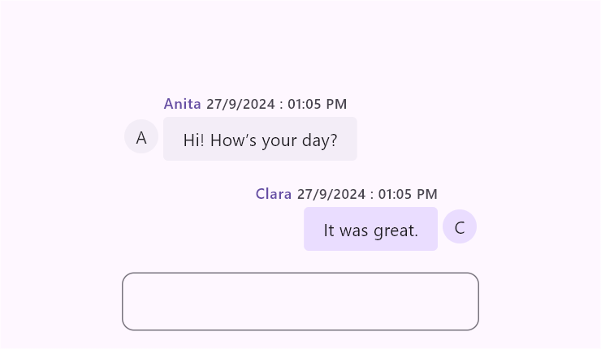
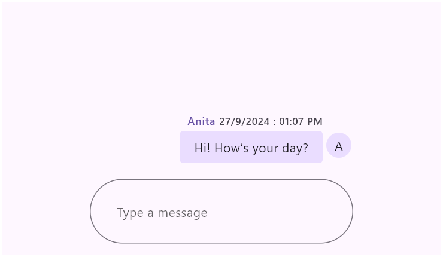
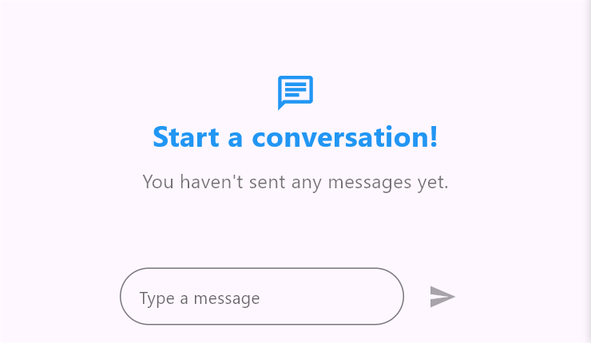
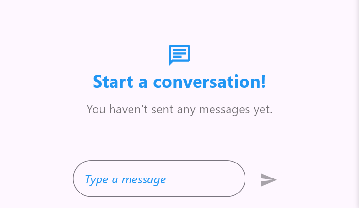
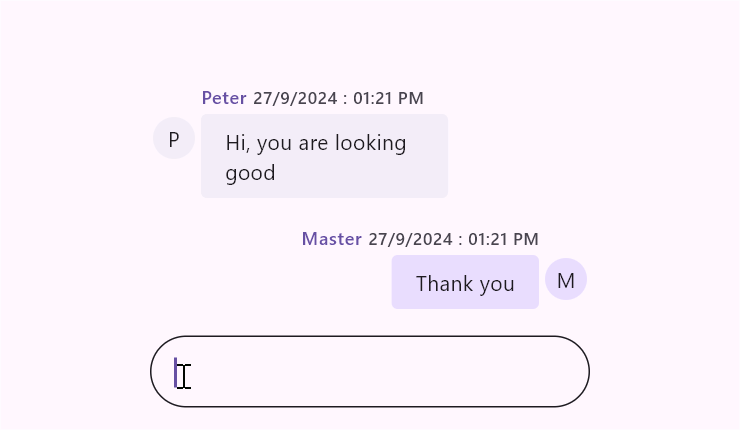

# Composer in Flutter Chat (SfChat)

This section explains the customization options available in [ChatComposer](https://pub.dev/documentation/syncfusion_flutter_chat/latest/syncfusion_flutter_chat/ChatComposer-class.html), including the option to add any type of widget as a composer.

## Composer

The [composer](https://pub.dev/documentation/syncfusion_flutter_chat/latest/syncfusion_flutter_chat/SfChat/composer.html) is a customizable text editor designed for typing new messages. It offers options to adjust the appearance and behavior of the text editor, including settings for the minimum and maximum number of lines, decoration, padding, and text style.

When the composer is null, no default text field is added to the chat widget.

### Minimum and maximum lines

* [minLines](https://pub.dev/documentation/syncfusion_flutter_chat/latest/syncfusion_flutter_chat/ChatComposer/minLines.html) specifies the minimum number of lines in the text span, which affects the height of the text field.
* [maxLines](https://pub.dev/documentation/syncfusion_flutter_chat/latest/syncfusion_flutter_chat/ChatComposer/maxLines.html) defines the maximum number of lines for the text, determining how many lines are visible when the text wraps.

The default value for minLines is 1, and the default value for maxLines is 6.




   // Load if there are existing messages.
  final List<ChatMessage> _messages = <ChatMessage>[];

  @override
  Widget build(BuildContext context) {
    return Scaffold(
      body: SfChat(
        messages: _messages,
        outgoingUser: '123-001',
        composer: const ChatComposer(
          minLines: 2,
          maxLines: 3,
        ),
      ),
    );
  }




### Decoration

The [decoration](https://pub.dev/documentation/syncfusion_flutter_chat/latest/syncfusion_flutter_chat/ChatComposer/decoration.html) property customizes the visual attributes of the message input field, such as hint text,borders, and internal padding, using an [InputDecoration](https://api.flutter.dev/flutter/material/InputDecoration-class.html).

The [InputDecoration](https://api.flutter.dev/flutter/material/InputDecoration-class.html) class enhances the composer by utilizing its properties, such as borders, labels, icons, and styles.

The following are the major features available in [InputDecoration](https://api.flutter.dev/flutter/material/InputDecoration-class.html) for decorating the composer:
* [enabled](https://api.flutter.dev/flutter/material/InputDecoration/enabled.html)
* [border](https://api.flutter.dev/flutter/material/InputDecoration/border.html)
* [contentPadding](https://api.flutter.dev/flutter/material/InputDecoration/contentPadding.html)
* [hintText](https://api.flutter.dev/flutter/material/InputDecoration/hintText.html)
* [hintStyle](https://api.flutter.dev/flutter/material/InputDecoration/hintStyle.html)
* [prefixIcon](https://api.flutter.dev/flutter/material/InputDecoration/prefixIcon.html) and [suffixIcon](https://api.flutter.dev/flutter/material/InputDecoration/suffixIcon.html)

#### Enabled

The [enabled](https://api.flutter.dev/flutter/material/InputDecoration/enabled.html) property defines whether the compose feature is in an enabled or disabled state. By default, it is set to true. If set to false, the compose feature will be disabled, and the default action button will also be disabled.

#### Border

The [border](https://api.flutter.dev/flutter/material/InputDecoration/border.html) property defines shape of the border that is drawn around the text field. By default, an [OutlineInputBorder](https://api.flutter.dev/flutter/material/OutlineInputBorder-class.html) is used.




  late List<ChatMessage> _messages;

  @override
  void initState() {
    _messages = <ChatMessage>[
      ChatMessage(
        text: 'Hi! How’s your day?',
        time: DateTime.now(),
        author: const ChatAuthor(
          id: '123-001',
          name: 'Anita',
        ),
      ),
      ChatMessage(
        text: 'It was great.',
        time: DateTime.now(),
        author: const ChatAuthor(
          id: '123-005',
          name: 'Clara',
        ),
      ),
    ];
    super.initState();
  }

  @override
  Widget build(BuildContext context) {
    return Scaffold(
      body: SfChat(
        messages: _messages,
        outgoingUser: '123-005',
        composer: ChatComposer(
          decoration: InputDecoration(
            border: OutlineInputBorder(
              borderRadius: BorderRadius.circular(10),
            ),
          ),
        ),
      ),
    );
  }




#### Content padding

The [contentPadding](https://api.flutter.dev/flutter/material/InputDecoration/contentPadding.html) property defines the padding surrounding the text added inside the text field. By default, the padding is set to 16 horizontally and 18 vertically.


 

  late List<ChatMessage> _messages;

  @override
  void initState() {
    _messages = <ChatMessage>[
      ChatMessage(
        text: 'Hi! How’s your day?',
        time: DateTime.now(),
        author: const ChatAuthor(
          id: '123-001',
          name: 'Anita',
        ),
      ),
    ];
    super.initState();
  }

  @override
  Widget build(BuildContext context) {
    return Scaffold(
      body: SfChat(
        messages: _messages,
        outgoingUser: '123-001',
        composer: const ChatComposer(
          decoration: InputDecoration(
            hintText: 'Type a message',
            contentPadding: EdgeInsets.all(30),
          ),
        ),
      ),
    );
  }




#### Hint text

The [hintText](https://api.flutter.dev/flutter/material/InputDecoration/hintText.html) property sets the placeholder text for the text field. By default, it is set to null.




  // Load if there are existing messages.
  final List<ChatMessage> _messages = <ChatMessage>[];

  @override
  Widget build(BuildContext context) {
    return Scaffold(
      body: SfChat(
        messages: _messages,
        outgoingUser: '123-001',
        composer: const ChatComposer(
          decoration: InputDecoration(
            hintText: 'Type a message',
          ),
        ),
      ),
    );
  }




#### Hint text style

The [hintStyle](https://api.flutter.dev/flutter/material/InputDecoration/hintStyle.html) property refers to the text style of the hint text.




  // Load if there are existing messages.
  final List<ChatMessage> _messages = <ChatMessage>[];

  @override
  Widget build(BuildContext context) {
    return Scaffold(
      body: SfChat(
        messages: _messages,
        outgoingUser: '123-001',
        composer: const ChatComposer(
          decoration: InputDecoration(
            hintText: 'Type a message',
            hintStyle: TextStyle(
              color: Colors.blue,
              fontSize: 16,
              fontStyle: FontStyle.italic,
            ),
          ),
        ),
      ),
    );
  }




#### Prefix and suffix icons

The [prefixIcon](https://api.flutter.dev/flutter/material/InputDecoration/prefixIcon.html) and [suffixIcon](https://api.flutter.dev/flutter/material/InputDecoration/suffixIcon.html) properties are used to add icons at the beginning and end of the text field, respectively.




  late List<ChatMessage> _messages;

  @override
  void initState() {
    _messages = <ChatMessage>[
      ChatMessage(
        text: 'Hi! How’s your day?',
        time: DateTime.now(),
        author: const ChatAuthor(
          id: '123-001',
          name: 'Sheila',
        ),
      ),
      ChatMessage(
        text: 'Good! Just relaxing.',
        time: DateTime.now(),
        author: const ChatAuthor(
          id: '123-005',
          name: 'Alex',
        ),
      ),
    ];
    super.initState();
  }

  @override
  Widget build(BuildContext context) {
    return Scaffold(
      body: SfChat(
        messages: _messages,
        outgoingUser: '123-005',
        composer: const ChatComposer(
          decoration: InputDecoration(
            prefixIcon: Icon(
              Icons.attachment,
              color: Color(0xFF433D8B),
            ),
            suffixIcon: Icon(
              Icons.camera_alt,
              color: Color(0xFF433D8B),
            ),
          ),
        ),
      ),
    );
  }




### Padding

The [padding](https://pub.dev/documentation/syncfusion_flutter_chat/latest/syncfusion_flutter_chat/ChatComposer/padding.html) property defines the space around the text field, which is used to create space between the conversion area and the text field.

By default, the top padding is set to 16.




  late List<ChatMessage> _messages;

  @override
  void initState() {
    _messages = <ChatMessage>[
      ChatMessage(
        text: 'Hi, did you get my order?',
        time: DateTime.now(),
        author: const ChatAuthor(
          id: '123-001',
          name: 'Honey',
        ),
      ),
      ChatMessage(
        text: 'Yes, I got it.',
        time: DateTime.now(),
        author: const ChatAuthor(
          id: '123-005',
          name: 'Kenny',
        ),
      ),
    ];
    super.initState();
  }

  @override
  Widget build(BuildContext context) {
    return Scaffold(
      body: SfChat(
        messages: _messages,
        outgoingUser: '123-005',
        composer: const ChatComposer(
          padding: EdgeInsets.fromLTRB(10, 30, 10, 20),
        ),
      ),
    );
  }




### Text style

The [textStyle](https://pub.dev/documentation/syncfusion_flutter_chat/latest/syncfusion_flutter_chat/ChatComposer/textStyle.html) property is used to set the style for the default [ChatComposer](https://pub.dev/documentation/syncfusion_flutter_chat/latest/syncfusion_flutter_chat/ChatComposer-class.html) text.

The specified text style will be merged with the [bodyMedium](https://api.flutter.dev/flutter/material/TextTheme/bodyMedium.html) and `editorTextStyle` text styles.




  late List<ChatMessage> _messages;

  @override
  void initState() {
    _messages = <ChatMessage>[
      ChatMessage(
        text: 'Hi, you are looking good',
        time: DateTime.now(),
        author: const ChatAuthor(
          id: '123-001',
          name: 'Peter',
        ),
      ),
      ChatMessage(
        text: 'Thank you',
        time: DateTime.now(),
        author: const ChatAuthor(
          id: '123-002',
          name: 'Master',
        ),
      ),
    ];
    super.initState();
  }

  @override
  Widget build(BuildContext context) {
    return Scaffold(
      body: SfChat(
        messages: _messages,
        outgoingUser: '123-002',
        composer: const ChatComposer(
          textStyle: TextStyle(
            color: Color(0xFF433D8B),
          ),
        ),
      ),
    );
  }




### Builder

The [ChatComposer.builder](https://pub.dev/documentation/syncfusion_flutter_chat/latest/syncfusion_flutter_chat/ChatComposer/ChatComposer.builder.html) enables the option to specify any type of widget as a primary composer, which is useful for integrating additional options alongside the text field, such as a microphone button, file attachment button, and so on.

If [ChatComposer.builder](https://pub.dev/documentation/syncfusion_flutter_chat/latest/syncfusion_flutter_chat/ChatComposer/ChatComposer.builder.html) is used, the action button will always be enabled.




  // Load if there are existing messages.
  final List<ChatMessage> _messages = <ChatMessage>[];
  final TextEditingController _controller = TextEditingController();

  @override
  Widget build(BuildContext context) {
    return Scaffold(
      body: SfChat(
        messages: _messages,
        outgoingUser: '123-001',
        composer: builderComposer(),
      ),
    );
  }

  ChatComposer builderComposer() {
    return ChatComposer.builder(
      builder: (context) {
        return Row(
          children: [
            const Icon(
              Icons.add,
              size: 35,
              color: Color(0xFF433D8B),
            ),
            const SizedBox(width: 5),
            Expanded(
              child: Container(
                decoration: BoxDecoration(
                  color: Theme.of(context).colorScheme.primary.withOpacity(0.2),
                  borderRadius: BorderRadius.circular(25),
                ),
                child: TextField(
                  minLines: 1,
                  maxLines: 6,
                  controller: _controller,
                  decoration: InputDecoration(
                    contentPadding: const EdgeInsets.symmetric(
                      vertical: 10,
                      horizontal: 18,
                    ),
                    hintText: 'Messages...',
                    hintStyle: TextStyle(
                      color: Colors.grey.shade800,
                      fontSize: 14,
                      fontWeight: FontWeight.w500,
                    ),
                    suffixIcon: const Padding(
                      padding: EdgeInsets.only(right: 5.0),
                      child: Icon(
                        Icons.emoji_emotions_outlined,
                        color: Color(0xFF433D8B),
                      ),
                    ),
                    border: InputBorder.none,
                  ),
                ),
              ),
            ),
            const SizedBox(width: 7),
            const Icon(
              Icons.send,
              color: Color(0xFF433D8B),
            ),
          ],
        );
      },
    );
  }




>You can refer to our [Flutter Chat](https://www.syncfusion.com/flutter-widgets/flutter-chat) feature tour page for its groundbreaking feature representations. You can also explore our [Flutter Chat example](https://flutter.syncfusion.com/#/chat/getting-started) which demonstrates conversations between two or more users in a fully customizable layout and shows how to easily configure the chat with built-in support for creating stunning visual effects.
