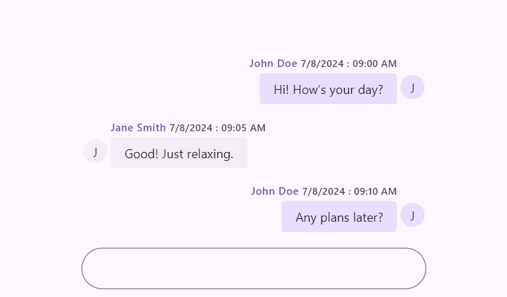
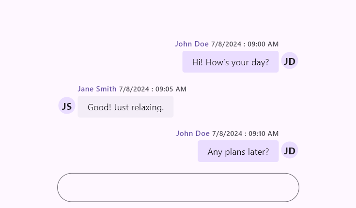
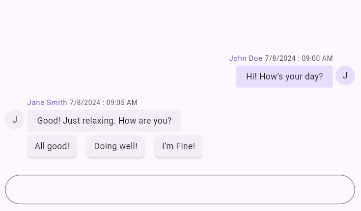
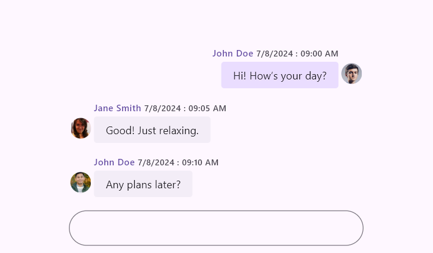
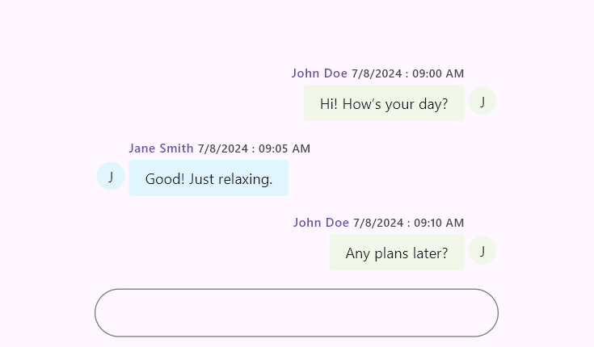

# Messages Content in Flutter Chat (SfChat)

This section explains the customization options available for incoming and outgoing messages in the chat widget.

## Messages

The [`messages`](https://pub.dev/documentation/syncfusion_flutter_chat/latest/chat/SfChat/messages.html) property is the data source of the Chat widget. It accepts a list of [`ChatMessage`](https://pub.dev/documentation/syncfusion_flutter_chat/latest/chat/ChatMessage-class.html) objects that are displayed as incoming or outgoing based on the [`outgoingUser`](https://pub.dev/documentation/syncfusion_flutter_chat/latest/chat/SfChat/outgoingUser.html) value.

Each [`ChatMessage`](https://pub.dev/documentation/syncfusion_flutter_chat/latest/chat/ChatMessage-class.html) contains:

* [`text`](https://pub.dev/documentation/syncfusion_flutter_chat/latest/chat/ChatMessage/text.html) - The actual message content.
* [`time`](https://pub.dev/documentation/syncfusion_flutter_chat/latest/chat/ChatMessage/time.html) - The time when the message was sent.
* [`author`](https://pub.dev/documentation/syncfusion_flutter_chat/latest/chat/ChatMessage/author.html) - Details about the author, such as name and avatar.




import 'package:flutter/material.dart';
import 'package:syncfusion_flutter_chat/chat.dart';

void main() {
  runApp(const MessagesExample());
}

class MessagesExample extends StatelessWidget {
  const MessagesExample({super.key});

  @override
  Widget build(BuildContext context) {
    return MaterialApp(
      home: Scaffold(
        body: SfChat(
          messages: <ChatMessage>[
            ChatMessage(
              text: 'Hi! How’s your day?',
              time: DateTime(2024, 08, 07, 9, 0),
              author: const ChatAuthor(id: '123-001', name: 'John Doe'),
            ),
            ChatMessage(
              text: 'Good! Just relaxing.',
              time: DateTime(2024, 08, 07, 9, 5),
              author: const ChatAuthor(id: '123-002', name: 'Jane Smith'),
            ),
            ChatMessage(
              text: 'Any plans later?',
              time: DateTime(2024, 08, 07, 9, 10),
              author: const ChatAuthor(id: '123-001', name: 'John Doe'),
            ),
          ],
          outgoingUser: '123-001',
        ),
      ),
    );
  }
}




You can also extend the default message model to include additional message metadata.




import 'package:flutter/material.dart';
import 'package:syncfusion_flutter_chat/chat.dart';

void main() {
  runApp(const CustomMessageExample());
}

class CustomMessageExample extends StatefulWidget {
  const CustomMessageExample({super.key});

  @override
  State<CustomMessageExample> createState() => _CustomMessageExampleState();
}

class _CustomMessageExampleState extends State<CustomMessageExample> {
  late List<ChatMessage> _messages;

  @override
  void initState() {
    super.initState();
    _messages = <ChatMessage>[
      ChatMessageExt(
        text: 'Hi! How’s your day?',
        time: DateTime(2024, 08, 07, 9, 0),
        author: const ChatAuthor(id: '123-001', name: 'John Doe'),
        displayName: 'JD',
      ),
      ChatMessageExt(
        text: 'Good! Just relaxing.',
        time: DateTime(2024, 08, 07, 9, 5),
        author: const ChatAuthor(id: '123-002', name: 'Jane Smith'),
        displayName: 'JS',
      ),
      ChatMessageExt(
        text: 'Any plans later?',
        time: DateTime(2024, 08, 07, 9, 10),
        author: const ChatAuthor(id: '123-001', name: 'John Doe'),
        displayName: 'JD',
      ),
    ];
  }

  @override
  Widget build(BuildContext context) {
    return MaterialApp(
      home: Scaffold(
        body: SfChat(
          messages: _messages,
          outgoingUser: '123-001',
          messageAvatarBuilder: (BuildContext context, int index, ChatMessage message) {
            if (message is ChatMessageExt) {
              return CircleAvatar(
                radius: 20,
                child: Text(
                  message.displayName,
                  style: const TextStyle(
                    color: Colors.black87,
                    fontWeight: FontWeight.bold,
                  ),
                ),
              );
            }
            return const SizedBox.shrink();
          },
        ),
      ),
    );
  }
}

class ChatMessageExt extends ChatMessage {
  const ChatMessageExt({
    required super.text,
    required super.time,
    required super.author,
    required this.displayName,
  });

  final String displayName;
}




## Suggestions

The [`suggestions`](https://pub.dev/documentation/syncfusion_flutter_chat/latest/chat/ChatMessage/suggestions.html) property adds quick-reply items to a message. The selected suggestion can be displayed as incoming or outgoing based on the selected user.




import 'package:flutter/material.dart';
import 'package:syncfusion_flutter_chat/chat.dart';

void main() {
  runApp(const SuggestionsExample());
}

class SuggestionsExample extends StatelessWidget {
  const SuggestionsExample({super.key});

  @override
  Widget build(BuildContext context) {
    return MaterialApp(
      home: Scaffold(
        body: SfChat(
          messages: <ChatMessage>[
            ChatMessage(
              text: 'Hi! How’s your day?',
              time: DateTime(2024, 08, 07, 9, 0),
              author: const ChatAuthor(id: '123-001', name: 'John Doe'),
            ),
            ChatMessage(
              text: 'Good! Just relaxing. How are you?',
              time: DateTime(2024, 08, 07, 9, 5),
              author: const ChatAuthor(id: '123-002', name: 'Jane Smith'),
              suggestions: <ChatMessageSuggestion>[
                const ChatMessageSuggestion(data: 'All good!'),
                const ChatMessageSuggestion(data: 'Doing well!'),
                const ChatMessageSuggestion(data: 'I\'m fine'),
              ],
            ),
          ],
          outgoingUser: '123-001',
        ),
      ),
    );
  }
}




## Outgoing user

The [`outgoingUser`](https://pub.dev/documentation/syncfusion_flutter_chat/latest/chat/SfChat/outgoingUser.html) property identifies the message sender. Set it to the [`id`](https://pub.dev/documentation/syncfusion_flutter_chat/latest/chat/ChatAuthor/id.html) of the current user.

Multiple users can share the same display name, but each `id` must be unique.




import 'package:flutter/material.dart';
import 'package:syncfusion_flutter_chat/chat.dart';

void main() {
  runApp(const OutgoingUserExample());
}

class OutgoingUserExample extends StatelessWidget {
  const OutgoingUserExample({super.key});

  @override
  Widget build(BuildContext context) {
    return MaterialApp(
      home: Scaffold(
        body: SfChat(
          messages: <ChatMessage>[
            ChatMessage(
              text: 'Hi! How’s your day?',
              time: DateTime(2024, 08, 07, 9, 0),
              author: const ChatAuthor(
                id: '123-001',
                name: 'John Doe',
                avatar: NetworkImage('https://randomuser.me/api/portraits/men/1.jpg'),
              ),
            ),
            ChatMessage(
              text: 'Good! Just relaxing.',
              time: DateTime(2024, 08, 07, 9, 5),
              author: const ChatAuthor(
                id: '123-002',
                name: 'Jane Smith',
                avatar: NetworkImage('https://randomuser.me/api/portraits/women/1.jpg'),
              ),
            ),
            ChatMessage(
              text: 'Any plans later?',
              time: DateTime(2024, 08, 07, 9, 10),
              author: const ChatAuthor(
                id: '123-003',
                name: 'John Doe',
                avatar: NetworkImage('https://randomuser.me/api/portraits/men/4.jpg'),
              ),
            ),
          ],
          outgoingUser: '123-001',
        ),
      ),
    );
  }
}




## Message builders

The conversation area supports the following builders for fully custom message layouts:

* [`messageHeaderBuilder`](https://pub.dev/documentation/syncfusion_flutter_chat/latest/chat/SfChat/messageHeaderBuilder.html)
* [`messageFooterBuilder`](https://pub.dev/documentation/syncfusion_flutter_chat/latest/chat/SfChat/messageFooterBuilder.html)
* [`messageContentBuilder`](https://pub.dev/documentation/syncfusion_flutter_chat/latest/chat/SfChat/messageContentBuilder.html)

### Message header builder

Use `messageHeaderBuilder` to customize the header region (typically author and timestamp).




import 'package:flutter/material.dart';
import 'package:syncfusion_flutter_chat/chat.dart';

void main() {
  runApp(const MessageHeaderBuilderExample());
}

class MessageHeaderBuilderExample extends StatelessWidget {
  const MessageHeaderBuilderExample({super.key});

  @override
  Widget build(BuildContext context) {
    return MaterialApp(
      home: Scaffold(
        body: SfChat(
          messages: <ChatMessage>[
            ChatMessage(
              text: 'Hello from header builder',
              time: DateTime(2024, 08, 07, 9, 0),
              author: const ChatAuthor(id: '123-001', name: 'John'),
            ),
          ],
          outgoingUser: '123-001',
          messageHeaderBuilder: (BuildContext context, int index, ChatMessage message) {
            return Padding(
              padding: const EdgeInsets.symmetric(horizontal: 12, vertical: 6),
              child: Text(
                '${message.author.name} • ${message.time.hour}:${message.time.minute.toString().padLeft(2, '0')}',
                style: Theme.of(context).textTheme.labelSmall,
              ),
            );
          },
        ),
      ),
    );
  }
}




### Message footer builder

Use `messageFooterBuilder` to add custom metadata or actions below each message.




import 'package:flutter/material.dart';
import 'package:syncfusion_flutter_chat/chat.dart';

void main() {
  runApp(const MessageFooterBuilderExample());
}

class MessageFooterBuilderExample extends StatelessWidget {
  const MessageFooterBuilderExample({super.key});

  @override
  Widget build(BuildContext context) {
    return MaterialApp(
      home: Scaffold(
        body: SfChat(
          messages: <ChatMessage>[
            ChatMessage(
              text: 'Hello from footer builder',
              time: DateTime(2024, 08, 07, 9, 0),
              author: const ChatAuthor(id: '123-001', name: 'John'),
            ),
          ],
          outgoingUser: '123-001',
          messageFooterBuilder: (BuildContext context, int index, ChatMessage message) {
            return const Padding(
              padding: EdgeInsetsDirectional.only(start: 12, end: 12, top: 4),
              child: Text(
                'Delivered',
                style: TextStyle(fontSize: 11, color: Colors.black54),
              ),
            );
          },
        ),
      ),
    );
  }
}




### Message content builder

Use `messageContentBuilder` to fully customize the message bubble content.




import 'package:flutter/material.dart';
import 'package:syncfusion_flutter_chat/chat.dart';

void main() {
  runApp(const MessageContentBuilderExample());
}

class MessageContentBuilderExample extends StatelessWidget {
  const MessageContentBuilderExample({super.key});

  @override
  Widget build(BuildContext context) {
    return MaterialApp(
      home: Scaffold(
        body: SfChat(
          messages: <ChatMessage>[
            ChatMessage(
              text: 'Hello from content builder',
              time: DateTime(2024, 08, 07, 9, 0),
              author: const ChatAuthor(id: '123-001', name: 'John'),
            ),
          ],
          outgoingUser: '123-001',
          messageContentBuilder: (BuildContext context, int index, ChatMessage message) {
            return Container(
              padding: const EdgeInsets.all(10),
              decoration: BoxDecoration(
                color: const Color(0xFFE8EAF6),
                borderRadius: BorderRadius.circular(10),
              ),
              child: Row(
                mainAxisSize: MainAxisSize.min,
                children: <Widget>[
                  const Icon(Icons.chat_bubble_outline, size: 16),
                  const SizedBox(width: 6),
                  Text(message.text),
                ],
              ),
            );
          },
        ),
      ),
    );
  }
}




## Message settings

Based on the [`outgoingUser`](https://pub.dev/documentation/syncfusion_flutter_chat/latest/chat/SfChat/outgoingUser.html) property, messages are rendered as incoming or outgoing. The following options are available to customize bubble display settings:

>Import the [`intl`](https://pub.dev/documentation/intl/latest/intl/intl-library.html) package to use [`timestampFormat`](https://pub.dev/documentation/syncfusion_flutter_chat/latest/chat/ChatMessageSettings/timestampFormat.html).

### Author name

The [`showAuthorName`](https://pub.dev/documentation/syncfusion_flutter_chat/latest/chat/ChatMessageSettings/showAuthorName.html) property shows or hides the author name. Default is `true`.

### Time stamp

The [`showTimestamp`](https://pub.dev/documentation/syncfusion_flutter_chat/latest/chat/ChatMessageSettings/showTimestamp.html) property shows or hides the timestamp. Default is `true`.

### Time stamp format

The [`timestampFormat`](https://pub.dev/documentation/syncfusion_flutter_chat/latest/chat/ChatMessageSettings/timestampFormat.html) property controls timestamp formatting. Default is `DateFormat('d/M/y : hh:mm a')`.

### Author avatar

The [`showAuthorAvatar`](https://pub.dev/documentation/syncfusion_flutter_chat/latest/chat/ChatMessageSettings/showAuthorAvatar.html) property shows or hides author avatar. Default is `true`.

The [`avatar`](https://pub.dev/documentation/syncfusion_flutter_chat/latest/chat/ChatAuthor/avatar.html) field in [`ChatAuthor`](https://pub.dev/documentation/syncfusion_flutter_chat/latest/chat/ChatAuthor-class.html) accepts an `ImageProvider`, such as `NetworkImage`, `AssetImage`, or `MemoryImage`.

### Text styles

The [`textStyle`](https://pub.dev/documentation/syncfusion_flutter_chat/latest/chat/ChatMessageSettings/textStyle.html) property defines message text style.

### Header text style

The [`headerTextStyle`](https://pub.dev/documentation/syncfusion_flutter_chat/latest/chat/ChatMessageSettings/headerTextStyle.html) property defines header text style (name and timestamp).

### Background color

The [`backgroundColor`](https://pub.dev/documentation/syncfusion_flutter_chat/latest/chat/ChatMessageSettings/backgroundColor.html) property defines bubble background color.

### Shape

The [`shape`](https://pub.dev/documentation/syncfusion_flutter_chat/latest/chat/ChatMessageSettings/shape.html) property defines bubble shape.

### Width factor

The [`widthFactor`](https://pub.dev/documentation/syncfusion_flutter_chat/latest/chat/ChatMessageSettings/widthFactor.html) property defines relative bubble width. Valid range is from `0` to `1`, and default is `0.8`.

### Avatar size

The [`avatarSize`](https://pub.dev/documentation/syncfusion_flutter_chat/latest/chat/ChatMessageSettings/avatarSize.html) property defines avatar size. Default is `Size.square(32.0)`.

### Margin

The [`margin`](https://pub.dev/documentation/syncfusion_flutter_chat/latest/chat/ChatMessageSettings/margin.html) property defines external spacing around a message bubble. Default is `EdgeInsets.all(2.0)`.

### Padding

The [`padding`](https://pub.dev/documentation/syncfusion_flutter_chat/latest/chat/ChatMessageSettings/padding.html) property defines internal spacing inside a message bubble. Default is `EdgeInsets.symmetric(horizontal: 16.0, vertical: 8.0)`.

### Avatar padding

The [`avatarPadding`](https://pub.dev/documentation/syncfusion_flutter_chat/latest/chat/ChatMessageSettings/avatarPadding.html) property defines padding around the avatar.

### Header padding

The [`headerPadding`](https://pub.dev/documentation/syncfusion_flutter_chat/latest/chat/ChatMessageSettings/headerPadding.html) property defines padding around the header (name and timestamp). Default is `EdgeInsetsDirectional.only(top: 14.0, bottom: 4.0)`.

### Footer padding

The [`footerPadding`](https://pub.dev/documentation/syncfusion_flutter_chat/latest/chat/ChatMessageSettings/footerPadding.html) property defines padding around the footer. Default is `EdgeInsetsDirectional.only(top: 4.0)`.




import 'package:flutter/material.dart';
import 'package:intl/intl.dart';
import 'package:syncfusion_flutter_chat/chat.dart';

void main() {
  runApp(const MessageSettingsExample());
}

class MessageSettingsExample extends StatelessWidget {
  const MessageSettingsExample({super.key});

  @override
  Widget build(BuildContext context) {
    return MaterialApp(
      home: Scaffold(
        body: SfChat(
          messages: <ChatMessage>[
            ChatMessage(
              text: 'Hi! How’s your day?',
              time: DateTime(2024, 08, 07, 9, 0),
              author: const ChatAuthor(
                id: '123-001',
                name: 'John Doe',
                avatar: NetworkImage('https://randomuser.me/api/portraits/men/1.jpg'),
              ),
            ),
            ChatMessage(
              text: 'Good! Just relaxing.',
              time: DateTime(2024, 08, 07, 9, 5),
              author: const ChatAuthor(
                id: '123-002',
                name: 'Jane Smith',
                avatar: NetworkImage('https://randomuser.me/api/portraits/women/1.jpg'),
              ),
            ),
          ],
          outgoingUser: '123-001',
          incomingMessageSettings: ChatMessageSettings(
            showAuthorName: true,
            showTimestamp: true,
            showAuthorAvatar: true,
            timestampFormat: DateFormat('MMM d, h:mm a'),
            textStyle: const TextStyle(fontSize: 14, color: Colors.black87),
            headerTextStyle: const TextStyle(fontSize: 11, color: Colors.black54),
            backgroundColor: const Color(0xFFE1F5FE),
            shape: const RoundedRectangleBorder(
              borderRadius: BorderRadius.all(Radius.circular(6)),
            ),
            widthFactor: 0.9,
            avatarSize: const Size.square(35),
            margin: const EdgeInsets.all(4),
            padding: const EdgeInsets.symmetric(horizontal: 18, vertical: 10),
            avatarPadding: const EdgeInsets.all(4),
            headerPadding: const EdgeInsetsDirectional.only(top: 10, bottom: 2),
            footerPadding: const EdgeInsetsDirectional.only(top: 6),
          ),
          outgoingMessageSettings: ChatMessageSettings(
            showAuthorName: true,
            showTimestamp: true,
            showAuthorAvatar: false,
            timestampFormat: DateFormat('h:mm a'),
            textStyle: const TextStyle(fontSize: 14, color: Colors.black87),
            headerTextStyle: const TextStyle(fontSize: 11, color: Colors.black54),
            backgroundColor: const Color(0xFFF1F8E9),
            shape: const RoundedRectangleBorder(
              borderRadius: BorderRadius.all(Radius.circular(10)),
            ),
            widthFactor: 0.7,
            avatarSize: const Size.square(35),
            margin: const EdgeInsets.all(4),
            padding: const EdgeInsets.symmetric(horizontal: 18, vertical: 10),
            avatarPadding: const EdgeInsets.all(4),
            headerPadding: const EdgeInsetsDirectional.only(top: 10, bottom: 2),
            footerPadding: const EdgeInsetsDirectional.only(top: 6),
          ),
        ),
      ),
    );
  }
}




>You can refer to our [Flutter Chat](https://www.syncfusion.com/flutter-widgets/flutter-chat) feature tour page for its groundbreaking feature representations. You can also explore our [Flutter Chat example](https://flutter.syncfusion.com/#/chat/getting-started) which demonstrates conversations between two or more users in a fully customizable layout and shows how to easily configure the chat with built-in support for creating stunning visual effects.

#### See Also

* You can customize message shapes and colors for both [`incomingMessageSettings`](https://pub.dev/documentation/syncfusion_flutter_chat/latest/chat/SfChat/incomingMessageSettings.html) and [`outgoingMessageSettings`](https://pub.dev/documentation/syncfusion_flutter_chat/latest/chat/SfChat/outgoingMessageSettings.html) using [`SfChatTheme`](https://pub.dev/documentation/syncfusion_flutter_core/latest/theme/SfChatTheme/SfChatTheme.html) with [`SfChat`](https://pub.dev/documentation/syncfusion_flutter_chat/latest/chat/SfChat-class.html).