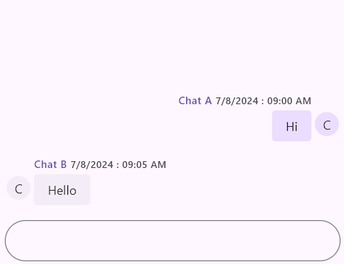
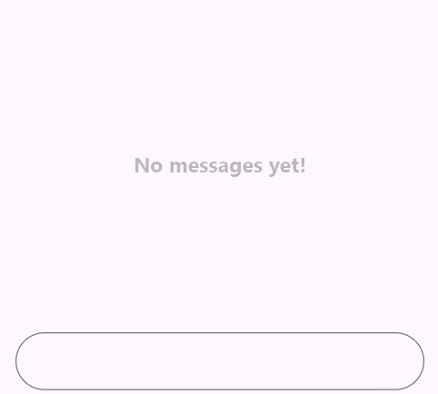
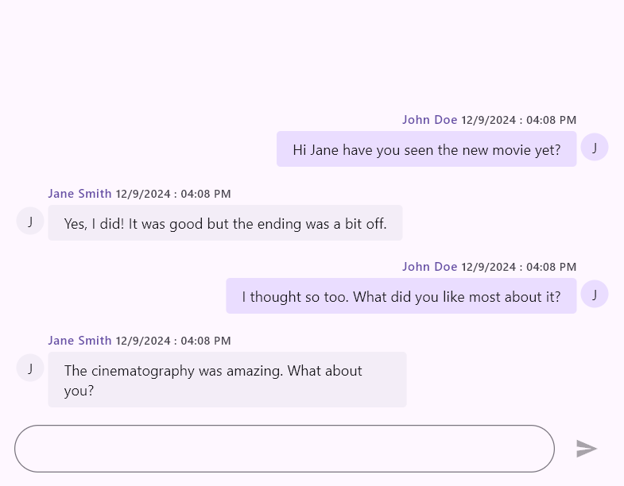
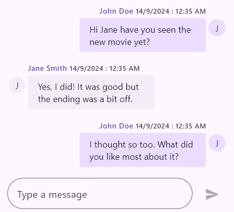

# Getting started with Flutter Chat (SfChat)
This section explains how to add the Flutter Chat widget to your application and how to use its basic features.

To get start quickly with our Flutter Chat widget, you can check on this video.

<!-- 
<iframe id='FlutterChatVideoTutorial' src='https://www.youtube.com/embed/f2ws1N6lvqo'></iframe> -->

## Add Flutter Chat to an application
Create a simple project using the instructions given in the [Getting Started with your first Flutter app](https://docs.flutter.dev/get-started/test-drive?tab=vscode#create-app) documentation.

**Add dependency**

Add the Syncfusion Flutter Chat dependency to your pubspec.yaml file.



dependencies:

syncfusion_flutter_chat: ^x.x.x



>**Note**: Here **x.x.x** denotes the current version of [`Syncfusion Flutter Chat`] package.

**Get packages** 

Run the following command to get the required packages.



$ flutter pub get



**Import package**

Import the following package in your Dart code.




import 'package:syncfusion_flutter_chat/chat.dart';




## Initialize Chat widget 

Add a chat widget with the required properties, such as messages and outgoingUser.

>**Note**: The chat interface updates based on changes to messages and outgoingUser. Ensure the widget's state is rebuilt to reflect any updates.




List<ChatMessage> _messages = []; // Load if there are existing messages.

@override
Widget build(BuildContext context) {
  return SfChat(
    messages: _messages,
    outgoingUser: _currentUser.id,
  );
}
	



## Add Placeholder

To display a placeholder message in the chat widget when there are no messages, you can use the placeholderBuilder property. This property allows you to specify a custom widget that will be shown when the messages list is empty.




List<ChatMessage> _messages = <ChatMessage>[]; // Load if there are existing messages.

@override
Widget build(BuildContext context) {
  return SfChat(
    messages: _messages,
    outgoingUser: _currentUser.id,
    placeholderBuilder: (BuildContext context) {
      return Center(
        child: Text(
          'No messages yet!',
          style: TextStyle(fontSize: 16, color: Colors.black),
        ),
      );
    },
  );
}




## Add Action Button

By default, the chat widget does not rebuild itself when the send button is clicked. Therefore, it is necessary to create a new message object using the newly composed message passed as a parameter in the `onPressed` callback of the `ChatActionButton`, and then rebuild the widget using the `setState` function.




List<ChatMessage> _messages = <ChatMessage>[]; // Load if there are existing messages.

@override
Widget build(BuildContext context) {
  return SfChat(
    messages: _messages,
    outgoingUser: _currentUser.id,
    actionButton: ChatActionButton(
      onPressed: (String newMessage) {
        setState(() {
          _messages.add(ChatMessage(
            text: newMessage,
            time: DateTime.now(),
            author: _currentUser,
          ));
        });
      },
    ),
  );
}




## Add Placeholder to Composer

To add a placeholder to the ChatComposer in the chat widget, configure the composer property with a ChatComposer widget that includes an InputDecoration with a hintText. This will display a placeholder text inside the message input field.




List<ChatMessage> _messages = <ChatMessage>[]; // Load if there are existing messages.

@override
Widget build(BuildContext context) {
  return SfChat(
    messages: _messages,
    outgoingUser: _currentUser.id,
    composer: const ChatComposer(
      decoration: InputDecoration(
        hintText: 'Message',
      ),
    ),
    actionButton: ChatActionButton(
      onPressed: (String newMessage) {
        // Handle the send button click action.
      },
    ),
  );
}




