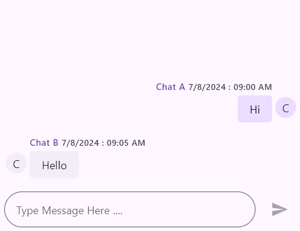
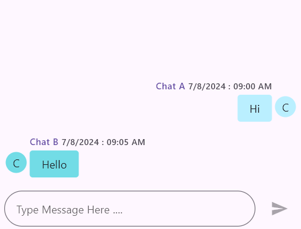

# Getting started with Flutter Chat (Chat)
This section explains the steps required to add the chat widget and its elements such as message display, user profiles, message bubbles, and customization options. This section covers only the basic features needed to get started with the Syncfusion chat widget.

To get start quickly with our Flutter Chat widget, you can check on this video.

<!-- 
<iframe id='FlutterChatVideoTutorial' src='https://www.youtube.com/embed/f2ws1N6lvqo'></iframe> -->

## Add Flutter chat to an application
Create a simple project using the instructions given in the [Getting Started with your first Flutter app](https://docs.flutter.dev/get-started/test-drive?tab=vscode#create-app) documentation.

**Add dependency**

Add the Syncfusion Flutter chat dependency to your pubspec.yaml file.



dependencies:

syncfusion_flutter_chat: ^xx.x.xx



N> Here **xx.x.xx** denotes the current version of [`Syncfusion Flutter Chat`] package.

**Get packages** 

Run the following command to get the required packages.



$ flutter pub get



**Import package**

Import the following package in your Dart code.




import 'package:syncfusion_flutter_chat/chat.dart';




## Initialize chat

After importing the package, initialize the Chat widget as a child of any widget, such as Center. In the initState method, ensure the messages property is set with a list of ChatMessage objects and the outgoingUser is provided with the ID of the current user. This setup ensures proper message display and user differentiation in the chat interface.

N> The Chat widget updates its display based on the messages list and outgoingUser properties. Changes to the messages list or outgoingUser will not be reflected until the widget's state is rebuilt with the updated data.




late List<ChatMessage> _messages;

@override
void initState() {
  _messages = <ChatMessage>[
    ChatMessage(
      text: 'Hi',
      time: DateTime(2024, 08, 07, 9, 0),
      author: ChatAuthor(
        id: '123-001',
        name: 'Chat A',
      ),
    ),
    ChatMessage(
      text: 'Hello',
      time: DateTime(2024, 08, 07, 9, 5),
      author: ChatAuthor(
        id: '123-002',
        name: 'Chat B',
      ),
    ),
  ];
  super.initState();
}

@override
Widget build(BuildContext context) {
  return MaterialApp(
    home: Scaffold(
      body: Center(
        child: SfChat(
          messages: _messages,
          outgoingUser: '123-001',
        ),
      ),
    ),
  );
}
	



### Set composer and action Button

To customize the SfChat widget with a composer and an action button, you can use the composer and actionButton properties. The composer property allows you to define a widget that will serve as the text input area where users can type their messages. The actionButton property lets you specify a button widget that users can press to send the composed message.




late List<ChatMessage> _messages;

@override
void initState() {
  _messages = <ChatMessage>[
    ChatMessage(
      text: 'Hi',
      time: DateTime(2024, 08, 07, 9, 0),
      author: ChatAuthor(
        id: '123-001',
        name: 'Chat A',
      ),
    ),
    ChatMessage(
      text: 'Hello',
      time: DateTime(2024, 08, 07, 9, 5),
      author: ChatAuthor(
        id: '123-002',
        name: 'Chat B',
      ),
    ),
  ];
  super.initState();
}

@override
Widget build(BuildContext context) {
  return MaterialApp(
    home: Scaffold(
      body: Center(
        child: SfChat(
          messages: _messages,
          outgoingUser: '123-001',
          composer: ChatComposer(
            minLines: 1,
            maxLines: 6,
            decoration: InputDecoration(
              hintText: 'Type Message Here ....'
            ),
            padding: EdgeInsets.only(top: 16.0),
          ),
          actionButton: ChatActionButton(
            onPressed: (String newMessage) {
              setState(() {
                _messages.add(
                  ChatMessage(
                    text: newMessage,
                    time: DateTime.now(),
                    author: ChatAuthor(
                      id: '123-001',
                      name: 'Chat A',
                    ),
                  ),
                );
              });
            },
          ),
        ),
      ),
    ),
  );
}




### Set Incoming and Outgoing chat bubble settings

To customize the appearance of chat bubbles in the SfChat widget, you can use the incomingBubbleSettings and outgoingBubbleSettings properties.
The `[incomingBubbleSettings]` property allows you to customize the appearance of incoming chat bubbles, including the display of the sender's username, timestamp, avatar, and various padding options. The [`outgoingBubbleSettings`] property allows you to customize the appearance of outgoing chat bubbles, including the display of the sender's username, timestamp, avatar, and various padding options.




late List<ChatMessage> _messages;

@override
void initState() {
  _messages = <ChatMessage>[
    ChatMessage(
      text: 'Hi',
      time: DateTime(2024, 08, 07, 9, 0),
      author: ChatAuthor(
        id: '123-001',
        name: 'Chat A',
      ),
    ),
    ChatMessage(
      text: 'Hello',
      time: DateTime(2024, 08, 07, 9, 5),
      author: ChatAuthor(
        id: '123-002',
        name: 'Chat B',
      ),
    ),
  ];
  super.initState();
}

@override
Widget build(BuildContext context) {
  return MaterialApp(
    home: Scaffold(
      body: Center(
        child: SfChat(
          messages: _messages,
          outgoingUser: '123-001',
          composer: ChatComposer(
            minLines: 1,
            maxLines: 6,
            decoration: InputDecoration(hintText: 'Type Message Here ....'),
            padding: EdgeInsets.only(top: 16.0),
          ),
          actionButton: ChatActionButton(
            onPressed: (String newMessage) {
              setState(() {
                _messages.add(
                  ChatMessage(
                    text: newMessage,
                    time: DateTime.now(),
                    author: ChatAuthor(
                      id: '123-001',
                      name: 'Chat A',
                    ),
                  ),
                );
              });
            },
          ),
          incomingBubbleSettings: ChatBubbleSettings(
            showUserName: true,
            showTimestamp: true,
            showUserAvatar: true,
            widthFactor: 0.8,
            avatarSize: const Size.square(32.0),
            padding: const EdgeInsets.all(2.0),
            contentPadding:
                const EdgeInsets.symmetric(horizontal: 16.0, vertical: 8.0),
            headerPadding:
                const EdgeInsetsDirectional.only(top: 14.0, bottom: 4.0),
            footerPadding: const EdgeInsetsDirectional.only(top: 4.0),
          ),
          outgoingBubbleSettings: ChatBubbleSettings(
            showUserName: true,
            showTimestamp: true,
            showUserAvatar: true,
            widthFactor: 0.8,
            avatarSize: const Size.square(32.0),
            padding: const EdgeInsets.all(2.0),
            contentPadding:
                const EdgeInsets.symmetric(horizontal: 16.0, vertical: 8.0),
            headerPadding:
                const EdgeInsetsDirectional.only(top: 14.0, bottom: 4.0),
            footerPadding: const EdgeInsetsDirectional.only(top: 4.0),
          ),
        ),
      ),
    ),
  );
}




