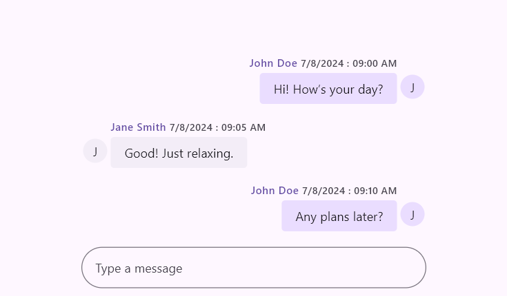
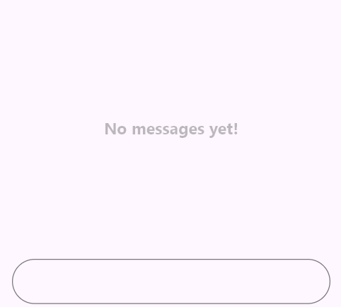
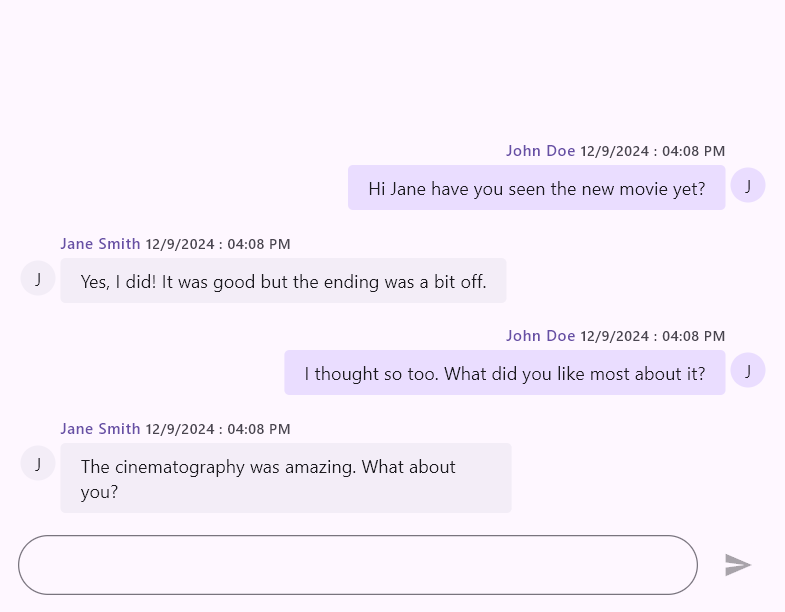

# Getting started with Flutter Chat (SfChat)

This section explains how to add the Flutter Chat widget to a single Flutter application and how to use its basic features.

## Add Flutter Chat to an application

Create a simple Flutter project by following the instructions provided in the [Getting Started with your first Flutter app](https://docs.flutter.dev/get-started/test-drive#choose-your-ide) documentation.

**Add dependency**

Add the [`Syncfusion Flutter Chat`](https://pub.dev/packages/syncfusion_flutter_chat/versions) dependency to your pubspec.yaml file.




dependencies:
  syncfusion_flutter_chat: ^x.x.x
  syncfusion_flutter_core: ^x.x.x




>Here **x.x.x** denotes the current version of [`Syncfusion Flutter Chat`](https://pub.dev/packages/syncfusion_flutter_chat/versions) and [`syncfusion_flutter_core`](https://pub.dev/packages/syncfusion_flutter_core/versions). It is recommended to use the latest available version from pub.dev for the best features and updates.

>**Note:** `syncfusion_flutter_chat` depends on `syncfusion_flutter_core`. Add both dependencies in your application.

**Get packages**

Run the following command to get the required packages.




flutter pub get




**Import the Chat library**

Import the library using the code provided below.




import 'package:syncfusion_flutter_chat/chat.dart';




## Initialize chat widget

Add a chat widget with the necessary properties, such as [`messages`](https://pub.dev/documentation/syncfusion_flutter_chat/latest/chat/SfChat/messages.html) and [`outgoingUser`](https://pub.dev/documentation/syncfusion_flutter_chat/latest/chat/SfChat/outgoingUser.html).




import 'package:flutter/material.dart';
import 'package:syncfusion_flutter_chat/chat.dart';

void main() {
  runApp(const ChatInitializeExample());
}

class ChatInitializeExample extends StatelessWidget {
  const ChatInitializeExample({super.key});

  @override
  Widget build(BuildContext context) {
    return MaterialApp(
      home: Scaffold(
        body: SfChat(
          messages: <ChatMessage>[
            ChatMessage(
              text: 'Hi! How’s your day?',
              time: DateTime(2024, 08, 07, 9, 0),
              author: const ChatAuthor(
                id: '123-001',
                name: 'John Doe',
              ),
            ),
            ChatMessage(
              text: 'Good! Just relaxing.',
              time: DateTime(2024, 08, 07, 9, 5),
              author: const ChatAuthor(
                id: '123-002',
                name: 'Jane Smith',
              ),
            ),
            ChatMessage(
              text: 'Any plans later?',
              time: DateTime(2024, 08, 07, 9, 10),
              author: const ChatAuthor(
                id: '123-001',
                name: 'John Doe',
              ),
            ),
          ],
          outgoingUser: '123-001',
        ),
      ),
    );
  }
}




## Add composer

To add the [`ChatComposer`](https://pub.dev/documentation/syncfusion_flutter_chat/latest/chat/ChatComposer-class.html) to the SfChat widget, use the [`composer`](https://pub.dev/documentation/syncfusion_flutter_chat/latest/chat/SfChat/composer.html) property. The composer can be customized using the [`decoration`](https://pub.dev/documentation/syncfusion_flutter_chat/latest/chat/ChatComposer/decoration.html) property, which is of type [`InputDecoration`](https://api.flutter.dev/flutter/material/InputDecoration-class.html). The hint text can be added using the [`hintText`](https://api.flutter.dev/flutter/material/InputDecoration/hintText.html) property.




import 'package:flutter/material.dart';
import 'package:syncfusion_flutter_chat/chat.dart';

void main() {
  runApp(const ChatComposerExample());
}

class ChatComposerExample extends StatelessWidget {
  const ChatComposerExample({super.key});

  @override
  Widget build(BuildContext context) {
    return MaterialApp(
      home: Scaffold(
        body: SfChat(
          messages: <ChatMessage>[
            ChatMessage(
              text: 'Hi! How’s your day?',
              time: DateTime(2024, 08, 07, 9, 0),
              author: const ChatAuthor(
                id: '123-001',
                name: 'John Doe',
              ),
            ),
            ChatMessage(
              text: 'Good! Just relaxing.',
              time: DateTime(2024, 08, 07, 9, 5),
              author: const ChatAuthor(
                id: '123-002',
                name: 'Jane Smith',
              ),
            ),
            ChatMessage(
              text: 'Any plans later?',
              time: DateTime(2024, 08, 07, 9, 10),
              author: const ChatAuthor(
                id: '123-001',
                name: 'John Doe',
              ),
            )
          ],
          outgoingUser: '123-001',
          composer: const ChatComposer(
            decoration: InputDecoration(
              hintText: 'Type a message',
            ),
          ),
        ),
      ),
    );
  }
}




## Add placeholder to conversation area

By default, conversation messages are empty. It is a good idea to show a message or design to indicate this state. You can use the [`placeholderBuilder`](https://pub.dev/documentation/syncfusion_flutter_chat/latest/chat/SfChat/placeholderBuilder.html) property to create a custom widget in the conversation area. It will be removed once messages are added.




import 'package:flutter/material.dart';
import 'package:syncfusion_flutter_chat/chat.dart';

void main() {
  runApp(const ChatPlaceholderExample());
}

class ChatPlaceholderExample extends StatelessWidget {
  const ChatPlaceholderExample({super.key});

  final List<ChatMessage> _messages = const <ChatMessage>[];

  @override
  Widget build(BuildContext context) {
    return MaterialApp(
      home: Scaffold(
        body: SfChat(
          messages: _messages,
          outgoingUser: '123-001',
          placeholderBuilder: (BuildContext context) {
            return const Center(
              child: Text(
                'No messages yet!',
                style: TextStyle(
                  fontSize: 18,
                  color: Colors.black54,
                  fontWeight: FontWeight.bold,
                ),
              ),
            );
          },
        ),
      ),
    );
  }
}




## Add action button

The action button represents the send button, which is not included by default. To add it, create an instance of [`ChatActionButton`](https://pub.dev/documentation/syncfusion_flutter_chat/latest/chat/ChatActionButton-class.html) for the [`actionButton`](https://pub.dev/documentation/syncfusion_flutter_chat/latest/chat/SfChat/actionButton.html) property.

When the send button is clicked, the [`ChatActionButton.onPressed`](https://pub.dev/documentation/syncfusion_flutter_chat/latest/chat/ChatActionButton/onPressed.html) callback is invoked. In that callback, add the newly composed message to the messages list and rebuild the chat widget.




import 'package:flutter/material.dart';
import 'package:syncfusion_flutter_chat/chat.dart';

void main() {
  runApp(const ChatActionButtonExample());
}

class ChatActionButtonExample extends StatefulWidget {
  const ChatActionButtonExample({super.key});

  @override
  State<ChatActionButtonExample> createState() => _ChatActionButtonExampleState();
}

class _ChatActionButtonExampleState extends State<ChatActionButtonExample> {
  late List<ChatMessage> _messages;

  @override
  void initState() {
    super.initState();
    _messages = <ChatMessage>[
      ChatMessage(
        text: 'Hi! How’s your day?',
        time: DateTime(2024, 08, 07, 9, 0),
        author: const ChatAuthor(
          id: '123-001',
          name: 'John Doe',
        ),
      ),
      ChatMessage(
        text: 'Good! Just relaxing.',
        time: DateTime(2024, 08, 07, 9, 5),
        author: const ChatAuthor(
          id: '123-002',
          name: 'Jane Smith',
        ),
      ),
      ChatMessage(
        text: 'Any plans later?',
        time: DateTime(2024, 08, 07, 9, 10),
        author: const ChatAuthor(
          id: '123-001',
          name: 'John Doe',
        ),
      ),
    ];
  }

  @override
  Widget build(BuildContext context) {
    return MaterialApp(
      home: Scaffold(
        body: SfChat(
          messages: _messages,
          outgoingUser: '123-001',
          actionButton: ChatActionButton(
            onPressed: (String newMessage) {
              setState(() {
                _messages = <ChatMessage>[
                  ..._messages,
                  ChatMessage(
                    text: newMessage,
                    time: DateTime.now(),
                    author: const ChatAuthor(
                      id: '123-001',
                      name: 'John Doe',
                    ),
                  ),
                ];
              });
            },
          ),
        ),
      ),
    );
  }
}




>You can refer to our [Flutter Chat](https://www.syncfusion.com/flutter-widgets/flutter-chat) feature tour page for its groundbreaking feature representations. You can also explore our [Flutter Chat example](https://flutter.syncfusion.com/#/chat/getting-started) which demonstrates conversations between two or more users in a fully customizable layout and shows how to easily configure the chat with built-in support for creating stunning visual effects.