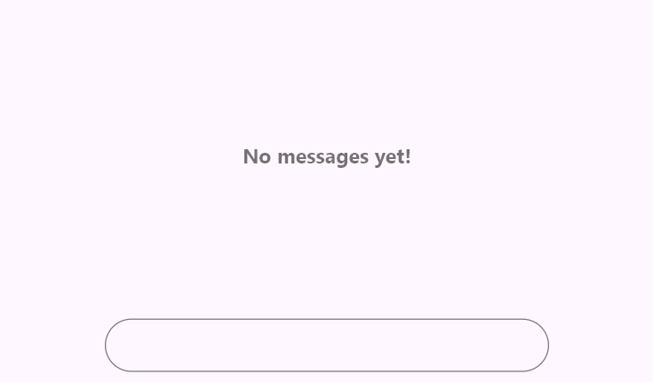

# Getting started with Flutter Chat (SfChat)

This section explains how to add the Flutter Chat widget to a single Flutter application and how to use its basic features.

## Add Flutter Chat to an application

Create a simple Flutter project by following the instructions provided in the [Getting Started with your first Flutter app](https://docs.flutter.dev/get-started/test-drive?tab=vscode#create-app) documentation.

**Add dependency**

Add the [`Syncfusion Flutter Chat`](https://pub.dev/packages/syncfusion_flutter_charts/versions) dependency to your pubspec.yaml file.


 

    dependencies:
      syncfusion_flutter_chat: ^x.x.x




>**Note**: Here **x.x.x** denotes the current version of [`Syncfusion Flutter Chat`](https://pub.dev/packages/syncfusion_flutter_charts/versions) package. It is recommended to use the latest available version from pub.dev for the best features and updates.

**Get packages** 

Run the following command to get the required packages.


 

    flutter pub get




**Import the Chat library**

Import the library using the code provided below.




    import 'package:syncfusion_flutter_chat/chat.dart';




## Initialize Chat widget

Add a chat widget with the necessary properties, such as [`messages`] and [`outgoingUser`].




// Load if there are existing messages.
final List<ChatMessage> _messages = <ChatMessage>[];

@override
Widget build(BuildContext context) {
  return Scaffold(
    body: SfChat(
      messages: _messages,
      outgoingUser: '123-001',
    ),
  );
}
	



## Add placeholder to composer

To add a placeholder to the [`ChatComposer`], use the [`decoration`] property, which is of type InputDecoration. The placeholder can be added using the [`hintText`] property.




// Load if there are existing messages.
final List<ChatMessage> _messages = <ChatMessage>[];

@override
Widget build(BuildContext context) {
  return Scaffold(
    body: SfChat(
      messages: _messages,
      outgoingUser: '123-001',
      composer: const ChatComposer(
        decoration: InputDecoration(
          hintText: 'Type a message',
        ),
      ),
      actionButton: ChatActionButton(
        onPressed: (String newMessage) {
          // Handle the send button click action here.
        },
      ),
    ),
  );
}




## Add placeholder to conversation area

By default, conversation messages are empty. It’s a good idea to show a message or design to indicate this. You can use the [`placeholderBuilder`] property to create a custom widget that appears in the conversation area, which can be removed once messages start coming in.




// Load if there are existing messages.
final List<ChatMessage> _messages = <ChatMessage>[];

@override
Widget build(BuildContext context) {
  return Scaffold(
    body: SfChat(
      messages: _messages,
      outgoingUser: '123-001',
      placeholderBuilder: (BuildContext context) {
        return const Center(
          child: Text(
            'No messages yet!',
            style: TextStyle(fontSize: 16, color: Colors.black),
          ),
        );
      },
    ),
  );
}




## Add action button

It represents the send button, which was not included by default. To add it, create an instance of [`ChatActionButton`] for the actionButton.

When the send button is clicked, the [`ChatActionButton.onPressed`] callback is invoked, which rebuilds the chat widget with the newly composed message.




// Load if there are existing messages.
final List<ChatMessage> _messages = <ChatMessage>[];

@override
Widget build(BuildContext context) {
  return Scaffold(
    body: SfChat(
      messages: _messages,
      outgoingUser: '123-001',
      actionButton: ChatActionButton(
        onPressed: (String newMessage) {
          setState(() {
            _messages.add(
              ChatMessage(
                text: newMessage,
                time: DateTime.now(),
                author: ChatAuthor(
                  id: '123-001',
                  name: 'John Doe',
                ),
              ),
            );
          });
        },
      ),
    ),
  );
}




>**Note**: You can refer to our [Flutter Chat](https://www.syncfusion.com/flutter-widgets/flutter-chat) feature tour page for its groundbreaking feature representations. You can also explore our [Flutter Chat example](https://flutter.syncfusion.com/#/chat) which demonstrates conversations between two or more users in a fully customizable layout and shows how to easily configure the chat with built-in support for creating stunning visual effects.