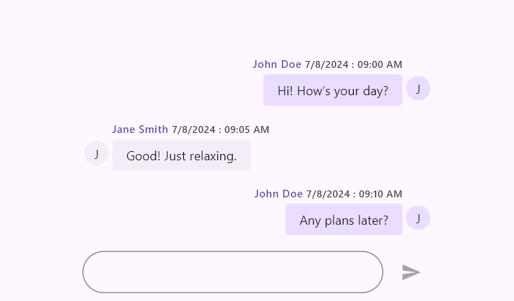

# Getting started with Flutter Chat (SfChat)

This section explains how to add the Flutter Chat widget to your application and how to use its basic features.

To get start quickly with our Flutter Chat widget, you can check on this video.

<!-- 
<iframe id='FlutterChatVideoTutorial' src='https://www.youtube.com/embed/f2ws1N6lvqo'></iframe> -->

## Add Flutter Chat to an application

Create a simple project using the instructions given in the [Getting Started with your first Flutter app](https://docs.flutter.dev/get-started/test-drive?tab=vscode#create-app) documentation.

**Add dependency**

Add the Syncfusion Flutter Chat dependency to your pubspec.yaml file.


 

    dependencies:

    syncfusion_flutter_chat: ^xx.x.xx




>**Note**: Here **x.x.x** denotes the current version of [`Syncfusion Flutter Chat`](https://pub.dev/packages/syncfusion_flutter_chat/versions) package.

**Get packages** 

Run the following command to get the required packages.


 

    $ flutter pub get




**Import package**

Import the following package in your Dart code.


 

    import 'package:syncfusion_flutter_chat/chat.dart';




## Initialize Chat widget 

Once the package has been imported, add a chat widget with the required properties, such as messages and outgoingUser.

>**Note**: The chat interface updates based on changes to messages and outgoingUser. Ensure the widget's state is rebuilt to reflect any updates.




// Load if there are existing messages.
List<ChatMessage> _messages = <ChatMessage>[];
final String _outgoingUserId = '';

@override
Widget build(BuildContext context) {
  return SfChat(
    messages: _messages,
    outgoingUser: _outgoingUserId,
  );
}
	



## Add Placeholder

To display a placeholder message in the chat widget when there are no messages, you can use the placeholderBuilder property. This property allows you to specify a custom widget that will be shown when the messages list is empty.




  // Load if there are existing messages.
  final List<ChatMessage> _messages = <ChatMessage>[];
  final String _outgoingUserId = '';

  @override
  Widget build(BuildContext context) {
    return Scaffold(
      body: SfChat(
        messages: _messages,
        outgoingUser: _outgoingUserId,
        placeholderBuilder: (BuildContext context) {
          return const Center(
            child: Text(
              'No messages yet!',
              style: TextStyle(fontSize: 16, color: Colors.black),
            ),
          );
        },
      ),
    );
  }




## Enable Action Button

By default, the chat widget does not rebuild itself when the send button is clicked. Therefore, it is necessary to create a new message object using the newly composed message passed as a parameter in the `onPressed` callback of the `ChatActionButton`, and then rebuild the widget using the `setState` function.




  // Load if there are existing messages.
  final List<ChatMessage> _messages = <ChatMessage>[];
  final String _outgoingUserId = '';

  @override
  Widget build(BuildContext context) {
    return Scaffold(
      appBar: AppBar(
        title: const Text('Chat App'),
      ),
      body: SfChat(
        messages: _messages,
        outgoingUser: _outgoingUserId,
        actionButton: ChatActionButton(
          onPressed: (String newMessage) {
            // Handle the send button click action.
          },
        ),
      ),
    );
  }




## Enable Composer

To add a placeholder to the ChatComposer in the chat widget, configure the composer property with a ChatComposer widget that includes an InputDecoration with a hintText. This will display a placeholder text inside the message input field.




  // Load if there are existing messages.
  final List<ChatMessage> _messages = <ChatMessage>[];
  final String _outgoingUserId = '';

  @override
  Widget build(BuildContext context) {
    return Scaffold(
      appBar: AppBar(
        title: const Text('Chat App'),
      ),
      body: SfChat(
        messages: _messages,
        outgoingUser: _outgoingUserId,
        composer: const ChatComposer(
          decoration: InputDecoration(
            hintText: 'Message',
          ),
        ),
        actionButton: ChatActionButton(
          onPressed: (String newMessage) {
            // Handle the send button click action.
          },
        ),
      ),
    );
  }




>**Note**: You can refer to our [Flutter Chat](https://www.syncfusion.com/flutter-widgets/flutter-chat) feature tour page for its groundbreaking feature representations. You can also explore our [Flutter Chat example](https://flutter.syncfusion.com/#/chat) which demonstrates conversations between two or more users in a fully customizable layout and shows how to easily configure the chat with built-in support for creating stunning visual effects.

#### See Also

* [Integrating syncfusion flutter chat in a flutter web application](https://support.syncfusion.com/kb/article/9941/how-to-integrate-syncfusion-chat-in-flutter).