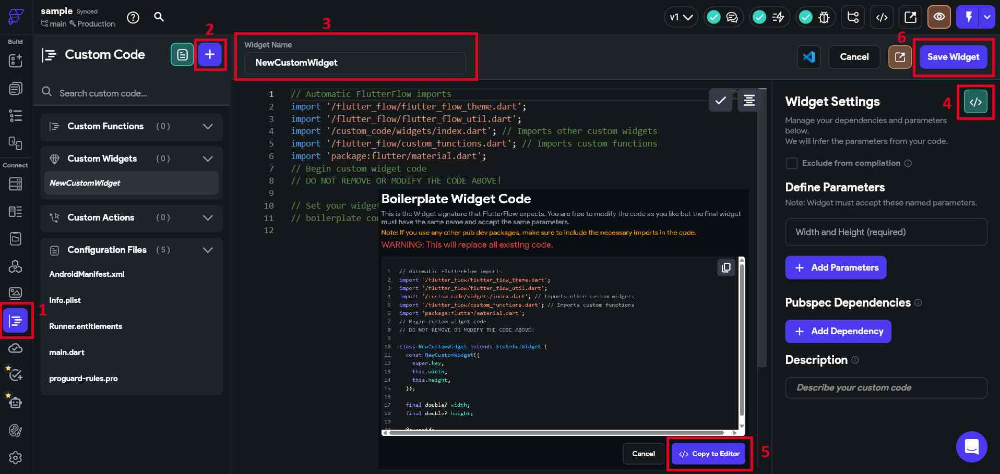
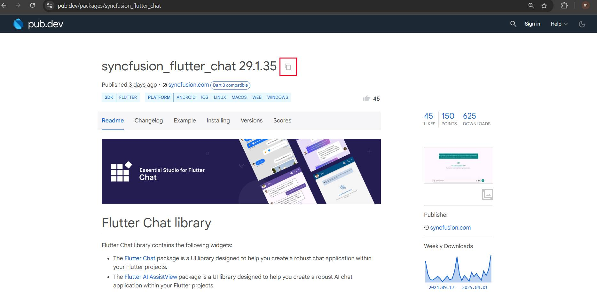
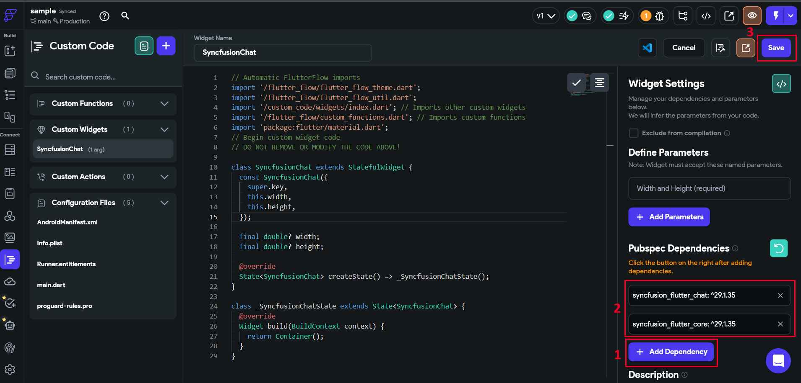
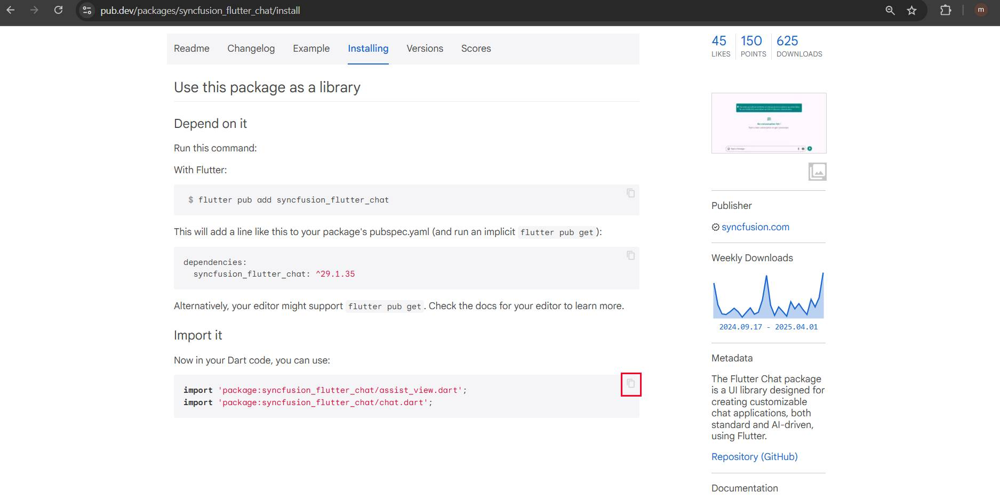
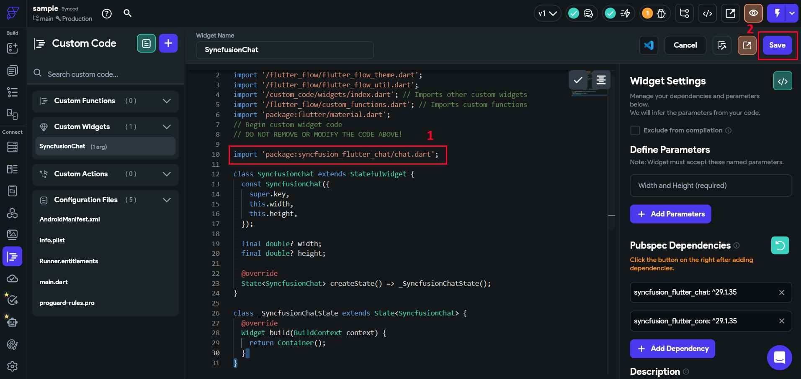
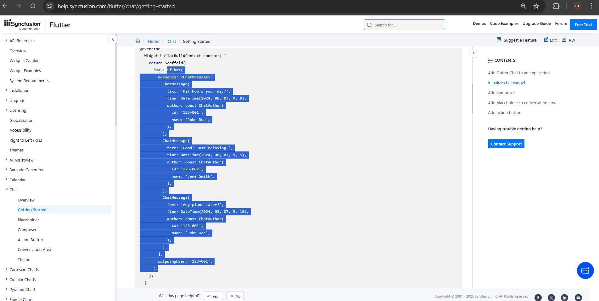
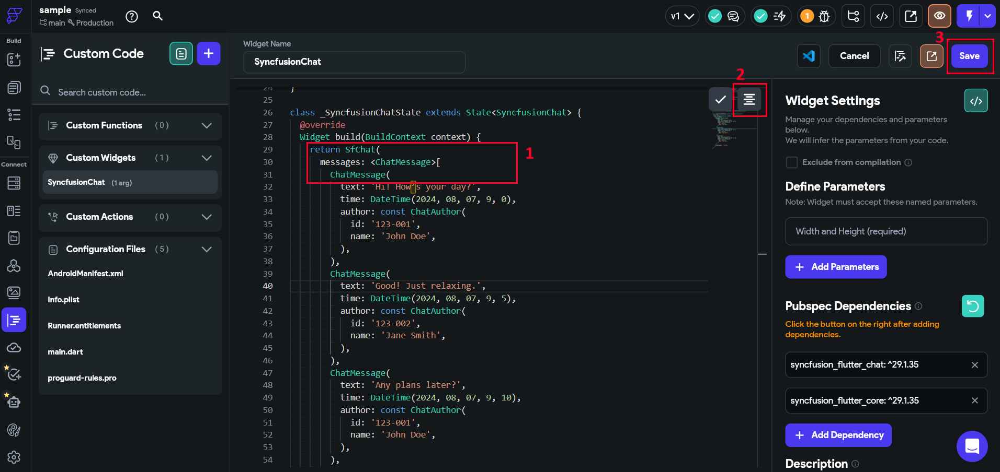
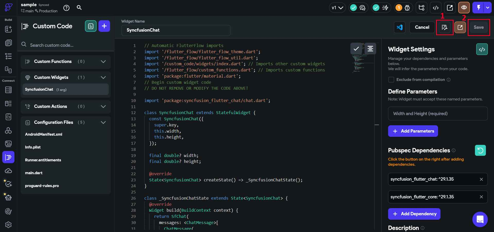
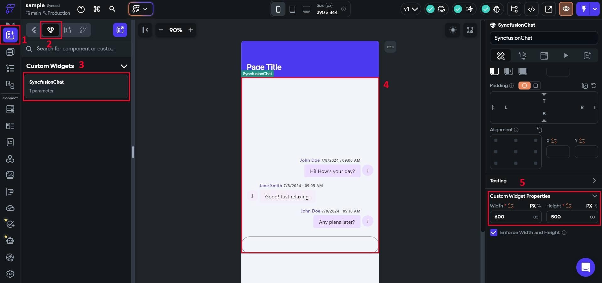

# How to add Syncfusion&reg; Chat widget in FlutterFlow?

## Overview

[FlutterFlow](https://app.flutterflow.io/dashboard) enables you to create native applications using its graphical interface, reducing the need to write extensive code. It also offers the capability to include custom widgets that aren't part of the default [FlutterFlow](https://app.flutterflow.io/dashboard) widget collection. This article explains how to incorporate our SfChat widget as a custom widget in [FlutterFlow](https://app.flutterflow.io/dashboard).

### Create a new project

Navigate to the [FlutterFlow dashboard](https://app.flutterflow.io/dashboard) and click the `+ Create New` button to create a new project.

### Creating the custom widget

1. Navigate to the `Custom Code` section in the left side navigation menu.
2. Click on the `+ Add` button to open a dropdown menu, then select `Widget`.
3. Update the widget name as desired.
4. Click the `View Boilerplate Code` button on the right side.
5. A popup will appear with boilerplate code; locate the button labeled `</> Copy to Editor` and click it.
6. Save the widget.

### Add Chat widget as a dependency

1. Click on `+ Add Dependency`, and a text editor will appear.
2. Navigate to [Syncfusion&reg; Flutter Chat](https://pub.dev/packages/syncfusion_flutter_chat) in [pub.dev](https://pub.dev/) and copy the dependency name and version using the `Copy to Clipboard` option.

3. Paste the copied dependency into the text editor, then click `Refresh` and `Save` it.

>**Note**: The current version of [Syncfusion&reg; Flutter Chat](https://pub.dev/packages/syncfusion_flutter_chat) targets the latest Flutter SDK. To ensure compatibility, check [FlutterFlow](https://app.flutterflow.io/dashboard)'s current Flutter version and choose the matching package version using [SDK compatibility](https://help.syncfusion.com/flutter/system-requirements#sdk-version-compatibility).

>**Note**: If you are using an older version of a dependency instead of the latest one, remove the caret symbol (^) prefix in the version number after pasting the dependency. For example, change `^21.3.0` to `21.3.0`.

>**Note**: Since [Syncfusion&reg; Flutter Chat](https://pub.dev/packages/syncfusion_flutter_chat) depends on [Syncfusion&reg; Flutter Core](https://pub.dev/packages/syncfusion_flutter_core), add both packages as dependencies.

### Import the package

1. Navigate to the `Installing` tab on the [Syncfusion&reg; Flutter Chat](https://pub.dev/packages/syncfusion_flutter_chat) page. Under the `Import it` section, copy the package import statement.

2. Paste the copied import statement into the code editor and then `Save` it.

### Add widget code snippet in code editor

1. Navigate to the [Example](https://pub.dev/packages/syncfusion_flutter_chat/example) tab in [Syncfusion&reg; Flutter Chat](https://pub.dev/packages/syncfusion_flutter_chat) and copy the widget-specific code sample.

2. Paste the copied code sample into the code editor, click `Format Code`, and `Save` it.

### Compiling the codes

1. Click the 'Compile Code' button located in the top right corner.
2. If there are no errors, save the process. If errors are present, fix them and compile the code again. Once the code has been successfully compiled, save the process.

>**Note**: The compilation progress takes 2 to 3 minutes to complete.

### Troubleshooting compile issues

If compilation fails, check the following:

1. Verify that both `syncfusion_flutter_chat` and `syncfusion_flutter_core` are added.
2. Ensure imports are correct and do not contain duplicate/conflicting package names.
3. If your sample uses date formatting, add the `intl` package dependency.
4. Match dependency versions with FlutterFlow's Flutter SDK version.
5. Re-run `Compile Code` after each fix to validate incrementally.

### Utilizing the custom widget

1. Navigate to `Widget Palette` located in the left side navigation menu.
2. Click on the `Components` tab.
3. Your custom widget will appear under `Custom Code Widgets`. Drag and drop the custom widget to your page.
4. Bind your custom widget inputs to FlutterFlow data sources (for example, pass a messages list, current user ID, and callbacks as widget parameters).

The screenshot above shows the custom widget added to a page layout. Use this placement to preview your chat with sample content.