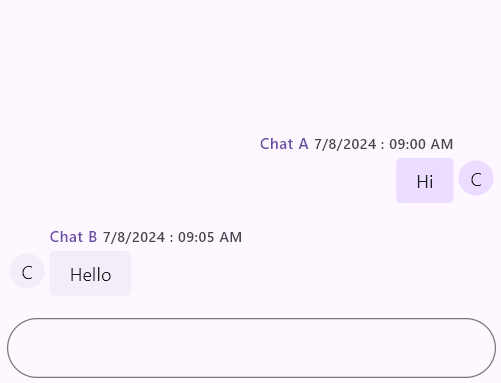

# Messages and User Support in Flutter Chat (SfChat)
This section explains how to integrate and customize the Messages and User Support in the SfChat widget. You can use the following properties to customize the composer.

## Messages (ChatMessage)

* [`text`] - Used to define the text content of the chat message.
* [`time`] - Used to specify the timestamp of when the message was sent, typically represented as a DateTime object.
* [`author`] - Used to specify the author of the message, represented by a ChatAuthor object which includes details about the message sender.

## User Support (ChatAuthor)

* [`id`] - Used to uniquely identify the author of the message. This is a required field for distinguishing between different users.
* [`name`] - Used to specify the name of the author of the message. This helps in displaying the author's name in the chat interface.




@override
Widget build(BuildContext context) {
  return MaterialApp(
    home: Scaffold(
      body: Center(
        child: SfChat(
          messages: <ChatMessage>[
            ChatMessage(
              text: 'Hi',
              time: DateTime(2024, 08, 07, 9, 0),
              author: ChatAuthor(
                id: '123-001',
                name: 'Chat A',
                avatar: NetworkImage('https://randomuser.me/api/portraits/men/1.jpg'),
              ),
            ),
            ChatMessage(
              text: 'Hello',
              time: DateTime(2024, 08, 07, 9, 5),
              author: ChatAuthor(
                id: '123-002',
                name: 'Chat B',
                avatar: NetworkImage('https://randomuser.me/api/portraits/women/1.jpg'),
              ),
            ),
          ],
          outgoingUser: '123-001',
        ),
      ),
    ),
  );
}




