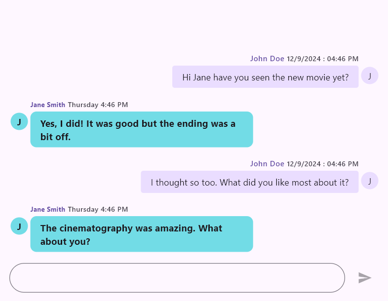
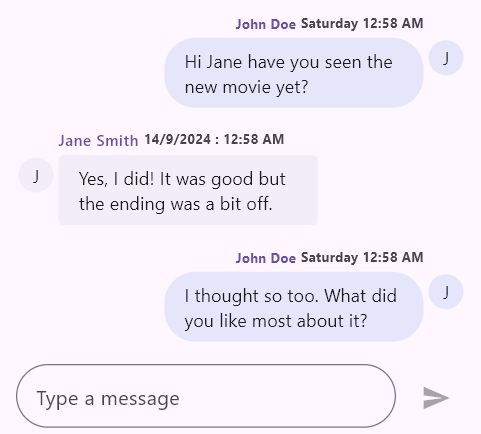

# Messages Content in Flutter Chat (SfChat)

This section explains how to integrate and customize the messages, outgoing user settings, and the appearance of message bubbles in the chat widget. You can use various properties to manage the content and styling of messages, as well as differentiate between outgoing and incoming messages.

## Messages

In the chat widget, messages are represented by instances of the [`ChatMessage`] class. This class encapsulates the details of each message within the chat interface. The properties of the [`ChatMessage`] class allow you to define various aspects of the message, including its content, timing, and sender.

* The [`text`] property is used to define the text content of the chat message.
* The [`time`] property is used to specify the timestamp of when the message was sent, typically represented as a DateTime object.
* The [`author`] property is used to specify the author of the message, represented by a ChatAuthor object which includes details about the message sender.




@override
Widget build(BuildContext context) {
  return SfChat(
    messages: <ChatMessage>[
      ChatMessage(
        text: 'Hi Jane have you seen the new movie yet?',
        time: DateTime(2024, 08, 07, 9, 0),
        author: ChatAuthor(
          id: '123-001',
          name: 'John Doe',
        ),
      ),
      ChatMessage(
        text: 'Yes, I did! It was good but the ending was a bit off.',
        time: DateTime(2024, 08, 07, 9, 5),
        author: ChatAuthor(
          id: '123-002',
          name: 'Jane Smith',
        ),
      ),
    ],
    outgoingUser: '123-001',
  );
}




## Outgoing User

In the chat widget, the outgoingUser property represents the user who is sending messages. It is an instance of the [`ChatAuthor`] class and plays a crucial role in identifying and distinguishing messages from different users.

* The [`id`] property is used to uniquely identify the author of the message. This is a required field for distinguishing between different users.
* The [`name`] property is used to specify the name of the author of the message. This helps in displaying the author's name in the chat interface.
* The [`avatar`] property is used to specify the image or visual representation of the message author. It typically takes an ImageProvider, such as NetworkImage, AssetImage, or FileImage, to display the author’s profile picture in the chat interface.




@override
Widget build(BuildContext context) {
  return SfChat(
    messages: <ChatMessage>[
      ChatMessage(
        text: 'Hi Jane have you seen the new movie yet?',
        time: DateTime(2024, 08, 07, 9, 0),
        author: ChatAuthor(
          id: '123-001',
          name: 'John Doe',
          avatar: NetworkImage('https://randomuser.me/api/portraits/men/1.jpg'),
        ),
      ),
      ChatMessage(
        text: 'Yes, I did! It was good but the ending was a bit off.',
        time: DateTime(2024, 08, 07, 9, 5),
        author: ChatAuthor(
          id: '123-002',
          name: 'Jane Smith',
          avatar: NetworkImage('https://randomuser.me/api/portraits/women/1.jpg'),
        ),
      ),
    ],
    outgoingUser: '123-001',
  );
}




## Incoming Bubble Settings

The [`incomingBubbleSettings`] property allows you to customize the appearance and behavior of incoming chat bubbles through the [`ChatBubbleSettings`] class, which controls various aspects such as user information, timestamps, and visual styling.

>**Note**: You must import the [`intl`] package for handling [`timestampFormat`] in your chat application.

* The [`showUserName`] property is used to determine whether the username is displayed in the incoming chat bubble.
* The [`showTimestamp`] property is used to specify if the timestamp is shown in the incoming chat bubble.
* The [`showUserAvatar`] property is used to indicate whether the user's avatar is displayed in the incoming chat bubble.
* The [`timestampFormat`] property is used to set the format for displaying the timestamp in the incoming chat bubble.
* The [`textStyle`] property is used to define the text style for the content inside the incoming chat bubble.
* The [`headerTextStyle`] property is used to set the text style for the header of the incoming chat bubble, including username and timestamp.
* The [`contentBackgroundColor`] property is used to specify the background color of the incoming chat bubble's content.
* The [`contentShape`] property is used to define the shape of the incoming chat bubble's content area, such as rounded or custom shapes.
* The [`widthFactor`] property is used to set the width factor of the incoming chat bubble relative to the available width.
* The [`avatarSize`] property is used to specify the size of the user's avatar in the incoming chat bubble.
* The [`padding`] property is used to define the space inside the incoming chat bubble between its border and the content.
* The [`contentPadding`] property is used to set the padding inside the incoming chat bubble’s content area, controlling spacing around the text.
* The [`avatarPadding`] property is used to specify the padding around the user's avatar within the incoming chat bubble.
* The [`headerPadding`] property is used to define the padding around the header section of the incoming chat bubble, including the username and timestamp.
* The [`footerPadding`] property is used to set the padding around the footer section of the incoming chat bubble.




// Load if there are existing messages.
List<ChatMessage> _messages = <ChatMessage>[];
final String _outgoingUserId = '';

@override
Widget build(BuildContext context) {
  return SfChat(
    messages: _messages,
    outgoingUser: _outgoingUserId,
    incomingBubbleSettings: ChatBubbleSettings(
      showUserName: true,
      showTimestamp: true,
      showUserAvatar: true,
      timestampFormat: DateFormat('EEEE h:mm a'),
      textStyle:
          const TextStyle(fontSize: 14),
      headerTextStyle:
          const TextStyle(fontSize: 10, fontWeight: FontWeight.bold),
      contentBackgroundColor:
          const Color.fromARGB(255, 230, 230, 250),
      contentShape: const RoundedRectangleBorder(
        borderRadius: BorderRadius.all(Radius.circular(25)),
      ),
      widthFactor: 0.8,
      avatarSize: const Size.square(32.0),
      padding: const EdgeInsets.all(2.0),
      contentPadding:
          const EdgeInsets.symmetric(horizontal: 16.0, vertical: 8.0),
      avatarPadding: const EdgeInsets.only(right: 4),
      headerPadding:
          const EdgeInsetsDirectional.only(top: 14.0, bottom: 4.0),
      footerPadding: const EdgeInsetsDirectional.only(top: 4.0),
    ),
  );
}




## Outgoing Bubble Settings

The [`outgoingBubbleSettings`] property allows you to customize the appearance and behavior of outgoing chat bubbles through the [`ChatBubbleSettings`] class, which controls various aspects such as user information, timestamps, and visual styling.

>**Note**: You must import the [`intl`] package for handling [`timestampFormat`] in your chat application.

* The [`showUserName`] property is used to determine whether the username is displayed in the incoming chat bubble.
* The [`showTimestamp`] property is used to specify if the timestamp is shown in the incoming chat bubble.
* The [`showUserAvatar`] property is used to indicate whether the user's avatar is displayed in the incoming chat bubble.
* The [`timestampFormat`] property is used to set the format for displaying the timestamp in the incoming chat bubble.
* The [`textStyle`] property is used to define the text style for the content inside the incoming chat bubble.
* The [`headerTextStyle`] property is used to set the text style for the header of the incoming chat bubble, including username and timestamp.
* The [`contentBackgroundColor`] property is used to specify the background color of the incoming chat bubble's content.
* The [`contentShape`] property is used to define the shape of the incoming chat bubble's content area, such as rounded or custom shapes.
* The [`widthFactor`] property is used to set the width factor of the incoming chat bubble relative to the available width.
* The [`avatarSize`] property is used to specify the size of the user's avatar in the incoming chat bubble.
* The [`padding`] property is used to define the space inside the incoming chat bubble between its border and the content.
* The [`contentPadding`] property is used to set the padding inside the incoming chat bubble’s content area, controlling spacing around the text.
* The [`avatarPadding`] property is used to specify the padding around the user's avatar within the incoming chat bubble.
* The [`headerPadding`] property is used to define the padding around the header section of the incoming chat bubble, including the username and timestamp.
* The [`footerPadding`] property is used to set the padding around the footer section of the incoming chat bubble.




// Load if there are existing messages.
List<ChatMessage> _messages = <ChatMessage>[];
final String _outgoingUserId = '';

@override
Widget build(BuildContext context) {
  return SfChat(
    messages: _messages,
    outgoingUser: _outgoingUserId,
    outgoingBubbleSettings: ChatBubbleSettings(
      showUserName: true,
      showTimestamp: true,
      showUserAvatar: true,
      timestampFormat: DateFormat('EEEE h:mm a'),
      textStyle:
          const TextStyle(fontSize: 14),
      headerTextStyle:
          const TextStyle(fontSize: 10, fontWeight: FontWeight.bold),
      contentBackgroundColor:
          const Color.fromARGB(255, 230, 230, 250),
      contentShape: const RoundedRectangleBorder(
        borderRadius: BorderRadius.all(Radius.circular(10)),
      ),
      widthFactor: 0.8,
      avatarSize: const Size.square(32.0),
      padding: const EdgeInsets.all(2.0),
      contentPadding:
          const EdgeInsets.symmetric(horizontal: 16.0, vertical: 8.0),
      avatarPadding: const EdgeInsets.only(left: 4),
      headerPadding:
          const EdgeInsetsDirectional.only(top: 14.0, bottom: 4.0),
      footerPadding: const EdgeInsetsDirectional.only(top: 4.0),
    ),
  );
}




#### See Also

* You can also customize the bubble shapes and colors properties of both incomingBubbleSettings and outgoingBubbleSettings using [`SfChatTheme`] by wrapping with [`SfChat`].