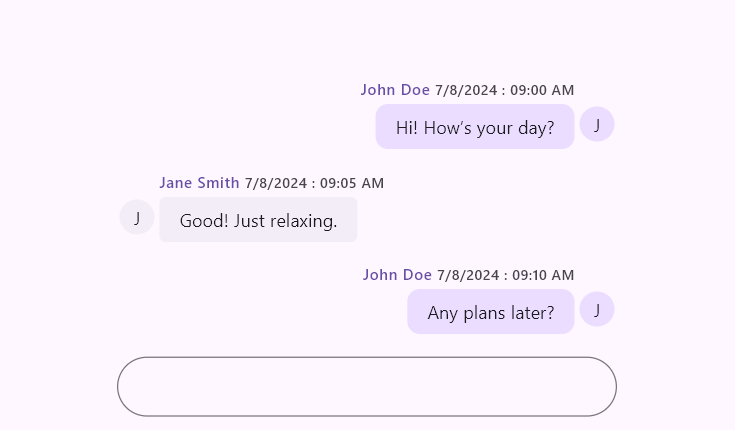

# Messages Content in Flutter Chat (SfChat)

This section explains the customization options available for modifying the incoming and outgoing messages in the chat widget.

## Messages

The [`messages`](https://pub.dev/documentation/syncfusion_flutter_chat/latest/chat/SfChat/messages.html) property is the data source of the Chat widget which accepts the list of [`ChatMessage`](https://pub.dev/documentation/syncfusion_flutter_chat/latest/chat/ChatMessage-class.html) objects to be displayed as incoming or outgoing messages based on the [`outgoingUser`](https://pub.dev/documentation/syncfusion_flutter_chat/latest/chat/SfChat/outgoingUser.html) property value.

Each [`ChatMessage`](https://pub.dev/documentation/syncfusion_flutter_chat/latest/chat/ChatMessage-class.html) contains the following message information,

* [`text`](https://pub.dev/documentation/syncfusion_flutter_chat/latest/chat/ChatMessage/text.html) - This defines the actual content of the message.
* [`time`](https://pub.dev/documentation/syncfusion_flutter_chat/latest/chat/ChatMessage/time.html) - This indicates the time the message was sent.
* [`author`](https://pub.dev/documentation/syncfusion_flutter_chat/latest/chat/ChatMessage/author.html) - This includes details about the author of the message, such as their name and user avatar or profile image.




  @override
  Widget build(BuildContext context) {
    return Scaffold(
      body: SfChat(
        messages: <ChatMessage>[
          ChatMessage(
            text: 'Hi! How’s your day?',
            time: DateTime(2024, 08, 07, 9, 0),
            author: const ChatAuthor(
              id: '123-001',
              name: 'John Doe',
            ),
          ),
          ChatMessage(
            text: 'Good! Just relaxing.',
            time: DateTime(2024, 08, 07, 9, 5),
            author: const ChatAuthor(
              id: '123-002',
              name: 'Jane Smith',
            ),
          ),
          ChatMessage(
            text: 'Any plans later?',
            time: DateTime(2024, 08, 07, 9, 10),
            author: const ChatAuthor(
              id: '123-001',
              name: 'John Doe',
            ),
          ),
        ],
        outgoingUser: '123-001',
      ),
    );
  }




Additionally the message can be extended to include more detailed information about the respected chat message.

In the following example, included the user's display name additionally in the existing message.




  @override
  void initState() {
    super.initState();
    _messages = [
      ChatMessageExt(
        text: 'Hi! How’s your day?',
        time: DateTime(2024, 08, 07, 9, 0),
        author: const ChatAuthor(
          id: '123-001',
          name: 'John Doe',
        ),
        displayName: 'JD',
      ),
      ChatMessageExt(
        text: 'Good! Just relaxing.',
        time: DateTime(2024, 08, 07, 9, 5),
        author: const ChatAuthor(
          id: '123-002',
          name: 'Jane Smith',
        ),
        displayName: 'JS',
      ),
      ChatMessageExt(
        text: 'Any plans later?',
        time: DateTime(2024, 08, 07, 9, 10),
        author: const ChatAuthor(
          id: '123-001',
          name: 'John Doe',
        ),
        displayName: 'JD',
      ),
    ];
  }

  @override
  Widget build(BuildContext context) {
    return MaterialApp(
      home: Scaffold(
        body: SfChat(
          messages: _messages,
          outgoingUser: '123-001',
          messageAvatarBuilder: (context, index, message) {
            if (message is ChatMessageExt) {
              return CircleAvatar(
                radius: 20,
                child: Text(
                  message.author.name.isNotEmpty
                      ? message.displayName
                      : '?',
                  style: const TextStyle(
                    color: Colors.black87,
                    fontWeight: FontWeight.bold,
                  ),
                ),
              );
            }
            return Container();
          },
        ),
      ),
    );
  }

  class ChatMessageExt extends ChatMessage {
    const ChatMessageExt({
      required super.text,
      required super.time,
      required super.author,
      required this.displayName,
    });
    final String displayName;
  }




## Suggestions 

The [`Suggestions`](https://pub.dev/documentation/syncfusion_flutter_chat/latest/chat/ChatMessage/suggestions.html) property allows you to add a list of suggestion items to a message in the message list. The selected suggestion item can be displayed in the chat interface as either an incoming or outgoing message, depending on the user who selected it. The suggestion `layout`, `background color`, and other properties can be customized.




  @override
  Widget build(BuildContext context) {
    return Scaffold(
      body: SfChat(
        messages: <ChatMessage>[
          ChatMessage(
            text: 'Hi! How’s your day?',
            time: DateTime(2024, 08, 07, 9, 0),
            author: const ChatAuthor(
              id: '123-001',
              name: 'John Doe',
            ),
          ),
          ChatMessage(
            text: 'Good! Just relaxing. How are you?',
            time: DateTime(2024, 08, 07, 9, 5),
            author: const ChatAuthor(
              id: '123-002',
              name: 'Jane Smith',
            ),
            suggestions: <ChatMessageSuggestion>[
              const ChatMessageSuggestion(data: 'All good!'),
              const ChatMessageSuggestion(data: 'Doing well!'),
              const ChatMessageSuggestion(data: 'I\'m Fine'),
            ],
          ),
        ],
        outgoingUser: '123-001',
      ),
    );
  }




## Outgoing user

The [`outgoingUser`](https://pub.dev/documentation/syncfusion_flutter_chat/latest/chat/SfChat/outgoingUser.html) property represents the user who is sending messages. It should be set to the unique ID of the user, which corresponds to the [`id`](https://pub.dev/documentation/syncfusion_flutter_chat/latest/chat/ChatAuthor/id.html) property of the [`ChatAuthor`](https://pub.dev/documentation/syncfusion_flutter_chat/latest/chat/ChatAuthor-class.html). This property plays a crucial role in identifying and distinguishing messages sent by different users.

The name may be repeated within the group, but the ID is unique to each user.




  @override
  Widget build(BuildContext context) {
    return Scaffold(
      body: SfChat(
        messages: <ChatMessage>[
          ChatMessage(
            text: 'Hi! How’s your day?',
            time: DateTime(2024, 08, 07, 9, 0),
            author: const ChatAuthor(
              id: '123-001',
              name: 'John Doe',
              avatar: NetworkImage('https://randomuser.me/api/portraits/men/1.jpg'),
            ),
          ),
          ChatMessage(
            text: 'Good! Just relaxing.',
            time: DateTime(2024, 08, 07, 9, 5),
            author: const ChatAuthor(
              id: '123-002',
              name: 'Jane Smith',
              avatar: NetworkImage('https://randomuser.me/api/portraits/women/1.jpg'),
            ),
          ),
          ChatMessage(
            text: 'Any plans later?',
            time: DateTime(2024, 08, 07, 9, 10),
            author: const ChatAuthor(
              id: '123-003',
              name: 'John Doe',
              avatar: NetworkImage('https://randomuser.me/api/portraits/men/4.jpg'),
            ),
          ),
        ],
        outgoingUser: '123-001',
      ),
    );
  }




## Message settings

Based on the [`outgoingUser`](https://pub.dev/documentation/syncfusion_flutter_chat/latest/chat/SfChat/outgoingUser.html) property, the messages are distinguished as either incoming or outgoing. The following options are available to customize the display settings of the message bubble.

>You must import the [`intl`](https://pub.dev/documentation/intl/latest/intl/intl-library.html) package for handling [`timestampFormat`](https://pub.dev/documentation/syncfusion_flutter_chat/latest/chat/ChatMessageSettings/timestampFormat.html) in your chat application.

### Author name

The [`showAuthorName`](https://pub.dev/documentation/syncfusion_flutter_chat/latest/chat/ChatMessageSettings/showAuthorName.html) property is used to show or hide the author's name for the message. Defaults to `true`.

### Time stamp

The [`showTimestamp`](https://pub.dev/documentation/syncfusion_flutter_chat/latest/chat/ChatMessageSettings/showTimestamp.html) property is used to show or hide the time the message was sent. The time format can be customized using [`timestampFormat`](https://pub.dev/documentation/syncfusion_flutter_chat/latest/chat/ChatMessageSettings/timestampFormat.html). Defaults to `true`.

### Time stamp format

The [`timestampFormat`](https://pub.dev/documentation/syncfusion_flutter_chat/latest/chat/ChatMessageSettings/timestampFormat.html) property is used to specify the date format for the sending time (timestamp). The default value is DateFormat('d/M/y : hh:mm a').




  @override
  Widget build(BuildContext context) {
    return Scaffold(
      body: SfChat(
        messages: <ChatMessage>[
          ChatMessage(
            text: 'Hi! How’s your day?',
            time: DateTime(2024, 08, 07, 9, 0),
            author: const ChatAuthor(
              id: '123-001',
              name: 'John Doe',
            ),
          ),
          ChatMessage(
            text: 'Good! Just relaxing.',
            time: DateTime(2024, 08, 07, 9, 5),
            author: const ChatAuthor(
              id: '123-002',
              name: 'Jane Smith',
            ),
          ),
          ChatMessage(
            text: 'Any plans later?',
            time: DateTime(2024, 08, 07, 9, 10),
            author: const ChatAuthor(
              id: '123-001',
              name: 'John Doe',
            ),
          ),
        ],
        outgoingUser: '123-001',
        incomingMessageSettings: ChatMessageSettings(
          timestampFormat: DateFormat('MMM d, h:mm a'),
        ),
        outgoingMessageSettings: ChatMessageSettings(
          timestampFormat: DateFormat('h:mm a'),
        ),
      ),
    );
  }




### Author avatar

The [`showAuthorAvatar`](https://pub.dev/documentation/syncfusion_flutter_chat/latest/chat/ChatMessageSettings/showAuthorAvatar.html) property is used to show or hide the author's image for the message. Defaults to `true`.




  @override
  Widget build(BuildContext context) {
    return Scaffold(
      body: SfChat(
        messages: <ChatMessage>[
          ChatMessage(
            text: 'Hi! How’s your day?',
            time: DateTime(2024, 08, 07, 9, 0),
            author: const ChatAuthor(
              id: '123-001',
              name: 'John Doe',
            ),
          ),
          ChatMessage(
            text: 'Good! Just relaxing.',
            time: DateTime(2024, 08, 07, 9, 5),
            author: const ChatAuthor(
              id: '123-002',
              name: 'Jane Smith',
            ),
          ),
          ChatMessage(
            text: 'Any plans later?',
            time: DateTime(2024, 08, 07, 9, 10),
            author: const ChatAuthor(
              id: '123-001',
              name: 'John Doe',
            ),
          ),
        ],
        outgoingUser: '123-001',
        incomingMessageSettings: const ChatMessageSettings(
          showAuthorAvatar: true,
        ),
        outgoingMessageSettings: const ChatMessageSettings(
          showAuthorAvatar: false,
        ),
      ),
    );
  }




### Text styles

The [`textStyle`](https://pub.dev/documentation/syncfusion_flutter_chat/latest/chat/ChatMessageSettings/textStyle.html) property is used to define the text style for content inside the message.

### Header text style

The [`headerTextStyle`](https://pub.dev/documentation/syncfusion_flutter_chat/latest/chat/ChatMessageSettings/headerTextStyle.html) property is used to define the text style for the header of the message, including the username and timestamp.

### Background color

The [`backgroundColor`](https://pub.dev/documentation/syncfusion_flutter_chat/latest/chat/ChatMessageSettings/backgroundColor.html) property is used to specify the background color of the content area within the message.




  @override
  Widget build(BuildContext context) {
    return Scaffold(
      body: SfChat(
        messages: <ChatMessage>[
          ChatMessage(
            text: 'Hi! How’s your day?',
            time: DateTime(2024, 08, 07, 9, 0),
            author: const ChatAuthor(
              id: '123-001',
              name: 'John Doe',
            ),
          ),
          ChatMessage(
            text: 'Good! Just relaxing.',
            time: DateTime(2024, 08, 07, 9, 5),
            author: const ChatAuthor(
              id: '123-002',
              name: 'Jane Smith',
            ),
          ),
          ChatMessage(
            text: 'Any plans later?',
            time: DateTime(2024, 08, 07, 9, 10),
            author: const ChatAuthor(
              id: '123-001',
              name: 'John Doe',
            ),
          ),
        ],
        outgoingUser: '123-001',
        incomingMessageSettings: const ChatMessageSettings(
          backgroundColor: Color(0xFFE1F5FE),
        ),
        outgoingMessageSettings: const ChatMessageSettings(
          backgroundColor: Color(0xFFF1F8E9),
        ),
      ),
    );
  }




### Shape

The [`shape`](https://pub.dev/documentation/syncfusion_flutter_chat/latest/chat/ChatMessageSettings/shape.html) property is used to define the shape of the content area of the message, such as rounded or custom shapes.




  @override
  Widget build(BuildContext context) {
    return Scaffold(
      body: SfChat(
        messages: <ChatMessage>[
          ChatMessage(
            text: 'Hi! How’s your day?',
            time: DateTime(2024, 08, 07, 9, 0),
            author: const ChatAuthor(
              id: '123-001',
              name: 'John Doe',
            ),
          ),
          ChatMessage(
            text: 'Good! Just relaxing.',
            time: DateTime(2024, 08, 07, 9, 5),
            author: const ChatAuthor(
              id: '123-002',
              name: 'Jane Smith',
            ),
          ),
          ChatMessage(
            text: 'Any plans later?',
            time: DateTime(2024, 08, 07, 9, 10),
            author: const ChatAuthor(
              id: '123-001',
              name: 'John Doe',
            ),
          ),
        ],
        outgoingUser: '123-001',
        incomingMessageSettings: const ChatMessageSettings(
          shape: RoundedRectangleBorder(
            borderRadius: BorderRadius.all(Radius.circular(5)),
          ),
        ),
        outgoingMessageSettings: const ChatMessageSettings(
          shape: RoundedRectangleBorder(
            borderRadius: BorderRadius.all(Radius.circular(10)),
          ),
        ),
      ),
    );
  }




### Width factor

The [`widthFactor`](https://pub.dev/documentation/syncfusion_flutter_chat/latest/chat/ChatMessageSettings/widthFactor.html) property is used to define the width factor of the message relative to available width. The width value should be between 0 and 1. Default value is `0.8`.

### Avatar size

The [`avatarSize`](https://pub.dev/documentation/syncfusion_flutter_chat/latest/chat/ChatMessageSettings/avatarSize.html) property is used to specify the size of the author's avatar in the message. Defaults to `Size.square(32.0)`.

### Margin

The [`margin`](https://pub.dev/documentation/syncfusion_flutter_chat/latest/chat/ChatMessageSettings/margin.html) property is used to define the space inside the message between the border and content. Defaults to `EdgeInsets.all(2.0)`.

### Padding

The [`padding`](https://pub.dev/documentation/syncfusion_flutter_chat/latest/chat/ChatMessageSettings/padding.html) property is used to specify the padding within the content area of the message, controlling spacing around the text. Defaults to `EdgeInsets.symmetric(horizontal: 16.0, vertical: 8.0)`.

### Avatar padding

The [`avatarPadding`](https://pub.dev/documentation/syncfusion_flutter_chat/latest/chat/ChatMessageSettings/avatarPadding.html) property is used to define the padding around the author's avatar within the message.

### Header padding

The [`headerPadding`](https://pub.dev/documentation/syncfusion_flutter_chat/latest/chat/ChatMessageSettings/headerPadding.html) property is used to specify the padding around the header section of the message, including the username and timestamp. Defaults to `EdgeInsetsDirectional.only(top: 14.0, bottom: 4.0)`.

### Footer padding

The [`footerPadding`](https://pub.dev/documentation/syncfusion_flutter_chat/latest/chat/ChatMessageSettings/footerPadding.html) property is used to define the padding around the footer section of the message. Defaults to `EdgeInsetsDirectional.only(top: 4.0)`.

>You can refer to our [Flutter Chat](https://www.syncfusion.com/flutter-widgets/flutter-chat) feature tour page for its groundbreaking feature representations. You can also explore our [Flutter Chat example](https://flutter.syncfusion.com/#/chat/getting-started) which demonstrates conversations between two or more users in a fully customizable layout and shows how to easily configure the chat with built-in support for creating stunning visual effects.

#### See Also

* You can also customize the bubble shapes and colors properties of both [`incomingMessageSettings`](https://pub.dev/documentation/syncfusion_flutter_chat/latest/chat/SfChat/incomingMessageSettings.html) and [`outgoingMessageSettings`](https://pub.dev/documentation/syncfusion_flutter_chat/latest/chat/SfChat/outgoingMessageSettings.html)using [`SfChatTheme`](https://pub.dev/documentation/syncfusion_flutter_core/latest/theme/SfChatTheme/SfChatTheme.html) by wrapping with [`SfChat`](https://pub.dev/documentation/syncfusion_flutter_chat/latest/chat/SfChat/SfChat.html).
