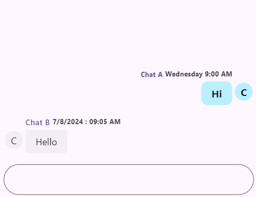

# Outgoing Chat Bubble Settings in Flutter Chat (SfChat)
This section explains how to integrate and customize the Outgoing Chat Bubble Settings in the SfChat widget.

N> You must import the [`intl`] package for handling [`timestampFormat`] in your chat application.

* [`showUserName`] - Used to determine whether the username is displayed in the Outgoing chat bubble.
* [`showTimestamp`] - Used to specify if the timestamp is shown in the Outgoing chat bubble.
* [`showUserAvatar`] - Used to indicate whether the user's avatar is displayed in the Outgoing chat bubble.
* [`timestampFormat`] - Used to set the format for displaying the timestamp in the Outgoing chat bubble.
* [`textStyle`] - Used to define the text style for the content inside the Outgoing chat bubble.
* [`headerTextStyle`] - Used to set the text style for the header of the Outgoing chat bubble, including username and timestamp.
* [`contentBackgroundColor`] - Used to specify the background color of the Outgoing chat bubble's content.
* [`contentShape`] - Used to define the shape of the Outgoing chat bubble's content area, such as rounded or custom shapes.
* [`widthFactor`] - Used to set the width factor of the Outgoing chat bubble relative to the available width.
* [`avatarSize`] - Used to specify the size of the user's avatar in the Outgoing chat bubble.
* [`padding`] - Used to define the space inside the Outgoing chat bubble between its border and the content.
* [`contentPadding`] - Used to set the padding inside the Outgoing chat bubble’s content area, controlling spacing around the text.
* [`avatarPadding`] - Used to specify the padding around the user's avatar within the Outgoing chat bubble.
* [`headerPadding`] - Used to define the padding around the header section of the Outgoing chat bubble, including the username and timestamp.
* [`footerPadding`] - Used to set the padding around the footer section of the Outgoing chat bubble.

#### See Also

* You can also customize the bubble shapes and colors properties using [`SfChatTheme`] by wrapping with [`SfChat`].




late List<ChatMessage> _messages;

@override
void initState() {
  _messages = <ChatMessage>[
    ChatMessage(
      text: 'Hi',
      time: DateTime(2024, 08, 07, 9, 0),
      author: ChatAuthor(
        id: '123-001',
        name: 'Chat A',
      ),
    ),
    ChatMessage(
      text: 'Hello',
      time: DateTime(2024, 08, 07, 9, 5),
      author: ChatAuthor(
        id: '123-002',
        name: 'Chat B',
      ),
    ),
  ];
  super.initState();
}

@override
Widget build(BuildContext context) {
  return MaterialApp(
    home: Scaffold(
      body: Center(
        child: SfChat(
          messages: _messages,
          outgoingUser: '123-001',
          outgoingBubbleSettings: ChatBubbleSettings(
            showUserName: true,
            showTimestamp: true,
            showUserAvatar: true,
            timestampFormat: DateFormat('EEEE h:mm a'),
            textStyle:
                const TextStyle(fontSize: 15, fontWeight: FontWeight.bold),
            headerTextStyle:
                const TextStyle(fontSize: 10, fontWeight: FontWeight.bold),
            contentBackgroundColor: const Color.fromARGB(255, 186, 239, 255),
            contentShape: const RoundedRectangleBorder(
              borderRadius: BorderRadius.all(Radius.circular(10)),
            ),
            widthFactor: 0.8,
            avatarSize: const Size.square(32.0),
            padding: const EdgeInsets.all(2.0),
            contentPadding:
                const EdgeInsets.symmetric(horizontal: 16.0, vertical: 8.0),
            avatarPadding: const EdgeInsets.only(left: 4),
            headerPadding:
                const EdgeInsetsDirectional.only(top: 14.0, bottom: 4.0),
            footerPadding: const EdgeInsetsDirectional.only(top: 4.0),
          ),
        ),
      ),
    ),
  );
}




