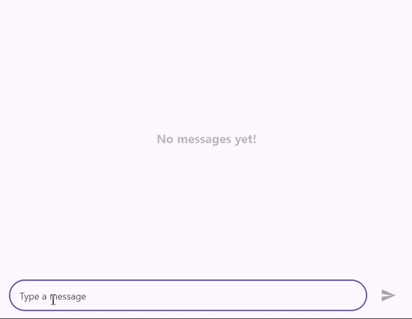

# Flutter Chat (SfChat) Overview

The Syncfusion Flutter Chat widget displays conversations between two or more users and offers a wide range of customization options, including the composer, action button, and message bubbles (header, footer, content, and avatar).

## Features

* **Placeholder** - The [`placeholderBuilder`](https://pub.dev/documentation/syncfusion_flutter_chat/latest/chat/SfChat/placeholderBuilder.html) can be used to create a custom widget that appears when conversations are empty. This feature is especially useful for displaying a relevant or visually appealing message, indicating that the conversation currently has no messages.

* **Composer** - The primary text editor where new chat messages can be composed. You can also integrate custom composer widgets.

* **Action Button** - Represents the send button. Pressing this action button invokes the [`onPressed`](https://pub.dev/documentation/syncfusion_flutter_chat/latest/chat/ChatActionButton/onPressed.html) callback with the text entered in the default [`ChatComposer`](https://pub.dev/documentation/syncfusion_flutter_chat/latest/chat/ChatComposer-class.html).

* **Message Bubble** -  A list of [`ChatMessage`](https://pub.dev/documentation/syncfusion_flutter_chat/latest/chat/ChatMessage-class.html) objects that will be displayed in the chat interface as either incoming or outgoing messages based on the [`outgoingUser`](https://pub.dev/documentation/syncfusion_flutter_chat/latest/chat/SfChat/outgoingUser.html). Each [`ChatMessage`](https://pub.dev/documentation/syncfusion_flutter_chat/latest/chat/ChatMessage-class.html) includes details such as the message text, timestamp, and author information.

* **Suggestions** - The list of suggestion items can be added for a message in the message list. The selected suggestion item can be displayed in the chat interface as either incoming or outgoing messages based on the user who selected the suggestion item.

* **Bubble Header** - Displays the sender's name and the timestamp associated with each message. Using the [`bubbleHeaderBuilder`](https://pub.dev/documentation/syncfusion_flutter_chat/latest/chat/SfChat/bubbleHeaderBuilder.html), a custom widget can be specified to display as a header for each chat bubble with required details about the respective message.

* **Bubble Footer** - By default, no footer is added to the message bubble. Using the [`bubbleFooterBuilder`](https://pub.dev/documentation/syncfusion_flutter_chat/latest/chat/SfChat/bubbleFooterBuilder.html), a custom widget can be specified to display as a footer for each chat bubble with required details about the respective message.

* **Bubble Content** - The actual message content. Using the [`bubbleContentBuilder`](https://pub.dev/documentation/syncfusion_flutter_chat/latest/chat/SfChat/bubbleContentBuilder.html), a custom widget can be specified to display as the content for each chat message with a customized layout.

* **Bubble Avatar** - Displays user avatars or profile pictures of the respective message. Using the [`bubbleAvatarBuilder`](https://pub.dev/documentation/syncfusion_flutter_chat/latest/chat/SfChat/bubbleAvatarBuilder.html), a custom widget can be specified to display the chat message avatar with relevant details.

>You can refer to our [Flutter Chat](https://www.syncfusion.com/flutter-widgets/flutter-chat) feature tour page for its groundbreaking feature representations. You can also explore our [Flutter Chat example](https://flutter.syncfusion.com/#/chat/getting-started) which demonstrates conversations between two or more users in a fully customizable layout and shows how to easily configure the chat with built-in support for creating stunning visual effects.