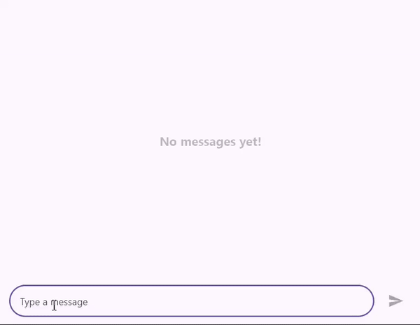

# Flutter Chat (SfChat) Overview

The Syncfusion&reg; Flutter Chat widget displays conversations between two or more users and offers a wide range of customization options, including the composer, action button, and message content (header, footer, content, and avatar).

## Features

* **Placeholder** - The [`placeholderBuilder`](https://pub.dev/documentation/syncfusion_flutter_chat/latest/chat/SfChat/placeholderBuilder.html) can be used to create a custom widget that appears when conversations are empty. This feature is especially useful for displaying a relevant or visually appealing message, indicating that the conversation currently has no messages.

* **Composer** - The primary text editor where new chat messages can be composed. You can also integrate custom composer widgets.

* **Action Button** - Represents the send button. Pressing this action button invokes the [`onPressed`](https://pub.dev/documentation/syncfusion_flutter_chat/latest/chat/ChatActionButton/onPressed.html) callback with the text entered in the default [`ChatComposer`](https://pub.dev/documentation/syncfusion_flutter_chat/latest/chat/ChatComposer-class.html).

* **Message Content** - A list of [`ChatMessage`](https://pub.dev/documentation/syncfusion_flutter_chat/latest/chat/ChatMessage-class.html) objects that will be displayed in the chat interface as either incoming or outgoing messages based on the [`outgoingUser`](https://pub.dev/documentation/syncfusion_flutter_chat/latest/chat/SfChat/outgoingUser.html). Each [`ChatMessage`](https://pub.dev/documentation/syncfusion_flutter_chat/latest/chat/ChatMessage-class.html) includes details such as the message text, timestamp, and author information.

* **Suggestions** - The list of [`suggestions`](https://pub.dev/documentation/syncfusion_flutter_chat/latest/chat/ChatMessage/suggestions.html) can be added for a message in the message list. The selected suggestion item can be displayed in the chat interface as either incoming or outgoing messages based on the user who selected the suggestion item.

* **Message Header** - Displays the sender's name and the timestamp associated with each message. Using the [`messageHeaderBuilder`](https://pub.dev/documentation/syncfusion_flutter_chat/latest/chat/SfChat/messageHeaderBuilder.html), a custom widget can be specified as the header for each message. For customization details, refer to the [Conversation Area](conversation-area.md) documentation.

* **Message Footer** - By default, no footer is added to the message content. Using the [`messageFooterBuilder`](https://pub.dev/documentation/syncfusion_flutter_chat/latest/chat/SfChat/messageFooterBuilder.html), a custom widget can be specified as the footer for each message. For customization details, refer to the [Conversation Area](conversation-area.md) documentation.

* **Custom Message Content** - The actual message content can be customized using the [`messageContentBuilder`](https://pub.dev/documentation/syncfusion_flutter_chat/latest/chat/SfChat/messageContentBuilder.html), which lets you build a fully custom layout for each message. For customization details, refer to the [Conversation Area](conversation-area.md) documentation.

* **Message Avatar** - Displays user avatars or profile pictures of the respective message. Using the [`messageAvatarBuilder`](https://pub.dev/documentation/syncfusion_flutter_chat/latest/chat/SfChat/messageAvatarBuilder.html), a custom widget can be specified to display the chat message avatar with relevant details.

>You can refer to our [Flutter Chat](https://www.syncfusion.com/flutter-widgets/flutter-chat) feature tour page for its groundbreaking feature representations. You can also explore our [Flutter Chat example](https://flutter.syncfusion.com/#/chat/getting-started) which demonstrates conversations between two or more users in a fully customizable layout and shows how to easily configure the chat with built-in support for creating stunning visual effects.