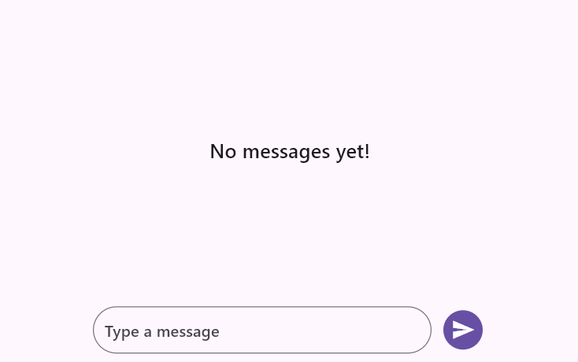

# Flutter Chat (SfChat) Overview

The Syncfusion Flutter Chat widget displays conversations between two or more users in a fully customizable layout. It presents messages in a chat user interface and allows you to customize various aspects, such as message composition, action buttons, and the appearance of message bubbles.

## Features

* **Placeholder** - You can use the [`placeholderBuilder`] to create a custom widget that appears when the conversation is idle. This feature is particularly useful for presenting users with a relevant or visually appealing message indicating that the conversation is currently empty.

* **Message** -  This feature displays [messages] with text, timestamps, and author details, and it allows profile customization. The [isOutgoingUser] property helps differentiate between incoming and outgoing messages, enabling distinct styling for messages sent by the current user.

* **Composer** - The [`composer`] property allows you to add a message entry field to the chat interface. This widget includes a customizable text input area for users to compose and send new messages.You can use a predefined widget or provide a custom builder for complete flexibility in the presentation and styling of the message input field.

* **Action Button** - This represents a customizable [`actionButton`] for sending new messages in the chat conversation. It supports customization of focus, hover, and splash colors, as well as elevation and more, allowing you to align it with your app’s design and functionality requirements.

* **Builder** - The [`bubbleHeaderBuilder`] allows you to specify a custom widget that will be displayed as a header within each chat bubble. The [`bubbleAvatarBuilder`] enables you to specify a custom widget that will be shown as an avatar within each chat bubble. The [`bubbleContentBuilder`] allows you to define a custom widget to display as the content within each chat bubble. The [`bubbleFooterBuilder`] permits you to specify a custom widget that will be presented as a footer within each chat bubble.

* **Message Bubble** - The [`incomingBubbleSettings`] property allows you to customize the appearance of incoming chat bubbles, including the display of the sender's username, timestamp, avatar, and various padding options.Similarly, the [`outgoingBubbleSettings`] property enables you to customize the appearance of outgoing chat bubbles, which also includes options for displaying the sender's username, timestamp, avatar, and various padding settings.