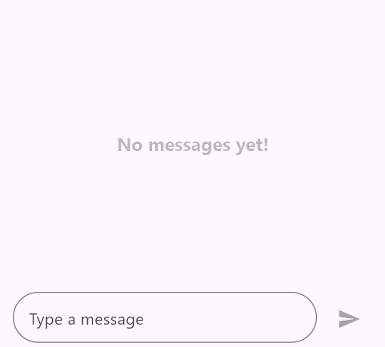

# Placeholder in Flutter Chat (SfChat)

The ['placeholderBuilder'] property allows you to specify any type of widget that will be displayed in the conversion area.

It will be displayed when there are no messages in the conversions and will be removed when messages start being added.




  // Load if there are existing messages.
  final List<ChatMessage> _messages = <ChatMessage>[];

  @override
  Widget build(BuildContext context) {
    return Scaffold(
      body: SfChat(
        messages: _messages,
        outgoingUser: '123-001',
        placeholderBuilder: (BuildContext context) {
          return const Center(
            child: Padding(
              padding: EdgeInsets.symmetric(horizontal: 20.0),
              child: Column(
                mainAxisAlignment: MainAxisAlignment.center,
                children: [
                  Icon(
                    Icons.chat_bubble_outline,
                    size: 100,
                    color: Colors.blueAccent,
                  ),
                  SizedBox(height: 20),
                  Text(
                    'Start a conversation!',
                    style: TextStyle(
                      fontSize: 24,
                      fontWeight: FontWeight.bold,
                      color: Colors.blueAccent,
                    ),
                  ),
                  SizedBox(height: 10),
                  Text(
                    'You haven\'t sent any messages yet. \nTap the button below to send your first message.',
                    textAlign: TextAlign.center,
                    style: TextStyle(
                      fontSize: 16,
                      color: Colors.black54,
                    ),
                  ),
                ],
              ),
            ),
          );
        },
      ),
    );
  }




>**Note**: You can refer to our [Flutter Chat](https://www.syncfusion.com/flutter-widgets/flutter-chat) feature tour page for its groundbreaking feature representations. You can also explore our [Flutter Chat example](https://flutter.syncfusion.com/#/chat) which demonstrates conversations between two or more users in a fully customizable layout and shows how to easily configure the chat with built-in support for creating stunning visual effects.