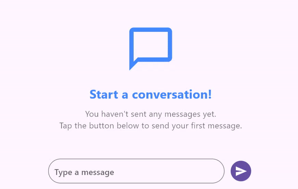

# Placeholder in Flutter Chat (SfChat)

The [`placeholderBuilder`](https://pub.dev/documentation/syncfusion_flutter_chat/latest/chat/SfChat/placeholderBuilder.html) property allows you to specify any type of widget that is displayed in the conversation area.

It is displayed when there are no messages in the conversation and is removed once messages are added.




import 'package:flutter/material.dart';
import 'package:syncfusion_flutter_chat/chat.dart';

void main() {
  runApp(const PlaceholderExample());
}

class PlaceholderExample extends StatelessWidget {
  const PlaceholderExample({super.key});

  final List<ChatMessage> _messages = const <ChatMessage>[];

  @override
  Widget build(BuildContext context) {
    return MaterialApp(
      home: Scaffold(
        body: SfChat(
          messages: _messages,
          outgoingUser: '123-001',
          placeholderBuilder: (BuildContext context) {
            return const Center(
              child: Padding(
                padding: EdgeInsets.symmetric(horizontal: 10.0),
                child: Column(
                  mainAxisAlignment: MainAxisAlignment.center,
                  children: <Widget>[
                    Icon(
                      Icons.chat_bubble_outline,
                      size: 35,
                      color: Color(0xFF433D8B),
                    ),
                    Text(
                      'Start a conversation!',
                      style: TextStyle(
                        fontSize: 24,
                        fontWeight: FontWeight.bold,
                        color: Color(0xFF433D8B),
                      ),
                    ),
                    SizedBox(height: 10),
                    Text(
                      'You haven\'t sent any messages yet.',
                      textAlign: TextAlign.center,
                      style: TextStyle(
                        fontSize: 16,
                        color: Colors.black54,
                      ),
                    ),
                  ],
                ),
              ),
            );
          },
        ),
      ),
    );
  }
}




>You can refer to our [Flutter Chat](https://www.syncfusion.com/flutter-widgets/flutter-chat) feature tour page for its groundbreaking feature representations. You can also explore our [Flutter Chat example](https://flutter.syncfusion.com/#/chat/getting-started) which demonstrates conversations between two or more users in a fully customizable layout and shows how to easily configure the chat with built-in support for creating stunning visual effects.

#### See Also

* [Action button](action-button.md)
* [Conversation area](conversation-area.md)
* [Getting started](getting-started.md)