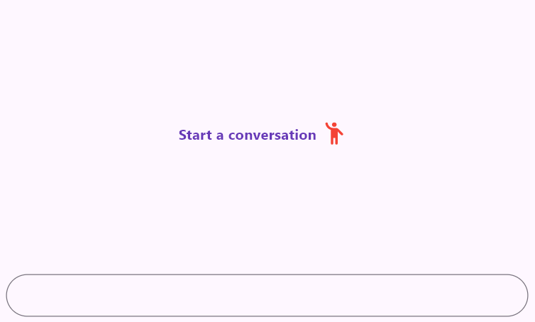
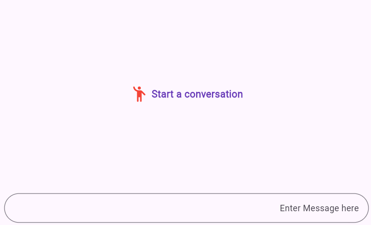
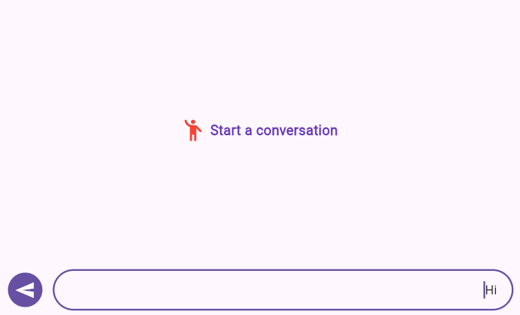
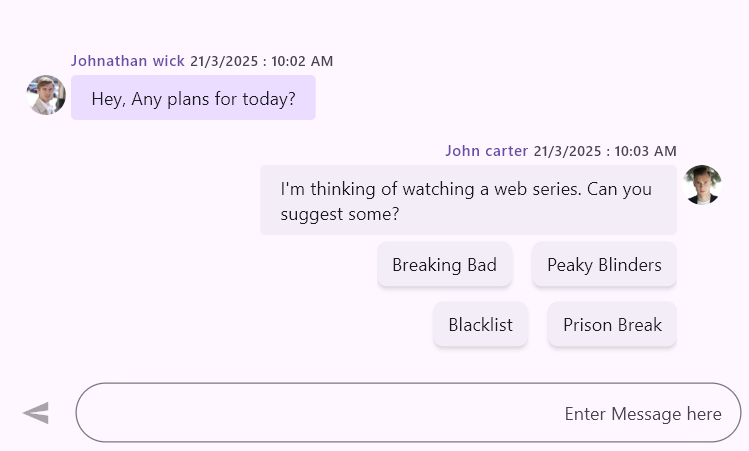

# Right To Left (RTL) in Flutter Chat (SfChat)

Chat supports right-to-left rendering for all elements in the chat widget.

## RTL rendering ways

Right-to-left rendering can be enabled in the following ways.

### Wrapping SfChat with Directionality widget

To change rendering direction to RTL, wrap [`SfChat`](https://pub.dev/documentation/syncfusion_flutter_chat/latest/chat/SfChat-class.html) in [`Directionality`](https://api.flutter.dev/flutter/widgets/Directionality-class.html) and set [`textDirection`](https://api.flutter.dev/flutter/widgets/Directionality/textDirection.html) to [`TextDirection.rtl`](https://api.flutter.dev/flutter/dart-ui/TextDirection.html).




import 'package:flutter/material.dart';
import 'package:syncfusion_flutter_chat/chat.dart';

void main() {
  runApp(const RTLDirectionalityExample());
}

class RTLDirectionalityExample extends StatelessWidget {
  const RTLDirectionalityExample({super.key});

  @override
  Widget build(BuildContext context) {
    return MaterialApp(
      home: Scaffold(
        body: Directionality(
          textDirection: TextDirection.rtl,
          child: SfChat(
            outgoingUser: '1010',
            messages: <ChatMessage>[
              ChatMessage(
                text: 'Hello',
                time: DateTime(2025, 03, 21, 10, 2),
                author: const ChatAuthor(id: '1010', name: 'Johnathan Wick'),
              ),
            ],
          ),
        ),
      ),
    );
  }
}




### Setting locale to an RTL language

You can also enable RTL layout by configuring `MaterialApp` with an RTL locale and localization delegates.




import 'package:flutter/material.dart';
import 'package:flutter_localizations/flutter_localizations.dart';
import 'package:syncfusion_flutter_chat/chat.dart';

void main() {
  runApp(const RTLLocaleExample());
}

class RTLLocaleExample extends StatelessWidget {
  const RTLLocaleExample({super.key});

  @override
  Widget build(BuildContext context) {
    return MaterialApp(
      localizationsDelegates: const <LocalizationsDelegate<dynamic>>[
        GlobalMaterialLocalizations.delegate,
        GlobalWidgetsLocalizations.delegate,
      ],
      supportedLocales: const <Locale>[Locale('ar')],
      locale: const Locale('ar'),
      home: Scaffold(
        body: SfChat(
          outgoingUser: '1010',
          messages: <ChatMessage>[
            ChatMessage(
              text: 'Hello',
              time: DateTime(2025, 03, 21, 10, 2),
              author: const ChatAuthor(id: '1010', name: 'Johnathan Wick'),
            ),
          ],
        ),
      ),
    );
  }
}




## RTL supported chat elements

RTL rendering is supported for placeholder, composer, action button, message content, message header, and message footer.

### Placeholder

RTL rendering is supported for [`placeholderBuilder`](https://pub.dev/documentation/syncfusion_flutter_chat/latest/chat/SfChat/placeholderBuilder.html). The placeholder widget layout follows RTL direction.




import 'package:flutter/material.dart';
import 'package:syncfusion_flutter_chat/chat.dart';

void main() {
  runApp(const RTLPlaceholderExample());
}

class RTLPlaceholderExample extends StatelessWidget {
  const RTLPlaceholderExample({super.key});

  final List<ChatMessage> _messages = const <ChatMessage>[];

  @override
  Widget build(BuildContext context) {
    return MaterialApp(
      home: Scaffold(
        body: Directionality(
          textDirection: TextDirection.rtl,
          child: SfChat(
            outgoingUser: '1010',
            messages: _messages,
            placeholderBuilder: (BuildContext context) {
              return const Center(
                child: Row(
                  mainAxisAlignment: MainAxisAlignment.center,
                  children: <Widget>[
                    SizedBox(width: 10),
                    Icon(
                      Icons.emoji_people_rounded,
                      size: 30,
                      color: Colors.red,
                    ),
                    SizedBox(width: 5),
                    Text(
                      'Start a conversation',
                      style: TextStyle(
                        color: Colors.deepPurple,
                        fontSize: 16,
                        fontWeight: FontWeight.bold,
                      ),
                    ),
                  ],
                ),
              );
            },
          ),
        ),
      ),
    );
  }
}




### Composer

RTL rendering is supported for [`composer`](https://pub.dev/documentation/syncfusion_flutter_chat/latest/chat/SfChat/composer.html). The composer container follows RTL layout.

>In RTL mode, the caret and typed text flow follow the active text-direction and keyboard/language settings.




import 'package:flutter/material.dart';
import 'package:syncfusion_flutter_chat/chat.dart';

void main() {
  runApp(const RTLComposerExample());
}

class RTLComposerExample extends StatelessWidget {
  const RTLComposerExample({super.key});

  final List<ChatMessage> _messages = const <ChatMessage>[];

  @override
  Widget build(BuildContext context) {
    return MaterialApp(
      home: Scaffold(
        body: Directionality(
          textDirection: TextDirection.rtl,
          child: SfChat(
            outgoingUser: '1010',
            messages: _messages,
            composer: const ChatComposer(
              decoration: InputDecoration(
                hintText: 'Enter message here',
              ),
            ),
          ),
        ),
      ),
    );
  }
}




### Action Button

RTL rendering is supported for [`actionButton`](https://pub.dev/documentation/syncfusion_flutter_chat/latest/chat/SfChat/actionButton.html). The action button is rendered from right to left.




import 'package:flutter/material.dart';
import 'package:syncfusion_flutter_chat/chat.dart';

void main() {
  runApp(const RTLActionButtonExample());
}

class RTLActionButtonExample extends StatefulWidget {
  const RTLActionButtonExample({super.key});

  @override
  State<RTLActionButtonExample> createState() => _RTLActionButtonExampleState();
}

class _RTLActionButtonExampleState extends State<RTLActionButtonExample> {
  late List<ChatMessage> _messages;

  @override
  void initState() {
    super.initState();
    _messages = <ChatMessage>[];
  }

  @override
  Widget build(BuildContext context) {
    return MaterialApp(
      home: Scaffold(
        body: Directionality(
          textDirection: TextDirection.rtl,
          child: SfChat(
            outgoingUser: '1010',
            messages: _messages,
            actionButton: ChatActionButton(
              onPressed: (String value) {
                if (value.trim().isEmpty) {
                  return;
                }
                setState(() {
                  _messages = <ChatMessage>[
                    ..._messages,
                    ChatMessage(
                      text: value,
                      time: DateTime.now(),
                      author: const ChatAuthor(id: '1010', name: 'Johnathan Wick'),
                    ),
                  ];
                });
              },
            ),
          ),
        ),
      ),
    );
  }
}




### Message Content

Right-to-left rendering is supported for [`messages`](https://pub.dev/documentation/syncfusion_flutter_chat/latest/chat/ChatMessage-class.html) in the conversation area.

In RTL mode, message content, header, footer, and suggestions render from right to left.




import 'package:flutter/material.dart';
import 'package:syncfusion_flutter_chat/chat.dart';

void main() {
  runApp(const RTLMessageContentExample());
}

class RTLMessageContentExample extends StatelessWidget {
  const RTLMessageContentExample({super.key});

  @override
  Widget build(BuildContext context) {
    return MaterialApp(
      home: Scaffold(
        body: Directionality(
          textDirection: TextDirection.rtl,
          child: SfChat(
            outgoingUser: '1010',
            messages: <ChatMessage>[
              ChatMessage(
                text: 'Hey, any plans for today?',
                time: DateTime.parse('2025-03-21T10:02:00Z'),
                author: const ChatAuthor(
                  id: '1010',
                  name: 'Johnathan Wick',
                  avatar: AssetImage('assets/images/People_Circle23.png'),
                ),
              ),
              ChatMessage(
                text: 'I am thinking of watching a web series. Can you suggest some?',
                time: DateTime.parse('2025-03-21T10:03:00Z'),
                author: const ChatAuthor(
                  id: '1020',
                  name: 'John Carter',
                  avatar: AssetImage('assets/images/People_Circle5.png'),
                ),
                suggestions: const <ChatMessageSuggestion>[
                  ChatMessageSuggestion(data: 'Peaky Blinders'),
                  ChatMessageSuggestion(data: 'Breaking Bad'),
                  ChatMessageSuggestion(data: 'Prison Break'),
                  ChatMessageSuggestion(data: 'Blacklist'),
                ],
              ),
            ],
          ),
        ),
      ),
    );
  }
}




>Note: The `AssetImage` paths shown above are sample paths. Add matching image assets in your application and register them in `pubspec.yaml`.

>You can refer to our [Flutter Chat](https://www.syncfusion.com/flutter-widgets/flutter-chat) feature tour page for its groundbreaking feature representations. You can also explore our [Flutter Chat example](https://flutter.syncfusion.com/#/chat/getting-started) which demonstrates conversations between two or more users in a fully customizable layout and shows how to easily configure the chat with built-in support for creating stunning visual effects.