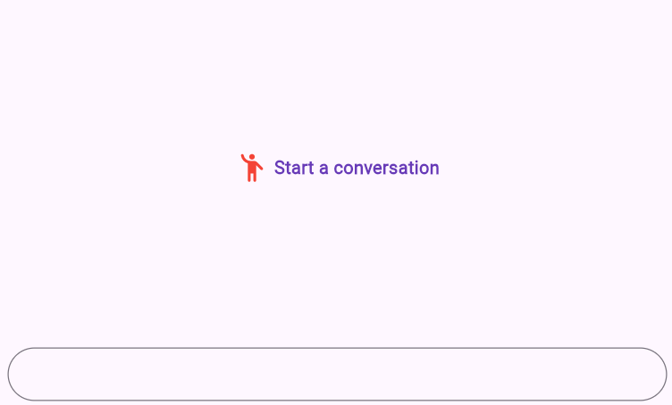

# Right To Left (RTL) in Flutter Chat (SfChat)

Chat supports the right to left rendering for all the elements in the Chat widget. 

## RTL rendering ways

Right to left rendering can be switched in the following ways:

### Wrapping the SfChat with Directionality widget

To change the rendering direction from right to left, you can wrap the [`SfChat`](https://pub.dev/documentation/syncfusion_flutter_chat/latest/chat/SfChat-class.html) widget inside the [`Directionality`](https://api.flutter.dev/flutter/widgets/Directionality-class.html) widget and set the [`textDirection`](https://api.flutter.dev/flutter/widgets/Directionality/textDirection.html) property as [`TextDirection.rtl`](https://api.flutter.dev/flutter/dart-ui/TextDirection.html).




    @override
    Widget build(BuildContext context) {
      return Scaffold(
        body: Directionality(
          textDirection: TextDirection.rtl,
          child: SfChat(
              //...
          ),
        ),
      );
    }




## RTL supported chat elements

### Placeholder

Right to left (RTL) rendering is supported for the [`placeholderBuilder`](https://pub.dev/documentation/syncfusion_flutter_chat/latest/chat/SfChat/placeholderBuilder.html) in the chat. The widget added in the placeholderBuilder will be rendered from right to left direction. But, the text widget or text entered in the widget will render from left to right direction.




     @override
     Widget build(BuildContext context) {
       return Scaffold(
         body: Directionality(
           textDirection: TextDirection.rtl,
           child: SfChat(
             outgoingUser: '1010',
             messages: _messages,
             placeholderBuilder: (context) {
               return const Center(
                 child: Row(
                   mainAxisAlignment: MainAxisAlignment.center,
                   children: [
                     SizedBox(width: 10),
                     Icon(
                       size: 30,
                       Icons.emoji_people_rounded,
                       color: Colors.red,
                     ),
                     SizedBox(width: 5),
                     Text(
                    'Start a conversation',
                       style: TextStyle(
                         color: Colors.deepPurple,
                         fontSize: 16,
                         fontWeight: FontWeight.bold,
                       ),
                     ),
                   ],
                 ),
               );
             },
           ),
         ),
       );
     } 




### Composer

Right to left (RTL) rendering is supported for the [`composer`](https://pub.dev/documentation/syncfusion_flutter_chat/latest/chat/SfChat/composer.html) in the chat. Composer will be rendered from right to left direction. But, the text entered in the composer will render from the left to right in the composer.




    @override
    Widget build(BuildContext context) {
      return Scaffold(
        body: Directionality(
          textDirection: TextDirection.rtl,
          child: SfChat(
            outgoingUser: '1010',
            messages: _messages,
            composer: const ChatComposer(
                decoration: InputDecoration(
              hintText: 'Enter Message here',
            )),
          ),
        ),
      );
    }  




### Action Button

Right to left (RTL) rendering is supported for the [`actionButton`](https://pub.dev/documentation/syncfusion_flutter_chat/latest/chat/SfChat/actionButton.html) in the chat. Action button will be rendered from right to left direction.




    @override
    Widget build(BuildContext context) {
      return Scaffold(
        body: Directionality(
          textDirection: TextDirection.rtl,
          child: SfChat(
            outgoingUser: '1010',
            messages: _messages,
            actionButton: ChatActionButton(
              onPressed: (value) {
                setState(() {
                  _messages.add(
                    ChatMessage(
                      text: value,
                      time: DateTime.now(),
                      author: const ChatAuthor(
                          id: '1010', name: 'Johnathan wick'),
                    ),
                  );
                });
              },
            ),
          ),
        ),
      );
    }  




### Message Content

Right to left (RTL) rendering is supported for [`Messages`](https://pub.dev/documentation/syncfusion_flutter_chat/latest/chat/ChatMessage-class.html) in the chat conversation area. In RTL mode, message content, header and suggestions will render the widget in right to left direction. 




     @override
     Widget build(BuildContext context) {
       return Scaffold(
         body: Directionality(
           textDirection: TextDirection.rtl,
           child: SfChat(
             outgoingUser: '1010',
             messages: <ChatMessage>[
               ChatMessage(
                 text: 'Hey, Any plans for today?',
                 time: DateTime.parse('2025-03-21T10:02:00Z'),
                 author: const ChatAuthor(
                   id: '1010',
                   name: 'Johnathan wick',
                   avatar: AssetImage('assets/images/People_Circle23.png'),
                 ),
               ),
               ChatMessage(
                 text:
                     "I'm thinking of watching a web series. Can you suggest some?",
                 time: DateTime.parse('2025-03-21T10:03:00Z'),
                 author: const ChatAuthor(
                   id: '1020',
                   name: 'John carter',
                   avatar: AssetImage('assets/images/People_Circle5.png'),
                 ),
                 suggestions: [
                   const ChatMessageSuggestion(data: 'Peaky Blinders'),
                   const ChatMessageSuggestion(data: 'Breaking Bad'),
                   const ChatMessageSuggestion(data: 'Prison Break'),
                   const ChatMessageSuggestion(data: 'Blacklist'),
                 ],
               ),
             ],
           ),
         ),
       );
     }




