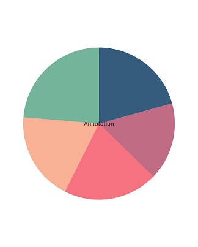
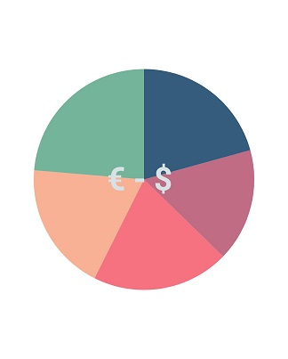

# Annotation in Flutter Circular Chart

The chart supports annotations, which allow you to mark a specific area of interest in the chart area. You can add custom widgets using this annotation feature, as shown below.


 

    @override
    Widget build(BuildContext context) {
      return Scaffold(
        body: SafeArea(
          child: Center(
            child: Container(
              child: SfCircularChart(
                annotations: <CircularChartAnnotation>[
                  CircularChartAnnotation(
                    widget: 
                      Container(
                        child: const Text('Annotation')
                      ),
                  )
                ]
              )
            )
          )
        )
      );
    }




## Positioning the annotation

The [`horizontalAlignment`](https://pub.dev/documentation/syncfusion_flutter_charts/latest/charts/CircularChartAnnotation/horizontalAlignment.html) and [`verticalAlignment`](https://pub.dev/documentation/syncfusion_flutter_charts/latest/charts/CircularChartAnnotation/verticalAlignment.html) values can be specified to align the annotation widget horizontally or vertically, and the [`radius`](https://pub.dev/documentation/syncfusion_flutter_charts/latest/charts/CircularChartAnnotation/radius.html) property can be used to place the annotation, with values ranging from `0%` to `100%`. 

Defaults to `0%`.

**Positioning based on Alignment and Radius**

To place the annotation based on the radius value, set the [`radius`](https://pub.dev/documentation/syncfusion_flutter_charts/latest/charts/CircularChartAnnotation/radius.html). To change the annotation alignment, use the [`horizontalAlignment`](https://pub.dev/documentation/syncfusion_flutter_charts/latest/charts/CircularChartAnnotation/horizontalAlignment.html) and [`verticalAlignment`](https://pub.dev/documentation/syncfusion_flutter_charts/latest/charts/CircularChartAnnotation/verticalAlignment.html) properties, as shown in the following code snippet.


 

    @override
    Widget build(BuildContext context) {
      return Scaffold(
        body: SafeArea(
          child: Center(
            child: Container(
              child: SfCircularChart(
                annotations: <CircularChartAnnotation>[
                  CircularChartAnnotation(
                    widget: Container(
                      child: const Text('Text')
                    ),
                    radius: '50%',
                    verticalAlignment: ChartAlignment.center,
                    horizontalAlignment: ChartAlignment.far  
                  )
                ]
              )
            )
          )
        )
      );
    }




## Chart with watermark

The chart supports watermark, which allows you to mark a specific area of interest in the chart area. You can add custom widgets and watermarks using this annotation feature, as shown below.


 

    @override
    Widget build(BuildContext context) {
      return Scaffold(
        body: SafeArea(
          child: Center(
            child: Container(
                  child: SfCircularChart(
                      annotations: <CircularChartAnnotation>[
                      CircularChartAnnotation(
                        widget: Container(
                        child: const Text(
                        '€ - \$ ',
                        style: TextStyle(
                        color: Color.fromRGBO(216, 225, 227, 1),
                        fontWeight: FontWeight.bold,
                        fontSize: 80)),
                        ),
                      )
                    ],
                    series: <PieSeries<ChartData, String>>[
                    PieSeries<ChartData, String>(
                      dataSource: <ChartData>[
                      ChartData('jan', 37),
                      ChartData('feb', 24),
                      ChartData('mar', 36),
                      ChartData('apr', 38),
                      ChartData('may', 40),
                      ],
                      xValueMapper: (ChartData data, _) => data.x,
                      yValueMapper: (ChartData data, _) => data.y),
                      ],
                    )
                  )
                )
              )
            );
          }

        class ChartData {
          ChartData(this.x, this.y);
          final String x;
          final double y;
        }
        



