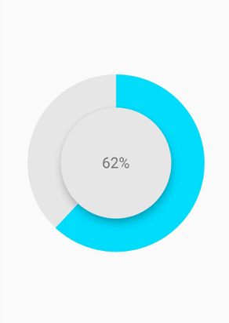

# Chart types in Flutter Circular Charts (SfCircularChart)

## Pie chart

To render a pie chart, create an instance of [`PieSeries`](https://pub.dev/documentation/syncfusion_flutter_charts/latest/charts/PieSeries-class.html), and add it to the [`series`](https://pub.dev/documentation/syncfusion_flutter_charts/latest/charts/CircularSeries-class.html) collection property of [`SfCircularChart`](https://pub.dev/documentation/syncfusion_flutter_charts/latest/charts/SfCircularChart-class.html). The following properties can be used to customize the appearance of pie segment:

* [`opacity`](https://pub.dev/documentation/syncfusion_flutter_charts/latest/charts/CircularSeries/opacity.html) - controls the transparency of the chart series.
* [`strokeWidth`](https://pub.dev/documentation/syncfusion_flutter_charts/latest/charts/CircularSeries/borderWidth.html) - changes the stroke width of the series.
* [`strokeColor`](https://pub.dev/documentation/syncfusion_flutter_charts/latest/charts/CircularSeries/borderColor.html) - changes the stroke color of the series.
* [`pointColorMapper`](https://pub.dev/documentation/syncfusion_flutter_charts/latest/charts/CircularSeries/pointColorMapper.html) - maps the color for individual points from the data source.
* [`pointShaderMapper`](https://pub.dev/documentation/syncfusion_flutter_charts/latest/charts/CircularSeries/pointShaderMapper.html) - maps the shader (gradient or image shader) for individual points from the data source.
* [`pointRenderMode`](https://pub.dev/documentation/syncfusion_flutter_charts/latest/charts/CircularSeries/pointRenderMode.html) - defines the painting mode for the data points either as segment or gradient.

 

    @override
    Widget build(BuildContext context) {
        final List<ChartData> chartData = [
            ChartData('David', 25),
            ChartData('Steve', 38),
            ChartData('Jack', 34),
            ChartData('Others', 52)
        ];
        return Scaffold(
            body: Center(
                child: Container(
                    child: SfCircularChart(
                        series: <CircularSeries>[
                            // Render pie chart
                            PieSeries<ChartData, String>(
                                dataSource: chartData,
                                pointColorMapper:(ChartData data,  _) => data.color,
                                xValueMapper: (ChartData data, _) => data.x,
                                yValueMapper: (ChartData data, _) => data.y
                            )
                        ]
                    )
                )
            )
        );
    }

    class ChartData {
        ChartData(this.x, this.y, [this.color]);
        final String x;
        final double y;
        final Color color;
    }



### Changing pie size

You can use the [`radius`](https://pub.dev/documentation/syncfusion_flutter_charts/latest/charts/CircularSeries/radius.html) property to change the diameter of the pie chart with respect to the plot area. The default value is 80%.

 

    @override
    Widget build(BuildContext context) {
        return Scaffold(
            body: Center(
                child: Container(
                    child: SfCircularChart(
                        series: <CircularSeries>[
                            PieSeries<ChartData, String>(
                                dataSource: chartData,
                                xValueMapper: (ChartData data, _) => data.x,
                                yValueMapper: (ChartData data, _) => data.y,
                                // Radius of pie
                                radius: '50%'
                            )
                        ]
                    )
                )
            )
        );
    }



### Exploding a segment

You can explode a pie segment by enabling the [`explode`](https://pub.dev/documentation/syncfusion_flutter_charts/latest/charts/CircularSeries/explode.html) property. The following properties can be used to customize the explode options:

* [`explodeIndex`](https://pub.dev/documentation/syncfusion_flutter_charts/latest/charts/CircularSeries/explodeIndex.html) - specifies the index of the slice to explode it at the initial rendering.
* [`explodeOffset`](https://pub.dev/documentation/syncfusion_flutter_charts/latest/charts/CircularSeries/explodeOffset.html) - specifies the offset of exploded slice. The value ranges from 0% to 100%.
* [`explodeGesture`](https://pub.dev/documentation/syncfusion_flutter_charts/latest/charts/CircularSeries/explodeOffset.html) - gesture for activating the explode. Explode can be activated in single tap, double tap, and long press. The available gesture types are [`singleTap`](https://pub.dev/documentation/syncfusion_flutter_charts/latest/charts/ActivationMode-class.html), [`doubleTap`](https://pub.dev/documentation/syncfusion_flutter_charts/latest/charts/ActivationMode-class.html), [`longPress`](https://pub.dev/documentation/syncfusion_flutter_charts/latest/charts/ActivationMode-class.html), and [`none`](https://pub.dev/documentation/syncfusion_flutter_charts/latest/charts/ActivationMode-class.html) and the default value is [`singleTap`](https://pub.dev/documentation/syncfusion_flutter_charts/latest/charts/ActivationMode-class.html).

 

    @override
    Widget build(BuildContext context) {
        return Scaffold(
            body: Center(
                child: Container(
                    child: SfCircularChart(
                        series: <CircularSeries>[
                            PieSeries<ChartData, String>(
                                dataSource: chartData,
                                xValueMapper: (ChartData data, _) => data.x,
                                yValueMapper: (ChartData data, _) => data.y,
                                // Segments will explode on tap
                                explode: true,
                                // First segment will be exploded on initial rendering 
                                explodeIndex: 1
                            )
                        ]
                    )
                )
            )
        );
    }



### Exploding all the segments

Using the [`explodeAll`](https://pub.dev/documentation/syncfusion_flutter_charts/latest/charts/CircularSeries/explodeAll.html) property of [`PieSeries`](https://pub.dev/documentation/syncfusion_flutter_charts/latest/charts/PieSeries-class.html), you can explode all the pie segments.

 

    @override
    Widget build(BuildContext context) {
        return Scaffold(
            body: Center(
                child: Container(
                    child: SfCircularChart(
                        series: <CircularSeries>[
                            PieSeries<ChartData, String>(
                                dataSource: chartData,
                                xValueMapper: (ChartData data, _) => data.x,
                                yValueMapper: (ChartData data, _) => data.y,
                                explode: true,
                                // All the segments will be exploded
                                explodeAll: true
                            )
                        ]
                    )
                )
            )
        );
    }



### Angle of pie

[`SfCircularChart`](https://pub.dev/documentation/syncfusion_flutter_charts/latest/charts/SfCircularChart-class.html) allows you to render all the data points or segments in semi-pie, quarter-pie, or in any sector using the [`startAngle`](https://pub.dev/documentation/syncfusion_flutter_charts/latest/charts/CircularSeries/startAngle.html) and [`endAngle`](https://pub.dev/documentation/syncfusion_flutter_charts/latest/charts/CircularSeries/endAngle.html) properties.

 

    @override
    Widget build(BuildContext context) {
        return Scaffold(
            body: Center(
                child: Container(
                    child: SfCircularChart(
                        series: <CircularSeries>[
                            PieSeries<ChartData, String>(
                                dataSource: chartData,
                                xValueMapper: (ChartData data, _) => data.x,
                                yValueMapper: (ChartData data, _) => data.y,
                                startAngle: 270, // starting angle of pie
                                endAngle: 90 // ending angle of pie
                            )
                        ]
                    )
                )
            )
        );
    } 



### Grouping data points

The small segments in the pie chart can be grouped into **others** category using the [`groupTo`](https://pub.dev/documentation/syncfusion_flutter_charts/latest/charts/CircularSeries/groupTo.html) and [`groupMode`](https://pub.dev/documentation/syncfusion_flutter_charts/latest/charts/CircularSeries/groupMode.html) properties of [`PieSeries`](https://pub.dev/documentation/syncfusion_flutter_charts/latest/charts/PieSeries-class.html). The [`groupMode`](https://pub.dev/documentation/syncfusion_flutter_charts/latest/charts/CircularSeries/groupMode.html) property specifies the grouping type based on the actual data point value or by points length, and the [`groupTo`](https://pub.dev/documentation/syncfusion_flutter_charts/latest/charts/CircularSeries/groupTo.html) property sets the limit to group data points into a single slice. The grouped segment is labeled as **Others** in legend and toggled as any other segment. The default value of the [`groupTo`](https://pub.dev/documentation/syncfusion_flutter_charts/latest/charts/CircularSeries/groupTo.html) property is null, and the default value of [`groupMode`](https://pub.dev/documentation/syncfusion_flutter_charts/latest/charts/CircularSeries/groupMode.html) property is [`point`]().

 

    @override
    Widget build(BuildContext context) {
        return Scaffold(
            body: Center(
                child: Container(
                    child: SfCircularChart(
                        series: <CircularSeries>[
                            PieSeries<ChartData, String>(
                                dataSource: chartData,
                                xValueMapper: (ChartData data, _) => data.x,
                                yValueMapper: (ChartData data, _) => data.y,
                                groupMode: CircularChartGroupMode.point,
                                // As the grouping mode is point, 2 points will be grouped
                                groupTo: 2
                            )
                        ]
                    )
                )
            )
        );
    }



### Various radius for each slice

The [`pointRadiusMapper`](https://pub.dev/documentation/syncfusion_flutter_charts/latest/charts/CircularSeries/pointRadiusMapper.html) maps the field name, which will be considered for calculating the radius of the data points.

 

    @override
    Widget build(BuildContext context) {
        final List<ChartData> chartData = [
            ChartData('USA', 10, '70%'),
            ChartData('China', 11, '60%'),
            ChartData('Russia', 9, '52%'),
            ChartData('Germany', 10, '40%')
        ];
        return Scaffold(
            body: Center(
                child: Container(
                    child: SfCircularChart(
                        series: <CircularSeries>[
                            PieSeries<ChartData, String>(
                                dataSource: chartData,
                                xValueMapper: (ChartData data, _) => data.x,
                                yValueMapper: (ChartData data, _) => data.y,
                                // Radius for each segment from data source
                                pointRadiusMapper: (ChartData data, _) => data.size
                            )
                        ]
                    )
                )
            )
        );
    }

    class ChartData {
        ChartData(this.x, this.y, this.size);
        final String x;
        final double y;
        final String size;
    }



## Doughnut chart

To render a doughnut chart, create an instance of [`DoughnutSeries`](https://pub.dev/documentation/syncfusion_flutter_charts/latest/charts/DoughnutSeries-class.html), and add it to the [`series`](https://pub.dev/documentation/syncfusion_flutter_charts/latest/charts/SfCircularChart/series.html) collection property of [`SfCircularChart`](https://pub.dev/documentation/syncfusion_flutter_charts/latest/charts/SfCircularChart-class.html). The following properties can be used to customize the appearance of doughnut segment:

* [`opacity`](https://pub.dev/documentation/syncfusion_flutter_charts/latest/charts/CircularSeries/opacity.html) - controls the transparency of the chart series.
* [`strokeWidth`](https://pub.dev/documentation/syncfusion_flutter_charts/latest/charts/ChartPoint/strokeWidth.html) - changes the stroke width of the series.
* [`strokeColor`](https://pub.dev/documentation/syncfusion_flutter_charts/latest/charts/ChartPoint/strokeColor.html) - changes the stroke color of the series.
* [`pointColorMapper`](https://pub.dev/documentation/syncfusion_flutter_charts/latest/charts/CircularSeries/pointColorMapper.html) - maps the color for individual points from the data source.
* [`pointShaderMapper`](https://pub.dev/documentation/syncfusion_flutter_charts/latest/charts/CircularSeries/pointShaderMapper.html) - maps the shader (gradient or image shader) for individual points from the data source.
* [`pointRenderMode`](https://pub.dev/documentation/syncfusion_flutter_charts/latest/charts/CircularSeries/pointRenderMode.html) - defines the painting mode for the data points either as segment or gradient.

 

    @override
    Widget build(BuildContext context) {
        final List<ChartData> chartData = [
            ChartData('David', 25, Color.fromRGBO(9,0,136,1)),
            ChartData('Steve', 38, Color.fromRGBO(147,0,119,1)),
            ChartData('Jack', 34, Color.fromRGBO(228,0,124,1)),
            ChartData('Others', 52, Color.fromRGBO(255,189,57,1))
        ];
        return Scaffold(
            body: Center(
                child: Container(
                    child: SfCircularChart(
                        series: <CircularSeries>[
                            // Renders doughnut chart
                            DoughnutSeries<ChartData, String>(
                                dataSource: chartData,
                                pointColorMapper:(ChartData data,  _) => data.color,
                                xValueMapper: (ChartData data, _) => data.x,
                                yValueMapper: (ChartData data, _) => data.y
                            )
                        ]
                    )
                )
            )
        );
    }

    class ChartData {
        ChartData(this.x, this.y, [this.color]);
            final String x;
            final double y;
            final Color color;
    }



### Rounded corners

The [`cornerStyle`](https://pub.dev/documentation/syncfusion_flutter_charts/latest/charts/CircularSeries/cornerStyle.html) property specifies the corner type for doughnut chart. The corners can be customized using the [`bothFlat`](https://pub.dev/documentation/syncfusion_flutter_charts/latest/charts/CornerStyle-class.html), [`bothCurve`](https://pub.dev/documentation/syncfusion_flutter_charts/latest/charts/CornerStyle-class.html), [`startCurve`](https://pub.dev/documentation/syncfusion_flutter_charts/latest/charts/CornerStyle-class.html), and [`endCurve`](https://pub.dev/documentation/syncfusion_flutter_charts/latest/charts/CornerStyle-class.html) options. The default value of this property is [`bothFlat`](https://pub.dev/documentation/syncfusion_flutter_charts/latest/charts/CornerStyle-class.html).

 

    @override
    Widget build(BuildContext context) {
        return Scaffold(
            body: Center(
                child: Container(
                    child: SfCircularChart(
                        series: <CircularSeries>[
                            DoughnutSeries<ChartData, String>(
                                dataSource: chartData,
                                xValueMapper: (ChartData data, _) => data.x,
                                yValueMapper: (ChartData data, _) => data.y,
                                // Corner style of doughnut segment
                                cornerStyle: CornerStyle.bothCurve
                            )
                        ]
                    )
                )
            )
        );  
    }



### Doughnut with center elevation

You can use the Annotations property in charts, to provide center elevation text in doughnut charts as shown below:

 

    @override
    Widget build(BuildContext context) {
        return Scaffold(
            body: Center(
                child: Container(
                    child: SfCircularChart(
                        annotations: <CircularChartAnnotation>[
                         CircularChartAnnotation(
                           child: Container(
                             child: PhysicalModel(
                              child: Container(),
                                shape: BoxShape.circle,
                                elevation: 10,
                                shadowColor: Colors.black,
                                color: const Color.fromRGBO(230, 230, 230, 1)))),
                                CircularChartAnnotation(
                                  child: Container(
                                  child: const Text('62%',
                                 style: TextStyle(
                                color: Color.fromRGBO(0, 0, 0, 0.5), fontSize: 25))))
                                   ],
                        series: <CircularSeries>[
                            DoughnutSeries<ChartData, String>(
                                dataSource: chartData,
                                xValueMapper: (ChartData data, _) => data.x,
                                yValueMapper: (ChartData data, _) => data.y,
                                // Radius of doughnut
                                radius: '50%'
                            )
                        ]
                    )
                )
            )
        );
    }



### Doughnut with color mapping

You can use the [`pointColorMapper`](https://pub.dev/documentation/syncfusion_flutter_charts/latest/charts/ChartSeries/pointColorMapper.html) property to provide different color mappings to the doughnut charts as shown below:

 

    @override
    Widget build(BuildContext context) {
        return Scaffold(
            body: Center(
                child: Container(
                    child: SfCircularChart(
                        series: <CircularSeries>[
                            DoughnutSeries<ChartData, String>(
                                dataSource: chartData,
                                xValueMapper: (ChartData data, _) => data.x,
                                yValueMapper: (ChartData data, _) => data.y,
                                pointColorMapper: (ChartSampleData data, _) => data.pointColor,
                                // Radius of doughnut
                                radius: '50%'
                            )
                        ]
                    )
                )
            )
        );
    }



### Changing the doughnut size

You can use the [`radius`](https://pub.dev/documentation/syncfusion_flutter_charts/latest/charts/CircularSeries/radius.html) property to change the diameter of the doughnut chart with respect to the plot area. The default value of this property is 80%.

 

    @override
    Widget build(BuildContext context) {
        return Scaffold(
            body: Center(
                child: Container(
                    child: SfCircularChart(
                        series: <CircularSeries>[
                            DoughnutSeries<ChartData, String>(
                                dataSource: chartData,
                                xValueMapper: (ChartData data, _) => data.x,
                                yValueMapper: (ChartData data, _) => data.y,
                                // Radius of doughnut
                                radius: '50%'
                            )
                        ]
                    )
                )
            )
        );
    }



### Changing doughnut inner radius

You can change the inner radius of doughnut chart using the [`innerRadius`](https://pub.dev/documentation/syncfusion_flutter_charts/latest/charts/CircularSeries/innerRadius.html) property with respect to the plot area. The value ranges from 0% to 100%.

 

    @override
    Widget build(BuildContext context) {
        return Scaffold(
            body: Center(
                child: Container(
                    child: SfCircularChart(
                        series: <CircularSeries>[
                            DoughnutSeries<ChartData, String>(
                                dataSource: chartData,
                                xValueMapper: (ChartData data, _) => data.x,
                                yValueMapper: (ChartData data, _) => data.y,
                                // Radius of doughnut's inner circle
                                innerRadius: '80%'
                            )
                        ]
                    )
                )
            )
        );
    }



### Exploding a segment

You can explode a doughnut segment by enabling the [`explode`](https://pub.dev/documentation/syncfusion_flutter_charts/latest/charts/CircularSeries/explode.html) property. The following properties are used to customize the explode options:

* [`explodeIndex`](https://pub.dev/documentation/syncfusion_flutter_charts/latest/charts/CircularSeries/explodeIndex.html) - specifies the index of the slice to explode it at the initial rendering.
* [`explodeOffset`](https://pub.dev/documentation/syncfusion_flutter_charts/latest/charts/CircularSeries/explodeOffset.html) - specifies the offset of exploded slice. The value ranges from 0% to 100%.
* [`explodeGesture`](https://pub.dev/documentation/syncfusion_flutter_charts/latest/charts/CircularSeries/explodeGesture.html) - gesture for activating the explode. Explode can be activated in single tap, double tap, and long press. The available gesture types are [`singleTap`](https://pub.dev/documentation/syncfusion_flutter_charts/latest/charts/ActivationMode-class.html), [`doubleTap`](https://pub.dev/documentation/syncfusion_flutter_charts/latest/charts/ActivationMode-class.html), [`longPress`](https://pub.dev/documentation/syncfusion_flutter_charts/latest/charts/ActivationMode-class.html), and [`none`](https://pub.dev/documentation/syncfusion_flutter_charts/latest/charts/ActivationMode-class.html). The default value is [`singleTap`](https://pub.dev/documentation/syncfusion_flutter_charts/latest/charts/ActivationMode-class.html).

 

    @override
    Widget build(BuildContext context) {
        return Scaffold(
            body: Center(
                child: Container(
                    child: SfCircularChart(
                        series: <CircularSeries>[
                            DoughnutSeries<ChartData, String>(
                                dataSource: chartData,
                                xValueMapper: (ChartData data, _) => data.x,
                                yValueMapper: (ChartData data, _) => data.y,
                                // Explode the segments on tap
                                explode: true,
                                explodeIndex: 1
                            )
                        ]
                    )
                )
            )
        );
    }



### Exploding all the segments

Using the [`explodeAll`](https://pub.dev/documentation/syncfusion_flutter_charts/latest/charts/CircularSeries/explodeAll.html) property of [`DoughnutSeries`](https://pub.dev/documentation/syncfusion_flutter_charts/latest/charts/DoughnutSeries-class.html), you can explode all the doughnut segments.

 

    @override
    Widget build(BuildContext context) {
        return Scaffold(
            body: Center(
                child: Container(
                    child: SfCircularChart(
                        series: <CircularSeries>[
                            DoughnutSeries<ChartData, String>(
                                dataSource: chartData,
                                xValueMapper: (ChartData data, _) => data.x,
                                yValueMapper: (ChartData data, _) => data.y,
                                explode: true,
                                // Explode all the segments
                                explodeAll: true
                            )
                        ]
                    )
                )
            )
        );
    }



### Angle of doughnut

[`SfCircularChart`](https://pub.dev/documentation/syncfusion_flutter_charts/latest/charts/SfCircularChart-class.html) allows you to render all the data points or segments in semi-pie, quarter-pie, or in any sector using the [`startAngle`](https://pub.dev/documentation/syncfusion_flutter_charts/latest/charts/CircularSeries/startAngle.html) and [`endAngle`](https://pub.dev/documentation/syncfusion_flutter_charts/latest/charts/CircularSeries/endAngle.html) properties.

 

    @override
    Widget build(BuildContext context) {
        return Scaffold(
            body: Center(
                child: Container(
                    child: SfCircularChart(
                        series: <CircularSeries>[
                            DoughnutSeries<ChartData, String>(
                                dataSource: chartData,
                                xValueMapper: (ChartData data, _) => data.x,
                                yValueMapper: (ChartData data, _) => data.y,
                                startAngle: 270, // Starting angle of doughnut
                                endAngle: 90 // Ending angle of doughnut
                            )
                        ]
                    )
                )
            )
        );
    }



### Grouping data points

The small segments in the doughnut chart can be grouped into **others** category using the [`groupTo`](https://pub.dev/documentation/syncfusion_flutter_charts/latest/charts/CircularSeries/groupTo.html) and [`groupMode`](https://pub.dev/documentation/syncfusion_flutter_charts/latest/charts/CircularSeries/groupMode.html) properties of [`DoughnutSeries`](https://pub.dev/documentation/syncfusion_flutter_charts/latest/charts/DoughnutSeries-class.html). The [`groupMode`](https://pub.dev/documentation/syncfusion_flutter_charts/latest/charts/CircularSeries/groupMode.html) property is used to specify the grouping type based on the actual data point value or by points length, and the [`groupTo`](https://pub.dev/documentation/syncfusion_flutter_charts/latest/charts/CircularSeries/groupTo.html) property is used to set the limit to group data points into a single slice. The grouped segment is labeled as **Others** in legend and toggled as any other segment. The default value of the [`groupTo`](https://pub.dev/documentation/syncfusion_flutter_charts/latest/charts/CircularSeries/groupTo.html) property is null, and the default value of [`groupMode`](https://pub.dev/documentation/syncfusion_flutter_charts/latest/charts/CircularSeries/groupMode.html) property is [`point`]().

 

    @override
    Widget build(BuildContext context) {
        return Scaffold(
            body: Center(
                child: Container(
                    child: SfCircularChart(
                        series: <CircularSeries>[
                            DoughnutSeries<ChartData, String>(
                                dataSource: chartData,
                                xValueMapper: (ChartData data, _) => data.x,
                                yValueMapper: (ChartData data, _) => data.y,
                                // Mode of grouping
                                groupMode: CircularChartGroupMode.point,
                                groupTo: 2
                            )
                        ]
                    )
                )
            )
        );
    }



## Radial bar chart

The radial bar chart is used for showing the comparisons among the categories using the circular shapes. To render a radial bar chart, create an instance of [`RadialBarSeries`](https://pub.dev/documentation/syncfusion_flutter_charts/latest/charts/RadialBarSeries-class.html), and add to the [`series`](https://pub.dev/documentation/syncfusion_flutter_charts/latest/charts/SfCircularChart/series.html) collection property of [`SfCircularChart`](https://pub.dev/documentation/syncfusion_flutter_charts/latest/charts/SfCircularChart-class.html). The following properties can be used to customize the appearance of radial bar segment:

* [`opacity`](https://pub.dev/documentation/syncfusion_flutter_charts/latest/charts/CircularSeries/opacity.html) - controls the transparency of the chart series.
* [`strokeWidth`](https://pub.dev/documentation/syncfusion_flutter_charts/latest/charts/ChartPoint/strokeColor.html) - changes the stroke width of the series.
* [`strokeColor`](https://pub.dev/documentation/syncfusion_flutter_charts/latest/charts/ChartPoint/strokeWidth.html) - changes the stroke color of the series.
* [`pointColorMapper`](https://pub.dev/documentation/syncfusion_flutter_charts/latest/charts/CircularSeries/pointColorMapper.html) - maps the color for individual points from the data source.
* [`gap`](https://pub.dev/documentation/syncfusion_flutter_charts/latest/charts/CircularSeries/gap.html) - changes the spacing between two individual segments. The default value of spacing is 1%.
* [`maximumValue`](https://pub.dev/documentation/syncfusion_flutter_charts/latest/charts/RadialBarSeries/maximumValue.html) - represents the entire span of an individual circle. The default value of the this property is null.
* [`trackColor`](https://pub.dev/documentation/syncfusion_flutter_charts/latest/charts/RadialBarSeries/trackColor.html) - changes the color of the track area.
* [`trackBorderColor`](https://pub.dev/documentation/syncfusion_flutter_charts/latest/charts/RadialBarSeries/trackBorderColor.html) - changes the color of the track border.
* [`trackBorderWidth`](https://pub.dev/documentation/syncfusion_flutter_charts/latest/charts/RadialBarSeries/trackBorderWidth.html) - changes the width of the track border.
* [`trackOpacity`](https://pub.dev/documentation/syncfusion_flutter_charts/latest/charts/RadialBarSeries/trackOpacity.html) - controls the transparency of the track area.
* [`useSeriesColor`](https://pub.dev/documentation/syncfusion_flutter_charts/latest/charts/RadialBarSeries/useSeriesColor.html) - uses the point color for filling the track area.
* [`pointShaderMapper`](https://pub.dev/documentation/syncfusion_flutter_charts/latest/charts/CircularSeries/pointShaderMapper.html) - maps the shader (gradient or image shader) for individual points from the data source.

 

    @override
    Widget build(BuildContext context) {
        return Scaffold(
            body: Center(
                child: Container(
                    child: SfCircularChart(
                        series: <CircularSeries>[
                            // Renders radial bar chart
                            RadialBarSeries<ChartData, String>(
                                dataSource: chartData,
                                xValueMapper: (ChartData data, _) => data.x,
                                yValueMapper: (ChartData data, _) => data.y
                            )
                        ]
                    )
                )
            )
        );  
    }



### Changing the radial bar size

You can use the [`radius`](https://pub.dev/documentation/syncfusion_flutter_charts/latest/charts/CircularSeries/radius.html) property to change the diameter of the radial bar chart with respect to the plot area. The default value is 80%.

 

    @override
    Widget build(BuildContext context) {
        return Scaffold(
            body: Center(
                child: Container(
                    child: SfCircularChart(
                        series: <CircularSeries>[
                            RadialBarSeries<ChartData, String>(
                                dataSource: chartData,
                                xValueMapper: (ChartData data, _) => data.x,
                                yValueMapper: (ChartData data, _) => data.y,
                                // Radius of the radial bar
                                radius: '50%'
                            )
                        ]
                    )
                )
            )
        );
    }



### Changing the radial bar inner radius

You can change the inner radius of radial bar chart using the [`innerRadius`](https://pub.dev/documentation/syncfusion_flutter_charts/latest/charts/CircularSeries/innerRadius.html) property with respect to the plot area. The value ranges from 0% to 100%.

 

    @override
    Widget build(BuildContext context) {
        return Scaffold(
            body: Center(
                child: Container(
                    child: SfCircularChart(
                        series: <CircularSeries>[
                            RadialBarSeries<ChartData, String>(
                                dataSource: chartData,
                                xValueMapper: (ChartData data, _) => data.x,
                                yValueMapper: (ChartData data, _) => data.y,
                                // Radius of the radial bar's inner circle
                                innerRadius: '80%'
                            )
                        ]
                    )
                )
            )
        );
    }



### Rounded corners

The [`cornerStyle`](https://pub.dev/documentation/syncfusion_flutter_charts/latest/charts/CircularSeries/cornerStyle.html) property specifies the corner type for radial bar chart. The corners can be customized using the [`bothFlat`](https://pub.dev/documentation/syncfusion_flutter_charts/latest/charts/CornerStyle-class.html), [`bothCurve`](https://pub.dev/documentation/syncfusion_flutter_charts/latest/charts/CornerStyle-class.html), [`startCurve`](https://pub.dev/documentation/syncfusion_flutter_charts/latest/charts/CornerStyle-class.html), and [`endCurve`](https://pub.dev/documentation/syncfusion_flutter_charts/latest/charts/CornerStyle-class.html) options. The default value of this property is [`bothFlat`](https://pub.dev/documentation/syncfusion_flutter_charts/latest/charts/CornerStyle-class.html).

 

    @override
    Widget build(BuildContext context) {
        return Scaffold(
            body: Center(
                child: Container(
                    child: SfCircularChart(
                        series: <CircularSeries>[
                            RadialBarSeries<ChartData, String>(
                                dataSource: chartData,
                                xValueMapper: (ChartData data, _) => data.x,
                                yValueMapper: (ChartData data, _) => data.y,
                                // Corner style of radial bar segment
                                cornerStyle: CornerStyle.bothCurve
                            )
                        ]
                    )
                )
            )
        );
    }



### Rendering data labels

Data labels can be enabled using the [`isVisible`](https://pub.dev/documentation/syncfusion_flutter_charts/latest/charts/DataLabelSettings/isVisible.html) property of [`dataLabelSettings`](https://pub.dev/documentation/syncfusion_flutter_charts/latest/charts/CircularSeries/dataLabelSettings.html). The appearance of label can be customized using the following properties:

* [`color`](https://pub.dev/documentation/syncfusion_flutter_charts/latest/charts/DataLabelSettings/color.html) - changes the label background color.
* [`textStyle`](https://pub.dev/documentation/syncfusion_flutter_charts/latest/charts/DataLabelRenderArgs/textStyle.html) - changes the text color, size, font family, fontStyle, and font weight.
* [`textStyle.color`](https://pub.dev/documentation/syncfusion_flutter_charts/latest/charts/TextStyle/color.html) - changes the color of the text.
* [`textStyle.fontFamily`](https://pub.dev/documentation/syncfusion_flutter_charts/latest/charts/TextStyle/fontFamily.html) - changes the font family for chart title. 
* [`textStyle.fontStyle`](https://pub.dev/documentation/syncfusion_flutter_charts/latest/charts/TextStyle/fontStyle.html) - changes the font style for the chart title.
* [`textStyle.fontSize`](https://pub.dev/documentation/syncfusion_flutter_charts/latest/charts/TextStyle/fontSize.html) - changes the font size for the chart title.
* [`opacity`](https://pub.dev/documentation/syncfusion_flutter_charts/latest/charts/CircularSeries/opacity.html) - controls the transparency of the label background color.
* [`borderRadius`](https://pub.dev/documentation/syncfusion_flutter_charts/latest/charts/DataLabelSettings/borderRadius.html) - customizes the data label border radius.
* [`angle`](https://pub.dev/documentation/syncfusion_flutter_charts/latest/charts/DataLabelSettings/angle.html) - rotates the labels.
* [`borderWidth`](https://pub.dev/documentation/syncfusion_flutter_charts/latest/charts/DataLabelSettings/borderWidth.html) - changes the stroke width of the data label shape.
* [`borderColor`](https://pub.dev/documentation/syncfusion_flutter_charts/latest/charts/DataLabelSettings/borderColor.html) - changes the stroke color of the data label shape.
* [`useSeriesColor`](https://pub.dev/documentation/syncfusion_flutter_charts/latest/charts/DataLabelSettings/useSeriesColor.html) - uses the series color for filling the data label shape.

 

    @override
    Widget build(BuildContext context) {
        return Scaffold(
            body: Center(
                child: Container(
                    child: SfCircularChart(
                        series: <CircularSeries>[
                            RadialBarSeries<ChartData, String>(
                                dataSource: chartData,
                                xValueMapper: (ChartData data, _) => data.x,
                                yValueMapper: (ChartData data, _) => data.y,
                                dataLabelSettings: DataLabelSettings(
                                    // Renders the data label
                                    isVisible: true
                                )
                            )
                        ]
                    )
                )
            )
        );  
    }



